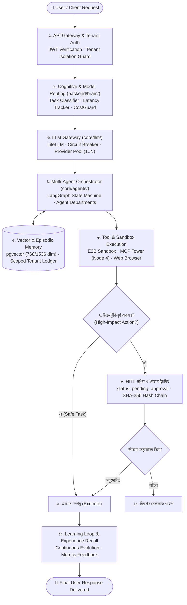
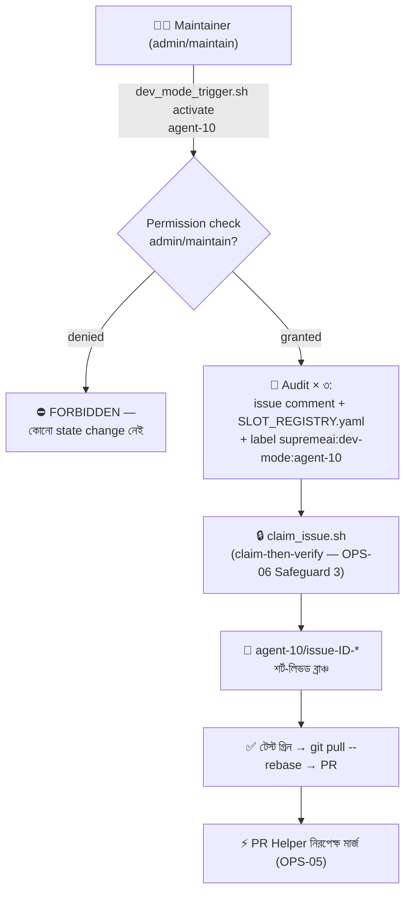

# OPS-08 — SupremeAI Native Autonomous Work Process (Platform Runtime Execution Engine)

> **ডকুমেন্ট আইডি:** OPS-08 · **স্ট্যাটাস:** সক্রিয় (ACTIVE) · **ভার্সন:** ১.০ (২০২৬-০৯)  
> **প্রযোজ্য:** সুপ্রিমএআই প্ল্যাটফর্মের নিজস্ব অভ্যন্তরীণ অটোনোমাস ইঞ্জিন, রানটাইম এআই এজেন্ট, ওয়ার্কার পুল, এবং মাইক্রোসার্ভিস ক্লাস্টার।  
> **মূল রেফারেন্স:** [`AIBRAIN-01`](AIBRAIN-01-MASTER_AGENT_SPECIFICATION.md) · [`ARCH-01`](ARCH-01-MASTER_CONSTITUTION.md) · [`ARCH-02`](ARCH-02-SYSTEM_OVERVIEW_AND_FLOWS.md) · [`SEC-01`](SEC-01-30_CATEGORY_SECURITY_MATRIX.md)

---

## 🎯 ১. উদ্দেশ্য ও ক্ষেত্র (Scope & Core Philosophy)

এই ডকুমেন্টটি বর্ণনা করে **SupremeAI-এর নিজস্ব প্ল্যাটফর্ম কীভাবে চলে**—অর্থাৎ ক্লাউডে ডেপ্লয়ড সুপ্রিমএআই-এর ব্যাকএন্ড, ওয়ার্কার ক্লাস্টার, ব্রেইন ইঞ্জিন এবং অভ্যন্তরীণ এজেন্টরা কীভাবে ব্যবহারকারীর রিকোয়েস্ট প্রসেস করে, সিদ্ধান্ত নেয়, মেমোরি ব্যবহার করে এবং নিরাপদ স্বয়ংক্রিয় একশন সম্পন্ন করে।

> ⚡ **পার্থক্য মনে রাখুন:**  
> - **[`OPS-07`](OPS-07-DEVELOPER-AGENT-LIFECYCLE.md):** এক্সটার্নাল এআই ডেভেলপাররা কীভাবে কোড লেখে ও পিআর পাঠায়।  
> - **OPS-08 (এই ডকুমেন্ট):** সুপ্রিমএআই রানটাইম সফটওয়্যার নিজে কীভাবে ব্যবহারকারীর কাজ সম্পন্ন করে।

---

## 🗺️ ২. সুপ্রিমএআই প্ল্যাটফর্ম রানটাইম লাইফসাইকেল (Execution Pipeline)



---

## ⚙️ ৩. প্ল্যাটফর্ম রানটাইমের ৬টি স্তম্ভ (Core Runtime Pillars)

### ১. টেন্যান্ট আইসোলেশন ও জিরো-ট্রাস্ট সিকিউরিটি (Tenant Isolation)
* প্ল্যাটফর্মের প্রতিটি কল একটি সুনির্দিষ্ট `tenant_id`-এর অধীনে এক্সিকিউট হয়।
* **জিরো লিকেজ পলিসি:** এক টেন্যান্টের ভেক্টর মেমোরি, চ্যাট হিস্টোরি, ক্রেডেনশিয়াল বা কাস্টম স্কিল কখনোই অন্য টেন্যান্ট দেখতে পাবে না (`AGENTS.md` Directive 1)।

### ২. কগনিটিভ রাউটিং ও ডাইনামিক এলএলএম গেটওয়ে (Cognitive Routing)
* ব্যবহারকারীর ইনপুট এনালাইসিস করে টাস্ক ক্যাটাগরি নির্ধারণ করা হয় (Coding, Reasoning, Chat, Multilingual, Fast Search)।
* **রিসোর্স পুল ($1 \dots N$):** কোনো সিঙ্গেল প্রোভাইডারের ওপর প্ল্যাটফর্ম নির্ভরশীল নয়। Groq, Gemini, OpenRouter, Ollama ইত্যাদির মধ্যে স্বয়ংক্রিয় ফেইলওভার ও সার্কিট ব্রেকার কাজ করে।
* **CostGuard:** প্রতি টাস্কের টোকেন বাজেট এবং খরচ লিমিট রিয়েল-টাইমে গার্ড করা হয় (fail-closed)।

### ৩. মাল্টি-এজেন্ট অর্কেস্ট্রেশন ও ডিপার্টমেন্টস (Agent Orchestration)
* জটিল সমস্যা সমাধানের জন্য সুপ্রিমএআই একাধিক বিশেষায়িত অভ্যন্তরীণ সাব-এজেন্ট সক্রিয় করে:
  * **CodingAgent:** কোড লেখা ও বিশ্লেষণ।
  * **ReviewAgent:** কোড কোয়ালিটি ও সিকিউরিটি টেস্ট।
  * **QAAgent:** এন্ড-টু-এন্ড ফাংশনালিটি ভেরিফিকেশন।
* এজেন্টরা `SupremeOrchestrator` (LangGraph স্টেট-মেশিন)-এর মাধ্যমে একে অপরের সাথে ডেটা শেয়ার করে।

### ৪. ভেক্টর মেমোরি ও ডিজিটাল টুইন (Long-term Memory)
* `pgvector` এবং হাইব্রিড সার্চের মাধ্যমে দীর্ঘমেয়াদী স্মৃতি সংরক্ষণ (Standard Dimension: 768 / 1536)।
* ব্যবহারকারীর পছন্দ, পূর্ববর্তী সেশন এবং কাজের প্যাটার্ন ক্রিপ্টোগ্রাফিক হ্যাশ-চেইনের মাধ্যমে সংরক্ষিত থাকে।

### ৫. হিউম্যান-ইন-দ্য-লুপ সেফগার্ড (HITL State Machine)
* কোনো এজেন্ট স্বয়ংক্রিয়ভাবে সংবেদনশীল পরিবর্তন করতে পারবে না (যেমন: ডাটাবেস ড্রপ, ক্লাউড রিসোর্স পার্জ, বা অনুমোদনহীন নতুন স্কিল ইনস্টল)।
* এ ধরনের অপারেশনের ক্ষেত্রে স্টেট তাত্ক্ষণিক `pending_approval`-এ চলে যায় এবং অ্যাডমিন ড্যাশবোর্ডে নোটিফিকেশন পাঠায়।

### ৬. অটোনোমাস এভোলিউশন ও ক্যানারি রোলআউট (Evolution Engine)
* `AutoSkillCreator` প্ল্যাটফর্মের পারফরম্যান্স গ্যাপ শনাক্ত করে স্বয়ংক্রিয়ভাবে নতুন স্কিল তৈরি করতে পারে।
* নতুন স্কিলগুলো সরাসরি প্রোডাকশনে যায় না; `CanaryRolloutController`-এর মাধ্যমে ট্রাফিক স্প্লিট করে টেস্ট করার পর তবেই প্রমোট করা হয়।

---

## 📊 ৪. OPS-07 বনাম OPS-08-এর পরিষ্কার পার্থক্য

| বৈশিষ্ট্য | 🛠️ OPS-07 (External AI Developer) | 🧠 OPS-08 (SupremeAI Runtime Process) |
|---|---|---|
| **উদ্দেশ্য** | রিপোজিটরির কোডবেস ডেভেলপ ও বাগ ফিক্স করা | শেষ ব্যবহারকারীর রিকোয়েস্ট ও টাস্ক সমাধান করা |
| **অপারেটিং পরিবেশ** | Git, GitHub Issues, PR Helper, লোকাল টেস্ট রানার | Render ক্লাউড নোড, FastAPI ব্যাকএন্ড, Supabase, Redis |
| **লাইফসাইকেল** | Issue Claim → Branch → Pull-Before-Push → PR | Request → Routing → Agent Execution → HITL → Response |
| **টোকেন/অথ** | GitHub Fine-Grained PAT (`GITHUB_TOKEN`) | JWT, API Key Vault, Per-tenant session |
| **আইসোলেশন** | গিট ব্রাঞ্চ ও মিউটেক্স লেবেল আইসোলেশন | টেন্যান্ট ডেটাবেস রো-লেভেল সিকিউরিটি (RLS) |

---

## 🔄 ৫. সুপ্রিমএআই-এর সেলফ-ইঞ্জিনিয়ারিং ভূমিকা (SupremeAI as an Assigned Developer Agent)

যখন অ্যাডমিন/ইউজার সুপ্রিমএআই-কে সরাসরি কোড ডেভেলপমেন্ট বা বাগ ফিক্সিংয়ের দায়িত্ব দেবেন (যেমন: `agent-1`, `agent-2` বা `agent-10 = supremeai` হিসেবে অ্যাসাইন করবেন), তখন সুপ্রিমএআই প্ল্যাটফর্ম সাময়িকভাবে তার নিজস্ব অভ্যন্তরীণ সেলফ-ইঞ্জিনিয়ারিং মোড (**Developer Mode**) সক্রিয় করে।

### ৫.১. ট্রিগার ও অথরাইজেশন (Trigger & Authorization)

> GAP-07: আগে কোনো explicit trigger, authorization, বা audit trail ছিল না — চ্যাটে যে-কেউ "SupremeAI, fix issue #900" বললেই Developer Mode শুরু হয়ে যেত? এখন নিচের গেট বাধ্যতামূলক।

* **একমাত্র বৈধ ট্রিগার:** maintainer-নিয়ন্ত্রিত helper script:
  ```bash
  bash .github/scripts/dev_mode_trigger.sh activate agent-10 <ISSUE_ID> "notes"
  # deactivate: bash .github/scripts/dev_mode_trigger.sh deactivate agent-10
  ```
* **অথরাইজেশন:** script কলারের GitHub permission যাচাই করে (`collaborators/{user}/permission` API) — শুধু `admin` বা `maintain` পারমিশনধারী ট্রিগার করতে পারবেন। অন্য কারও call করলে script `FORBIDDEN` (exit 1) দেবে — কোনো state change হবে না।
* **চ্যাট নির্দেশনা নিজে কখনোই ট্রিগার নয়** — maintainer অবশ্যই এই script পথ ধরবেন।

### ৫.২. অডিট ট্রেইল (Audit Trail)

প্রতিটি activation/deactivation-এ ৩টি রেকর্ড অবশ্যই থাকবে:

| # | রেকর্ড | কোথায় |
|---|---|---|
| ১ | অডিট কমেন্ট (`🔧 Developer Mode activated — slot agent-X by @maintainer · expires <date>`) | টার্গেট issue-তে |
| ২ | স্লট এন্ট্রি (`slot / tool / maintainer / assigned_on / expires_on ≤ ৭ দিন / active`) | [`AGENT_SLOT_REGISTRY.yaml`](AGENT_SLOT_REGISTRY.yaml) |
| ৩ | ভিজ্যুয়াল লেবেল `supremeai:dev-mode:<slot>` | টার্গেট issue-তে |

### ৫.৩. এক্সিকিউশন ফ্লো (Execution Flow)



1. **রোল ট্রানজিশন (Role Transition):** সুপ্রিমএআই সাধারণ এন্ড-ইউজার সার্ভিসিং থেকে সরে এসে [`OPS-07`](OPS-07-DEVELOPER-AGENT-LIFECYCLE.md) ও [`OPS-06`](OPS-06-MULTI-AGENT-BRANCHING-LIFECYCLE.md)-এর ডেভেলপার প্রটোকলে প্রবেশ করে।
2. **মিউটেক্স লক:** নিজের নির্ধারিত স্লটে (`agent-X`) ক্লেইম-থেন-ভেরিফাই দিয়ে ইস্যু ক্লেইম করে (`bash .github/scripts/claim_issue.sh $ID "agent-X"` — OPS-06 Safeguard 3)।
3. **আইসোলেটেড ব্রাঞ্চিং:** `agent-X/issue-$ID-...` শর্ট-লিভড ব্রাঞ্চ স্পন করে।
4. **টেস্ট ও পিআর সাবমিশন:** কোড পরিবর্তন করে টেস্ট গ্রিন কনফার্ম করে এবং `git pull --rebase origin main` চালিয়ে PR ওপেন করে।
5. **নিরপেক্ষ পিআর হেল্পার গার্ড:** সুপ্রিমএআই নিজের কোড নিজে সরাসরি মার্জ করে না—সিআই-এর PR Helper (OPS-05) নিরপেক্ষভাবে টেস্ট ডেল্টা ভ্যালিডেট করে তবেই মার্জ সম্পন্ন করে।

---

*ডকুমেন্ট আইডি: OPS-08 · সুপ্রিমএআই কোর আর্কিটেকচার টিম · সেপ্টেম্বর ২০২৬*
