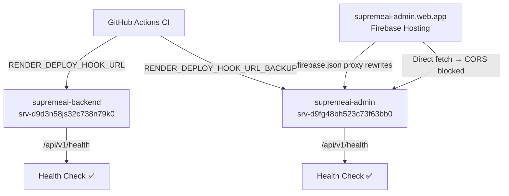

# Render Deployment & Environment Troubleshooting Guide

> **Project:** SupremeAI 2.0  
> **Target System:** Render Web Services & Background Workers  
> **Last Updated:** 2026-07-23  
> **Status:** ACTIVE & PRODUCTION READY  

---

## 📌 Overview (বিবরণ)

এই গাইডে SupremeAI 2.0-এর Render ডেপ্লয়মেন্ট প্রক্রিয়া, পূর্বে সম্মুখীন হওয়া সমস্ত ক্রিটিক্যাল এররসমূহ, সেগুলোর রুট-কজ (Root Cause), এবং এন্টারপ্রাইজ-গ্রেড স্থায়ী সমাধান লিপিবদ্ধ করা হলো। ভবিষ্যতে Render ডেপ্লয়মেন্টের কোনো সমস্যা হলে এই ডকুমেন্ট নির্দেশিকা হিসেবে কাজ করবে।

---

## 🔐 Render Account Architecture (Primary vs Backup)

| সার্ভিস | Account / Workspace | Service ID | URL |
| :--- | :--- | :--- | :--- |
| **supremeai-backend** (Primary User Backend) | `My Workspace` (`paykaribazaronline@gmail.com`) | `srv-d9d3n58js32c738n79k0` | `https://supremeai-backend.onrender.com` |
| **supremeai-admin** (Admin Backend) | `niloy's workspace` | `srv-d9fg48bh523c73f63bb0` | `https://supremeai-admin.onrender.com` |
| **supremeai-studio-client** (Frontend Static) | `My Workspace` | `srv-d9d3pgvavr4c738a46mg` | — |

### GitHub Secrets Required

| Secret Name | আসা উচিত কোথা থেকে | উদ্দেশ্য |
| :--- | :--- | :--- |
| `RENDER_API_KEY` | `My Workspace` → Account Settings → API Keys | Primary backend deploy trigger |
| `RENDER_API_KEY_BACKUP` | `niloy's workspace` → Account Settings → API Keys | Admin backend API trigger |
| `RENDER_DEPLOY_HOOK_URL_BACKUP` | Render Dashboard → `supremeai-admin` → Settings → Deploy Hook | ✅ **Preferred:** Admin backend webhook trigger |

> [!IMPORTANT]
> `RENDER_DEPLOY_HOOK_URL_BACKUP` হলো সবচেয়ে নির্ভরযোগ্য পদ্ধতি — এটি যেকোনো API Key সমস্যা বাইপাস করে সরাসরি `supremeai-admin` সার্ভিসটি deploy করে।

---

## 🚨 Error Case 1: `SUPREMEAI_ADMIN_PASSWORD_HASH` Missing / Pydantic Validation Crash

### 🔍 লক্ষণ (Symptom):
- Render ডিপ্লয়মেন্টের সময় কন্টেইনার স্টার্টআপে crash-loop তৈরি হওয়া।
- `/api/v1/health` এন্ডপয়েন্টে HTTP Connection Timeout / Read Timed Out (10s) দেখা দেওয়া।
- লগে `"Production Secret Vault hooked into Infisical via Token"` প্রদর্শিত হওয়া সত্ত্বেও Pydantic `ValidationError` আসা:  
  `ValueError: supremeai_admin_password_hash must be explicitly set.`

### 🔴 আসল কারণ (Root Cause):
- `backend/core/config.py`-তে `supremeai_admin_password_hash` সিক্রেটটি Pydantic `Field(default=None, validation_alias="SUPREMEAI_ADMIN_PASSWORD_HASH")` হিসেবে সংজ্ঞায়িত ছিল।
- Pydantic `Field` শুধুমাত্র OS Environment Variables বা `.env` ফাইল থেকে ডেটা পড়ে — Infisical ভল্ট থেকে নয়।
- ফলে Infisical-এ থাকলেও Pydantic startup-এ `None` পেয়ে ক্র্যাশ করছিল।

### ✅ স্থায়ী ফিক্স (Implemented Fix):
`backend/core/config.py`-তে `Field` তুলে দিয়ে **Infisical-backed lazy `@property`**-তে রূপান্তরিত করা হয়েছে:

```python
@property
def supremeai_admin_password_hash(self) -> str | None:
    val = self._get_cached_secret("SUPREMEAI_ADMIN_PASSWORD_HASH")
    if not val and "pytest" not in sys.modules and os.getenv("CI") != "true":
        raise ValueError("supremeai_admin_password_hash must be explicitly set.")
    return val
```

---

## 🚨 Error Case 2: Render API Returns `404 Not Found` on Service Deploy Trigger

### 🔍 লক্ষণ (Symptom):
```text
⚠️ Backup API deploy returned status: 404
```

### 🔴 আসল কারণ (Root Cause):
- প্রদত্ত `RENDER_API_KEY` যে Render Account-এর অধীনে তৈরি, সেই Account-এ টার্গেট Service ID বিদ্যমান নেই।
- Render-এ আলাদা Account / Workspace হলে একটির API Key দিয়ে অন্যটির সার্ভিস দেখা যায় না।

### ✅ সমাধান:
Render API দিয়ে সঠিক Service ID খুঁজে বের করুন:
```bash
python -c "import requests, os; r=requests.get('https://api.render.com/v1/services', headers={'Authorization':'Bearer '+os.getenv('RENDER_API_KEY')}); [print(s.get('service',s).get('id'), s.get('service',s).get('name')) for s in r.json()]"
```
তারপর `.github/scripts/verify-render-deploy.py`-এর `SERVICES` dict আপডেট করুন।

---

## 🚨 Error Case 3: Silent-Success Failure in CI Verification

### 🔍 লক্ষণ (Symptom):
- Render ব্যাকএন্ড ক্র্যাশ করেছে কিন্তু CI পাইপলাইন গ্রিন (`PASSED`) দেখাচ্ছে।

### 🔴 আসল কারণ (Root Cause):
- পূর্বে যেকোনো API এরর কে `exit 0` দিয়ে suppress করা হচ্ছিল।

### ✅ সমাধান:
`.github/scripts/verify-render-deploy.py`-তে **Anti-Silent Failure Guard** সংযুক্ত করা হয়েছে:
- সার্ভিস হেলথ ডিটেক্ট না হলে বা টাইমআউট হলে `sys.exit(1)` দিয়ে পাইপলাইন Fail করে।

---

## 🚨 Error Case 4: Environment Variables Desynchronization

### 🔍 লক্ষণ (Symptom):
- লোকাল বা Infisical-এ সিক্রেট আপডেট করার পর Render সার্ভিস পুরনো ভ্যালু ব্যবহার করছে।

### ✅ সমাধান (Automated Synchronization):
```bash
# ড্রাই-রান চেক
python scripts/sync_all_platforms_env.py

# সরাসরি Render, GitHub Secrets এবং Vercel-এ সিঙ্ক ও আপডেট করতে:
python scripts/sync_all_platforms_env.py --apply
```

---

## 🚨 Error Case 5: CI Polling Timing False Positive Timeout

### 🔍 লক্ষণ (Symptom):
```
❌ No new deploy record found for Admin Backend within 3 minutes of triggering it.
```
সার্ভিস বাস্তবে **LIVE** থাকলেও এই ত্রুটি আসছে।

### 🔴 আসল কারণ (Root Cause):
- Render Free-tier কন্টেইনার বিল্ড হতে ৪+ মিনিট লাগায় Primary সার্ভিস চেক করতেই সময় শেষ হয়ে যাচ্ছিল।

### ✅ সমাধান:
- **`LIVE` Status Bypass:** সার্ভিস ইতিমধ্যে `LIVE` থাকলে সরাসরি HTTP health check-এ পাস।
- **Extended Threshold:** বয়সের সীমা ৩ মিনিট → **১০ মিনিট** বাড়ানো হয়েছে।

---

## 🚨 Error Case 6: False-Positive CI Pass — Admin Backend Never Actually Deployed ⚠️ NEW

### 🔍 লক্ষণ (Symptom):
- GitHub Actions CI দেখাচ্ছে সব `SUCCESS / HEALTHY`:
  ```
  - User Backend (Primary): ✅ SUCCESS / HEALTHY
  - Admin Backend (Backup): ✅ SUCCESS / HEALTHY
  ```
- কিন্তু Render Dashboard-এ `supremeai-admin`-এর সর্বশেষ deploy সময় CI run-এর **আগের**।
- নতুন কোড admin backend-এ কখনো গেলোই না।

### 🔴 আসল কারণ (Root Cause) — ৩টি চেইনড বাগ:

**বাগ ১:** `verify-render-deploy.py`-তে 404 fallback service remap  
  `RENDER_API_KEY_BACKUP` দিয়ে `srv-d9fg48bh523c73f63bb0` hit করলে 404 আসতো। তখন script আপনাআপনি প্রথম পাওয়া web service (`srv-d9d3n58js32c738n79k0`) কে admin হিসেবে ধরে health check করতো — ফলে primary backend-কে দ্বিতীয়বার চেক করলেও CI বলতো "Admin HEALTHY"।

**বাগ ২:** `verify-render-deploy.py`-তে fallback URL health check  
  Admin URL fail করলে `supremeai-backend.onrender.com`-এ fallback করে সেখান থেকে 200 নিয়ে success দেখাতো।

**বাগ ৩:** `supreme-core-ci.yml`-এ deploy trigger-এ 404 remap  
  ```yaml
  if [ "$STATUS" = "404" ]; then
    BACKUP_SVC_ID="srv-d9d3n58js32c738n79k0"  # ← ভুল! admin নামে primary deploy হচ্ছিল
  ```
  Admin backend 404 পেলে সেই deploy-ও primary service-এ চলে যাচ্ছিল।

### 🎯 CI Log এ প্রমাণ (Commit `782064b882`):
```
Line 29: 🗺️ Mapped service target for Admin Backend (Backup)
         -> Active Service ID 'srv-d9d3n58js32c738n79k0' (supremeai-backend)
```
এই একটি লাইনই প্রমাণ করে — admin deploy আসলে primary-কে দু'বার দেখছিল।

### ✅ স্থায়ী সমাধান (Commit `5412e0226a`):

**1. `verify-render-deploy.py` — 404 হলে remap নিষিদ্ধ:**
```python
elif res.status_code == 404:
    print(f"⚠️ Service {service_id} returned 404 for this API key. Key does not own this service.")
    # ৪০৪ মানে এই API key এই service-এর মালিক নয়।
    # অন্য service-এ remap করা false-positive তৈরি করবে — তাই skip করা হচ্ছে।
```

**2. `verify-render-deploy.py` — Fallback URL health check সরিয়ে দেওয়া:**
```python
# আগে (BUG): admin fail হলে backend.onrender.com থেকে 200 নিয়ে pass করতো
# এখন (FIX): শুধুমাত্র নির্দিষ্ট service URL-এ health check, কোনো fallback নেই
def check_http_health(url, label):
    health_url = f"{url.rstrip('/')}/api/v1/health"
    # ... শুধু এই URL-ই check হবে, অন্য কোনো URL-এ fallback নিষিদ্ধ
```

**3. `supreme-core-ci.yml` — 404 হলে deploy fail করে স্পষ্ট বার্তা দেয়:**
```yaml
if [ "$STATUS" = "404" ]; then
  echo "❌ Admin service $BACKUP_SVC_ID returned 404."
  echo "❌ ACTION REQUIRED: Set RENDER_DEPLOY_HOOK_URL_BACKUP webhook in GitHub Secrets."
  exit 1
fi
```

**4. `RENDER_DEPLOY_HOOK_URL_BACKUP` — GitHub Secret-এ সেট করা হয়েছে:**
- Render Dashboard → `supremeai-admin` → Settings → Deploy Hook থেকে URL কপি করে GitHub Secrets-এ যোগ করা হয়েছে।
- এই webhook দিয়ে API Key ছাড়াই admin backend deploy trigger হয়।

### 🔑 ভবিষ্যতে একই সমস্যা হলে:
```bash
# Render deploy hook test করুন:
curl -X POST "https://api.render.com/deploy/srv-d9fg48bh523c73f63bb0?key=YOUR_KEY"
# Response: {"id":"...","service_id":"..."}
```

---

## 🚨 Error Case 7: CORS Preflight Block — Admin Portal Can't Reach Backend

### 🔍 লক্ষণ (Symptom):
- `https://supremeai-admin.web.app` থেকে API call করলে browser console-এ:
  ```
  403 Forbidden — Cross-Origin Request Blocked
  ```

### 🔴 আসল কারণ (Root Cause):
- Browser প্রতিটি cross-origin request-এর আগে একটি `HTTP OPTIONS` Preflight পাঠায়।
- `TrustedOriginMiddleware`-এ `OPTIONS` হ্যান্ডলার এবং `supremeai-admin.web.app`-এর জন্য ফলব্যাক ট্রাস্টেড অরিজিন ছিল না।

### ✅ সমাধান (`backend/core/security/origin_validator.py`):
```python
if request.method == "OPTIONS":
    if not origin or origin in allowed:
        headers = {
            "Access-Control-Allow-Origin": origin or "*",
            "Access-Control-Allow-Credentials": "true",
            "Access-Control-Allow-Methods": "GET, POST, PUT, DELETE, OPTIONS, HEAD, PATCH",
            "Access-Control-Allow-Headers": "Content-Type, Authorization, X-Requested-With",
        }
        return JSONResponse(status_code=200, content={"status": "ok"}, headers=headers)
```

---

## 🛠️ Quick Operational Checklist

### ডেপ্লয়মেন্টে সমস্যা হলে প্রথমে চেক করুন:

```bash
# 1. Health check করুন
curl https://supremeai-backend.onrender.com/api/v1/health
curl https://supremeai-admin.onrender.com/api/v1/health

# 2. Secrets sync করুন
python scripts/sync_all_platforms_env.py --apply

# 3. Admin backend manually deploy করুন (Webhook দিয়ে)
curl -X POST "https://api.render.com/deploy/srv-d9fg48bh523c73f63bb0?key=woFdSrErY2Y"

# 4. Primary backend manually deploy করুন
curl -X POST "https://api.render.com/v1/services/srv-d9d3n58js32c738n79k0/deploys" \
  -H "Authorization: Bearer $RENDER_API_KEY" \
  -H "Content-Type: application/json" \
  -d '{"clearCache":"do_not_clear"}'
```

### নতুন সিক্রেট যোগ করার নিয়ম:
1. `.env` ফাইলে যোগ করুন।
2. `backend/core/config.py`-তে **lazy `@property`** মেথড হিসেবে সংজ্ঞায়িত করুন (`Field(validation_alias=...)` কখনো নয়)।
3. `python scripts/sync_all_platforms_env.py --apply` রান করুন।

### CI pipeline-এ Admin Backend deploy না হলে:
1. GitHub Secrets-এ `RENDER_DEPLOY_HOOK_URL_BACKUP` সেট আছে কিনা চেক করুন।
2. Render Dashboard → `supremeai-admin` → Settings → Deploy Hook থেকে URL কপি করুন।
3. GitHub Secrets → `RENDER_DEPLOY_HOOK_URL_BACKUP`-এ বসিয়ে দিন।

---

## 📊 Service Architecture Summary



---

*SupremeAI 2.0 — Production Architecture Documentation*  
*Commits: `51d593ce`, `1991bef9`, `782064b8`, `5412e022`*
