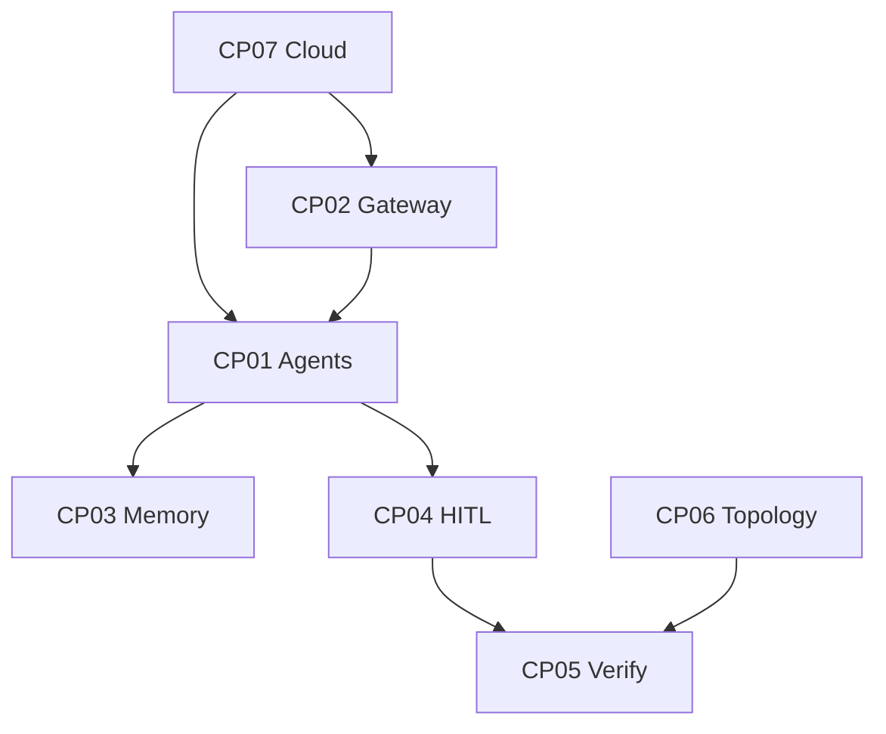

# SupremeAI — Core Plan Conflict Analysis

> **বিশ্লেষণের উদ্দেশ্য:** সব কোর প্ল্যান কি একে অপরের সাথে যুক্ত? সব সাব-প্ল্যান
> কি কোনো না কোনো কোর-এর সাথে যুক্ত? যেগুলো যুক্ত না — সেগুলোই আসল
> **conflicted plan**।

**সম্পর্কিত:** [ECOSYSTEM_PHILOSOPHY.md](./ECOSYSTEM_PHILOSOPHY.md) ·
[CORE_PLANS_CONNECTION_MAP.md](./CORE_PLANS_CONNECTION_MAP.md) ·
[core-plans/](./core-plans/README.md)

---

## ১. সারাংশ (Executive Summary)

| প্রশ্ন | উত্তর |
|---|---|
| ৭টা কোর প্ল্যান কি পরস্পর যুক্ত? | ✅ **হ্যাঁ** — সব ৭টা transitively connected |
| P01-P12 কি কোনো কোর-এ যুক্ত? | ✅ **হ্যাঁ** — সব ১২টা যুক্ত |
| ২৩টা Crown Jewel module কি যুক্ত? | ✅ **হ্যাঁ** — সব ২৩টা যুক্ত |
| Legacy ১৮৩ ফাইল কি যুক্ত? | ⚠️ **৮টা conflicted** (কোর-এর সাথে দিক ভিন্ন/বিপরীত) |

**আসল conflict সংখ্যা:** ৯টা conflicted + ১টা "complementary but confusing"

---

## ২. কোর-টু-কোর কানেকশন বিশ্লেষণ (Core-to-Core)

### ৭টা কোর প্ল্যানের ডিরেক্ট কানেকশন

```
CP01 <-> CP02, CP03, CP04, CP05, CP07   (৫টা — সবচেয়ে সংযুক্ত)
CP02 <-> CP01, CP07                      (২টা)
CP03 <-> CP01                            (১টা — সবচেয়ে কম)
CP04 <-> CP01, CP05                      (২টা)
CP05 <-> CP01, CP04, CP06               (৩টা)
CP06 <-> CP05                            (১টা — সবচেয়ে কম)
CP07 <-> CP01, CP02                      (২টা)
```

### BFS কানেক্টিভিটি চেক

CP01 থেকে BFS চালালে সব ৭টা কোর প্ল্যানে পৌঁছানো যায়:



**✅ কোনো isolated core plan নেই।** সব ৭টা একটা জীবন্ত গ্রাফ গঠন করে।

### ⚠️ দুর্বল কানেকশন (Weak Links)

| কোর | ডিরেক্ট কানেকশন | মন্তব্য |
|---|---|---|
| **CP03 Memory** | শুধু CP01 | CP03 শুধু CP01-এর সাথে যুক্ত। CP05 (verify) বা CP07 (cloud) এর সাথে সরাসরি না। |
| **CP06 Topology** | শুধু CP05 | CP06 শুধু CP05-কে enable করে। CP01/CP07 এর সাথে সরাসরি না। |

**সুপারিশ:** CP03 → CP05 (memory verification) এবং CP06 → CP01 (topology serves agents) কানেকশন স্পষ্ট করা উচিত।

---

## ৩. সাব-প্ল্যান → কোর প্ল্যান কানেকশন (P01-P12)

| সাব-প্ল্যান | যুক্ত কোর | স্ট্যাটাস |
|---|---|---|
| P01 Security Guardian | CP02, CP04, CP07 | ✅ ক্রস-কাটিং |
| P02 Provider Abstraction | CP02 | ✅ প্রধান সাহায্যকারী |
| P03 MCP Architecture | CP01 | ✅ প্রধান সাহায্যকারী |
| P04 Agent Orchestration | CP01 | ✅ প্রধান সাহায্যকারী |
| P05 Memory & Knowledge | CP03 | ✅ প্রধান সাহায্যকারী |
| P06 Browser Automation | CP05 | ✅ প্রধান সাহায্যকারী |
| P07 Frontend Evolution | CP06 | ✅ প্রধান সাহায্যকারী |
| P08 Infrastructure Opt. | CP07 | ✅ প্রধান সাহায্যকারী |
| P09 Observability | CP06 | ✅ state sync |
| P10 Deployment Safety | CP07 | ✅ canary + rollback |
| P11 Testing & Quality | সব ৭টা | ✅ ক্রস-কাটিং (CI gate) |
| P12 Codebase Cleanup | সব ৭টা | ✅ ক্রস-কাটিং (gardener) |

**✅ সব P01-P12 যুক্ত। কোনো orphan নেই।**

---

## ৪. কোর প্ল্যানে মডিউল সাপোর্ট শক্তি (Module Support Strength)

| কোর | মডিউল সংখ্যা | স্ট্যাটাস |
|---|---|---|
| CP01 Agents | ৫টা (M02, M06, M09, M12, M22) | ✅ শক্তিশালী |
| CP02 Gateway | ২টা (M03, M16) | ✠ মাঝারি |
| CP03 Memory | ৪টা (M01, M05, M07, M23) | ✅ শক্তিশালী |
| CP04 HITL | ৫টা (M13, M15, M17, M18, M20) | ✅ শক্তিশালী |
| CP05 Verify | ৪টা (M04, M08, M14, M21) | ✅ শক্তিশালী |
| CP06 Topology | ৩টা (M10, M11, M19) | ✠ মাঝারি |
| **CP07 Cloud** | **১টা (M22)** | **⚠️ দুর্বল** |

### ⚠️ CP07 দুর্বলতা

CP07 (Zero-Local Cloud Resilience) শুধু M22 (Scheduler) দিয়ে supported।
P08 ও P10 আছে কিন্তু সেগুলো P-level, module-level সাপোর্ট কম।

**সুপারিশ:** CP07-এর জন্য নতুন module বা explicit wiring দরকার:
- Edge Router observability module
- Federation failover drill module
- Render keepalive health module

---

## ৫. CONFLICTED PLANS (আসল conflict — কোর-এর সাথে বিপরীত)

এই ফাইলগুলো কোনো কোর-এর সাথে যুক্ত না — বরং **বিপরীত**। ইকোসিস্টেম দর্শনে
এগুলোকে "মুছবে না", কিন্তু "archive-dry-branch" হিসেবে আলাদা করা দরকার।

### Conflict ১: cloudflare_7node_global_edge_mesh_plan.md
- **কোর:** CP07 (Zero-Local Cloud Resilience)
- **কারণ:** ৭ Cloudflare account → 700k req/day। মাল্টি-অ্যাকাউন্ট কোটা
  multiplication — `free_tier_scaling_constitution` Rule 2 ভায়োলেট। CP07
  বলে "ফেডারেশন" কিন্তু কোটা বাড়ানোর জন্য অ্যাকাউন্ট বাড়ানো নিষিদ্ধ।
- **ভারডিক্ট:** `archive-dry-branch`

### Conflict ২: kaggle_6node_cluster_compute_plan.md
- **কোর:** CP07
- **কারণ:** ৬ Kaggle account → 180 GPU hr/week। একই নিয়ম ভায়োলেট।
- **ভারডিক্ট:** `archive-dry-branch`

### Conflict ৩: production_upgrade_implementation_plan_v2.md
- **কোর:** CP07
- **কারণ:** Istio service mesh + Kong API Gateway + NATS JetStream প্রস্তাব —
  Render ফ্রি-টিয়ারে অসম্ভব। CP07-এর লেন ফেডারেশন আর্কিটেকচারের বিপরীত।
- **ভারডিক্ট:** `archive-dry-branch`

### Conflict ৪: cloud_ai_multi_provider_deployment_plan.md
- **কোর:** CP02 (Vendor-Neutral Provider Gateway)
- **কারণ:** ৫টা কাল্পনিক GCP Cloud Run URL (Qwen/Llama/Phi) — কোডে নেই।
  CP02 বলে "ভেন্ডর-অ্যাগনস্টিক গেটওয়ে" কিন্তু এই প্ল্যান সেলফ-হোস্টেড মডেল চায় —
  দিক ভিন্ন।
- **ভারডিক্ট:** `archive-dry-branch`

### Conflict ৫: Plan_03_Continuous_Learning.md
- **কোর:** CP03 (Continuous Compounding Memory)
- **কারণ:** Qdrant দাবি করে কিন্তু CP03-এর canonical store = Supabase pgvector
  (M3 decision table)। ভেক্টর স্টোর নিয়ে conflict।
- **ভারডিক্ট:** `archive-reference` (CP03 দ্বারা superseded)

### Conflict ৬: customer_onboarding_flow.md (plan vs implementation)
- **কোর:** CP06 (Decoupled 3-Layer Topology)
- **কারণ:** প্ল্যান বলে "zero-config, 60s, কোনো API key না" কিন্তু আসল
  `OnboardingWizard.tsx` = `StepApiKey → StepModelSelect → StepFirstChat`।
  প্ল্যান vs implementation conflict।
- **ভারডিক্ট:** **implementation must follow plan** (code fix দরকার)

### Conflict ৭: ux_ui_best_practices_and_interaction_guide.md
- **কোর:** CP06
- **কারণ:** বলে "dark mode default নয়, option থাকুক" কিন্তু master plan বলে
  "dark-first"। ডার্ক মোড doctrine conflict।
- **ভারডিক্ট:** **doctrine conflict** — CP06-এ সমাধান করতে হবে

### Conflict ৮: Plan_22_Simulator_Controller_Perfection.md
- **কোর:** CP05 (Autonomous Simulator Verification)
- **কারণ:** নিজেই স্বীকার করে "❌ Completed Features: None - New requirement
  identified"। কিন্তু "90% complete" দাবি — self-contradictory। CP05-এর সাথে
  direct conflict (যা আসল verification চায়)।
- **ভারডিক্ট:** `archive-dry-branch`

### Conflict ৯: Java-era files (phase1-4, skill_matrix, dependency_matrix, onboarding_checklist, work_plan_bangla)
- **কোর:** CP06 + CP07 (wrong stack)
- **কারণ:** Java/Spring Boot + Firebase + Flask + MongoDB + Vue বর্ণনা করে —
  আসল স্ট্যাক Python/FastAPI + React + Render + Supabase। স্ট্যাক যুগের conflict।
- **ভারডিক্ট:** `archive-dry-branch` (stale stack)

---

## ৬. COMPLEMENTARY BUT CONFUSING (conflict নয়, কিন্তু কনফিউশন)

### ৫টা মাস্টার প্ল্যান
- UNIFIED_ECOSYSTEM_ARCHITECTURE_PLAN
- codebase_aligned_master_roadmap
- self_learning_ecosystem_transformation_roadmap
- living_autonomous_intelligence_synthesis
- SUPREMEAI_MASTER_PLAN_CANONICAL

**এগুলো conflict না** — একই সত্যকে ভিন্ন কোণ থেকে দেখে। কিন্তু CP01-CP07 এখন
canonical হলে এই ৫টা "complementary" — প্রতিযোগী না।

**ভারডিক্ট:** `archive-reference` with pointer to CP01-CP07

---

## ৭. Conflict ম্যাট্রিক্স (Core × Conflict)

| কোর | Conflict সংখ্যা | প্রভাবিত ফাইল |
|---|---|---|
| CP01 Agents | ০ | — |
| CP02 Gateway | ১ | cloud_ai_multi_provider |
| CP03 Memory | ১ | Plan_03_Continuous_Learning |
| CP04 HITL | ০ | — |
| CP05 Verify | ১ | Plan_22_Simulator |
| CP06 Topology | ৩ | onboarding, ux_ui_best_practices, Java-era |
| **CP07 Cloud** | **৪** | cloudflare_7node, kaggle_6node, production_upgrade_v2, Java-era |

### ⚠️ CP07 সবচেয়ে বেশি conflicted

CP07 (Zero-Local Cloud Resilience) এ ৪টা conflict — সবচেয়ে বেশি। কারণ:
- ফ্রি-টিয়ার নিয়ে অনেক পুরনো প্ল্যান ভিন্ন দিকে গিয়েছিল
- Enterprise rewrite (Istio/Kong) প্রস্তাব করেছিল
- স্ট্যাক যুগের সব ফাইল এখানে জমা

**সুপারিশ:** CP07-এর cleanup সবচেয়ে জরুরি।

---

## ৮. সারাংশ ও সুপারিশ

### কানেক্টিভিটি স্কোর

| স্তর | কানেক্টেড | কনফ্লিক্টেড | স্কোর |
|---|---|---|---|
| Core-to-Core | ৭/৭ | ০ | ✅ ১০০% |
| P01-P12 → Core | ১২/১২ | ০ | ✅ ১০০% |
| 23 Modules → Core | ২৩/২৩ | ০ | ✅ ১০০% |
| Legacy 183 → Core | ~১৭৪/১৮৩ | ৯ | ⚠️ ৯৫% |

### সুপারিশ

1. **CP07 cleanup সবার আগে** — ৪টা conflict, সবচেয়ে বেশি
2. **CP06 doctrine resolve** — onboarding + dark mode + Java-era (৩টা)
3. **CP03/CP05 single conflict** — সহজে সমাধানযোগ্য (archive)
4. **CP07 weak module support** — M22 ছাড়া আরও module দরকার
5. **CP03/CP06 weak core-to-core link** — CP03↔CP05, CP06↔CP01 স্পষ্ট করো

### ইকোসিস্টেম দর্শন অনুযায়ী

> ৯টা conflicted ফাইল কাউকে মুছতে হবে না। প্রতিটাকে তার ভূমিকা দাও:
> - `archive-dry-branch` — শুকনো ডাল (আলাদা করো, মুছো না)
> - `archive-reference` — পুরনো পাতা (মাটিতে মিশে খোরাক)
>
> এই ৯টা ফাইল ইকোসিস্টেমের শিক্ষা — কীভাবে না করতে হয়, তার প্রমাণ।

---

## রেফারেন্স

- [ECOSYSTEM_PHILOSOPHY.md](./ECOSYSTEM_PHILOSOPHY.md) — গাছের দর্শন
- [CORE_PLANS_CONNECTION_MAP.md](./CORE_PLANS_CONNECTION_MAP.md) — সব প্ল্যান কানেকশন
- [core-plans/](./core-plans/README.md) — ৭ কোর প্ল্যান
- [plans/MIGRATION_MAP.md](./plans/MIGRATION_MAP.md) — legacy ফাইল ভূমিকা
- [ANALYSIS_REPORT.md](./ANALYSIS_REPORT.md) — ১৮৩ ফাইল বিশ্লেষণ
