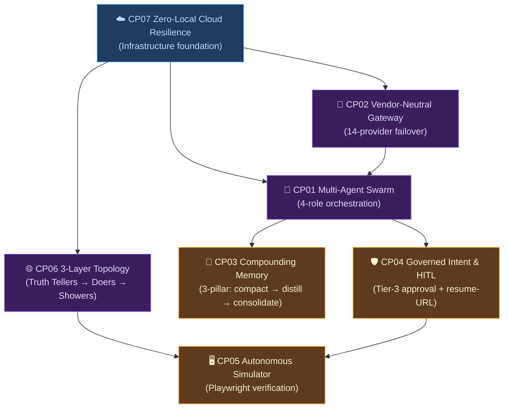
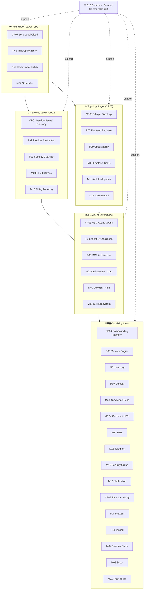

# SupremeAI — Core Plans Connection Map

> **"৭টা কোর প্ল্যান হলো গাছের মূল শাখা। বাকি সব প্ল্যান — P01-P12, ২৩টা Crown Jewel মডিউল,
> legacy ফাইল — এই শাখাগুলোকে সফল করার জন্য কাজ করে। কেউ কারও প্রতিযোগী না; সবাই একসাথে
> মিলে একটা জীবন্ত ইকোসিস্টেম গঠন করে।"**

**দর্শন:** [ECOSYSTEM_PHILOSOPHY.md](./ECOSYSTEM_PHILOSOPHY.md) ·
**কোর প্ল্যান ইনডেক্স:** [core-plans/README.md](./core-plans/README.md) ·
**বিবর্তন:** [CORE_PLANS_EVOLUTION.md](./CORE_PLANS_EVOLUTION.md)

---

## ১. ৭টা কোর প্ল্যানের ম্যাট্রিক্স (Core Plans Matrix)

| কোর প্ল্যান | ডোমেইন | Depends On | Enables | Modern Implementation |
|---|---|---|---|---|
| **CP01** Dynamic Multi-Agent Swarm | Agents | CP02 | CP03, CP04, CP05 | P04 + MCP Control Tower |
| **CP02** Vendor-Neutral Provider Gateway | Intelligence | — | CP01 | P02 + 14-Vendor LLM Gateway |
| **CP03** Continuous Compounding Memory | Intelligence | CP01 | — | P05 + CascadeMemoryService + pgvector |
| **CP04** Governed Intent & HITL | Governance | CP01 | CP05 | backend/core/hitl/ + Telegram + Resume-URL |
| **CP05** Autonomous Simulator Verification | Automation | CP01, CP04 | — | P06 + Playwright Headless Pool |
| **CP06** Decoupled 3-Layer Topology | Experience | — | CP05 | frontend/src/store/ + event_bus.py |
| **CP07** Zero-Local Cloud Resilience | Infrastructure | — | CP01, CP02 | Cloudflare Edge + Render Multi-Account |

---

## ২. কোর প্ল্যান গ্রাফ (Dependency Graph)



**পড়ার নিয়ম:** উপরের শাখা নিচের শাখাকে enable করে। CP07 (ক্লাউড) সবার ভিত্তি।
CP02 (গেটওয়ে) + CP06 (টপোলজি) মাঝখানে। CP01 (এজেন্ট) কেন্দ্রে।
CP03/CP04/CP05 উপরের স্তরে — memory, approval, verification।

---

## ৩. ছোট প্ল্যান → কোর প্ল্যান ম্যাপিং (Small Plans → Core Plans)

প্রতিটা ছোট প্ল্যান কোনো না কোনো কোর প্ল্যানকে **সফল করার জন্য কাজ করে**। কেউ প্রতিযোগী না।

### CP01 — Dynamic Multi-Agent Swarm কে কে সফল করে

| প্ল্যান | ভূমিকা | কীভাবে সাহায্য করে |
|---|---|---|
| **P04 Agent Orchestration** | প্রধান সাহায্যকারী | 4-role model (Planner/Writer/Reviewer/Guardian) |
| **P03 MCP Architecture** | এজেন্ট আবিষ্কার | টুল রেজিস্ট্রি যা এজেন্টদের capability দেয় |
| **MODULE_02 Orchestration Core** | কার্নেল একীকরণ | 4 orchestrator generation → 1 |
| **MODULE_09 Dormant Tools** | ReAct লুপ | এজেন্টরা যেন ০ টুল না কল করে |
| **MODULE_12 Skill Ecosystem** | স্কিল রেজিস্ট্রি | এজেন্ট ক্যাপাবিলিটি এক্সটেনশন |
| **MODULE_22 Scheduler** | সাপারভাইজার হার্টবিট | এজেন্ট ব্যাকগ্রাউন্ড টাস্ক শিডিউল |
| *Legacy:* MULTI_AGENT_MESH_MASTER_PLAN, EXTERNAL_AGENT_ORCHESTRATION_LAYER_PLAN | ইতিহাস | পুরনো টপোলজি (archive-reference) |

### CP02 — Vendor-Neutral Provider Gateway কে কে সফল করে

| প্ল্যান | ভূমিকা | কীভাবে সাহায্য করে |
|---|---|---|
| **P02 Provider Abstraction** | প্রধান সাহায্যকারী | 14-provider failover chain |
| **P01 Security Guardian** | কী লাইফসাইকেল | API key rotation + Infisical |
| **MODULE_03 LLM Gateway** | Zero-Bypass Boundary | `llm_gateway.py`-এর বাইরে LLM কল নিষিদ্ধ |
| **MODULE_16 Billing Metering** | কস্ট ট্র্যাকিং | meter-first doctrine, per-tenant খরচ |
| *Legacy:* dynamic_ai_architecture_v5_zero_downtime, vendor_independent_integration_architecture_plan | ইতিহাস | circuit-breaker প্যাটার্ন (archive-reference) |

### CP03 — Continuous Compounding Memory কে কে সফল করে

| প্ল্যান | ভূমিকা | কীভাবে সাহায্য করে |
|---|---|---|
| **P05 Memory & Knowledge Engine** | প্রধান সাহায্যকারী | 3-pillar stack + pgvector |
| **MODULE_01 Memory Subsystem** | canonical write path | 15 স্টোর → 1 CascadeMemoryService |
| **MODULE_07 Context Engine** | ইন-সেশন কম্প্যাকশন | ≥30% টোকেন কমানো |
| **MODULE_23 Knowledge Base** | retrieval-proof | যা retrieve করা যায় না তা "জানা" নয় |
| *Legacy:* PLAN_002 (compaction), PLAN_004 (distillation), PLAN_006 (consolidation) | ইতিহাস | এখন canonical write path-এ মার্জড |

### CP04 — Governed Intent & HITL কে কে সফল করে

| প্ল্যান | ভূমিকা | কীভাবে সাহায্য করে |
|---|---|---|
| **P01 Security Guardian** | টিয়ার-3 বাউন্ডারি | উচ্চ-ঝুঁকি কাজে মানুষের অনুমোদন |
| **MODULE_17 HITL & Approval** | resume-URL টোকেন | one-bridge-many-doors, 7 → 1 স্টেট মেশিন |
| **MODULE_18 Telegram** | অ্যাক্টিভেশন গেট | সিকিউরিটি + অ্যাক্টিভেশন এক গেটে |
| **MODULE_15 Security Organ** | deception-feedback | honeypot + autonoguard adaptive ডিফেন্স |
| **MODULE_20 Notification** | store-before-carrier | persistent SystemAlert → carrier |
| *Legacy:* Plan_04_Intent_Analysis, Plan_11_Pre_Push_Verification | ইতিহাস | intent classifier কনসেপ্ট (archive-reference) |

### CP05 — Autonomous Simulator Verification কে কে সফল করে

| প্ল্যান | ভূমিকা | কীভাবে সাহায্য করে |
|---|---|---|
| **P06 Browser Automation** | প্রধান সাহায্যকারী | Playwright headless pool + device emulation |
| **P11 Testing & Quality** | ভেরিফিকেশন গেট | pass^k + mission suite |
| **MODULE_04 Browser Stack** | allowed_actions unlock | click/fill/type HITL takeover |
| **MODULE_08 Scout** | রিসার্চ গ্রাউন্ডিং | 0-source → "no sources found" (truth) |
| **MODULE_21 Truth-Mirror** | false-assurance পার্জ | honest-mock vs dishonest-fabrication |
| *Legacy:* Plan_22_Simulator_Controller_Perfection | ইতিহাস | simulator concept (archive-dry-branch) |

### CP06 — Decoupled 3-Layer Topology কে কে সফল করে

| প্ল্যান | ভূমিকা | কীভাবে সাহায্য করে |
|---|---|---|
| **P07 Frontend Evolution** | Showers স্তর | React 19 + unified store |
| **P09 Observability** | state sync | metrics/logs/traces, runtime verification |
| **MODULE_10 Frontend Tier-S** | host-mount wiring | ChatInterface → 6 features live |
| **MODULE_11 Architecture Intelligence** | static dep graph | baseline-N ratchet |
| **MODULE_19 i18n Bengali** | language-tax reduction | 5× টোকেন কস্ট ঠিক |
| *Legacy:* UNIFIED_ECOSYSTEM_ARCHITECTURE_PLAN, federated_capability_circles_topology | ইতিহাস | 7-contract model (archive-reference) |

### CP07 — Zero-Local Cloud Resilience কে কে সফল করে

| প্ল্যান | ভূমিকা | কীভাবে সাহায্য করে |
|---|---|---|
| **P08 Infrastructure Optimization** | প্রধান সাহায্যকারী | free-tier federation + zero-hardcode |
| **P10 Deployment Safety** | canary + rollback | pre-push gate, safe rollout |
| **MODULE_22 Scheduler** | supervisor-as-heartbeat | last_run_at catch-up, no lost work |
| *Legacy:* free_tier_federation_master_plan_v4, render_* | ইতিহাস | federation doctrine (archive-reference) |

---

## ৪. সব প্ল্যান একসাথে (The Full Ecosystem)



---

## ৫. ক্রস-কাটিং প্ল্যান (Cross-Cutting Plans)

কিছু প্ল্যান একটা কোর-এ নয়, সব কোর-কে সাপোর্ট করে:

| প্ল্যান | ভূমিকা | কোন কোর-কে সাপোর্ট |
|---|---|---|
| **P01 Security Guardian** | ট্রাস্ট বাউন্ডারি | CP02 (কী), CP04 (Tier-3), CP07 (সিক্রেট) |
| **P11 Testing & Quality** | ভেরিফিকেশন স্পাইন | CP05 (E2E), সব কোর (CI gate) |
| **P12 Codebase Cleanup** | পরিষ্কার রাখখা | সব কোর (organization, archival) |

---

## ৬. ইকোসিস্টেম দর্শন (প্রতিটার ভূমিকা)

প্রতিটা প্ল্যান এই গাছের কোনো না কোনো অংশ — কেউ বর্জন নয়:

| গাছের অংশ | প্ল্যান | ভূমিকা |
|---|---|---|
| **শিকড় (Root)** | CP07, P08, P10 | মাটি, জল — সবার নিচে |
| **কাণ্ড (Trunk)** | CP02, CP06, CP01 | মূল প্রবাহ — রস ওঠে |
| **শাখা (Branches)** | CP03, CP04, CP05 | ডালপালা — capability |
| **পাতা (Leaves)** | P07, M10, M19 | ব্যবহারকারী দেখে |
| **ফুল (Flowers)** | CP05 ফলাফল | ভেরিফাইড ডেলিভারি |
| **শুকনো পাতা** | Legacy archive | মাটিতে মিশে খোরাক |
| **বাগানি (Gardener)** | P12, P11 | পরিষ্কার + সুস্থ রাখে |

> **নিয়ম:** কেউ কারও প্রতিযোগী না। প্রতিটা অংশ একটা ভূমিকা পালন করে।
> গাছটাকে ধরে রাখলে ফুল ফুটবে, ফল ধরবে।

---

## ৭. এক্সিকিউশন অর্ডার (কোন কোর আগে, কেন)

CP07 সবার আগে (শিকড়), CP05 সবার শেষে (ফুল):

```text
CP07 (Cloud)     ← Wave 0: সেফটি নেট, DB hazard বন্ধ
   ↓
CP02 (Gateway)   ← Wave 1: InferenceContext + Zero-Bypass
CP06 (Topology)  ← Wave 1: run_scope, unified store
   ↓
CP01 (Agents)    ← Wave 1-2: ReAct loop, role model
   ↓
CP03 (Memory)    ← Wave 2: canonical write path
CP04 (HITL)      ← Wave 2: resume-URL token
   ↓
CP05 (Verify)    ← Wave 3-5: Playwright, pass^k, truth-mirror
```

বিস্তারিত: [ANALYSIS_REPORT.md](./ANALYSIS_REPORT.md) §8

---

## রেফারেন্স

- [ECOSYSTEM_PHILOSOPHY.md](./ECOSYSTEM_PHILOSOPHY.md) — গাছের দর্শন
- [CORE_PLANS_EVOLUTION.md](./CORE_PLANS_EVOLUTION.md) — কোর প্ল্যান বিবর্তন
- [core-plans/README.md](./core-plans/README.md) — ৭ কোর প্ল্যান ইনডেক্স
- [plans/PLAN_REGISTRY.md](./plans/PLAN_REGISTRY.md) — ১২ ক্যানোনিকাল প্ল্যান
- [plans/PLAN_GRAPH.md](./plans/PLAN_GRAPH.md) — ডিপেন্ডেন্সি গ্রাফ
- [plans/MIGRATION_MAP.md](./plans/MIGRATION_MAP.md) — legacy ফাইল ভূমিকা নির্ধারণ
