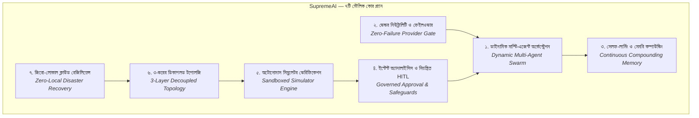

# SupremeAI — ৭টি মৌলিক কোর প্ল্যান ও বিবর্তন নকশা
## (The 7 Timeless Core Plans: From Genesis to Modern PaaS)

> **"আজকের প্ল্যান আর প্রথম দিনের প্ল্যান ৭০%–৮০% একই। প্ল্যান হলো লক্ষ্য ও শৃঙ্খলা (যা অপরিবর্তিত), আর ফোল্ডার, ইনডেক্সিং এবং টেক-স্ট্যাক হলো এক্সিকিউশন (যা সময়ের সাথে সাথে অভিযোজিত হয়েছে)।"**  
> — *Founder Directive, 2026-09-25*

---

## ১. দর্শন: প্ল্যান বনাম এক্সিকিউশন (Plan vs. Execution)

SupremeAI শুরু হয়েছিল একটি স্পষ্ট এবং দৃঢ় দৃষ্টিভঙ্গি নিয়ে: **একটি সেলফ-লার্নিং, স্বয়ংক্রিয় এবং মাল্টি-এজেন্ট সিস্টেম তৈরি করা যা সম্পূর্ণ স্বাধীনভাবে কাজ করবে এবং দিন দিন আরও শক্তিশালী হবে।**

| মাত্রা | সংজ্ঞা | অবস্থা | উদাহরণ |
| :--- | :--- | :--- | :--- |
| **কোর প্ল্যান (Core Intent)** | সিস্টেমের মৌলিক উদ্দেশ্য, দর্শন ও আর্কিটেকচারাল নিয়ম | **অপরিবর্তিত (Permanent)** | মাল্টি-এজেন্ট অর্কেস্ট্রেশন, মেমরি কম্পাউন্ডিং, জিরো-হার্ডকোড, ভেন্ডর নিউট্রালিটি |
| **এক্সিকিউশন (Execution)** | সময়, খরচ ও বাস্তবতার সাপেক্ষে বেছে নেওয়া টুলস, ফ্রেমওয়ার্ক ও ফোল্ডার | **অভিযোজিত (Changeable)** | Java প্রোটোটাইপ $\rightarrow$ Flask $\rightarrow$ FastAPI + TypeScript MCP + React 19 |

অতীতে তৈরি করা কোনো প্ল্যানই "ভুল" ছিল না; সেগুলো ছিল সময়ের সাথে সাথে প্রজেক্টের এক্সিকিউশনের বিবর্তন (Evolutionary Lineage)। সেই সব বিবর্তনের ভেতর থেকে **৭টি মৌলিক কোর প্ল্যান** নিচে স্থায়ীভাবে লিপিবদ্ধ করা হলো।

---

## ২. ৭টি মৌলিক কোর প্ল্যান (The 7 Core Pillars)



---

### কোর প্ল্যান ১: ডাইনামিক মাল্টি-এজেন্ট অর্কেস্ট্রেশন (Dynamic Multi-Agent Swarm)
* **মূল উদ্দেশ্য:** সিস্টেম কোনো নির্দিষ্ট ১ বা ২টি হার্ডকোডেড এআই মডেলের মধ্যে বন্দি থাকবে না। সিস্টেম ডাইনামিকালি $1 \dots N$ মডেল/এজেন্টকে আবিষ্কার করবে এবং কাজের জটিলতা ও সার্ভিসের প্রাপ্যতা অনুযায়ী রোল নির্ধারণ করবে।
* **রোল মডেল:**
  1. **Planner / Architect:** বড় কাজকে ছোট ছোট টাস্কে ভাগ করে।
  2. **Writer / Executor:** কোড বা কনটেন্ট তৈরি করে।
  3. **Reviewer:** কোডের গুণমান এবং কনফ্লিক্ট পরীক্ষা করে।
  4. **Security Guardian:** সিক্রেট ও পারমিশন সীমানা রক্ষা করে।
* **বর্তমান রূপ:** **`P04 Agent Orchestration`** এবং সেন্ট্রাল **MCP Control Tower** (stdio + HTTP transport)।

---

### কোর প্ল্যান ২: ভেন্ডর নিউট্রালিটি, কি-রোটেশন ও ফেইলওভার (Vendor Neutrality & Resilience)
* **মূল উদ্দেশ্য:** কোনো নির্দিষ্ট এআই ভেন্ডর (OpenAI, Google, Anthropic)-এর ডাউনটাইম বা রেট-লিমিটের কারণে SupremeAI বন্ধ হতে পারবে না।
* **মূল আর্কিটেকচার:**
  - একক গেটওয়ে দিয়ে সব ট্রাফিক যাবে (`Zero-Bypass Inference Boundary`)।
  - এক্সপোনেনশিয়াল ব্যাকঅফ এবং অটোমেটিক প্রোভাইডার ফেইলওভার চেইন (Gemini $\rightarrow$ Groq $\rightarrow$ OpenRouter $\rightarrow$ Local Ollama)।
  - এপিআই কি রোটেশন ও কোটা ট্র্যাকিং।
* **বর্তমান রূপ:** **`P02 Provider Abstraction`** ও ১৪-ভেন্ডর LLM গেটওয়ে।

---

### কোর প্ল্যান ৩: সেলফ-লার্নিং ও মেমরি কম্পাউন্ডিং (Compounding Intelligence)
* **মূল উদ্দেশ্য:** সিস্টেমকে প্রতি সেশনে শূন্য থেকে শুরু করতে হবে না। প্রতিটি সমাধানের অভিজ্ঞতা মেমোরিতে যাবে, যাতে একই বা কাছাকাছি সমস্যা ভবিষ্যতে আসলে কম সময়ে এবং কম টোকেন খরচে সমাধান হয়।
* **নমুনাসূত্র:**
  $$\text{Cost}(\text{Task}_{50}) < \text{Cost}(\text{Task}_5)$$
* **মেমরি ট্রায়ো:**
  - *In-Session Compaction:* চলমান প্রসঙ্গের সংকোচন।
  - *Distillation:* মূল লার্নিং নির্যাস আলাদা করা।
  - *Consolidation:* পার্মানেন্ট ভেক্টর ডেটাবেসে (pgvector) স্থায়ী জ্ঞান তৈরি।
* **বর্তমান রূপ:** **`P05 Memory & Knowledge Engine`** এবং ৩-পিলার কনসোলিডেশন।

---

### কোর প্ল্যান ৪: ইন্টেন্ট অ্যানালাইসিস ও হিউম্যান-ইন-দ্য-লুপ (Governed HITL & Intent)
* **মূল উদ্দেশ্য:** এআই-এর কাজ স্বয়ংক্রিয় হলেও উচ্চ ঝুঁকিপূর্ণ কাজে অন্ধ স্বাধীনতা দেওয়া হবে না।
* **নিয়মাবলী:**
  - প্রতিটি নির্দেশের পেছনে ইন্টেন্ট (Intent) ও কনফিডেন্স স্কোরিং থাকবে।
  - ধ্বংসাত্মক কমান্ড, সিক্রেট পরিবর্তন বা প্রোডাকশন ডেপ্লয়মেন্টের জন্য **Human-in-the-Loop (HITL)** অনুমোদন বাধ্যতামূলক।
  - সিকিউর `resume-URL` টোকেনের মাধ্যমে টেলিগ্রাম বা ড্যাশবোর্ড থেকে ওয়ান-ক্লিক অ্যাপ্রুভাল।
* **বর্তমান রূপ:** **`C5 Governed Approval`** এবং Tier-3 সেফটি গেট।

---

### কোর প্ল্যান ৫: অটোনোমাস সিমুলেটর ও রিয়েল-টাইম ভেরিফিকেশন (Autonomous Simulator Engine)
* **মূল উদ্দেশ্য:** এআই কেবল কোড লিখে বসে থাকবে না; এটি কোড রান করিয়ে যাচাই করে প্রমাণ দেবে।
* **আর্কিটেকচার:**
  - স্যান্ডবক্সড সিমুলেটরে অ্যাপ চালু করা।
  - হেডলেস ব্রাউজারে ডিভাইস এমুলেশন, রিয়েল-টাইম ওয়েব-সকেট ইন্টার‍্যাকশন ও ডম স্ক্রিনশট ক্যাপচার।
  - মেশিন-কাউন্টেড এভিডেন্স টেস্ট পাস হলে তবেই টাস্ক "Done" ঘোষণা করা।
* **বর্তমান রূপ:** **`P06 Browser Automation`** ও Playwright রানটাইম ভেরিফিকেশন।

---

### কোর প্ল্যান ৬: ৩-স্তরের ডিকাপলড টপোলজি (3-Layer Decoupled Topology)
* **মূল উদ্দেশ্য:** সিস্টেমের প্রতিটি অংশ সুনির্দিষ্ট বাউন্ডারিতে বিভক্ত থাকবে, কোনো মডিউল আরেকটির সাথে অযথা জটলা পাকাবে না:
  1. **Data Sources (Truth Tellers):** ডাটাবেস, মেট্রিক্স, রিয়েল স্টেট।
  2. **Action Takers (The Doers):** ব্যাকএন্ড কোর সার্ভিস, MCP টুলস ও রানার।
  3. **Display Views (The Showers):** ফ্রন্টএন্ড স্টুডিও, কন্ট্রোল প্যানেল ও ড্যাশবোর্ড।
  - সমস্ত স্টেট সিঙ্ক হবে সেন্ট্রাল **Unified Store** এবং ইভেন্ট বাসের মাধ্যমে।
* **বর্তমান রূপ:** **`C1 Capability Registry`** এবং React 19 + Zustand Unified Store।

---

### কোর প্ল্যান ৭: জিরো-লোকাল ক্লাউড রেজিলিয়েন্স (Zero-Local Cloud Resilience)
* **মূল উদ্দেশ্য:** 
  - কাজের ১%-ও লোকাল পিসির ওপর নির্ভরশীল থাকবে না (Zero Local-Machine Dependency)।
  - কোনো একটি সার্ভার নোড ডাউন হলেও ক্লাউডফ্লেয়ার এজ রাউটার এবং ফলব্যাক নোড দিয়ে সার্ভিস ২৪/৭ সচল থাকবে (ফ্রি-টিয়ার ফেডারেশন)।
  - সাইলেন্ট ডেটা লস সম্পূর্ণ নিষিদ্ধ (হার্ড-ফেইল ডাটাবেস চুক্তি)।
* **বর্তমান রূপ:** **`P08 Infrastructure Optimization`** (Render + Cloudflare + Supabase Federation)।

---

## ৩. বিবর্তন ম্যাট্রিক্স (Genesis to Modern PaaS)

| কোর প্ল্যান | প্রথম দিনের পরিকল্পনা (Genesis) | মধ্যবর্তী অভিযোজন (Mid-Pivot) | বর্তমান আধুনিক রূপ (Modern PaaS) |
| :--- | :--- | :--- | :--- |
| **১. Multi-Agent** | Java Spring Boot + `AgentOrchestrator.java` | Flask REST API + Worker | **Node/TS MCP Tower (~80 Tools) + FastAPI Swarm** |
| **২. Provider Gate** | `AIProviderFactory.java` (HF + Render) | litellm script routing | **14-Provider Zero-Bypass Gateway (`P02`)** |
| **৩. Memory Engine** | Firebase collections + local vector cache | ChromaDB ephemeral | **Supabase pgvector + Letta/Mem0 Distillation (`P05`)** |
| **৪. Governed HITL** | Hardcoded console prompt | Slack/Discord webhook alert | **Unified Resume-URL Token + Telegram Bot (`C5`)** |
| **৫. Simulator Engine** | DeviceEmulationMiddleware + Local preview | Docker preview URL | **Playwright Headless + Browser Automation (`P06`)** |
| **৬. Decoupled Topology** | Flutter + Firebase Database | Vue/Vite + REST endpoints | **React 19 + Vite 7 + Zustand Unified Store (`P07`)** |
| **৭. Cloud Resilience** | Single Cloud Build instance | Render manual multi-service | **4-Render Federation + Cloudflare Edge Router (`P08`)** |

---

## ৪. ৫টি চুক্তি ও ১২ ক্যানোনিকাল প্ল্যানের সাথে সংযোগ

এই ৭টি কোর প্ল্যানই আমাদের বর্তমান **৫টি চুক্তি (C1–C5)** এবং **১২টি ক্যানোনিকাল প্ল্যান (P01–P12)**-এর প্রাণশক্তি:

```text
[কোর প্ল্যান ১ & ২] ──► C1: Capability Registry  ──► P02 (Provider) & P04 (Agents)
[কোর প্ল্যান ৪]     ──► C2: Canonical Run        ──► P10 (Deployment Safety)
[কোর প্ল্যান ৫]     ──► C3: Verify Gate          ──► P06 (Browser) & P11 (Testing)
[কোর প্ল্যান ৩]     ──► C4: Memory Write         ──► P05 (Memory Engine)
[কোর প্ল্যান ৪]     ──► C5: Governed Approval    ──► P01 (Security Guardian)
[কোর প্ল্যান ৬ & ৭] ──► Ecosystem Architecture   ──► P03 (MCP) & P08 (Infrastructure)
```

---

## ৫. ভবিষ্যৎ কন্ট্রিবিউটর ও এজেন্টদের জন্য নির্দেশিকা

1. **নতুন কোড লেখার সময়:** সবসময় স্মরণ রাখুন—আমরা চাকা নতুন করে আবিষ্কার করি না (`extend-not-replace`)। যে ৭টি কোর পিলার প্রতিষ্ঠিত হয়েছে, নতুন যেকোনো ফিচার এই ৭টির কোনো একটির এক্সটেনশন হিসেবে যুক্ত হবে।
2. **ফোল্ডার ও ইনডেক্সিং পরিবর্তনের সময়:** ফোল্ডার স্ট্রাকচার সময় ও পরিচ্ছন্নতার খাতিরে পুনর্বিন্যাস হতে পারে, কিন্তু সেই পুনর্বিন্যাস যেন এই ৭টি মৌলিক স্তম্ভের কোনোটিকে ক্ষুণ্ণ না করে।
3. **সোর্স অফ ট্রুথ:** এই ডকুমেন্টটি SupremeAI-এর চিরন্তন আর্কিটেকচারাল সারমর্ম। কোনো এজেন্ট যেন একে "পুরোনো" বা "বাতিল" মনে না করে; এটিই আমাদের ভিত্তি।
