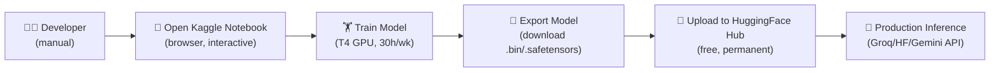
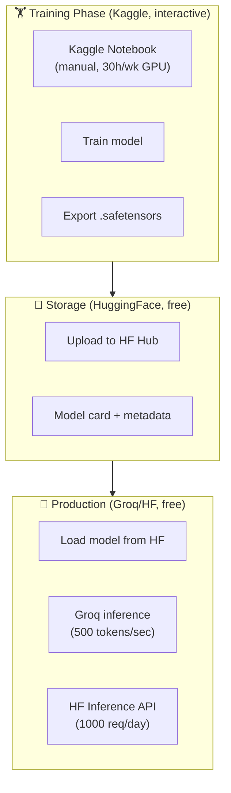

# SupremeAI — Kaggle Legitimate Use Plan

> **"Kaggle শুধু interactive notebook-এর জন্য — training/fine-tuning ম্যানুয়ালভাবে।
> Production inference কখনো Kaggle দিয়ে না। Headless bot সম্পূর্ণ নিষিদ্ধ।"**

**তৈরি:** 2026-09-25 · **AGENTS.md compliance:** ✅
**সম্পর্কিত:** [MULTI_PROVIDER_FEDERATION.md](./MULTI_PROVIDER_FEDERATION.md) ·
[ZERO_COST_STRATEGY.md](./ZERO_COST_STRATEGY.md)

---

## ০. এক লাইনে নিয়ম

```
Kaggle = interactive training/fine-tuning only
       ≠ production inference
       ≠ headless bot
       ≠ API endpoint
```

---

## ১. Kaggle-এর ToS (সততার সাথে)

Kaggle-এর Terms of Service স্পষ্টভাবে বলে:

### ✅ Allowed (Legitimate)

- **Interactive notebook** — ম্যানুয়ালি notebook খুলে code চালানো
- **Dataset exploration** — dataset ব্রাউজ করা, analyze করা
- **Model training** — ম্যানুয়াল notebook-এ model train করা
- **Competition participation** — Kaggle competition-এ অংশ নেওয়া
- **GPU (T4/P100)** — ৩০ ঘণ্টা/সপ্তাহ, ইন্টারেক্টিভ notebook-এ

### ❌ নিষিদ্ধ (ToS Violation)

- **Headless/automated execution** — bot দিয়ে notebook চালানো
- **Production inference** — notebook দিয়ে বাইরের সার্ভিসে API call
- **Multiple accounts** — এক ব্যক্তি একাধিক account
- **API scraping** — Kaggle API দিয়ে automated data collection
- **GPU বাইরে route করা** — notebook GPU দিয়ে অন্য সার্ভিসে কল

---

## ২. Legitimate Kaggle Use — Training Only

### কাজ যা Kaggle-এ করা যায়

| কাজ | কীভাবে | Legitimate? |
|---|---|---|
| **Model fine-tuning** | ম্যানুয়াল notebook খুলে, ৩০h/wk GPU | ✅ |
| **Dataset preparation** | interactive notebook-এ | ✅ |
| **Model evaluation** | notebook-ে eval script চালানো | ✅ |
| **Training experiment** | hyperparameter tuning | ✅ |
| **Model export** | trained model ডাউনলোড করা | ✅ |

### কাজ যা Kaggle-এ করা যায় না

| কাজ | কেন | Alternative |
|---|---|---|
| **Production inference** | ToS violation | Groq/HF/Gemini |
| **API endpoint** | ToS violation | Render API |
| **Background worker** | ToS violation | Render worker |
| **Bot automation** | ToS violation | কোনো alternative না — দরকার নেই |

---

## ৩. Kaggle Training Workflow (Legitimate)



### ধাপসমূহ

#### ধাপ ১: Training (Kaggle-এ)
1. Developer ম্যানুয়ালি Kaggle notebook খোলে (browser)
2. Training code লেখে/রান করে
3. T4/P100 GPU দিয়ে model train (৩০h/wk free)
4. Notebook save করে, version note রাখে

#### ধাপ ২: Export
1. Trained model ডাউনলোড করে (.bin/.safetensors)
2. Model card তৈরি করে (metadata, license, use case)
3. HuggingFace Hub-এ আপলোড করে (ফ্রি, permanent)

#### ধাপ ৩: Production Inference (Kaggle ছাড়া)
1. HuggingFace Hub থেকে model load করে
2. **Groq** দিয়ে fast inference (৫০০ tokens/sec)
3. অথবা **HF Inference API** দিয়ে (১০০০ req/day free)
4. অথবা **Modal/Replicate** দিয়ে serverless GPU

---

## ৪. Kaggle Account ব্যবহার (Team)

### নিয়ম: প্রতিটা টিম মেম্বারের নিজের Kaggle account

```
Member 1 (AI lead):     Kaggle account 1 → training experiments
Member 2 (Data):        Kaggle account 2 → dataset prep
Member 3 (Research):    Kaggle account 3 → model eval
Member 4 (ML):          Kaggle account 4 → fine-tuning
...
```

### কেন legitimate

- প্রতিটা account একজন আসল মেম্বারের
- প্রতিটার আলাদা legitimate use (training/data/eval)
- সবাই interactive notebook use করে, কেউ headless bot না
- ৩০h/wk × ১০ account = **৩০০h/wk legitimate GPU**

### কিন্তু — একই account-এ ৩০h/wk

```
Member 1: 30h/wk GPU (interactive, legitimate)
Member 2: 30h/wk GPU (interactive, legitimate)
...
Member 10: 30h/wk GPU (interactive, legitimate)

মোট: 300h/wk legitimate GPU training capacity
```

---

## ৫. Kaggle vs Alternatives (কখন কোনটা)

| কাজ | Kaggle | Alternative | কেন |
|---|---|---|---|
| **Model training** | ✅ (interactive) | Google Colab (interactive) | দুটোই legitimate |
| **Fine-tuning** | ✅ | HF Spaces | Kaggle ৩০h, HF permanent |
| **Production inference** | ❌ | Groq/HF/Gemini | Kaggle ToS violation |
| **Dataset storage** | ✅ | HuggingFace Datasets | দুটোই free |
| **Model hosting** | ❌ | HuggingFace Hub | Kaggle এ নেই |
| **Background job** | ❌ | Render worker | Kaggle ToS violation |

---

## ৬. Kaggle Integration with SupremeAI Pipeline

### Training Pipeline (Kaggle → HF → Production)



### কোনো Headless Step নেই

- ❌ কোনো Kaggle API call (automated)
- ❌ কোনো Kaggle notebook trigger (CI থেকে)
- ❌ কোনো Kaggle GPU route (বাইরের সার্ভিসে)
- ✅ শুধু ম্যানুয়াল training → download → upload → production

---

## ৭. Kaggle Account Management

### প্রতিটা Kaggle account-এর জন্য record

```yaml
kaggle_account:
  owner: "member-1 (name + email)"
  username: "member1_kaggle"
  use_case: "model training"
  gpu_quota: "30h/week"
  last_training: "2026-09-25"
  models_trained: ["supremeai-bengali-v1", "supremeai-router-v2"]
  legitimate_use: "interactive notebook only"
```

### Offboarding

মেম্বার ছাড়লে:
1. ওই মেম্বারের Kaggle account-এর trained models HuggingFace-এ migrate
2. ওই account-এর Kaggle access revoke (যদি shared হয়)
3. Audit log-এ রেকর্ড

---

## ৮. কী কী Avoid করবে

| ❌ ভুল | কেন |
|---|---|
| Kaggle notebook দিয়ে production API | ToS violation |
| Headless bot দিয়ে notebook চালানো | ToS violation |
| Proxy দিয়ে Kaggle access লুকানো | behavioral detection → ban |
| Kaggle GPU বাইরের সার্ভিসে route | ToS violation |
| এক ব্যক্তি একাধিক Kaggle account | ToS violation |
| CI থেকে Kaggle notebook trigger | ToS violation |

---

## ৯. Performance + Cost Analysis

### Training Cost (Kaggle legitimate)

| কাজ | Kaggle Free | Alternative Paid |
|---|---|---|
| Model fine-tuning (১ বার) | $0 (৩০h/wk) | $৫-২০ (AWS/GCP) |
| Dataset prep | $0 | $২-৫ |
| Hyperparameter tuning | $0 (৩০h/wk) | $১০-৫০ |

**সাশ্রয়:** প্রতিটা training experiment-এ $৫-৫০ — legitimate, $0।

### Inference Cost (Kaggle ছাড়া)

| কাজ | Provider | Cost |
|---|---|---|
| Production inference | Groq (500 tokens/sec) | $0 (১৪৪০০ req/day) |
| Fallback inference | HF Inference | $0 (১০০০ req/day) |
| Heavy inference | Modal ($৩০/mo credit) | $০-৩/mo |

**ফলাফল:** Training $0 (Kaggle), Inference $0 (Groq) — সম্পূর্ণ legitimate।

---

## ১০. Summary

```
Kaggle legitimate use:
  ✅ Interactive notebook training (30h/wk × 10 members = 300h/wk)
  ✅ Model export to HuggingFace
  ✅ Dataset preparation
  ❌ Production inference (use Groq instead)
  ❌ Headless bot (never)
  ❌ API endpoint (never)

Result:
  Training: $0 (Kaggle, 300h/wk legitimate)
  Inference: $0 (Groq, 500 tokens/sec)
  Storage: $0 (HuggingFace Hub)
  Total: $0/month, fully legitimate
```

---

## ১১. ইকোসিস্টেম দর্শন

> **Kaggle হলো গাছের বীজ থেকে চারা গজানোর জায়গা — nursery।**
> চারা বড় হলে তাকে বাগানে (HuggingFace) লাগাতে হয়, নার্সারিতে রাখা যায় না।
> একইভাবে — Kaggle-এ model train করো, তারপর HuggingFace-এ নিয়ে যাও,
> production-এ Groq দিয়ে serve করো।
>
> কেউ nursery-তেই গাছ রেখে ফল চায় না — সেটা অসম্ভব আর অসৎ।

---

## রেফারেন্স

- [MULTI_PROVIDER_FEDERATION.md](./MULTI_PROVIDER_FEDERATION.md) — multi-account legitimate
- [ZERO_COST_STRATEGY.md](./ZERO_COST_STRATEGY.md) — $0/month strategy
- [core-plans/CP02](./core-plans/CP02_VENDOR_NEUTRAL_PROVIDER_GATEWAY.md) — LLM gateway
- [core-plans/CP03](./core-plans/CP03_CONTINUOUS_COMPOUNDING_MEMORY.md) — memory (model storage)
