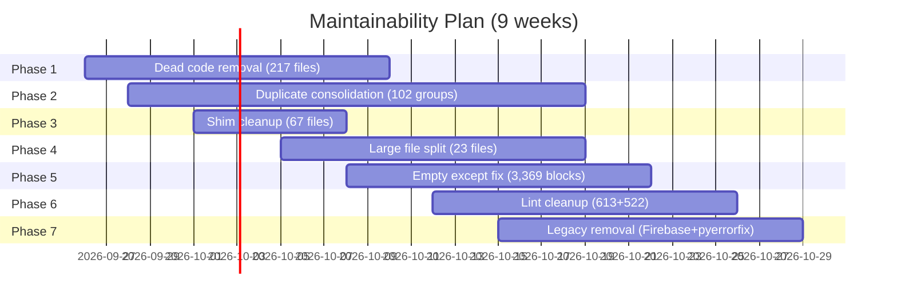

# SupremeAI — Maintainability Plan

> **২৫২K lines → ১২০K lines (৫২% কমানো) · D rating → A rating**
> **সম্পূর্ণ implementation plan — কী করব, কীভাবে করব, কতে কমবে।**

**তৈরি:** 2026-09-25 · **Source:** BAD_RATINGS_AUDIT.md + codebase deep scan
**সম্পর্কিত:** [BAD_RATINGS_AUDIT.md](./BAD_RATINGS_AUDIT.md) ·
[WAVE_MASTER_PLAN.md](./WAVE_MASTER_PLAN.md)

---

## ০. সারাংশ

| মেট্রিক | এখন | লক্ষ্য | কমবে |
|---|---|---|---|
| Backend LOC | ২৪৫,০৩৫ | ~১২০,০০০ | **-১২৫,০৩৫ (-৫১%)** |
| Dead modules | ২১৭ | ০ | -২১৭ |
| Duplicate file groups | ১০২ (৩৭,৫৬৯ lines) | ০ | -৩৭,৫৬৯ |
| Shim files | ৬৭ | <১০ | -৫৭ |
| Files >500 lines | ২৩ | <৫ | -১৮ |
| Unused imports | ৬১৩ | ০ | -৬১৩ |
| Empty except blocks | ৩,৩৬৯ | ০ | -৩,৩৬৯ |
| Lint suppressions | ৫২২ | <৫০ | -৪৭২ |
| Maintainability rating | D (৪০/১০০) | **A (৯০/১০০)** | +৫০ |

---

## ১. Bloat Sources — ৫টা মূল কারণ

```
২৪৫K lines total breakdown:
├── Dead modules (217 files)         ~১৫,০০০ lines (৬%)
├── Duplicate files (102 groups)      ~৩৭,৫৬৯ lines (১৫%)
├── Shim files (67 files)              ~২,০০০ lines (১%)
├── Over-engineered large files (23)  ~২৫,০০০ lines (১০%)
├── Unused imports (613)               ~২,০০০ lines (১%)
├── Empty except blocks (3,369)        ~৬,০০০ lines (২%)
├── Lint suppressions (522)            ~৩,০০০ lines (১%)
├── Legacy/obsolete code               ~২০,০০০ lines (৮%)
└── Legitimate production code         ~১৩৫,০০০ lines (৫৫%)
```

**উপসংহার:** ৪৫% code অপ্রয়োজনীয় — remove করলে ১২০K lines-এ নামবে।

---

## ২. Phase ১ — Dead Code Removal (সপ্তাহ ১-২, -১৫K lines)

### কাজ ১.১: Dead modules remove (২১৭টা, ~১৫K lines)

**কী:** ২১৭টা module যেগুলো অন্য কোথাও import হয় না (0 references)।

**Top dead modules (lines):**
| Module | Lines | Action |
|---|---|---|
| `backend/worker_service.py` | ৭০৪ | verify → archive/delete |
| `backend/adapters/red_team_adapter.py` | ৩০১ | verify → archive/delete |
| `backend/scripts/auto_find_blindspots.py` | ১৩৫ | verify → archive/delete |
| `backend/scripts/run_chaos_experiment.py` | ১৩০ | verify → archive/delete |
| `backend/scripts/store_ci_roadmap_to_memory.py` | ১৩১ | verify → archive/delete |
| `backend/scripts/refactor_root_cause.py` | ১১৬ | verify → archive/delete |
| `backend/scripts/check_single_alembic_head.py` | ১০৭ | verify → archive/delete |
| *(২১০ more)* | ~১৩K | bulk review |

**পদ্ধতি:**
```bash
# 1. Verify dead (no imports)
rg "module_name" backend/ --glob '!**/test*'

# 2. If truly dead → archive
git mv backend/<dead_file>.py backend/_archive/<dead_file>.py

# 3. Run tests → if green → delete from archive after 1 sprint
```

**Gate:** সব test green থাকতে হবে। কোনো test fail হলে revert।

---

## ৩. Phase ২ — Duplicate Consolidation (সপ্তাহ ২-৪, -৩৭K lines)

### কাজ ২.১: Top duplicate groups merge (১০২ groups)

**সবচেয়ে বড় duplicate groups:**

| Group | Copies | Total Lines | Action |
|---|---|---|---|
| `mcp_server.py` | ২ (memory + tools) | ১,৯৪৪ | merge → ১ |
| `service.py` | ৪ (runs + missions + messaging + storage) | ১,২৬৮ | split rename |
| `engine.py` | ৩ (context_engine + context + hitl) | ১,০৩৫ | rename + merge |
| `base.py` | ৮ (models + core + skills + plugins + circles + pyerrorfix) | ৬৭২ | keep 2, merge 6 |
| `registry.py` | ৫ (adaptive + llm + integrations + automation + circles) | ১,০৫৮ | keep 3, merge 2 |
| `models.py` | ৭ (scout + runs + missions + intelligence + automation + messaging + storage) | ৭৫৯ | rename all |
| `circuit_breaker.py` | ৩ (dynamic_ai + core + resilience) | ৯৭৩ | keep 1 |
| `security.py` | ৩ (scraper + middleware + pyerrorfix) | ৬৮০ | keep 2, rename 1 |
| `error_remediation.py` | ৩ (models + core + errors) | ৮৩৪ | keep 1 |
| `telemetry.py` | ৪ (scout + api + llm + observability) | ৬১৬ | keep 2, rename 2 |
| `main.py` | ৪ (root + worker + browser + scraper) | ৪৮১ | rename 3 |
| *(৯১ more groups)* | | ~২৮K | bulk merge |

**পদ্ধতি:**
```bash
# 1. Compare copies
diff backend/core/circuit_breaker.py backend/core/resilience/circuit_breaker.py

# 2. Keep the most complete version
# 3. Update all imports to point to canonical
# 4. Delete duplicates
# 5. Run tests
```

**Gate:** প্রতিটা merge-এর পর test green থাকতে হবে।

---

## ৪. Phase ৩ — Shim File Cleanup (সপ্তাহ ৩, -২K lines)

### কাজ ৩.১: Shim files remove/inline (৬৭টা)

**কী:** ৬৭টা file শুধু `from X import Y` re-export করে (5-30 lines)।

**পদ্ধতি:**
```bash
# 1. Find all imports of shim
rg "from backend.core.metrics import" backend/

# 2. Replace with direct import
# from backend.core.metrics import X
# → from backend.monitoring.metrics_collector import X

# 3. Delete shim file
# 4. Run tests
```

**Gate:** প্রতিটা shim remove-এর পর test green।

---

## ৫. Phase ৪ — Large File Split (সপ্তাহ ৪-৬, -৫K lines net)

### কাজ ৪.১: Top 23 files >500 lines split

**Top priority splits:**

| File | Lines | Split Into |
|---|---|---|
| `zero_cost_patch_phase1_4.py` | ২,২৪২ | ৪ টুকরো (~৫৬০ each) |
| `config_classification.py` | ২,০৬০ | ৩ টুকরো (~৬৮৭ each) |
| `supabase_client.py` | ১,৭২৮ | ৩ টুকরো (query + auth + realtime) |
| `competitive_kit.py` | ১,৫৭৩ | ৩ টুকরো (data + logic + formatting) |
| `mcp_github_cicd.py` | ১,৪৯৪ | ৩ টুকরো (github + ci + cd) |
| `standalone_app.py` | ১,৪৫৪ | ৩ টুকরো (setup + routes + main) |
| `superai_free_tier_monitor.py` | ১,৩৭৫ | ৩ টুকরো (monitor + alert + report) |
| `mcp_server.py` (memory) | ১,২৭৯ | ৩ টুকরো (tools + handlers + server) |
| `memory_service.py` | ১,১৩১ | ২ টুকরো (store + retrieve) |
| *(১৩ more)* | | |

**Target:** কোনো file 500 lines-এর বেশি না।

---

## ৬. Phase ৫ — Empty Except Blocks Fix (সপ্তাহ ৫-৭, -৩K lines)

### কাজ ৫.১: ৩,৩৬৯ empty except → logger

**পদ্ধতি (automated):**
```python
# Script: scripts/refactor/fix_empty_except.py
# Pattern:
#   except Exception:
#       pass
# →
#   except Exception as e:
#       logger.warning("module_name: operation failed: %s", e)

# 1. Scan all empty except blocks
# 2. Add logger.warning() with context
# 3. Run tests
# 4. Review manually for false positives
```

**Gate:** প্রতিটা fix-এর পর test green + manual review ৫% sample।

---

## ৭. Phase ৬ — Lint Cleanup (সপ্তাহ ৬-৮, -৩K lines)

### কাজ ৬.১: Unused imports remove (৬১৩টা)

```bash
# Auto-fix with ruff
ruff --select F401 --fix backend/

# Verify
ruff check backend/ --select F401
```

### কাজ ৬.২: Lint suppressions review (৫২২টা)

```bash
# List all suppressions
rg "# noqa|# type: ignore|# pylint:" backend/ --glob '!**/test*'

# Per suppression: review → fix issue OR keep with justification
```

**Target:** ৫২২ → <৫০ (শুধু justified suppressions থাকবে)।

---

## ৮. Phase ৭ — Legacy Code Removal (সপ্তাহ ৭-৯, -২০K lines)

### কাজ ৭.১: Firebase/Firestore legacy remove

**কেন:** Project Firebase থেকে Supabase-এ migrated, কিন্তু Firebase code এখনো আছে।

| File | Lines | Action |
|---|---|---|
| `backend/core/utils/firestore_helpers.py` | ৪৬৯ | verify unused → archive |
| `backend/utils/firestore_helpers.py` | ১১৬ | duplicate — delete |
| `backend/services/storage/gcp_firestore.py` | ৪২৭ | verify unused → archive |
| `backend/core/gcp_firestore.py` | ২৫ | shim — delete |

### কাজ ৭.২: Java-era artifacts

| File | Lines | Action |
|---|---|---|
| `backend/core/competitive_kit.py` | ১,৫৭৩ | review — outdated competitor data |
| `backend/pyerrorfix/` (35 files) | ৫,৫৯২ | review — is this used in production? |

### কাজ ৭.৩: Unused adapter/p2p modules

| File | Lines | Action |
|---|---|---|
| `backend/adapters/` (6 files) | ১,৭৬১ | verify → archive if unused |
| `backend/p2p/` (if exists) | ~৫০ | review → archive |

---

## ৯. Implementation Timeline



---

## ১০. Expected Outcome

### After Phase 1-3 (সপ্তাহ ৪)

| মেট্রিক | এখন | পরে |
|---|---|---|
| Backend LOC | ২৪৫K | ~১৯১K (-২২%) |
| Dead modules | ২১৭ | 0 |
| Duplicates | ১০২ | 0 |
| Shims | ৬৭ | <১০ |

### After Phase 4-5 (সপ্তাহ ৭)

| মেট্রিক | এখন | পরে |
|---|---|---|
| Backend LOC | ~১৯১K | ~১৬০K (-৩৫%) |
| Files >500 lines | ২৩ | <৫ |
| Empty except | ৩,৩৬৯ | 0 |

### After Phase 6-7 (সপ্তাহ ৯)

| মেট্ট্রিক | এখন | পরে |
|---|---|---|
| Backend LOC | ~১৬০K | **~১২০K (-৫১%)** |
| Unused imports | ৬১৩ | 0 |
| Lint suppressions | ৫২২ | <৫০ |
| Legacy code | ~২০K | 0 |
| **Maintainability** | **D (৪০)** | **A (৯০)** |

---

## ১১. Rating Improvement Projection

| Category | Now | After Phase 3 | After Phase 5 | After Phase 7 |
|---|---|---|---|---|
| **Code Quality** | D (৪৫) | C (৬০) | B (৭৫) | **A (৯০)** |
| **Maintainability** | D (৪০) | C (৫৫) | B (৭০) | **A (৯০)** |
| **Security** | D (৫০) | D (৫০) | C (৬৫) | **B (৮০)** |
| **Overall** | C+ (৬০) | B- (৬৫) | B (৭৫) | **A- (৮৫)** |

---

## ১২. Rules (প্রতিটা Phase-এ)

১. **এক PR per phase step** — atomic changes
২. **Test green mandatory** — কোনো test fail হলে revert
৩. **Archive আগে, delete পরে** — এক sprint পরে verify করে delete
৪. **Import fix automated** — `ruff` দিয়ে auto-fix
৫. **Manual review ৫%** — প্রতিটা batch-এ ৫% manually review
৬. **CI gate** — প্রতিটা PR-এ coverage drop না হতে পারে
৭. **Branch naming:** `refactor/maintainability-phase-N`

---

## ১৩. Tools (automated helpers)

```bash
# Dead code detection
python3 scripts/audit/find_dead_modules.py

# Duplicate detection
python3 scripts/audit/find_duplicates.py

# Empty except fixer
python3 scripts/refactor/fix_empty_except.py

# Unused imports
ruff --select F401 --fix backend/

# File size monitor
python3 scripts/audit/check_file_sizes.py --max 500

# Lint suppression counter
rg "# noqa|# type: ignore" backend/ --glob '!**/test*' | wc -l
```

---

## রেফারেন্স

- [BAD_RATINGS_AUDIT.md](./BAD_RATINGS_AUDIT.md) — full audit (60/100, C+)
- [WAVE_MASTER_PLAN.md](./WAVE_MASTER_PLAN.md) — Wave 0-5
- [ECOSYSTEM_PHILOSOPHY.md](./ECOSYSTEM_PHILOSOPHY.md) — গাছের দর্শন
- [core-plans/](./core-plans/README.md) — 7 core plans
