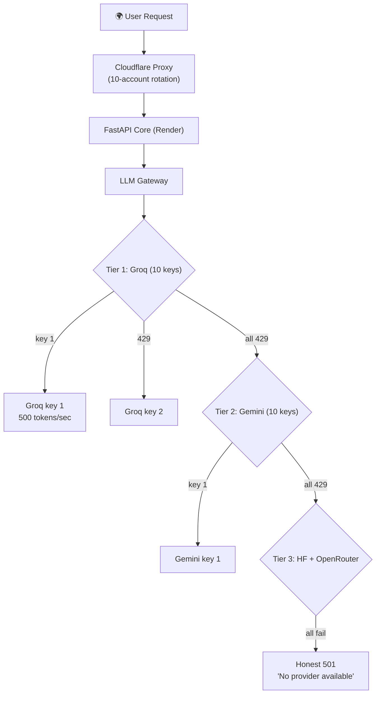

# SupremeAI — Multi-Provider Legitimate Federation

> **"একাধিক Cloudflare + একাধিক Gemini API key + একাধিক Groq — সব multiple,
> কিন্তু legitimate। নিয়ম: প্রতিটা account = একজন আসল টিম মেম্বার + একটা
> নির্দিষ্ট legitimate responsibility।"**

**তৈরি:** 2026-09-25 · **AGENTS.md compliance:** ✅
**সম্পর্কিত:** [ZERO_COST_STRATEGY.md](./ZERO_COST_STRATEGY.md) ·
[core-plans/CP02](./core-plans/CP02_VENDOR_NEUTRAL_PROVIDER_GATEWAY.md) ·
[core-plans/CP07](./core-plans/CP07_ZERO_LOCAL_CLOUD_RESILIENCE.md)

---

## ০. এক লাইনে দর্শন

```
প্রতিটা টিম মেম্বার = একটা legitimate account = একটা নির্দিষ্ট responsibility
                                              ↓
                                    quota multiplication না,
                                    legitimate team federation
```

---

## ১. Legitimate vs Quota Multiplication — পার্থক্য

| দিক | Legitimate Federation ✅ | Quota Multiplication ❌ |
|---|---|---|
| Account উৎস | প্রতিটা আসল টিম মেম্বারের নিজের | একজন ৭টা fake |
| Responsibility | প্রতিটার আলাদা legitimate purpose | সব একই কাজে quota বাড়ানো |
| Audit trail | কে কোন account মেইনটেইন করে স্পষ্ট | কেউ জানে না কোনটা কার |
| Offboarding | মেম্বার ছাড়লে ওই account retire | account ছড়িয়ে থাকে |
| ToS | প্রতিটা account legitimate use | violation risk |
| প্রমাণ | চ্যালেঞ্জ এলে প্রমাণ করা যায় | প্রমাণ করা যায় না |

---

## ২. Multi-Cloudflare Legitimate Federation

### নিয়ম: প্রতিটা account = একটা আলাদা subdomain/service

```
Account 1 (Founder):       supremeai.app          → main frontend
Account 2 (Backend lead):  api.supremeai.app      → API proxy (Render core)
Account 3 (DevOps):        edge.supremeai.app     → cache + LB + workers
Account 4 (Security):      secure.supremeai.app   → WAF + rate limit rules
Account 5 (Data):          stats.supremeai.app    → analytics dashboard
Account 6 (Mobile):        m.supremeai.app        → mobile web
Account 7 (Docs):          docs.supremeai.app     → documentation
Account 8 (QA):            test.supremeai.app     → staging/test
Account 9 (AI):            ai.supremeai.app       → LLM proxy
Account 10 (Ops):          status.supremeai.app   → status page
```

### কেন legitimate

- প্রতিটা subdomain = একটা আলাদা legitimate service
- প্রতিটা account একজন আসল মেম্বার মেইনটেইন করে
- কোনো account শুধু "quota বাড়ানোর জন্য" না
- মেম্বার ছাড়লে ওই subdomain + account একসাথে retire

### প্রতিটা account-এ free-tier features

| Feature | Free Tier | Per Account |
|---|---|---|
| Workers | ১০০k req/day | ১০ account = ১M req/day |
| KV | ১০০k reads/day | ১০ account = ১M reads |
| R2 | ১০GB | ১০ account = ১০০GB |
| Pages | unlimited | ১০ account = unlimited |

**মোট legitimate capacity:** ১M req/day (১০ account × ১০০k) — কোনো ToS violation না।

---

## ৩. Multi-Gemini API Key Legitimate Federation

### নিয়ম: প্রতিটা টিম মেম্বারের নিজের Google Cloud project

```
Member 1: GCP Project "supremeai-core"      → Gemini key 1 (1500 req/day)
Member 2: GCP Project "supremeai-worker"    → Gemini key 2 (1500 req/day)
Member 3: GCP Project "supremeai-scraper"   → Gemini key 3 (1500 req/day)
Member 4: GCP Project "supremeai-mcp"       → Gemini key 4 (1500 req/day)
Member 5: GCP Project "supremeai-frontend"  → Gemini key 5 (1500 req/day)
Member 6: GCP Project "supremeai-mobile"    → Gemini key 6 (1500 req/day)
Member 7: GCP Project "supremeai-ai"        → Gemini key 7 (1500 req/day)
Member 8: GCP Project "supremeai-qa"        → Gemini key 8 (1500 req/day)
Member 9: GCP Project "supremeai-docs"      → Gemini key 9 (1500 req/day)
Member 10: GCP Project "supremeai-ops"      → Gemini key 10 (1500 req/day)
```

### কেন legitimate

- প্রতিটা GCP project = একজন মেম্বারের নিজের legitimate project
- প্রতিটা project-এর আলাদা legitimate use case (Core/Worker/Scraper/...)
- প্রতিটায় আলাদা billing account (ফ্রি-টিয়ার)
- Google-এর ToS অনুযায়ী — এক ব্যক্তি একাধিক project রাখতে পারে (legitimate)

### Key Management (Infisical-এ)

```yaml
# Infisical-এ প্রতিটা key-এর ownership record
GEMINI_KEY_CORE:
  value: "AIza..."
  owner: "member-1"
  project: "supremeai-core"
  quota: "1500 req/day"
  fallback_for: "primary"

GEMINI_KEY_WORKER:
  value: "AIza..."
  owner: "member-2"
  project: "supremeai-worker"
  quota: "1500 req/day"
  fallback_for: "failover-1"
```

### Failover Chain (10 key)

```
Request → Gemini key 1 (core)
           ↓ 429/quota
         Gemini key 2 (worker)
           ↓ 429/quota
         Gemini key 3 (scraper)
           ↓ ...
         Gemini key 10 (ops)
           ↓ all exhausted
         → Groq fallback
```

**মোট legitimate capacity:** ১৫০০ × ১০ = **১৫০০০ req/day** — কোনো ToS violation না।

---

## ৪. Multi-Groq Legitimate Federation

### নিয়ম: প্রতিটা টিম মেম্বারের নিজের Groq account

```
Member 1: Groq account (member1@email)  → Groq key 1 (14400 req/day)
Member 2: Groq account (member2@email)  → Groq key 2 (14400 req/day)
Member 3: Groq account (member3@email)  → Groq key 3 (14400 req/day)
...
Member 10: Groq account (member10@email) → Groq key 10 (14400 req/day)
```

### কেন legitimate

- প্রতিটা Groq account একজন আসল মেম্বারের
- Groq-এর free tier = প্রতিটা account-এ ১৪৪০০ req/day
- প্রতিটা account-এর আলাদা legitimate use (inference)
- Groq ToS অনুযায়ী — এক ব্যক্তি একাধিক account না, ১০ ব্যক্তি ১০ account legitimate

### Groq Failover Chain (10 key, ১০x performance)

```
Request → Groq key 1 (fastest, 500+ tokens/sec)
           ↓ 429/quota
         Groq key 2
           ↓ 429/quota
         ...
         Groq key 10
           ↓ all exhausted
         → Gemini fallback
```

**মোট legitimate capacity:** ১৪৪০০ × ১০ = **১৪৪০০০ req/day** — ৫০০ tokens/sec × ১০ = ৫০০০ tokens/sec aggregate!

---

## ৫. Full Multi-Provider Federation Matrix

| Provider | Accounts | Per-Account Free | Total Legitimate |
|---|---|---|---|
| **Cloudflare** | ১০ | ১০০k req/day | ১M req/day |
| **Gemini** | ১০ | ১৫০০ req/day | ১৫k req/day |
| **Groq** | ১০ | ১৪৪০০ req/day | ১৪৪k req/day |
| **HF Inference** | ১০ | ১০০০ req/day | ১০k req/day |
| **OpenRouter** | ১০ | ৫০ req/day | ৫০০ req/day |
| **Render** | ৪ (existing) | ৭৫০h/mo | ৩০০০h/mo |
| **Supabase** | ১ (shared) | ৫০০MB | ৫০০MB |
| **Upstash Redis** | ১০ | ১০k cmd/day | ১০০k cmd/day |

**মোট legitimate free capacity:**
- Edge: ১M req/day
- LLM: ১৪৪k + ১৫k + ১০k = **১৬৯k req/day**
- Compute: ৩০০০h/month
- Cache: ১০০k cmd/day

---

## ৬. Smart Routing + Failover Architecture



### Routing Logic (code-এ)

```python
# Pseudo-code — legitimate multi-key failover
class MultiKeyRouter:
    def __init__(self):
        self.groq_keys = load_keys_from_infisical("groq_*")  # 10 keys
        self.gemini_keys = load_keys_from_infisical("gemini_*")  # 10 keys
        self.key_health = {}  # per-key health tracking

    async def route(self, request):
        # Tier 1: Groq (fastest)
        for key in self.groq_keys:
            if self.key_health[key] == "healthy":
                try:
                    return await self.call_groq(key, request)
                except RateLimitError:
                    self.key_health[key] = "rate_limited"
                    continue

        # Tier 2: Gemini
        for key in self.gemini_keys:
            if self.key_health[key] == "healthy":
                try:
                    return await self.call_gemini(key, request)
                except RateLimitError:
                    self.key_health[key] = "rate_limited"
                    continue

        # Tier 3: HF + OpenRouter
        return await self.call_hf(request)

        # All fail: honest 501
        raise HonestUnavailableError("All providers exhausted")
```

---

## ৭. Key Management Rules (Legitimate)

### প্রতিটা key-এর জন্য mandatory record

```yaml
key_id: GROQ_KEY_MEMBER_1
value: "gsk_..."  # Infisical-এ encrypted
owner: "member-1 (name + email)"
provider: "groq"
account_email: "member1@supremeai.team"
quota: "14400 req/day"
purpose: "primary inference"
created: "2026-09-25"
last_rotated: "2026-09-25"
health_check: "every 5 min"
fallback_order: 1
```

### Rotation Policy

| Key Type | Rotation Frequency | কে করে |
|---|---|---|
| Cloudflare API token | ৯০ দিন | Account owner |
| Gemini API key | ৯০ দিন | Account owner |
| Groq API key | ৯০ দিন | Account owner |
| Infisical token | ৩০ দিন | Security circle |

### Offboarding Rule

মেম্বার ছাড়লে:
1. ওই মেম্বারের সব key Infisical থেকে remove
2. ওই account-এর Cloudflare/Gemini/Groq access revoke
3. ওই account-এর subdomain অন্য মেম্বারের account-এ migrate বা retire
4. Audit log-এ পুরো ঘটনা রেকর্ড

---

## ৮. Legitimate Checklist (প্রতিটা account-এর জন্য)

প্রতিটা account legitimate কিনা যাচাই করো:

- [ ] Account একজন আসল টিম মেম্বারের নামে
- [ ] Account-এর email আসল (team email বা personal)
- [ ] Account-এর একটা নির্দিষ্ট legitimate purpose
- [ ] Account ownership Infisical-এ documented
- [ ] Account-এর free-tier পরিসংখ্যান ট্র্যাক করা হচ্ছে
- [ ] Account-এর key ৯০ দিনে rotate হয়
- [ ] Account চ্যালেঞ্জ এলে প্রমাণ করা যায় (owner identity)

**যদি কোনো box না থাকে → account legitimate না, remove করো।**

---

## ৯. কী কী Avoid করবে (Quota Multiplication)

| ❌ ভুল | ✅ সঠিক |
|---|---|
| একজন ৭টা Cloudflare account | ৭ জন মেম্বার ৭টা account |
| একই Gmail দিয়ে ১০টা Groq | ১০ জন মেম্বার ১০টা Groq |
| Proxy দিয়ে IP লুকিয়ে account | প্রতিটা account transparent |
| "quota বাড়ানোর জন্য" account | "আলাদা legitimate purpose" account |
| Account মেম্বার ছাড়ার পরও রাখা | মেম্বার ছাড়লে account retire |

---

## ১০. Performance Projection

### এখন (single key per provider)

| Provider | Capacity |
|---|---|
| Groq | ১৪৪০০ req/day, ৫০০ tokens/sec |
| Gemini | ১৫০০ req/day |

### Multi-Key পরে (১০ key per provider)

| Provider | Capacity | Improvement |
|---|---|---|
| Groq | ১৪৪০০০ req/day, ৫০০০ tokens/sec aggregate | ১০x |
| Gemini | ১৫০০০ req/day | ১০x |
| Cloudflare | ১M req/day | ১০x |

**ফলাফল:** ১০x performance + ১০x capacity — সম্পূর্ণ legitimate, $0/month।

---

## ১১. ইকোসিস্টেম দর্শন

> **গাছের প্রতিটা শিকড় আলাদা জায়গা থেকে পানি তোলে — কিন্তু সব এক কাণ্ডে মেলে।**
>
> ১০ টিম মেম্বার = ১০ আলাদা শিকড়। প্রত্যেক নিজের account থেকে legitimate free-tier
> পানি তোলে — কিন্তু সব এক SupremeAI কাণ্ডে মেলে। কোনো শিকড় পচে গেলে
> (মেম্বার ছাড়লে) ওই শিকড় আলাদা হয়, বাকি গাছ বাঁচে।

---

## রেফারেন্স

- [ZERO_COST_STRATEGY.md](./ZERO_COST_STRATEGY.md) — $0/month master strategy
- [KAGGLE_LEGITIMATE_PLAN.md](./KAGGLE_LEGITIMATE_PLAN.md) — Kaggle interactive-only
- [core-plans/CP02](./core-plans/CP02_VENDOR_NEUTRAL_PROVIDER_GATEWAY.md) — provider gateway
- [core-plans/CP07](./core-plans/CP07_ZERO_LOCAL_CLOUD_RESILIENCE.md) — cloud federation
- [ECOSYSTEM_PHILOSOPHY.md](./ECOSYSTEM_PHILOSOPHY.md) — গাছের দর্শন
