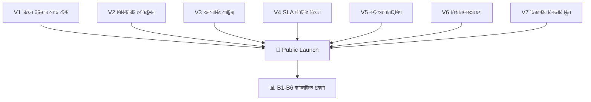
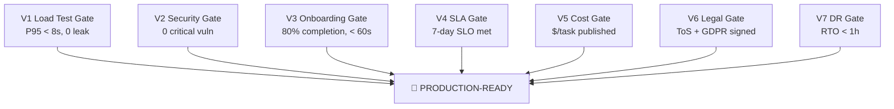

# SupremeAI — Validation Phase Roadmap

> **"Wave ০-৫ শেষ হলে প্রজেক্ট হবে production-hardened — সৎ, সংহত, ভেরিফাইড।
> কিন্তু পূর্ণ production-ready এর জন্য রিয়েল ইউজার + security audit + DR drill
> দরকার — সেটাই এই Validation Phase।"**

**তৈরি:** 2026-09-25 · **AGENTS.md compliance:** ✅
**সম্পর্কিত:** [WAVE_MASTER_PLAN.md](./WAVE_MASTER_PLAN.md) ·
[ECOSYSTEM_PHILOSOPHY.md](./ECOSYSTEM_PHILOSOPHY.md) ·
[core-plans/](./core-plans/README.md)

---

## ০. এক নজরে (Executive Summary)

Wave ০-৫ শেষ হলে প্রজেক্ট "production-hardened" — কোনো fake success নেই, কোনো
ডুপ্লিকেশন নেই, pass^k CI gate আছে, HITL কাজ করে। কিন্তু **পূর্ণ "production-ready"**
এর জন্য রিয়েল-ওয়ার্ল্ড validation দরকার — যেটা কোড/ডক্স দিয়ে হয় না।

```
Wave ০-৫ সম্পূর্ণ → "production-hardened" (সৎ + সংহত + ভেরিফাইড)
        ↓
Validation Phase (রিয়েল ইউজার + security + DR) → "production-ready"
        ↓
Public Launch (B1-B6 ব্যাটলফিল্ড প্রকাশ)
```

| ধাপ | সময় | কী হয় |
|---|---|---|
| Wave ০-৫ | ~১৩ সপ্তাহ | কোড + ডক্স + ডুপ্লিকেশন fix |
| **Validation Phase** | **~৬ সপ্তাহ** | **রিয়েল-ওয়ার্ল্ড proof** |
| Public Launch | চলমান | ব্যাটলফিল্ড স্কোরবোর্ড প্রকাশ |

---

## ১. দর্শন: Wave vs Validation

Wave আর Validation — দুটো আলাদা জিনিস, দুটোই দরকার:

| দিক | Wave (কোড/ডক্স) | Validation (রিয়েল-ওয়ার্ল্ড) |
|---|---|---|
| কী করে | কোড fix, ডুপ্লিকেশন কমায়, ডক্স সাজায় | রিয়েল ইউজার, রিয়েল ট্রাফিক, রিয়েল খরচ |
| কে করে | AI agents + developers | থার্ড-পার্টি auditors + প্রকৃত ইউজার |
| প্রমাণ | CI green, test pass, lint ০ | metrics, pentest report, DR drill log |
| ঝুঁকি | কমে (সততা + সংহতি) | ধরা যায় (রিয়েল দুনিয়ায় কী হয়) |
| শেষ কখন | Wave ৫ gate সবুজ | সব ৭টা validation track ✅ |

**ইকোসিস্টেম দর্শন:** Wave হলো গাছকে সুস্থ করা (শিকড়, কাণ্ড, পাতা)।
Validation হলো গাছকে ঝড়ে দাঁড় করানো (রিয়েল আবহাওয়ায় টেস্ট)। দুটো ছাড়াই গাছ পূর্ণ হয় না।

---

## ২. ৭টা Validation Track



---

## ৩. V1 — রিয়েল ইউজার লোড টেস্ট

> **কেন:** Wave কোড fix করে, কিন্তু রিয়েল ট্রাফিকে কেমন ব্যবহার করে সেটা দেখে না।
> ৫১২MB Render-এ ১০০ জন একসাথে এলে কী হয়?

### কাজ

| # | কাজ | টুল | গেট |
|---|---|---|---|
| V1.1 | Baseline load test — বর্তমান breaking point মাপা | k6 / locust | breaking-point documented |
| V1.2 | 50 concurrent users — ৫ মিনিট | k6 | P95 < 8s, 0 5xx |
| V1.3 | 100 concurrent users — ৫ মিনিট | k6 | graceful degradation |
| V1.4 | Spike test — ০ থেকে ২০০ জন ১০ সেকেন্ডে | k6 | circuit breaker trigger |
| V1.5 | Soak test — ২০ জন ২৪ ঘণ্টা | k6 | কোনো memory leak না |
| V1.6 | Bengali prompt load — Bengali text সহ stress | k6 + Bengali corpus | language-tax প্রমাণ |

### সময়: ১ সপ্তাহ · মালিক: Infra Circle
### গেট: P95 < 8s (50 user), graceful degradation (100 user), কোনো leak (24h soak)

---

## ৪. V2 — সিকিউরিটি পেনিট্রেশন টেস্ট

> **কেন:** অটোমেটেড স্ক্যান (gitleaks, semgrep, DAST) আছে, কিন্তু ম্যানুয়াল pentest না।
> LESSONS_LEARNED.md বলে: "scanner having a vuln type ≠ app is secure"।

### কাজ

| # | কাজ | টুল/পার্টি | গেট |
|---|---|---|---|
| V2.1 | OWASP Top-10 manual pentest | থার্ড-পার্টি auditor | ০ critical |
| V2.2 | OWASP LLM Top-10 (agent-specific) | auditor + Crown Jewel M15 | ০ critical |
| V2.3 | IDOR / BOLA test (tenant isolation) | auditor | কোনো cross-tenant leak না |
| V2.4 | Authentication pentest (JWT, OTP, resume-URL) | auditor | ০ bypass |
| V2.5 | API rate-limit bypass test | auditor | limits enforce হয় |
| V2.6 | Secret leakage audit (Infisical, env, CI) | auditor + gitleaks deep | ০ leaked secret |
| V2.7 | সিকিউরিটি report প্রকাশ + fix tracking | GitHub Security Advisory | সব critical fix হয়েছে |

### সময়: ২ সপ্তাহ · মালিক: Security Circle + থার্ড-পার্টি
### গেট: ০ critical vuln, সব high vuln fix বা accepted-risk

---

## ৫. V3 — কাস্টমার অনবোর্ডিং মেট্রিক্স

> **কেন:** Wave 2.6-এ OnboardingWizard code fix হয়েছে (zero-config)। কিন্তু completion
> rate মাপা হয়নি — প্রকৃত ইউজার ৬০ সেকেন্ডে শেষ করে কিনা?

### কাজ

| # | কাজ | টুল | গেট |
|---|---|---|---|
| V3.1 | Analytics instrumentation — প্রতিটা ধাপে event | PostHog / Mixpanel | event fire হয় |
| V3.2 | 50 beta users — onboarding সম্পূর্ণ | beta program | ≥80% completion |
| V3.3 | Time-to-first-task measurement | analytics | median < 60s |
| V3.4 | Drop-off point analysis | funnel analytics | কোনো ধাপে ৩০%+ drop না |
| V3.5 | Bengali user subset — language barrier মাপা | Bengali beta | Bengali completion ≥ English |
| V3.6 | A/B test — model-first vs template-first | analytics | কোনটা ভালো সেটা canonical |

### সময়: ২ সপ্তাহ · মালিক: Experience Circle
### গেট: ≥80% completion, median < 60s, কোনো ৩০%+ drop-off না

---

## ৬. V4 — SLA মনিটরিং রিয়েল ট্রাফিকে

> **কেন:** Wave ৫-এ per-service probe থাকবে, কিন্তু রিয়েল load-এ SLA মেনে চলে কিনা সেটা
> আলাদা। STATUS_PROOF কোড check করে, রিয়েল behavior না।

### কাজ

| # | কাজ | টুল | গেট |
|---|---|---|---|
| V4.1 | SLO definitions প্রকাশ (availability, latency, error rate) | Grafana dashboard | SLO doc public |
| V4.2 | ৭-দিন রিয়েল ট্রাফিক measurement | Grafana + Prom | SLO মেনে চলে |
| V4.3 | Error budget tracking | Grafana | budget burn rate < 2x |
| V4.4 | Alert dry-run — সব alert সঠিকভাবে fire করে | alert sandbox | ০ false-positive |
| V4.5 | Incident response runbook test | সিমুলেটেড incident | runbook কাজ করে |
| V4.6 | Status page public | status.supremeai.app | live status |

### সময়: ১ সপ্তাহ · মালিক: Infra Circle + Observability
### গেট: ৭-দিন SLO মেনে চলে, ০ false-positive alert, status page live

---

## ৭. V5 — কস্ট অ্যানালাইসিস রিয়েল ইউজে

> **কেন:** Wave ৩-এ meter-first doctrine হবে, কিন্তু রিয়েল $ খরচ মাপা হয়নি।
> B3 (Cost Frontier) ব্যাটলফিল্ডে জিততে হলে প্রকাশযোগ্য $ per task দরকার।

### কাজ

| # | কাজ | টুল | গেট |
|---|---|---|---|
| V5.1 | Per-task cost tracking live | billing_api + meter | প্রতিটা task-এ $ tag |
| V5.2 | ৭-দিন cost breakdown | cost dashboard | $/task median documented |
| V5.3 | Free-tier usage audit | provider APIs | কোনো quota near-limit না |
| V5.4 | Cost regression test | CI gate | কোনো PR $/task বাড়ায় না |
| V5.5 | B3 ব্যাটলফিল্ড স্কোরবোর্ড publish | public dashboard | $/task < competitor |
| V5.6 | Zero-cost proof — N=0 provider দিয়ে task সম্পন্ন | test suite | ০ ডলারে ১০ task |

### সময়: ১ সপ্তাহ · মালিক: Infra Circle + Finance
### গেট: $/task median documented, B3 স্কোরবোর্ড publish, কোনো quota near-limit না

---

## ৮. V6 — লিগ্যাল/কমপ্লায়েন্স

> **কেন:** Wave-এর scope বাইরে। কিন্তু public launch-এর আগে টার্মস, privacy,
> GDPR রিভিউ দরকার — নাহলে লিগ্যাল ঝুঁকি।

### কাজ

| # | কাজ | টুল/পার্টি | গেট |
|---|---|---|---|
| V6.1 | Terms of Service draft + legal review | lawyer | ToS published |
| V6.2 | Privacy Policy (GDPR-aligned) | lawyer + DPO | PP published |
| V6.3 | Data Processing Agreement (DPA) | lawyer | DPA template ready |
| V6.4 | Cookie consent + banner | frontend | consent flow live |
| V6.5 | Data retention policy enforcement | backend + DB | policy কোডে enforce |
| V6.6 | Right-to-erasure (GDPR Article 17) | backend API | deletion endpoint works |
| V6.7 | Bengali legal text (B5 ব্যাটলফিল্ড) | translator | bn ToS + PP |

### সময়: ২ সপ্তাহ · মালিক: Legal + Governance Circle
### গেট: ToS + PP published, GDPR compliance signed-off, Bengali legal text ready

---

## ৯. V7 — ডিজাস্টার রিকভারি রিয়েল ড্রিল

> **কেন:** Wave ০-তে নন-প্রোডাকশনে drill হবে। কিন্তু প্রোডাকশনে আসল drill দরকার —
> "backup আছে" আর "backup থেকে ফিরে আসা যায়" এক জিনিস না।

### কাজ

| # | কাজ | টুল | গেট |
|---|---|---|---|
| V7.1 | Backup integrity audit — সব backup restore-able | Supabase snapshots | ১০০% restore test |
| V7.2 | Production DR drill — আসল ডেটা ফিরিয়ে আনা | staging → prod | RTO < 1h |
| V7.3 | Multi-cloud failover drill | Cloudflare + Render | ১ নোড মারলে সার্ভিস বাঁচে |
| V7.4 | Database failover drill | Supabase replica | read replica → primary < 5min |
| V7.5 | Secret rotation drill | Infisical + Render | সব key rotate, সার্ভিস চালু |
| V7.6 | Incident postmortem template + ১ সিমুলেটেড incident | blameless postmortem | template + ১ drill report |
| V7.7 | DR runbook published | docs/operations/ | runbook public |

### সময়: ১ সপ্তাহ · মালিক: Infra Circle + Operations
### গেট: RTO < 1h, multi-cloud failover প্রমাণিত, runbook published

---

## ১০. Validation Phase গেট ম্যাট্রিক্স



| Track | কাজ সংখ্যা | সময় | গেট |
|---|---|---|---|
| V1 Load Test | ৬ | ১ সপ্তাহ | P95 < 8s, 0 leak |
| V2 Security | ৭ | ২ সপ্তাহ | ০ critical |
| V3 Onboarding | ৬ | ২ সপ্তাহ | 80%, < 60s |
| V4 SLA | ৬ | ১ সপ্তাহ | 7-day SLO |
| V5 Cost | ৬ | ১ সপ্তাহ | $/task published |
| V6 Legal | ৭ | ২ সপ্তাহ | ToS + GDPR |
| V7 DR | ৭ | ১ সপ্তাহ | RTO < 1h |
| **মোট** | **৪৫** | **~৬ সপ্তাহ** | **৭ গেট** |

---

## ১১. পূর্ণ Roadmap (Wave + Validation)

```
Week 1-13:   Wave ০-৫ (production-hardened)
             ├── Wave 0: সেফটি নেট (1 wk)
             ├── Wave 1: ফাউন্ডেশন (2 wk)
             ├── Wave 2: ট্রুথ পার্জ (2 wk)
             ├── Wave 3: কনসোলিডেশন (4 wk)
             ├── Wave 4: ডেলিভারি (4 wk)
             └── Wave 5: ভেরিফিকেশন (ongoing)

Week 14-19:  Validation Phase (production-ready)
             ├── V1: Load Test (1 wk)
             ├── V2: Security Pentest (2 wk)
             ├── V3: Onboarding Metrics (2 wk)
             ├── V4: SLA Monitoring (1 wk)
             ├── V5: Cost Analysis (1 wk)
             ├── V6: Legal/Compliance (2 wk)
             └── V7: DR Drill (1 wk)

Week 20+:    Public Launch + B1-B6 ব্যাটলফিল্ড প্রকাশ
             ├── B1: Verified Reliability (pass^3 published)
             ├── B2: Agentic Task Completion (GAIA-style)
             ├── B3: Cost Frontier ($/task published)
             ├── B4: Compounding Memory (repeat-task cost delta)
             ├── B5: Bengali Depth (Bangla eval head-to-head)
             └── B6: MCP Federation (time-to-first-verified-task)
```

---

## ১২. Validation Phase-এর নিয়ম (AGENTS.md compliance)

১. **Wave ৫-এর গেট সবুজ না হলে Validation শুরু নিষিদ্ধ** — কোড সৎ না হলে রিয়েল test অর্থহীন
২. **প্রতিটা track = আলাদা Issue + branch + PR** (V1.1, V1.2, ইত্যাদি)
৩. **থার্ড-পার্টি auditor বাধ্যতামূলক** (V2, V6) — self-audit চলবে না
৪. **Beta users বাধ্যতামূলক** (V3) — নিজে নিজে test করলে হবে না
৫. **প্রতিটা গেটে evidence link বাধ্যতামূলক** — report, dashboard, log
৬. **কোনো গেট বাদ দেওয়া যাবে না** — "later" বলে স্কিপ নিষিদ্ধ
৭. **প্রতিটা track-এর জন্য আলাদা milestone** — GitHub milestone tracking

---

## ১৩. ইকোসিস্টেম ভূমিকা (গাছের রূপক)

| Track | গাছের অবস্থান | কী যাচাই করে |
|---|---|---|
| V1 Load Test | ঝড়ে গাছ দাঁড়ায় কিনা | stress-এ টিকে থাকে |
| V2 Security | পোকামাকর় ধরা যায় | কোনো দুর্বলতা নেই |
| V3 Onboarding | নতুন বীজ অঙ্কুরিত হয় | ইউজার সফলভাবে শুরু করে |
| V4 SLA | গাছ সবসময় সবুজ | continuous health |
| V5 Cost | গাছের খরচ কম | efficient growth |
| V6 Legal | গাছের মালিকানা স্পষ্ট | আইনি সুরক্ষা |
| V7 DR | ঝড়ের পর গাছ ফিরে দাঁড়ায় | recovery proof |

> Wave গাছকে সুস্থ করে, Validation গাছকে ঝড়ে দাঁড় করায়। দুটো ছাড়াই পূর্ণ গাছ হয় না।

---

## ১৪. পরবর্তী কাজ (Wave শেষ হলে)

১. Wave ৫-এর সব গেট সবুজ নিশ্চিত করো
২. Validation Phase-এর জন্য ৭টা GitHub milestone খোলো (V1-V7)
৩. থার্ড-পার্টি security auditor চুক্তি (V2)
৪. Beta user program চালু (V3)
৫. Legal counsel নিয়োগ (V6)
৬. প্রতিটা track-এর প্রথম Issue খোলো

**গেট ক্রম:** V1 → V2 (parallel V3/V4/V5) → V6 → V7 → Launch

---

## রেফারেন্স

- [WAVE_MASTER_PLAN.md](./WAVE_MASTER_PLAN.md) — Wave ০-৫ (production-hardened)
- [ECOSYSTEM_PHILOSOPHY.md](./ECOSYSTEM_PHILOSOPHY.md) — গাছের দর্শন
- [CORE_PLANS_CONNECTION_MAP.md](./CORE_PLANS_CONNECTION_MAP.md) — ৭ কোর প্ল্যান
- [core-plans/](./core-plans/README.md) — CP01-CP07
- [ANALYSIS_REPORT.md](./ANALYSIS_REPORT.md) — ৬-ব্যাটলফিল্ড স্কোরবোর্ড (B1-B6)
