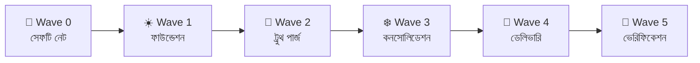
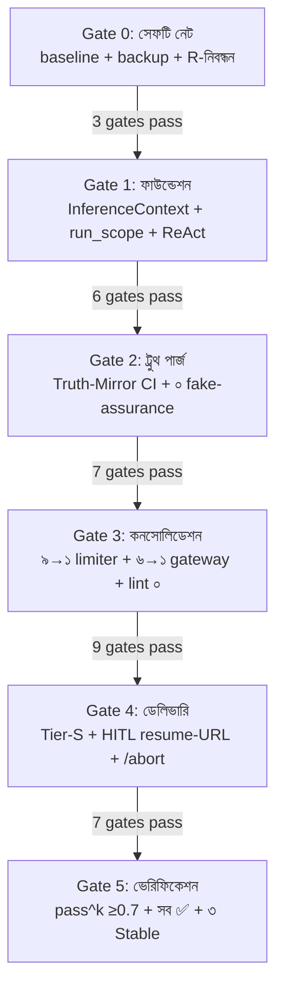

# SupremeAI — Wave Master Plan

> **"ইকোসিস্টেম দর্শনে কোনো কাজ বাদ দেওয়া যায় না — শুধু জায়গা মেলাতে হয়।
> এই প্ল্যান বলে কোন কাজটা কোন Wave-এ, কেন, আর কখন সম্পূর্ণ হবে।"**

**তৈরি:** 2026-09-25 · **AGENTS.md compliance:** ✅
**সম্পর্কিত:** [ECOSYSTEM_PHILOSOPHY.md](./ECOSYSTEM_PHILOSOPHY.md) ·
[CORE_PLANS_CONNECTION_MAP.md](./CORE_PLANS_CONNECTION_MAP.md) ·
[core-plans/](./core-plans/README.md)

---

## ০. গ্যাপ অডিট সারাংশ (Gap Audit Summary)

প্রতিটা কোর প্ল্যান (CP01-CP07) আসল কোডের সাথে মিলিয়ে দেখা হয়েছে।
**যে কাজগুলো এখনো ইকোসিস্টেম দর্শন অনুযায়ী হয়নি** — সেগুলো এই অডিটে ধরা পড়েছে:

| কোর | কোডে আছে? | কী বাকি (গ্যাপ) |
|---|---|---|
| **CP01 Agents** | ✅ MCP Tower + orchestration আছে | ⚠️ এজেন্টরা ০ টুল কল করে (MODULE_09) |
| **CP02 Gateway** | ✅ llm_gateway আছে | ⚠️ ৮+ প্রোভাইডার লিস্ট ডুপ্লিকেট; Zero-Bypass Boundary CI নেই |
| **CP03 Memory** | ⚠️ আধা | ⚠️ ৫০টা মেমরি ফাইল, CascadeMemoryService আছে কিন্তু সব স্টোর unified না |
| **CP04 HITL** | ⚠️ আধা | ❌ `resume_token` ০টা ইমপ্লিমেন্ট; ৭টা স্টেট মেশিন, কেউ সম্পূর্ণ না |
| **CP05 Verify** | ⚠️ আধা | ⚠️ Playwright আছে (৬টা টেস্ট), কিন্তু pass^k CI gate নেই |
| **CP06 Topology** | ✅ ১৪টা store | ⚠️ store overlap; OnboardingWizard প্ল্যানের বিপরীত |
| **CP07 Cloud** | ✅ CF worker আছে | ⚠️ M22 scheduler tick শুধু self-call; next_run_at ব্যবহার না |

---

## ১. Wave দর্শন (ঋতু অনুযায়ী)

একটা গাছ একসাথে চারটা ঋতু পালন করে না। SupremeAI-ও একসাথে একটাই Wave
(AGENTS.md single-plan execution discipline)।



| Wave | ঋতু | সময় | কোর ফোকাস |
|---|---|---|---|
| ০ | 🌸 বসন্ত | ১ সপ্তাহ | CP07 সেফটি (শিকড় মজবুত) |
| ১ | ☀️ গ্রীষ্ম | ২ সপ্তাহ | CP02 + CP01 (কাণ্ড সোজা) |
| ২ | 🍂 শরৎ | ২ সপ্তাহ | CP05 + CP06 (রোগ ছাঁটাই) |
| ৩ | ❄️ শীত | ৪ সপ্তাহ | সব কোর (ডাল ছাঁটাই) |
| ৪ | 🌱 নতুন বসন্ত | ৪ সপ্তাহ | CP03 + CP04 (নতুন কুঁড়ি) |
| ৫ | 🌳 পূর্ণতা | চলমান | সব কোর (গাছ সুস্থ) |

---

## ২. Wave ০ — সেফটি নেট (১ সপ্তাহ)

> **দর্শন:** মাটি পরীক্ষা, বেড়া মেরামত, বীজ তৈরি। কিছু ভাঙার আগে জাল বোনা।

### কাজ (CP07 ফোকাস)

| # | কাজ | কোর | গ্যাপ প্রমাণ | Issue |
|---|---|---|---|---|
| 0.1 | DB writer hazard বন্ধ — SQLite ফলব্যাক hard-fail | CP07 | `SUPABASE_ALLOW_DB_DEGRADATION=true` এখনো set | new |
| 0.2 | Backup snapshot + restore drill (প্রমাণ সহ) | CP07 | কোনো drill নেই | new |
| 0.3 | Contract test baseline freeze (CORS, JWT, LLM router, apiClient) | CP02+CP06 | baseline নেই | new |
| 0.4 | Token rotation verify (R10 incident) | CP07 | আগের টোকেন revoked কিনা অজানা | new |
| 0.5 | Open discrepancy নিবন্ধন (R4/R5/R9/R11) | CP07 | ৪টা OPEN | new |
| 0.6 | Rollback drill (নন-প্রোডাকশনে) | CP07 | কখনো হয়নি | new |

**গেট:** baseline suite সবুজ + backup tags + R-নিবন্ধন = ৩টাই ছাড়া পরের Wave নিষিদ্ধ।

---

## ৩. Wave ১ — ফাউন্ডেশন আনব্লক (২ সপ্তাহ)

> **দর্শন:** শিকড় মজবুত, কাণ্ড সোজা। প্রতিটা অন্য কোর এই ফাউন্ডেশনে দাঁড়াবে।

### কাজ (CP02 + CP01 ফোকাস)

| # | কাজ | কোর | গ্যাপ প্রমাণ | Issue |
|---|---|---|---|---|
| 1.1 | **M03 P0** InferenceContext dataclass + Zero-Bypass Inference Boundary CI গেট | CP02 | `llm_gateway.py`-এর বাইরে LLM কল AST গেট নেই | new |
| 1.2 | **M01 P-A** canonical MemoryStore write path (CascadeMemoryService unified) | CP03 | ৫০টা মেমরি ফাইল, একটা canonical না | new |
| 1.3 | **M06 P-A** `run_scope()` universal context-manager | CP01 | `backend/runs/` ১২-স্টেট, কিন্তু ১/৮ RunType জেগে | new |
| 1.4 | **M09 P-A** governed ReAct loop + প্রথম ৩টা টুল অ্যাক্টিভেট | CP01 | `SUPREME_TOOLS` ১৭ রেফারেন্স কিন্তু ০ প্রোডাকশন কনজিউমার | new |
| 1.5 | LLM provider list একীভূত (৮+ → ১ registry) | CP02 | `routing_policy.json` + `registry.py` দুই জায়গায় | new |
| 1.6 | MCP server registration (3 unreachable servers in `mcp.json`) | CP01 | `mcp.json`-এ ৩টা server unreachable | new |

**গেট:** InferenceContext CI গেট সবুজ + run_scope() universal + ReAct loop ৩ টুল সহ।

---

## ৪. Wave ২ — ট্রুথ পার্জ (২ সপ্তাহ)

> **দর্শন:** রোগাক্রান্ত পাতা ছাঁটাই। সিস্টেমে যে মিথ্যা "সফল" আছে, সেগুলো সত্যে পরিণত করা।

### কাজ (CP05 + CP06 ফোকাস)

| # | কাজ | কোর | গ্যাপ প্রমাণ | Issue |
|---|---|---|---|---|
| 2.1 | **M21** Truth-Mirror governance script (warn-only → CI gate) | CP05 | `detect_silent_errors.py` আছে কিন্তু CI gate নেই | new |
| 2.2 | **M14 P-A** voice_service fake transcript পার্জ | CP05 | `voice_service.py` fake "SupremeAI 2.0..." transcript | new |
| 2.3 | **M04 P-D** browser 5 false-assurance পার্জ (1×1 PNG, fabricated metrics) | CP05 | MODULE_04 audit প্রমাণ | new |
| 2.4 | **M18 P-C** Telegram fake KPI পার্জ ("38ms/142 Tasks/99.99%") | CP04 | MODULE_18 audit প্রমাণ | new |
| 2.5 | admin gap_analysis re-run (CostAuditor/SecurityDashboard fake data) | CP06 | `admin_dashboard_visual_and_api_gap_analysis.md` প্রমাণ | new |
| 2.6 | **OnboardingWizard code fix** — API-key ধাপ বাদ, প্ল্যান অনুযায়ী zero-config | CP06 | `StepApiKey → StepModelSelect → StepFirstChat` vs প্ল্যান "zero-config" | new |
| 2.7 | Dark-mode doctrine resolve (dark-first canonical) | CP06 | `ux_ui_best_practices` archived কিন্তু কোডে এখনো conflict | new |

**গেট:** Truth-Mirror CI gate সবুজ + ০টা fake-assurance + OnboardingWizard প্ল্যান মেনে চলে।

---

## ৫. Wave ৩ — কনসোলিডেশন (৪ সপ্তাহ)

> **দর্শন:** ডাল ছাঁটাই, আলো আলাদা করা। ডুপ্লিকেশন কমানো — কিন্তু কাউকে মুছবে না।

### কাজ (সব কোর — cross-cutting)

| # | কাজ | কোর | গ্যাপ প্রমাণ | Issue |
|---|---|---|---|---|
| 3.1 | ৯→১ রেট-লিমিটার collapse (policy-based: User/Provider/Global) | CP07 | ৯টা রেট-লিমিটার ফাইল, ২টা `tenant_rate_limiter.py` | new |
| 3.2 | ৬→১ LLM গেটওয়ে (Zero-Bypass Boundary দ্বারা এনফোর্স) | CP02 | Wave ১.১ এনফোর্স করবে | new |
| 3.3 | ৫০→domain-map মেমরি (M3 decision table execute) | CP03 | ৫০টা ফাইল, ১৫ স্টোর | new |
| 3.4 | ৩→১ ENV রেজিস্ট্রি (`core/config/registry.py` + `.env.example` অটো-জেন) | CP07 | `CONFIG_SCHEMA` + `ENV_REGISTRY` + `CONFIG_SPECS` drift | new |
| 3.5 | ৩০→৭ GitHub workflow (৩৮% CI churn শেষ) | CP07 | ৩০টা workflow, `ci-doctor.yml` ৭৩৮ লাইন | new |
| 3.6 | ৪→১ ফ্রন্টএন্ড HTTP স্ট্যাক (`apiClient.ts`, SSE token header-এ) | CP06 | ৪টা HTTP স্ট্যাক | new |
| 3.7 | ৮ Zustand store audit (`useStore` vs `unifiedStore` overlap) | CP06 | ১৪টা store ফাইল | new |
| 3.8 | ৬ router overlap audit (HTTP/Intent/Task/Model/unified) | CP01 | ৬টা router ফাইল | new |
| 3.9 | ৪ secret-retrieval module একীভূত (`SecretProvider` interface) | CP02 | `secret_vault` + `secure_credential_store` + `security_vault` + `config_secrets` | new |

**গেট:** প্রতিটা collapse-এর জন্য regression test সবুজ + lint_plans.py ০ warning।

---

## ৬. Wave ৪ — ডেলিভারি (৪ সপ্তাহ)

> **দর্শন:** নতুন কুঁড়ি ফোটানো। ব্যবহারকারী দেখবে এই Wave-এর ফল।

### কাজ (CP03 + CP04 + CP06 ফোকাস)

| # | কাজ | কোর | গ্যাপ প্রমাণ | Issue |
|---|---|---|---|---|
| 4.1 | **M10** Frontend Tier-S wiring (ChatInterface host-mount + ৬ features live) | CP06 | MODULE_10 প্রমাণ — একমাত্র এক্সিকিউশন প্রুফ সহ | new |
| 4.2 | **M18 P-A/B** Telegram activation-gate + `/abort` কমান্ড | CP04 | webhook secret + admin-identity truth (Wave ২.৪ পর) | new |
| 4.3 | **M17** HITL one-bridge-many-doors (resume-URL token) | CP04 | ❌ `resume_token` ০টা ইমপ্লিমেন্ট | new |
| 4.4 | **M19** Bengali text utility + language-tax-reduction | CP06 | split-estimator, danda-blind truncation | new |
| 4.5 | **M20 P-B** ২-লাইন WS wake-up (highest ROI fix) | CP06 | `/ws/dashboard` broadcast-task never starts | new |
| 4.6 | **M22 P-A** supervisor-as-heartbeat + last_run_at catch-up | CP07 | `tick()` শুধু self-call, `next_run_at` ব্যবহার না | new |
| 4.7 | **M23 P-A** knowledge `/ask` 500-error fix + retrieval-proof | CP03 | `POST /api/knowledge/ask` প্রতি কলে 500 | new |

**গেট:** Frontend Tier-S ৬ features live + HITL resume-URL end-to-end + `/abort` Telegram কাজ করে।

---

## ৭. Wave ৫ — ভেরিফিকেশন মোট (চলমান)

> **দর্শন:** গাছ যে সুস্থ তার প্রমাণ। এই Wave শেষ হবে না — সবসময় চলবে।

### কাজ (সব কোর — continuous verification)

| # | কাজ | কোর | গ্যাপ প্রমাণ | Issue |
|---|---|---|---|---|
| 5.1 | pass^k গেট CI-তে (≥0.7 Phase 2 gate) | CP05 | `core/self_benchmark.py` আছে কিন্তু CI gate নেই | new |
| 5.2 | per-service runtime probe ডেইলি স্মোকে | CP07 | Worker/Scraper/MCP 🟡 runtime-unprobed | new |
| 5.3 | STATUS_PROOF সব দাবা কভার | CP05 | কিছু 🟡 এখনো | new |
| 5.4 | ৬-ব্যাটলফিল্ড স্কোরবোর্ড প্রকাশযোগ্য | CP05+CP01 | স্কোরবোর্ড আছে কিন্তু publish না | new |
| 5.5 | lint_plans.py ০ warning (registry↔filesystem parity) | CP05 | এখনো ১৪ warning | new |
| 5.6 | Stable-gate: P01 Security → Stable (সবার ফাউন্ডেশন) | CP07 | P01 এখনো Active, Stable না | new |
| 5.7 | Stable-gate: P04 Agent → Stable | CP01 | P04 Active | new |
| 5.8 | Stable-gate: P08 Infra → Stable | CP07 | P08 Active | new |

**গেট:** pass^k ≥0.7 + সব 🟡 → ✅ + ৩টা Stable promotion।

---

## ৮. Wave গেট ম্যাট্রিক্স (Gate Matrix)



| Wave | কাজ সংখ্যা | গেট সংখ্যা | কোর ফোকাস |
|---|---|---|---|
| ০ | ৬ | ৩ | CP07 |
| ১ | ৬ | ৬ | CP02 + CP01 |
| ২ | ৭ | ৭ | CP05 + CP06 |
| ৩ | ৯ | ৯ | সব (cross-cutting) |
| ৪ | ৭ | ৭ | CP03 + CP04 + CP06 |
| ৫ | ৮ | ৮ | সব (continuous) |
| **মোট** | **৪৩** | **৪০** | |

---

## ৯. Issue টেমপ্লেট (প্রতিটা কাজের জন্য)

প্রতিটা কাজ একটা GitHub Issue হবে (AGENTS.md §3 Issue-First):

```markdown
## [Wave X.Y] কাজের নাম

**Core Plan:** CPxx
**Wave:** X (ঋতু)
**Gap evidence:** (code audit প্রমাণ)
**Acceptance criteria:**
- [ ] নির্দিষ্ট কাজ
- [ ] test সবুজ
- [ ] evidence link

**Depends on:** (পূর্ব Wave-এর কাজ)
**Enables:** (পরবর্তী Wave-এর কাজ)
```

---

## ১০. এক্সিকিউশন নিয়ম (AGENTS.md compliance)

1. **একসাথে একটাই Wave** — single-plan execution discipline
2. **প্রতিটা কাজ = একটা Issue + একটা branch + একটা PR**
3. **প্রতিটা Wave-এর গেট সবুজ না হলে পরের Wave শুরু নিষিদ্ধ**
4. **কোনো ফাইল মুছবে না** — archive-dry-branch হিসেবে থাকবে
5. **Stable promotion-এর জন্য evidence link বাধ্যতামূলক**

---

## ১১. ইকোসিস্টেম ভূমিকা (প্রতিটা Wave-এর গাছে অবস্থান)

| Wave | গাছের অংশ | কী করে |
|---|---|---|
| ০ | মাটি পরীক্ষা | শিকড় মজবুত করার প্রস্তুতি |
| ১ | শিকড় স্থির | কাণ্ড যে রস পাবে তার পথ তৈরি |
| ২ | রোগ ছাঁটাই | পাতা যেন সতেজ থাকে |
| ৩ | ডাল ছাঁটাই | আলো যেন সব জায়গায় পৌঁছায় |
| ৪ | ফুল ফোটানো | ব্যবহারকারী ফল দেখবে |
| ৫ | সুস্থতার প্রমাণ | গাছ যে জীবন্ত তার নিশ্চয়তা |

---

## রেফারেন্স

- [ECOSYSTEM_PHILOSOPHY.md](./ECOSYSTEM_PHILOSOPHY.md) — গাছের দর্শন
- [CORE_PLANS_CONNECTION_MAP.md](./CORE_PLANS_CONNECTION_MAP.md) — সব প্ল্যান কানেকশন
- [CONFLICT_ANALYSIS.md](./CONFLICT_ANALYSIS.md) — conflicted ফাইল
- [core-plans/](./core-plans/README.md) — ৭ কোর প্ল্যান
- [plans/PLAN_REGISTRY.md](./plans/PLAN_REGISTRY.md) — ১২ ক্যানোনিকাল প্ল্যান
- [ANALYSIS_REPORT.md](./ANALYSIS_REPORT.md) — ১৮৩ ফাইল বিশ্লেষণ
