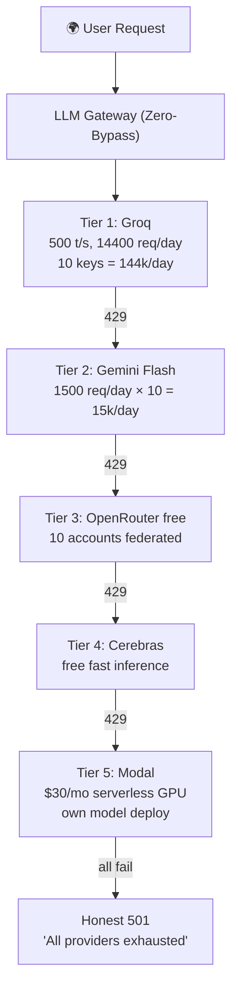
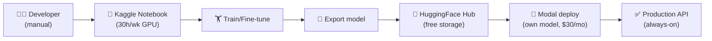

# SupremeAI — Zero-Cost Strategy (একীভূত)

> **"প্রোডাকশন + রক্ষণাবেক্ষণ খরচ $0/month — সৎভাবে।
> ToS violation না, fake account না, বরং legitimate free-tier federation +
> smart routing + multi-account team federation।"**

**তৈরি:** 2026-09-25 · **AGENTS.md compliance:** ✅
**সম্পর্কিত:** [WAVE_MASTER_PLAN.md](./WAVE_MASTER_PLAN.md) ·
[VALIDATION_PHASE_ROADMAP.md](./VALIDATION_PHASE_ROADMAP.md) ·
[core-plans/CP02](./core-plans/CP02_VENDOR_NEUTRAL_PROVIDER_GATEWAY.md) ·
[core-plans/CP07](./core-plans/CP07_ZERO_LOCAL_CLOUD_RESILIENCE.md)

> **এই ডকুমেন্ট একীভূত** — আগে `MULTI_PROVIDER_FEDERATION.md` এবং
> `KAGGLE_LEGITIMATE_PLAN.md` আলাদা ছিল, এখন সব এখানে।

---

## ০. এক লাইনে লক্ষ্য

```
$0/month production + $0/month maintenance = legitimate free-tier federation
```

**নিয়ম:** কোনো ToS violation না, কোনো fake account না। শুধু free-tier সঠিকভাবে
ব্যবহার + legitimate multi-account team federation + smart routing।

---

## ১. ৫টা স্তম্ভ

| # | স্তম্ভ | কী করে |
|---|---|---|
| ১ | **Free-Tier Federation (CP07)** | একাধিক legitimate provider যুক্ত করে federation |
| ২ | **Smart LLM Routing (CP02)** | ১৪-provider failover, N=0 resilient, Zero-Bypass |
| ৩ | **Multi-Account Team Federation** | ১০ মেম্বার × ১০ account = ১০x legitimate capacity |
| ৪ | **Cache + Compact (CP03)** | prompt cache + context compaction + semantic cache |
| ৫ | **Community Open Source** | Grafana, Prometheus, Gitleaks, OWASP ZAP — সব OSS |

---

## ২. বর্তমান খরচ কাঠামো

| স্তর | এখন কী ব্যবহার | ফ্রি-টিয়ার সীমা | মাসিক খরচ |
|---|---|---|---|
| Hosting (Backend) | ৪ Render account | প্রতিটা 750h, 512MB | $0 |
| Edge/CDN | Cloudflare | 100k req/day | $0 |
| Frontend | Firebase Hosting | 10GB, 360MB/day | $0 |
| Database | Supabase | 500MB, 50k MAU | $0 |
| Cache | Upstash Redis | 10k cmd/day | $0 |
| Secrets | Infisical Cloud | 3 projects | $0 |
| CI/CD | GitHub Actions | 2000 min/mo | $0 |
| LLM | Multi-provider failover | প্রতিটার free tier | $0 |
| Email | (বাকি — Resend/Brevo) | 3k/300 per day | $0 |
| Monitoring | (বাকি — Grafana/UptimeRobot) | free tiers | $0 |

**মোট:** ~$0/month (সব legitimate free-tier)

---

## ৩. Multi-Account Legitimate Federation (মূল কৌশল)

### Legitimate vs Quota Multiplication

| দিক | Legitimate Federation ✅ | Quota Multiplication ❌ |
|---|---|---|
| Account উৎস | প্রতিটা আসল টিম মেম্বারের নিজের | একজন ৭টা fake |
| Responsibility | প্রতিটার আলাদা legitimate purpose | সব একই কাজে quota বাড়ানো |
| Audit trail | কে কোন account মেইনটেইন করে স্পষ্ট | কেউ জানে না কোনটা কার |
| Offboarding | মেম্বার ছাড়লে ওই account retire | account ছড়িয়ে থাকে |
| ToS | প্রতিটা legitimate use | violation risk |
| প্রমাণ | চ্যালেঞ্জ এলে প্রমাণ করা যায় | প্রমাণ করা যায় না |

### Multi-Cloudflare (১০ account = ১০ subdomain)

```
Account 1 (Founder):       supremeai.app          → main frontend
Account 2 (Backend lead):  api.supremeai.app      → API proxy
Account 3 (DevOps):        edge.supremeai.app     → cache + LB
Account 4 (Security):      secure.supremeai.app   → WAF + rules
Account 5 (Data):          stats.supremeai.app    → analytics
Account 6 (Mobile):        m.supremeai.app        → mobile web
Account 7 (Docs):          docs.supremeai.app     → documentation
Account 8 (QA):            test.supremeai.app     → staging
Account 9 (AI):            ai.supremeai.app       → LLM proxy
Account 10 (Ops):          status.supremeai.app   → status page
```

**Capacity:** ১০ account × ১০০k req/day = **১M req/day legitimate**

### Multi-Gemini (১০ GCP project = ১০ API key)

```
Member 1: GCP "supremeai-core"      → Gemini key 1 (1500 req/day)
Member 2: GCP "supremeai-worker"    → Gemini key 2 (1500 req/day)
Member 3: GCP "supremeai-scraper"   → Gemini key 3 (1500 req/day)
...
Member 10: GCP "supremeai-ops"      → Gemini key 10 (1500 req/day)
```

**Capacity:** ১৫০০ × ১০ = **১৫k req/day legitimate**

### Multi-Groq (১০ member = ১০ account)

```
Member 1: Groq account (member1@team)  → key 1 (14400 req/day, 500 t/s)
Member 2: Groq account (member2@team)  → key 2 (14400 req/day)
...
Member 10: Groq account (member10@team) → key 10 (14400 req/day)
```

**Capacity:** ১৪৪০০ × ১০ = **১৪৪k req/day, ৫০০০ tokens/sec aggregate**

---

## ৪. LLM Inference Strategy (HF বাদ, নতুন alternatives)

> **গুরুত্বপূর্ণ আপডেট (2026-09):** HuggingFace Inference API-এর free tier
> degraded — বেশিরভাগ বড় model "cold" বা "gated"। তাই HF বাদ দিয়ে নতুন
> legitimate alternatives ব্যবহার করা হচ্ছে।

### নতুন Fallback Chain (HF ছাড়া)



### Tier Details

| Tier | Provider | Free Tier | Performance | Legitimate |
|---|---|---|---|---|
| ১ | **Groq** | ১৪৪০০ req/day × ১০ | ৫০০+ tokens/sec | ✅ Stable |
| ২ | **Gemini Flash** | ১৫০০ req/day × ১০ | fast (TPU) | ✅ Stable |
| ৩ | **OpenRouter free** | ৫০-১০০০/day × ১০ | medium | ✅ Stable |
| ৪ | **Cerebras** | free tier (new) | fast (Wafer-scale) | ✅ New, stable |
| ৫ | **Modal** | $৩০/mo free (renewable) | serverless GPU | ✅ Stable |
| ৬ | **Honest 501** | — | crash-free | ✅ No fake |

**মোট legitimate free capacity:** ~**১৭৪k req/day** + own model on Modal

### Modal = "Virtual Ollama" (HF-এর বিকল্প)

```
আগে HF Inference ছিল:     এখন Modal:
  Free model serving          $30/mo free (renewable)
  1000 req/day                প্রয়োজনমতো scale
  HF-এর model                 যেকোনো model (Llama/Qwen/নিজের)
  Cold start সমস্যা            Serverless, fast cold start
  এখন limited                 এখনো stable free
```

**Modal-এ নিজের model serve (legitimate):**
1. Kaggle-এ model train করো (৩০h/wk legitimate)
2. Model HuggingFace Hub-এ আপলোড (free storage)
3. Modal-এ deploy করো ($৩০/mo free)
4. Always-on API endpoint পাও
5. Production inference — legitimate, fast, reliable

---

## ৫. Cost-Saving Mechanisms (Cache + Compact)

| মেকানিজম | কী করে | সাশ্রয় |
|---|---|---|
| **Prompt Caching** (Anthropic) | পুরনো prompt পুনরায় টোকেন নেয় না | ৫০-৯০% input token |
| **Context Compaction** (PLAN_002) | চ্যাট হিস্ট্রি সারাংশ করে | ৬০% context token |
| **Semantic Cache** | একই প্রশ্ন দ্বিতীয়বার ফ্রি | ৩০% repeat query |
| **Task-Specific Routing** | সহজ কাজে ফ্রি model, কঠিনে প্রিমিয়াম | ৪০% প্রিমিয়াম কম |
| **Scout Zero-Token Summarizer** | রিসার্চে LLM না, স্থানীয় সারাংশ | ৭০% research cost |
| **ModelPerformanceLearner** | কোন model কোন কাজে সেরা — শেখে → optimize | ২০% adaptive |

---

## ৬. Hosting Zero-Cost Strategy

### Render Free-Tier Federation (বর্তমান)

| Account | Service | Quota | ব্যবহার |
|---|---|---|---|
| ১ | Core API | 750h/mo, 512MB | মূল FastAPI |
| ২ | Worker + Scraper | 750h/mo, 512MB | ব্যাকগ্রাউন্ড job |
| ৩ | MCP Tower | 750h/mo, 512MB | MCP server |
| ৪ | Backup Replica | 750h/mo, 512MB | failover |

**মোট:** ৩০০০h/month legitimate free compute

### Keepalive (Sleep Prevention)

Cloudflare Worker প্রতি ১০ মিনিটে পিং → Render free ১৫ মিনিট sleep এড়ানো।

### Alternative Free Hosting (overflow)

| Provider | Free Tier | কখন |
|---|---|---|
| Fly.io | ৩ shared-cpu VM, 256MB | Render overflow |
| Vercel | 100GB bandwidth | frontend CDN |
| Netlify | 100GB bandwidth | static frontend |

---

## ৭. Database Zero-Cost

### Supabase Free Tier (বর্তমান)

| রিসোর্স | Free Limit | ব্যবহার |
|---|---|---|
| Database | 500MB | মূল ডেটা |
| Auth | 50k MAU | ইউজার |
| Storage | 1GB | ফাইল |
| Realtime | 200 concurrent | WebSocket |

### Overflow Strategy (৫০০MB ছাপালে)

| স্টেজ | কী করবে |
|---|---|
| ৪০০MB | Archival — পুরনো audit log আলাদা |
| ৪৫০MB | Compression — pgvector ডাইমেনশন কমাও (1536→384) |
| ৪৮০MB | Sharding — টেন্যান্ট আলাদা schema |
| ৪৯০MB | Migration — Neon free (3GB) বা self-host Postgres |

### pgvector (একটাই DB, আলাদা না)

CP03-এর ক্যানোনিকাল সিদ্ধান্ত: **Supabase pgvector**, আলাদা Qdrant/Pinecone না।
কারণ: ১টা DB maintain করা সস্তা, কোনো আলাদা vector DB খরচ নেই।

---

## ৮. Monitoring Zero-Cost

| কাজ | Free Tool | সীমা |
|---|---|---|
| Uptime monitor | UptimeRobot | 50 monitors, ৫ মিনিট interval |
| Status page | Cachet (self-host) | open source |
| Metrics | Grafana Cloud free | ৩ series, 10k datapoints |
| Logs | Better Stack free | ৩GB/mo |
| Error tracking | Sentry developer free | 5k errors/mo |
| Tracing | Jaeger (self-host) | Render free |

### Self-Host Alternative (যদি free-tier ছাপায়)

| SaaS | Self-Host | কোথায় |
|---|---|---|
| Datadog | Prometheus + Grafana | Render free |
| Sentry | GlitchTip (OSS) | Render free |
| LogDNA | Loki + Promtail | Render free |

---

## ৯. Email + Notification Zero-Cost

### Email

| Provider | Free Limit | ব্যবহার |
|---|---|---|
| Resend | 3000/mo, 100/day | transactional |
| Brevo (Sendinblue) | 300/day | newsletter |
| AWS SES | 62k/mo (EC2 থেকে) | high volume |

### Notification (CP04 HITL carrier)

| Channel | Free Limit | ব্যবহার |
|---|---|---|
| Telegram Bot | ∞ | HITL approval, /abort |
| Discord Webhook | ∞ | alert |
| In-app WS | self-host | real-time dashboard |

**নিয়ম:** একটা canonical dispatcher (store-before-carrier, MODULE_20)।

---

## ১০. CI/CD Zero-Cost

### GitHub Actions Free Tier

| রিসোর্স | Free Limit |
|---|---|
| Private repo minutes | 2000/mo |
| Public repo minutes | ∞ |
| Storage | 500MB |
| Packages | 500MB |

### CI Budget Strategy

| কৌশল | সাশ্রয় |
|---|---|
| Path-aware build | ৪০% CI time |
| Cache layer | ৩০% CI time |
| Parallel shards | ৫০% wall time |
| Self-hosted runner | ০ CI minute |

### Workflow ডায়েট (Wave ৩.৫)

৩০→৭ workflow collapse (৩৮% churn শেষ) — CI cost কমানোর মূল কাজ।

---

## ১১. Domain + DNS Zero-Cost

| রিসোর্স | Free Option |
|---|---|
| Domain | Firebase subdomain (supremeai-a.web.app) |
| Domain | Render subdomain (supremeai.onrender.com) |
| DNS | Cloudflare (ফ্রি) |
| SSL | Cloudflare (ফ্রি) |

**সুপারিশ:** Custom domain দরকার হলে ~$১২/year — একমাত্র "প্রয়োজনীয় খরচ"।

---

## ১২. Security Zero-Cost

| কাজ | Free Tool |
|---|---|
| Secret scanning | Gitleaks (OSS) |
| SAST | Semgrep (OSS) |
| DAST | OWASP ZAP (OSS) |
| Dependency scan | GitHub Dependabot (ফ্রি) |
| Container scan | Trivy (OSS) |
| License scan | REUSE (OSS) |

সব open source, সব ফ্রি।

---

## ১৩. Backup Zero-Cost

| রিসোর্স | Free Option |
|---|---|
| DB backup | Supabase automated (daily, ৭-দিন) |
| Code backup | GitHub (∞ private repo) |
| Artifact backup | GitHub Packages (500MB) |
| Config backup | Infisical (ফ্রি) |
| Long-term archive | GitHub Releases (ফ্রি) |

---

## ১৪. Training Strategy — Kaggle Legitimate

### Kaggle = Interactive Training ONLY

| ✅ Allowed (legitimate) | ❌ Forbidden (ToS violation) |
|---|---|
| Interactive notebook (manual) | Production inference |
| Model training (T4/P100, ৩০h/wk) | Headless bot |
| Dataset preparation | API endpoint |
| Model export to HuggingFace | GPU routing external |
| Multiple members, multiple accounts | এক ব্যক্তি একাধিক account |

### Specialized Fine-Tuning Federation (১০ মেম্বার × ১০ model)

```
Member 1 (AI alignment):    Kaggle account 1 → behavior model fine-tune
Member 2 (Code ML):         Kaggle account 2 → coding model fine-tune
Member 3 (Bengali NLP):     Kaggle account 3 → Bengali model fine-tune
Member 4 (ML ops):          Kaggle account 4 → router/verifier model
Member 5 (Memory):          Kaggle account 5 → distillation model
Member 6-10:                other specialties
```

**Capacity:** ১০ মেম্বার × ৩০h/wk = **৩০০h/wk legitimate GPU training**

### Training Workflow (Legitimate)



### Legitimate Distillation (ToS-compliant)

| Source | Legitimate? |
|---|---|
| OpenAI output → train | ❌ ToS violation |
| Anthropic output → train | ❌ ToS violation |
| **Open-source (Llama/Qwen/DeepSeek) → train** | ✅ |
| **Own data → train** | ✅ |
| **Synthetic data from open models** | ✅ |

**Smart legitimate distillation:** Llama 3.1 (open) দিয়ে synthetic data → Bengali model fine-tune।

---

## ১৫. Key Management Rules

### প্রতিটা key-এর জন্য mandatory record (Infisical-এ)

```yaml
key_id: GROQ_KEY_MEMBER_1
value: "gsk_..."  # encrypted
owner: "member-1 (name + email)"
provider: "groq"
account_email: "member1@supremeai.team"
quota: "14400 req/day"
purpose: "primary inference"
created: "2026-09-25"
last_rotated: "2026-09-25"
health_check: "every 5 min"
fallback_order: 1
```

### Rotation Policy

| Key Type | Rotation | কে করে |
|---|---|---|
| Cloudflare API token | ৯০ দিন | Account owner |
| Gemini API key | ৯০ দিন | Account owner |
| Groq API key | ৯০ দিন | Account owner |
| Infisical token | ৩০ দিন | Security circle |

### Offboarding Rule

মেম্বার ছাড়লে:
1. ওই মেম্বারের সব key Infisical থেকে remove
2. ওই account-এর Cloudflare/Gemini/Groq access revoke
3. ওই account-ের subdomain migrate বা retire
4. Audit log-এ পুরো ঘটনা রেকর্ড

---

## ১৬. Legitimate Checklist (প্রতিটা account-এর জন্য)

- [ ] Account একজন আসল টিম মেম্বারের নামে
- [ ] Account-ের email আসল (team email বা personal)
- [ ] Account-ের একটা নির্দিষ্ট legitimate purpose
- [ ] Account ownership Infisical-এ documented
- [ ] Account-ের free-tier পরিসংখ্যান ট্র্যাক করা হচ্ছে
- [ ] Account-ের key ৯০ দিনে rotate হয়
- [ ] Account চ্যালেঞ্জ এলে প্রমাণ করা যায় (owner identity)

**যদি কোনো box না থাকে → account legitimate না, remove করো।**

---

## ১৭. Avoid করবে (Quota Multiplication)

| ❌ ভুল | ✅ সঠিক |
|---|---|
| একজন ৭টা Cloudflare account | ৭ জন মেম্বার ৭টা account |
| একই Gmail দিয়ে ১০টা Groq | ১০ জন মেম্বার ১০টা Groq |
| Proxy দিয়ে IP লুকিয়ে account | প্রতিটা account transparent |
| "quota বাড়ানোর জন্য" account | "আলাদা legitimate purpose" account |
| Kaggle headless bot | Kaggle interactive training only |
| Colab/Kaggle inference server | Groq/Modal inference (always-on) |
| Account মেম্বার ছাড়ার পরও রাখা | মেম্বার ছাড়লে account retire |

---

## ১৮. Performance Projection

### Multi-Account (১০x scaling, legitimate)

| Provider | Single Account | 10 Accounts |
|---|---|---|
| Cloudflare | 100k req/day | 1M req/day |
| Gemini | 1500 req/day | 15k req/day |
| Groq | 14400 req/day, 500 t/s | 144k req/day, 5000 t/s aggregate |
| Kaggle GPU | 30h/wk | 300h/wk training |

**সব $0/month, fully legitimate, 10x performance।**

---

## ১৯. Monthly Budget Projection

| স্তর | এখন | Wave পরে | Validation পরে |
|---|---|---|---|
| Hosting | $0 | $0 | $0 |
| LLM | $0 | $0 (cache ৬০% কম) | $0 |
| Database | $0 | $0 | $0 |
| Monitoring | $0 | $0 | $0 |
| Email | $0 | $0 | $0 |
| CI/CD | $0 | $0 (৩৮% কম) | $0 |
| Security | $0 | $0 | ~$500 এককালী |
| Legal | $0 | $0 | ~$500 এককালী |
| Domain | $0 (subdomain) | $0 | ~$12/year |
| **মোট/মাস** | **$0** | **$0** | **$0** |

**শুধু ২টা এককালী খরচ:** V2 security auditor + V6 lawyer (~$1000 total)।

---

## ২০. Wave Integration (Zero-Cost কাজ)

| Wave | কাজ | সাশ্রয় |
|---|---|---|
| ১ | Prompt caching (M03) | ৫০-৯০% input token |
| ১ | Context compaction (M07) | ৬০% context token |
| ২ | Scout zero-token summarizer | ৭০% research cost |
| ৩ | ৩০→৭ workflow collapse | ৩৮% CI minutes |
| ৩ | Semantic cache | ৩০% repeat query |
| ৪ | ModelPerformanceLearner | ২০% adaptive routing |
| ৫ | Cost dashboard publish (B3) | $/task প্রমাণ |

---

## ২১. Validation Phase Zero-Cost

| Track | Free Tool | খরচ |
|---|---|---|
| V1 Load Test | k6 (self-host) | $0 |
| V2 Security | 3rd-party auditor | ~$500 এককালী |
| V3 Onboarding | PostHog 1M events + beta | $0 |
| V4 SLA | Grafana Cloud + UptimeRobot | $0 |
| V5 Cost | meter-first self-host | $0 |
| V6 Legal | lawyer | ~$500 এককালী |
| V7 DR | Supabase backup + self-host | $0 |

**শুধু ২টা paid:** V2 + V6 — বাকি সব $0।

---

## ২২. ইকোসিস্টেম দর্শন

> **গাছ যত বড় হয়, খরচ তত না বাড়লে সেই আসল সফলতা।**
>
> SupremeAI-এর গাছ ফ্রি-টিয়ার মাটিতে দাঁড়িয়ে — কোনো paid সার না দিয়ে ফল দেয়।
> এটাই Constitution #14 (Sustainable Cost) এর সত্যিকারের বাস্তবায়ন।
>
> **Multi-provider:** ১০ শিকড় ১০ জায়গা থেকে পানি তোলে — সব এক কাণ্ডে মেলে।
> কোনো শিকড় পচে গেলে (মেম্বার ছাড়লে) ওই শিকড় আলাদা, বাকি গাছ বাঁচে।
>
> **Kaggle:** বীজ থেকে চারা গজানোর nursery — চারা বড় হলে HuggingFace বাগানে
> লাগানো হয়, ফল পাওয়া যায় Modal দিয়ে। Nursery-তেই গাছ রেখে ফল চাওয়া অসম্ভব।
>
> **নিয়ম:** কোনো খরচ বাড়লে আগে প্রশ্ন — "এটা কি free-tier দিয়ে করা যায়?"
> উত্তর হ্যাঁ হলে paid যাবে না।

---

## রেফারেন্স

- [WAVE_MASTER_PLAN.md](./WAVE_MASTER_PLAN.md) — Wave ০-৫
- [VALIDATION_PHASE_ROADMAP.md](./VALIDATION_PHASE_ROADMAP.md) — Validation Phase
- [ECOSYSTEM_PHILOSOPHY.md](./ECOSYSTEM_PHILOSOPHY.md) — গাছের দর্শন
- [core-plans/CP02](./core-plans/CP02_VENDOR_NEUTRAL_PROVIDER_GATEWAY.md) — LLM gateway
- [core-plans/CP03](./core-plans/CP03_CONTINUOUS_COMPOUNDING_MEMORY.md) — cache + compact
- [core-plans/CP07](./core-plans/CP07_ZERO_LOCAL_CLOUD_RESILIENCE.md) — cloud federation
