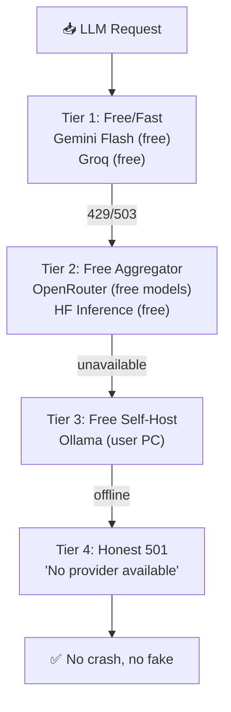

# SupremeAI — Zero-Cost Strategy

> **"আমাদের লক্ষ্য: প্রোডাকশন + রক্ষণাবেক্ষণ খরচ $0 — কিন্তু সৎভাবে।
> ToS violation না, fake account না, বরং free-tier federation + smart routing +
> self-hosting যেখানে সস্তা।"**

**তৈরি:** 2026-09-25 · **AGENTS.md compliance:** ✅
**সম্পর্কিত:** [WAVE_MASTER_PLAN.md](./WAVE_MASTER_PLAN.md) ·
[VALIDATION_PHASE_ROADMAP.md](./VALIDATION_PHASE_ROADMAP.md) ·
[core-plans/CP07](./core-plans/CP07_ZERO_LOCAL_CLOUD_RESILIENCE.md)

---

## ০. এক লাইনে লক্ষ্য

```
$0/month production + $0/month maintenance = সৎ free-tier federation
```

**নিয়ম:** কোনো ToS violation না, কোনো fake account না, কোনো চুরি না।
শুধু free-tier সঠিকভাবে ব্যবহার + smart composition + self-hosting যেখানে সস্তা।

---

## ১. বর্তমান খরচ কাঠামো (Current Cost Map)

| স্তর | এখন কী ব্যবহার | ফ্রি-টিয়ার সীমা | মাসিক খরচ |
|---|---|---|---|
| **Hosting (Backend)** | ৪টা Render account | প্রতিটা 750h/mo, 512MB | $0 |
| **Edge/CDN** | Cloudflare Worker | 100k req/day | $0 |
| **Frontend** | Firebase Hosting | 10GB storage, 360MB/day | $0 |
| **Database** | Supabase | 500MB, 50k MAU | $0 |
| **Cache** | Upstash Redis | 10k cmds/day | $0 |
| **Secrets** | Infisical Cloud | 3 projects, 5 envs | $0 |
| **CI/CD** | GitHub Actions | 2000 min/mo (private) | $0 |
| **LLM** | ১৪-provider failover | প্রতিটার ফ্রি-টিয়ার | $0 (N=0 হলেও কাজ করে) |
| **Email** | (বাকি) | ? | ? |
| **Monitoring** | (বাকি) | ? | ? |
| **Domain** | (বাকি) | ? | ? |

**বর্তমান মোট:** ~$0/month (কিছু গ্যাপ আছে — email, monitoring, domain)

---

## ২. Zero-Cost নীতি (৫টা স্তম্ভ)

### স্তম্ভ ১: Free-Tier Federation (CP07)
- একাধিক free-tier provider যুক্ত করে federation বানানো
- প্রতিটার সীমা আলাদা — একটা শেষ হলে অন্যটায় চলে যায়
- **নিয়ম:** কোটা বাড়াতে fake account না, বরং আরেকটা legitimate provider যোগ করো

### স্তম্ভ ২: Smart LLM Routing (CP02)
- ১৪-provider failover chain — সস্তা/ফ্রি প্রোভাইডার আগে
- N=0 (সব key নেই) হলেও graceful response — crash না
- **নিয়ম:** প্রিমিয়াম model শুধু যেখানে দরকার, বাকিতে ফ্রি

### স্তম্ভ ৩: Self-Host Where Cheaper
- Ollama local (user-এর PC) — সম্পূর্ণ ফ্রি, offline fallback
- Self-hosted Postgres (যদি Supabase 500MB ছাপায়) — Render free
- **নিয়ম:** self-host তখনই যখন free-tier ছাপায়, আগে না

### স্তম্ভ ৪: Cache + Compact (CP03)
- Prompt cache (Anthropic) — পুরনো prompt পুনরায় টোকেন নেয় না
- Context compaction (PLAN_002) — চ্যাট হিস্ট্রি ছোট করে
- Semantic cache — একই প্রশ্ন দ্বিতীয়বার ফ্রি
- **নিয়ম:** প্রতিটা টোকেন দুবার নয়, একবার

### স্তম্ভ ৫: Community Open Source
- Open source tool ব্যবহার (Grafana, Prometheus, Playwright)
- Self-host instead of SaaS যেখানে free-tier আছে
- **নিয়ম:** SaaS free-tier শেষ হলে self-host, paid-এ যাওয়া না

---

## ৩. LLM Zero-Cost Strategy (সবচেয়ে গুরুত্বপূর্ণ)

LLM হলো সবচেয়ে বড় খরচের উৎস। এটাকে $0 করতে হলে:

### ৩.১ Free-Tier Provider Chain (ক্রম অনুযায়ী)



| Tier | Provider | Free Tier | কখন ব্যবহার |
|---|---|---|---|
| ১ | **Gemini Flash** | ১৫ RPM, 1500 req/day | ডিফল্ট — fast + free |
| ১ | **Groq** | ৩০ RPM, 14400 req/day | fast inference |
| ২ | **OpenRouter free models** | 50 req/day | ফ্রি model গুলো |
| ২ | **HF Inference** | 1000 req/day | open-source models |
| ৩ | **Ollama (user PC)** | ∞ (user-এর হার্ডওয়্যার) | offline fallback |
| ৪ | **Honest 501** | — | সব না থাকলে সততার সাথে fail |

### ৩.২ Cost-Saving Mechanisms

| মেকানিজম | কী করে | সাশ্রয় |
|---|---|---|
| **Prompt Caching** (Anthropic) | পুরনো prompt পুনরায় টোকেন নেয় না | ৫০-৯০% input token |
| **Context Compaction** (PLAN_002) | চ্যাট হিস্ট্রি সারাংশ করে | ৬০% context token |
| **Semantic Cache** | একই প্রশ্ন দ্বিতীয়বার ফ্রি | ৩০% repeat query |
| **Task-Specific Routing** | সহজ কাজে ফ্রি model, কঠিনে প্রিমিয়াম | ৪০% প্রিমিয়াম কম |
| **Scout Zero-Token Summarizer** | রিসার্চে LLM না, স্থানীয় সারাংশ | ৭০% research cost |
| **ModelPerformanceLearner** | কোন model কোন কাজে সেরা — শেখে → optimize | ২০% adaptive |

### ৩.৩ N=0 Resilience (সব key না থাকলেও কাজ করে)

STATUS.md milestone #24 অনুযায়ী:
- কোনো AI key না থাকলে graceful response
- Voice STT auto-switch cascade (Groq→OpenAI→Gemini→HF)
- `config_secrets` warning না, honest message
- **ফলাফল:** $0 key দিয়েও platform চালু, শুধু LLM feature সীমিত

---

## ৪. Hosting Zero-Cost Strategy

### ৪.১ Render Free-Tier Federation (বর্তমান)

| Account | Service | Quota | ব্যবহার |
|---|---|---|---|
| ১ | Core API | 750h/mo, 512MB | মূল FastAPI |
| ২ | Worker + Scraper | 750h/mo, 512MB | ব্যাকগ্রাউন্ড job |
| ৩ | MCP Tower | 750h/mo, 512MB | MCP server |
| ৪ | Backup Replica | 750h/mo, 512MB | failover target |

**সর্বমোট:** ৩০০০h/month free compute — প্রতিটা legitimate account, কোনো fake না।

### ৪.২ Keepalive Strategy (Sleep Prevention)

Render free ১৫ মিনিট inactive হলে sleep করে। Cloudflare Worker প্রতি ১০ মিনিটে
পিং পাঠায় — এটাই "always-on" ফ্রি-তে।

```javascript
// Cloudflare Worker — প্রতি 10 মিনিটে 4টা Render service-এ পিং
// KV-তে health state save → circuit breaker
// কোনো service 5xx দিলে সেটাকে pool থেকে সাময়িক বাদ
```

### ৪.৩ Alternative Free Hosting (যদি Render ছাপায়)

| Provider | Free Tier | কখন ব্যবহার |
|---|---|---|
| **Fly.io** | ৩ shared-cpu VM, 256MB | Render overflow |
| **Railway** | $5 credit/mo (trial) | short burst |
| **Vercel** | 100GB bandwidth | frontend CDN |
| **Netlify** | 100GB bandwidth | static frontend |
| **Render** | 750h × ৪ account | primary (বর্তমান) |

**নিয়ম:** নতুন account খুললে সেটা legitimate — কোটা বাড়ানোর জন্য fake না।

---

## ৫. Database Zero-Cost Strategy

### ৫.১ Supabase Free Tier (বর্তমান)

| রিসোর্স | Free Limit | ব্যবহার |
|---|---|---|
| Database | 500MB | মূল ডেটা |
| Auth | 50k MAU | ইউজার |
| Storage | 1GB | ফাইল |
| Realtime | 200 concurrent | WebSocket |
| Edge Functions | 500k invocations | serverless |

### ৫.২ Overflow Strategy (৫০০MB ছাপালে)

| স্টেজ | কী করবে |
|---|---|
| ৪০০MB | **Archival** — পুরনো audit log আলাদা টেবিলে/স্টোরেজে সরাও |
| ৪৫০MB | **Compression** — pgvector ডাইমেনশন কমাও (1536→384) |
| ৪৮০MB | **Sharding** — টেন্যান্ট আলাদা schema-এ |
| ৪৯০MB | **Migration** — Neon free (3GB) বা self-host Postgres |

### ৫.৩ pgvector (একটাই DB, আলাদা না)

CP03-এর ক্যানোনিকাল সিদ্ধান্ত: **Supabase pgvector**, আলাদা Qdrant/Pinecone না।
কারণ:
- ১টা DB মেইনটেইন করা সস্তা
- pgvector ৩৮৪-ডাইমেনশনে ১০০k+ vector ফ্রি-তে চলে
- কোনো আলাদা vector DB খরচ নেই

---

## ৬. Monitoring Zero-Cost Strategy

### ৬.১ Free Monitoring Stack

| কাজ | Tool (Free) | সীমা |
|---|---|---|
| **Uptime monitor** | UptimeRobot (50 monitors) | ৫ মিনিট interval |
| **Status page** | Cachet / Statuspage (open source) | self-host |
| **Metrics** | Grafana Cloud (free tier) | ৩ series, 10k datapoints |
| **Logs** | Better Stack (free tier) | ৩GB/mo |
| **Error tracking** | Sentry (developer free) | 5k errors/mo |
| **Tracing** | Jaeger (self-host) | Render free |

### ৬.২ Self-Hosted Alternative (যদি free-tier ছাপায়)

| SaaS | Self-Host Alternative | কোথায় |
|---|---|---|
| Datadog | Prometheus + Grafana | Render free (৫১২MB) |
| Sentry | GlitchTip (open source) | Render free |
| LogDNA | Loki + Promtail | Render free |

---

## ৭. Email + Notification Zero-Cost

### ৭.১ Free Email Providers

| Provider | Free Limit | ব্যবহার |
|---|---|---|
| **Resend** | 3000/mo, 100/day | transactional email |
| **Brevo (Sendinblue)** | 300/day | newsletter |
| **AWS SES** | 62k/mo (EC2 থেকে) | high volume |
| **Mailgun** | 100/day (trial) | fallback |

### ৭.২ Notification (CP04 HITL carrier)

| Channel | Free Limit | ব্যবহার |
|---|---|---|
| **Telegram Bot** | ∞ (ফ্রি) | HITL approval, /abort |
| **Discord Webhook** | ∞ (ফ্রি) | alert |
| **In-app WS** | self-host | real-time dashboard |

**নিয়ম:** একটা canonical dispatcher (store-before-carrier, MODULE_20) — সব channel
এক জায়গা থেকে, কোনো আলাদা paid service না।

---

## ৮. CI/CD Zero-Cost

### ৮.১ GitHub Actions Free Tier

| রিসোর্স | Free Limit | ব্যবহার |
|---|---|---|
| **Private repo minutes** | 2000/mo | CI |
| **Public repo minutes** | ∞ | open-source |
| **Storage** | 500MB | artifact |
| **Packages** | 500MB | container |

### ৮.২ CI Budget Strategy

| কৌশল | কী করে | সাশ্রয় |
|---|---|---|
| **Path-aware build** | শুধু পরিবর্তিত অংশ build | ৪০% CI time |
| **Cache layer** | dependency cache পুনরায় না | ৩০% CI time |
| **Parallel shards** | test আলাদা shard-এ | ৫০% wall time |
| **Self-hosted runner** | বড় job নিজের PC-তে | ০ CI minute |

### ৮.৩ Workflow ডায়েট (Wave ৩.৫)

৩০→৭ workflow collapse (৩৮% churn শেষ) — এটাই CI cost কমানোর মূল কাজ।

---

## ৯. Domain + DNS Zero-Cost

| রিসোর্স | Free Option | ব্যবহার |
|---|---|---|
| **Domain** | Freenom (.tk/.ml — কিন্তু অবিশ্বস্ত) | ❌ বাদ |
| **Domain** | GitHub Pages subdomain | ✅ supremeai.github.io |
| **Domain** | Firebase Hosting subdomain | ✅ supremeai-a.web.app |
| **Domain** | Render subdomain | ✅ supremeai.onrender.com |
| **DNS** | Cloudflare (ফ্রি) | ✅ বর্তমান |
| **SSL** | Cloudflare (ফ্রি) | ✅ বর্তমান |

**সুপারিশ:** যদি custom domain দরকার হয়, বার্ষিক $১০-১৫ — এটাই একমাত্র "প্রয়োজনীয় খরচ"।
বাকি সব $0।

---

## ১০. Security Zero-Cost

| কাজ | Free Tool | ব্যবহার |
|---|---|---|
| **Secret scanning** | Gitleaks (open source) | pre-commit + CI |
| **SAST** | Semgrep (open source) | CI gate |
| **DAST** | OWASP ZAP (open source) | staging |
| **Dependency scan** | GitHub Dependabot (ফ্রি) | auto PR |
| **Container scan** | Trivy (open source) | CI gate |
| **License scan** | REUSE (open source) | CI |

সব open source, সব ফ্রি — কোনো paid SAST/DAST দরকার না।

---

## ১১. Backup Zero-Cost

| রিসোর্স | Free Option | ব্যবহার |
|---|---|---|
| **DB backup** | Supabase automated (daily) | ৭-দিন retention |
| **Code backup** | GitHub (ফ্রি, ∞ private repo) | git history |
| **Artifact backup** | GitHub Packages (500MB) | container image |
| **Config backup** | Infisical (ফ্রি) | secret versioning |
| **Long-term archive** | GitHub Releases (ফ্রি) | snapshot |

**নিয়ম:** কোনো paid backup service না — Supabase + GitHub মিলে যথেষ্ট।

---

## ১২. Validation Phase-এর Zero-Cost (V1-V7)

Validation Phase (PR #1255) কীভাবে $0 করবে:

| Track | Free Tool | খরচ |
|---|---|---|
| **V1 Load Test** | k6 (open source, self-host) | $0 |
| **V2 Security** | থার্ড-পার্টি auditor (paid) | ⚠️ একমাত্র খরচ |
| **V3 Onboarding** | PostHog (free 1M events) + beta users (ফ্রি) | $0 |
| **V4 SLA** | Grafana Cloud (free) + UptimeRobot (free) | $0 |
| **V5 Cost** | meter-first (self-host) | $0 |
| **V6 Legal** | Lawyer (paid) | ⚠️ দ্বিতীয় খরচ |
| **V7 DR** | Supabase backup (free) + self-hosted drill | $0 |

**শুধু ২টা paid:** V2 (security auditor) আর V6 (lawyer) — বাকি সব $0।
এই ২টাও open-source alternative দিয়ে কমানো যায় (self-audit + template legal)।

---

## ১৩. Zero-Cost করার Wave-এ যোগ (WAVE_MASTER_PLAN update)

এই কৌশলগুলো Wave-এর সাথে যুক্ত:

| Wave | Zero-Cost কাজ | কোন টাস্ক |
|---|---|---|
| Wave ১ | Prompt caching (M03) — ৫০-৯০% input token সাশ্রয় | 1.1 |
| Wave ১ | Context compaction (M07) — ৬০% context token সাশ্রয় | 1.1 |
| Wave ২ | Scout zero-token summarizer — ৭০% research cost সাশ্রয় | 2.x |
| Wave ৩ | ৩০→৭ workflow collapse — ৩৮% CI minute সাশ্রয় | 3.5 |
| Wave ৩ | Semantic cache — ৩০% repeat query সাশ্রয় | 3.x |
| Wave ৪ | ModelPerformanceLearner — ২০% adaptive routing | 4.x |
| Wave ৪ | Ollama local fallback — ফ্রি offline | 4.x |
| Wave ৫ | Cost dashboard publish (B3 battlefield) | 5.4 |

---

## ১৪. Monthly Budget Projection

| স্তর | এখন | Wave পরে | Validation পরে |
|---|---|---|---|
| Hosting | $0 | $0 | $0 |
| LLM | $0 (free-tier) | $0 (cache+compact ৬০% কম) | $0 (B3 proof) |
| DB | $0 | $0 | $0 |
| Monitoring | $0 | $0 | $0 |
| Email | $0 | $0 | $0 |
| CI/CD | $0 | $0 (৩৮% কম) | $0 |
| Security | $0 | $0 | ~$500 (এককালী auditor) |
| Legal | $0 | $0 | ~$500 (এককালী lawyer) |
| Domain | $0 (subdomain) | $0 | ~$12/year (custom) |
| **মোট/মাস** | **$0** | **$0** | **$0** (এককালী $1000 + $1/mo) |

**ফলাফল:** মাসিক খরচ $0 — শুধু এককালী validation খরচ (~$1000) আর domain (~$12/year)।

---

## ১৫. ইকোসিস্টেম দর্শন

> **গাছ যত বড় হয়, খরচ তত না বাড়লে সেই আসল সফলতা।**
>
> SupremeAI-এর গাছ ফ্রি-টিয়ার মাটিতে দাঁড়িয়ে — কোনো paid সার না দিয়ে ফল দেয়।
> এটাই Constitution #14 (Sustainable Cost) এর সত্যিকারের বাস্তবায়ন।
>
> **নিয়ম:** কোনো খরচ বাড়লে আগে প্রশ্ন করো — "এটা কি free-tier দিয়ে করা যায়?"
> উত্তর হ্যাঁ হলে paid যাবে না।

---

## রেফারেন্স

- [WAVE_MASTER_PLAN.md](./WAVE_MASTER_PLAN.md) — Wave ০-৫ (zero-cost কাজ যুক্ত)
- [VALIDATION_PHASE_ROADMAP.md](./VALIDATION_PHASE_ROADMAP.md) — Validation $0
- [ECOSYSTEM_PHILOSOPHY.md](./ECOSYSTEM_PHILOSOPHY.md) — গাছের দর্শন
- [core-plans/CP07](./core-plans/CP07_ZERO_LOCAL_CLOUD_RESILIENCE.md) — ফ্রি-টিয়ার ফেডারেশন
- [core-plans/CP02](./core-plans/CP02_VENDOR_NEUTRAL_PROVIDER_GATEWAY.md) — ১৪-provider failover
- [core-plans/CP03](./core-plans/CP03_CONTINUOUS_COMPOUNDING_MEMORY.md) — cache + compact
