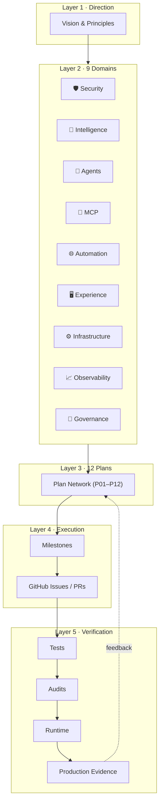

# SupremeAI System Architecture

> **Layer 2 — Architecture.** What SupremeAI is made of, at the highest level.
> This is the *shape*; the *behavior* lives in the [plan network](../plans/PLAN_REGISTRY.md).

---

## The one-line model

```text
VISION → DOMAINS → PLANS → DEPENDENCIES → MILESTONES → GITHUB ISSUES → IMPLEMENTATION → VERIFICATION ↺
```

Documentation is a **living graph**, not a collection of documents.

---

## System map



---

## The 5 layers

| Layer | Question | Artifact | Owner |
|-------|----------|----------|-------|
| 1 — Direction | Why does SupremeAI exist? | [vision/principles.md](../vision/principles.md) | Founder |
| 2 — Architecture | What big systems is it made of? | [architecture/domains.md](./domains.md) + this file | Architecture Governance |
| 3 — Strategic Plans | How does each domain evolve? | [plans/PLAN_REGISTRY.md](../plans/PLAN_REGISTRY.md) | Planning Circle |
| 4 — Execution | Who builds it, and when? | [execution/github-mapping.md](../execution/github-mapping.md) | Circle leads |
| 5 — Verification | How do we know it works? | [verification/](../verification/) | Quality Circle |

---

## Why this beats a master document

The legacy `docs/DOCUMENTATION_MASTER_INDEX.md` was **305 KB** — a single file
trying to be the index, the graph, the matrix, and the vision all at once. It
was unreadable and always stale.

This architecture splits those concerns:

- **Index** → `PLAN_REGISTRY.md` (one row per plan)
- **Graph** → `PLAN_GRAPH.md` (mermaid, regenerable)
- **Matrix** → `PLAN_MATRIX.md` (flat dependency view)
- **Vision** → `vision/principles.md` (rarely changes)
- **Shape** → this file (the 5 layers)

Each file is small, has one job, and can be checked independently by
`lint_plans.py`.

---

## Relationship to the existing repo

This patch is **additive and compatible**. It preserves the existing frontmatter
schema (`id / subject / document_role / planning_authority / status /
evidence_state / disposition / last_verified / supersedes / superseded_by /
target_scope`) and the 3-tier scope taxonomy
(`supremeai_internal / combined_ecosystem / user_project`).

It adds only the missing piece: the **relationship layer**
(`plan_id / domain / depends_on / enables / implemented_by / verified_by / related_to`)
and the single registry + graph that make those relationships visible.
