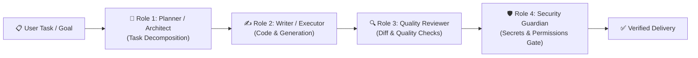

# কোর প্ল্যান ১ — ডাইনামিক মাল্টি-এজেন্ট অর্কেস্ট্রেশন
## (Core Plan 1: Dynamic Multi-Agent Swarm & Dynamic Discovery)

> **"সিস্টেম কোনো নির্দিষ্ট মডেলের নাম নিয়ে জন্ম নেয়নি। এটি যেকোনো $1 \dots N$ মডেলকে আবিষ্কার করবে এবং কাজের প্রাপ্যতা অনুযায়ী ভূমিকা দেবে।"**

---

## ১. উদ্দেশ্য ও দর্শন (Intent & Philosophy)

এআই জগতে মডেল দ্রুত পরিবর্তিত হয় (আজ Claude 3.7, কাল GPT-5, পরশু ওপেন-সোর্স DeepSeek বা Qwen)। সিস্টেমকে কোনো নির্দিষ্ট মডেলের নামে হার্ডকোড করে রাখা যাবে না। 

কোর প্ল্যান ১-এর দর্শন:
1. **Dynamic Model Discovery:** রানটাইমে $1 \dots N$ এআই মডেল/প্রোভাইডার আবিষ্কার করা।
2. **Specialized Role Delegation:** একটি একক বড় প্রম্পট দিয়ে সবকিছু না করিয়ে কাজের ধরন অনুযায়ী আলাদা রোলে কাজ ভাগ করা।
3. **Decoupled Orchestration:** প্রতিটি এজেন্টের আউটপুট পরবর্তী এজেন্টের ইনপুট হিসেবে একটি গভর্নড পাইপলাইনে প্রবাহিত হবে।

---

## ২. ৪-রোল স্পেশালাইজেশন মডেল (4-Role Swarm Model)

| রোল (Role) | দায়িত্ব | উপযুক্ত মডেল ক্যাটাগরি | আউটপুট |
| :--- | :--- | :--- | :--- |
| **১. Planner / Architect** | বড় সমস্যাকেন্দ্রিক কাজকে ছোট ছোট অ্যাটমিক টাস্কে ভাগ করা | হাই-রিজনিং ফ্রন্টিয়ার মডেল (যেমন: Claude Sonnet, o3-mini) | স্টেপ-বাই-স্টেপ এক্সিকিউশন প্ল্যান |
| **২. Writer / Executor** | কোড লেখা, টেক্সট তৈরি বা টুল এক্সিকিউট করা | হাই-থ্রুপুট কোডিং মডেল (যেমন: Gemini 2.5 Flash, DeepSeek-Coder) | কোড ডিটেইলস, প্যাচ বা ফাইল |
| **৩. Reviewer** | রিগ্রেশন, কনফ্লিক্ট বা সাইড-ইফেক্ট পরীক্ষা করা | ক্রিটিক্যাল অডিট মডেল (যেমন: GPT-4o, Sonnet) | রিভিউর মন্তব্য বা সংশোধন নির্দেশ |
| **৪. Security Guardian** | টোকেন লিক, পারমিশন ও অথ বাউন্ডারি চেক | স্পেশালাইজড লাইটওয়েট বা AST রুল স্ক্যানার | নিরাপত্তা ছাড়পত্র (PASS/FAIL) |

---

## ৩. সেন্ট্রাল MCP কন্ট্রোল টাওয়ার ইন্টিগ্রেশন

এজেন্টরা অন্ধভাবে কাজ করবে না; তারা **Model Context Protocol (MCP)** কন্ট্রোল টাওয়ারের মাধ্যমে পরিচালিত হবে:
- **`ai_available_providers`**: লাইভ ক্লাউড এবং লোকাল প্রোভাইডারের তালিকা দেবে।
- **`ai_list_capabilities`**: কোন এজেন্ট ওয়েব ব্রাউজিং করতে পারে, কোনটা কোড এক্সিকিউট করতে পারে তা যাচাই করবে।
- **`ai_assign_task`**: রোলের ভিত্তিতে নির্দিষ্ট এজেন্টের কাছে টাস্ক ডেলিগেট করবে।

---

## ৪. বিবর্তনের ইতিহাস (Lineage)

* **Genesis (মে ২০২৬):** Java 21-এ `AgentOrchestrator.java` এবং হার্ডকোডেড ৩-এজেন্ট ট্রায়ো।
* **Mid-Pivot:** Flask REST API ও Celery/Redis ভিত্তিক ব্যাকগ্রাউন্ড টাস্ক প্রসেসিং।
* **Modern PaaS (বর্তমান):** ১,২৮৬ লাইনের TypeScript FastMCP টাওয়ার (~৮০টি টুলস) + Python FastAPI অ্যাসিঙ্ক অর্কেস্ট্রেশন পাইপলাইন (`trio_pipeline.py`)।
