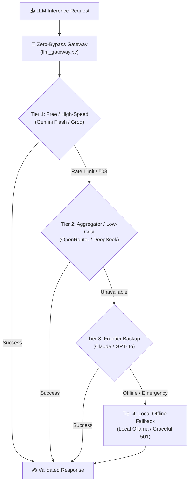

# কোর প্ল্যান ২ — ভেন্ডর নিউট্রালিটি ও জিরো-ফেইলিউর প্রোভাইডার গেটওয়ে
## (Core Plan 2: Vendor-Neutral Provider Gateway & Failover Chain)

> **"কোনো একক ক্লাউড বা মডেল কোম্পানি আমাদের সেবা বন্ধ করতে পারবে না। গেটওয়ে হবে ভেন্ডর-অ্যাগনস্টিক এবং সেলফ-হিলিং।"**

---

## ১. উদ্দেশ্য ও দর্শন (Intent & Philosophy)

বাস্তব দুনিয়ায় এআই প্রোভাইডাররা প্রায়ই 429 (Rate Limit), 503 (Overloaded) বা ডাউনটাইমে পড়ে। সুপ্রিমএআই এমনভাবে তৈরি যে একজন ইউজারের রিকোয়েস্ট কোনো অবস্থাতেই ফেল করবে না।

কোর নীতিসমূহ:
1. **Zero-Bypass Inference Boundary:** কোডবেসের কোনো মডিউল সরাসরি `openai`, `anthropic` বা `httpx` দিয়ে মডেল কল করতে পারবে না। সব কল অবশ্যই সেন্ট্রাল `llm_gateway.py`-এর ভেতর দিয়ে যেতে হবে (CI AST দ্বারা রক্ষিত)।
2. **Graceful Multi-Tier Degradation:** প্রাইমারি মডেল ডাউন হলে সেকেন্ডারি এবং টারশিয়ারি মডেলে অটো-ফলব্যাক।
3. **API Key Lifecycle & Rotation:** প্রতিটা টেন্যান্টের কোটা ট্র্যাকিং এবং কি-রোটেশন।

---

## ২. ফেইলওভার ও কস্ট চেইন আর্কিটেকচার (Failover & Cost Chain)

---

## ৩. ১৪টি সমর্থিত প্রোভাইডার ক্লাস্টার (14 Supported Providers)

আমাদের সেন্ট্রাল গেটওয়ে ১৪টি প্রোভাইডারকে একক স্ট্যান্ডার্ড ইন্টারফেসে যুক্ত করে:
1. **Google Gemini** (Gemini 2.5 Flash, Pro)
2. **Groq** (Ultra-fast Llama 3.3 70B)
3. **OpenRouter** (Multi-model routing)
4. **Mistral AI** (Mistral Large, Codestral)
5. **OpenAI** (GPT-4o, o3-mini)
6. **Anthropic** (Claude 3.7 Sonnet)
7. **DeepSeek** (DeepSeek V3, R1)
8. **Cohere** (Command R+)
9. **Together AI** (Open-source compute)
10. **HuggingFace Endpoints** (Custom serverless)
11. **Nvidia NIM** (Enterprise open models)
12. **BAI / Bynara** (Specialized inference)
13. **Cloudflare Workers AI** (Edge-based inferencing)
14. **Local Ollama** (Air-gapped / Local fallback)

---

## ৪. বিবর্তনের ইতিহাস (Lineage)

* **Genesis (মে ২০২৬):** Java-তে `AIProviderFactory.java` ও `SupremeCloudProvider.java`—হাগিংফেস ও রেন্ডারের সীমিত মডেল।
* **Mid-Pivot:** LiteLLM র‍্যাপার ও ম্যানুয়াল এনভায়রনমেন্ট ভ্যারিয়েবল সুইচিং।
* **Modern PaaS (বর্তমান):** Python Pydantic v2 বেসড `InferenceContext`, সেন্ট্রাল প্রোভাইডার অ্যাডাপ্টার ও টোকেন-ক্যালকুলেটর (`core/llm_gateway.py`)।
