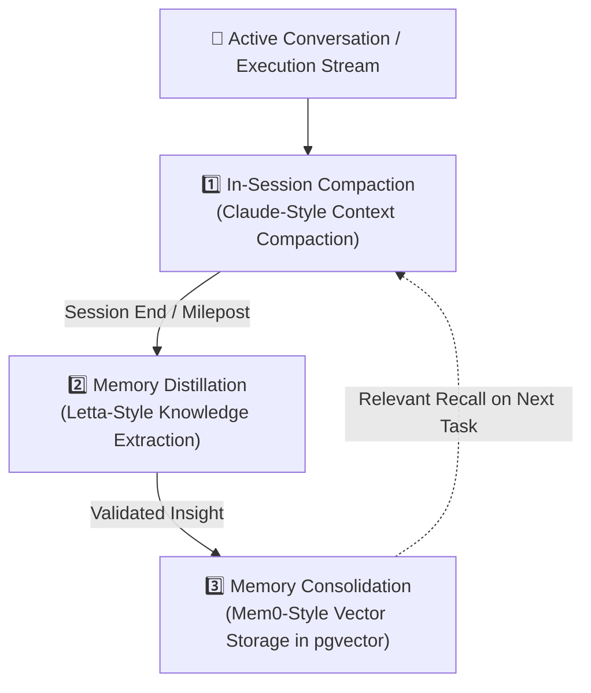

# কোর প্ল্যান ৩ — সেলফ-লার্নিং ও মেমরি কম্পাউন্ডিং
## (Core Plan 3: Continuous Learning & Compounding Memory Engine)

> **"প্রতিটা সমাধান পরের সমাধানকে সস্তা ও দ্রুত করবে। যে সিস্টেম নিজের সমাধান থেকে শেখে না, সে সত্যিকারের এআই নয়।"**

---

## ১. উদ্দেশ্য ও দর্শন (Intent & Philosophy)

সাধারণ চ্যাটবট বা এআই সেশন বন্ধ হলে সব ভুলে যায়। প্রতিবার ইউজারকে নতুন করে কন্টেক্সট দিতে হয়, যা বিপুল টোকেন নষ্ট করে।

কোর প্ল্যান ৩-এর লক্ষ্য:
1. **Compounding Intelligence:** Task #50 সম্পন্ন করতে Task #5-এর চেয়ে কম টোকেন ও কম সময় লাগবে।
2. **Context Window Protection:** অপ্রয়োজনীয় চ্যাট হিস্টোরি দিয়ে উইন্ডো নষ্ট না করে স্বয়ংক্রিয়ভাবে সারমর্ম তৈরি (Compaction)।
3. **Multi-Tier Memory Architecture:** মেমরিকে তিনটি ভিন্ন স্তরে বিভক্ত রাখা।

---

## ২. ৩-পিলার মেমরি আর্কিটেকচার (3-Pillar Memory Stack)

| স্তর (Pillar) | ভূমিকা | প্রযুক্তি | স্থায়িত্ব |
| :--- | :--- | :--- | :--- |
| **১. Context Compaction** | চলমান কথোপকথনের অতিরিক্ত টোকেন ছেঁটে ফেলে মূল নির্যাস রাখা | রানিং কনটেক্সট সামারাইজার (`PLAN_002`) | সেশন চলাকালীন |
| **২. Memory Distillation** | সেশনের সফল সমাধান, সিদ্ধান্ত ও ত্রুটিগুলোর শিক্ষা আলাদা করা | লার্নিং ডিস্ট্রিবিউটর (`PLAN_004`) | টাস্কভিত্তিক |
| **৩. Memory Consolidation** | ইউজারের পছন্দ, প্রজেক্ট আর্কিটেকচার ও কোডিং প্যাটার্ন ভেক্টরাইজ করা | Supabase `pgvector` (`PLAN_006`) | স্থায়ী (Persistent) |

---

## ৩. ক্যানোনিকাল রাইট পাথ (Canonical Write Path)

কোডবেসের ভিন্ন ভিন্ন ১৫টি জায়গায় মেমরি স্টোর ছড়ানো থাকবে না। একটি সেন্ট্রাল সার্ভিস:
- **`CascadeMemoryService`**: এটি প্রথমে লোকাল ক্যাশে সার্চ করবে, না পেলে ভেক্টর ডাটাবেসে সেমান্টিক সার্চ করবে।
- **Truth Criterion:** *"যা রিট্রিভ (retrieve) করা যায় না, তা জানা নয়।"* প্রতিটি মেমরি আইটেমের সাথে সোর্স টাস্ক আইডি ও টাইমস্ট্যাম্প ট্যাগ থাকবে।

---

## ৪. বিবর্তনের ইতিহাস (Lineage)

* **Genesis (মে ২০২৬):** Firebase Firestore কালেকশন (`knowledge`, `tasks`) এবং লোকাল ইন-মেমরি হ্যাশম্যাপ।
* **Mid-Pivot:** Ephemeral ChromaDB যা কন্টেইনার রিস্টার্টে মুছে যেত।
* **Modern PaaS (বর্তমান):** Supabase `pgvector` (HNSW ইন্ডেক্সিং) + Anthropic প্রম্পট ক্যাশিং + ডিস্টিলেশন পাইপলাইন।
