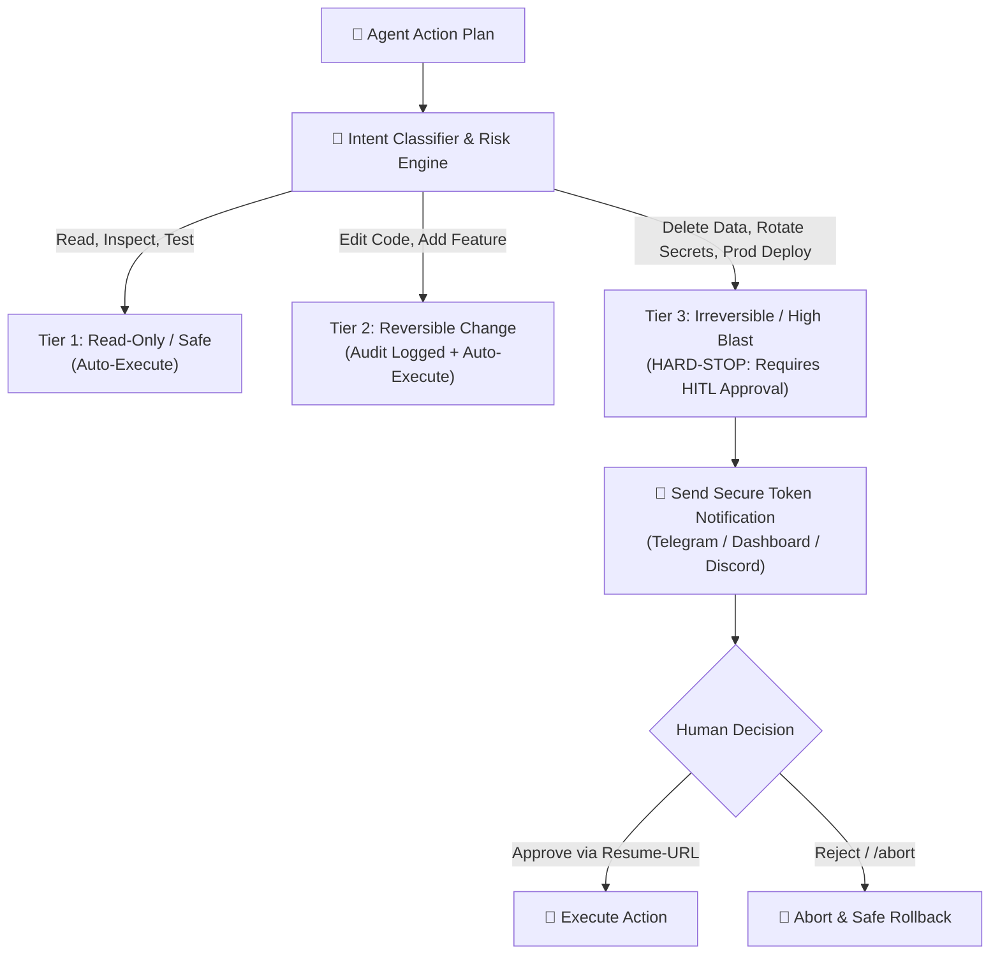

# কোর প্ল্যান ৪ — ইন্টেন্ট অ্যানালাইসিস ও নিয়ন্ত্রিত হিউম্যান-ইন-দ্য-লুপ
## (Core Plan 4: Governed Intent Analysis & Human-in-the-Loop Safeguards)

> **"এজেন্ট শক্তিশালী হবে কিন্তু কখনো অনিয়ন্ত্রিত বা স্বেচ্ছাচারী হবে না। ঝুঁকিপূর্ণ কাজের জন্য মানুষের অনুমোদনই চূড়ান্ত সুরক্ষা প্রাচীর।"**

---

## ১. উদ্দেশ্য ও দর্শন (Intent & Philosophy)

এআই এজেন্ট যখন স্বয়ংক্রিয়ভাবে কোড পরিবর্তন, ডাটাবেস মাইগ্রেশন বা সার্ভার ডিপ্লয়মেন্ট করতে শুরু করে, তখন একটি ছোট্ট ভুলের কারণে বিপর্যয় ঘটতে পারে। 

কোর প্ল্যান ৪-এর মূলনীতি:
1. **Intent Scoring:** ইউজারের প্রম্পটের উদ্দেশ্য কী (তথ্য জানতে চাওয়া, নিরীহ কোড রিড, নাকি ধ্বংসাত্মক ফাইল ডিলিট?) তা আগে স্ক্যান করা।
2. **Tier-3 Action Boundary:** ঝুঁকিপূর্ণ কাজের জন্য স্বয়ংক্রিয় অনুমতি নিষিদ্ধ।
3. **One-Bridge-Many-Doors:** ৭টি আলাদা নোটিফিকেশন চ্যানেল তৈরি না করে একটি সেন্ট্রাল ডিসপ্যাচ ও সিকিউর টোকেন সিস্টেম চালানো।

---

## ২. ইন্টেন্ট ও পারমিশন টায়ারিং (Action Tiering)

---

## ৩. সিকিউর রেজ্যুম-ইউআরএল মেকানিজম (Resume-URL Token Pattern)

এজেন্টের কার্যক্রম বন্ধ না করে একটি অ্যাসিনক্রোনাস ওয়েটিং স্টেটে নেওয়া হয়:
1. এজেন্ট একটি অনন্য ক্রিপ্টোগ্রাফিক টোকেন (`resume_token_xyz`) তৈরি করে।
2. ইউজারের কাছে টেলিগ্রাম বা মোবাইল ড্যাশবোর্ডে পুশ মেসেজ যায়:
   > *"⚠️ Agent wants to apply migration on Production DB. Approve? [Yes] [No]"*
3. ইউজার বোতাম চাপলে সিকিউর ওয়েবহুকের মাধ্যমে এজেন্টকে ওয়েক-আপ সিগন্যাল পাঠানো হয় এবং কাজটি সম্পন্ন হয়।

---

## ৪. বিবর্তনের ইতিহাস (Lineage)

* **Genesis (মে ২০২৬):** কনসোল টার্মিনালে হার্ডকোডেড ব্লকিং প্রম্পট (`System.in.read()`)।
* **Mid-Pivot:** একাধিক ভিন্ন ডিসকর্ড/টেলিগ্রাম বটের আলাদা আলাদা কোড ও অগোছালো লুপ।
* **Modern PaaS (বর্তমান):** স্টোর-বিফোর-ক্যারিয়ার প্যাটার্ন (`MODULE_20`) + ইউনিফায়েড `resume-URL` টোকেন ডিসপ্যাচ (`MODULE_17`)।
