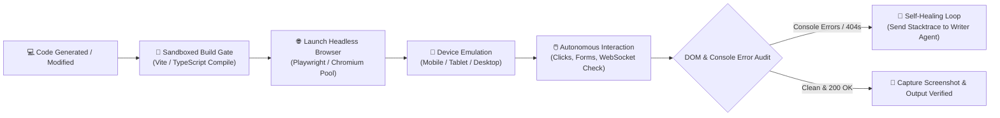

# কোর প্ল্যান ৫ — অটোনোমাস সিমুলেটর ও রিয়েল-টাইম ভেরিফিকেশন
## (Core Plan 5: Autonomous Sandboxed Simulator & Live Verification)

> **"কোড লেখা কাজের মাত্র অর্ধেক। কোডটি ব্রাউজারে কাজ করছে কিনা, তা নিজে রান করিয়ে চোখে দেখে প্রমাণ দেওয়া হলো বাকি অর্ধেক।"**

---

## ১. উদ্দেশ্য ও দর্শন (Intent & Philosophy)

এআই এজেন্টরা অনেক সময় এমন কোড লেখে যা সিনট্যাক্স অনুযায়ী ঠিক হলেও ব্রাউজারে বা রানটাইমে ইউজার ইন্টারফেস ভেঙে ফেলে বা সাদা স্ক্রিন (Blank Screen) দেখায়।

কোর প্ল্যান ৫-এর উদ্দেশ্য:
1. **Zero Fake Pass:** শুধু `it builds` বা `syntax ok` বললেই চলবে না; রানটাইম প্রুফ বাধ্যতামূলক।
2. **Headless Device Emulation:** মোবাইল, ট্যাবলেট বা ডেস্কটপ ভিউপোর্টে অ্যাপটি লাইভ রেন্ডার করা।
3. **Visual & DOM Evidence:** ব্রাউজারের ডম (DOM), কনসোল এরর এবং ভিজ্যুয়াল স্ক্রিনশট স্বয়ংক্রিয়ভাবে সংগ্রহ করা।

---

## ২. সিমুলেটর ভেরিফিকেশন আর্কিটেকচার (Simulator Flow)

---

## ৩. কোর ক্যাপাবিলিটিজ (Key Capabilities)

- **Device Emulation Middleware:** ডিভাইস অনুযায়ী ইউজার-এজেন্ট ও স্ক্রিন সাইজ অ্যাডাপ্টেশন।
- **WebSocket Remote Control:** রিয়েল-টাইমে ব্রাউজারের সেশন দেখা এবং নিয়ন্ত্রণ করা।
- **Visual Regression Checker:** পূর্বের স্ক্রিনশটের সাথে বর্তমান স্ক্রিনশট মিলিয়ে দেখা কোনো ইউআই ভেঙেছে কিনা।
- **Sandbox Escape Prevention:** এজেন্ট যাতে ব্রাউজার থেকে মূল হোস্টে কোনো ক্ষতিকর কোড চালাতে না পারে, তার জন্য কঠোর কন্টেইনার বা স্যান্ডবক্স আইসোলেশন।

---

## ৪. বিবর্তনের ইতিহাস (Lineage)

* **Genesis (মে ২০২৬):** `SimulatorRuntimeController.java` ও `DeviceEmulationMiddleware.java` (জাভা ক্লাউড রান ভিত্তিক প্রোটোটাইপ)।
* **Mid-Pivot:** সেলিনিয়াম (Selenium) নির্ভর ভারী স্ক্রিপ্ট যা বারবার হ্যাং হতো।
* **Modern PaaS (বর্তমান):** লাইটওয়েট Chromium + Playwright হেডলেস ক্লাস্টার (`infrastructure/mcp-control-plane/browser/`) + Playwright E2E টেস্ট চেইন।
