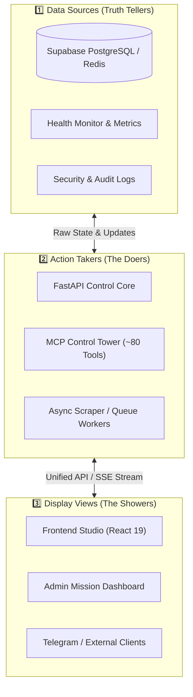

# কোর প্ল্যান ৬ — ৩-স্তরের ডিকাপলড টপোলজি ও স্টেট সিঙ্ক
## (Core Plan 6: Decoupled 3-Layer Topology: Truth Tellers, Doers, Showers)

> **"ইউআই কখনো সরাসরি কাঁচা ডাটাবেসে হাত দেবে না। ব্যাকএন্ড কখনো ইউআই লজিক জানবে না। মাঝখানে থাকবে একটি জীবন্ত স্টেট ও ইভেন্ট বাস।"**

---

## ১. উদ্দেশ্য ও দর্শন (Intent & Philosophy)

একটি বড় প্ল্যাটফর্মে ফ্রন্টএন্ড এবং ব্যাকএন্ডের মধ্যে যদি সরাসরি শক্ত নির্ভরতা (tight coupling) তৈরি হয়, তবে ব্যাকএন্ড বদলালে ইউআই ভেঙে যায় এবং ইউআই বদলালে ব্যাকএন্ড অকেজো হয়ে পড়ে।

কোর প্ল্যান ৬-এর আর্কিটেকচারাল রুল:
1. **Three Clear Tiers:** পুরো সিস্টেমকে ৩টি সুনির্দিষ্ট ভাগে ভাগ করা।
2. **Unified State Management:** ক্লায়েন্ট সাইডে ১৫টি আলাদা স্টোর না রেখে একটি পরিষ্কার **Unified Store** মেইনটেইন করা।
3. **Event-Driven Communication:** মডিউলগুলো একে অপরকে সরাসরি কল না করে ইভেন্ট বাসের মাধ্যমে তথ্য আদান-প্রদান করবে।

---

## ২. ৩-স্তরের টপোলজি ডায়াগ্রাম (3-Layer Topology Diagram)

---

## ৩. উপাদানগুলোর দায়িত্ব (Roles & Responsibilities)

1. **Truth Tellers (ডাটা সোর্স):**
   - একমাত্র এরাই আসল সত্য জানে। সিস্টেমের রিয়েল স্টেট, টেন্যান্ট কনফিগ এবং অডিট লগ এখানে থাকে।
2. **The Doers (অ্যাকশন টেকার্স):**
   - ব্যাকএন্ড সার্ভিস এবং MCP টুলস। এরা রিকোয়েস্ট প্রসেস করে, ইনফারেন্স চালায় এবং ডাটা আপডেট করে।
3. **The Showers (ডিসপ্লে ভিউজ):**
   - ইউজার যা দেখে। এরা কখনোই ব্যাকএন্ড লজিক ক্যালকুলেট করে না; এরা শুধু সেন্ট্রাল স্টোর থেকে ডাটা নিয়ে সুন্দরভাবে ইউজারকে দেখায়।

---

## ৪. বিবর্তনের ইতিহাস (Lineage)

* **Genesis (মে ২০২৬):** Flutter UI + Firebase Cloud Functions + Firestore সরাসরি ক্লায়েন্ট থেকে কল।
* **Mid-Pivot:** Flask এন্ডপয়েন্ট ও একাধিক আন-কোঅর্ডিনেটেড রিঅ্যাক্ট কম্পোনেন্ট।
* **Modern PaaS (বর্তমান):** React 19 + Vite 7 + Zustand ডোমেইন স্টোরস + `getApiBaseUrl()` ক্যানোনিকাল ক্লায়েন্ট + FastAPI REST/WebSocket।
