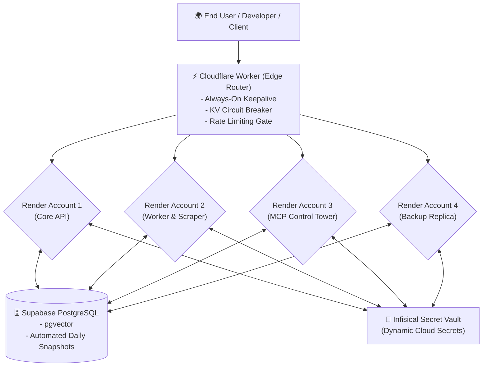

# কোর প্ল্যান ৭ — জিরো-লোকাল ক্লাউড রেজিলিয়েন্স ও ডিজাস্টার রিকভারি
## (Core Plan 7: Zero-Local Dependency, Multi-Cloud Federation & Disaster Recovery)

> **"সিস্টেমের ১%-ও কোনো ডেভেলপারের লোকাল ল্যাপটপের ওপর নির্ভর করবে না। ক্লাউড নোড মারা গেলেও এজ রাউটার সার্ভিস বাঁচিয়ে রাখবে।"**

---

## ১. উদ্দেশ্য ও দর্শন (Intent & Philosophy)

অনেক এআই প্রজেক্ট শুধু লোকাল মেশিনে `localhost:8000`-এ চলে, যা রিয়েল-ওয়ার্ল্ড ক্লাউডে নিতেই ভেঙে পড়ে। 

কোর প্ল্যান ৭-এর মূল অনুশাসন:
1. **Zero Local-Machine Dependency:** ডেভেলপারের ল্যাপটপ বন্ধ থাকলেও প্ল্যাটফর্ম ২৪/৭ চলবে।
2. **Free-Tier Multi-Cloud Federation:** বড় বড় বিল না বাড়িয়ে একাধিক নির্ভরযোগ্য ফ্রি ক্লাউড প্রোভাইডারকে (Render, Cloudflare, Supabase, Infisical) ফেডারেশন আকারে সাজানো।
3. **Fail-Closed & Circuit Breaking:** কোনো নোড ক্র্যাশ করলে ট্রাফিক স্বয়ংক্রিয়ভাবে স্বাস্থ্যবান নোডে চলে যাবে। সাইলেন্ট ডেটা লস সম্পূর্ণ নিষিদ্ধ।

---

## ২. মাল্টি-ক্লাউড ফেডারেশন টপোলজি (Cloud Federation Topology)

---

## ৩. গুরুত্বপূর্ণ সার্ভাইভাল কৌশল (Survival Strategies)

1. **Always-On Edge Ping:** রেন্ডারের ফ্রি ইনস্ট্যান্স যাতে স্লিপে না যায় (cold start ঠেকানোর জন্য), ক্লাউডফ্লেয়ার এজ ওয়ার্কার প্রতি ১০ মিনিটে লাইভ পিং পাঠায়।
2. **Circuit Breaker Mechanism:** কোনো একটি নোড ৫xx এরর দিতে শুরু করলে ক্লাউডফ্লেয়ার সাথে সাথে ওই নোডকে পুল থেকে সাময়িক সরিয়ে ব্যাকআপে ট্রাফিক ঘুরিয়ে দেয়।
3. **Hard-Fail on Database Failure:** মেমরি প্রেশারে পোস্টগ্রেস ডিসকানেক্ট হলে সাইলেন্টলি লোকাল ইন-মেমরি SQLite-এ গিয়ে ইউজারের ডেটা মুছে ফেলা নিষিদ্ধ; বরং সততার সাথে হার্ড-ফেইল (Crash/Alert) করে ডাটা ইন্টিগ্রিটি রক্ষা করা হবে।

---

## ৪. বিবর্তনের ইতিহাস (Lineage)

* **Genesis (মে ২০২৬):** একক Google Cloud Build বা লোকাল ডকার কনটেইনার—কোনো ফেইলওভার সাপোর্ট ছিল না।
* **Mid-Pivot:** জটিল এন্টারপ্রাইজ কুবারনেটিস (Istio/Kong) প্ল্যান—যা বাস্তব ফ্রি-টিয়ার ফ্রেমওয়ার্কে অবাস্তব ছিল।
* **Modern PaaS (বর্তমান):** বাস্তবসম্মত, পরীক্ষিত এবং লাইভ ৪-রেন্ডার অ্যাকাউন্ট + ক্লাউডফ্লেয়ার এজ ওয়ার্কারের ফ্রি-টিয়ার ফেডারেশন (`infrastructure/cloudflare-worker/`)।
