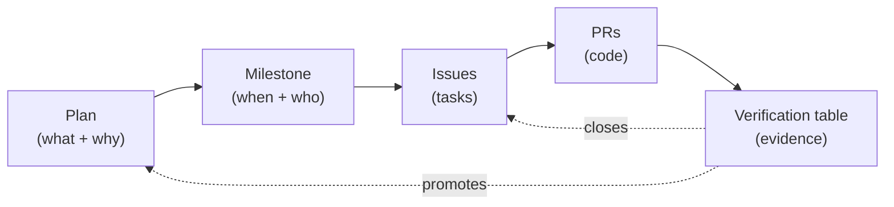

# Plan → Milestone → GitHub Issue Mapping

> **Layer 4 — Execution.** A plan document never holds implementation detail.
> It points to a GitHub milestone; the milestone points to issues; the issues
> point to PRs; the PRs point back to the plan's Verification table.

---

## The mapping

| Plan | Milestone | GitHub Milestone | Issue range | Status |
|------|-----------|------------------|-------------|--------|
| [P01](../plans/security/security-guardian.md) | Security Hardening | `milestone:security-hardening` | `#101–#110` *(example)* | 🟦 Active |
| [P02](../plans/intelligence/provider-abstraction.md) | Provider Gateway | `milestone:provider-gateway` | `#111–#118` | 🟦 Active |
| [P03](../plans/mcp/mcp-architecture.md) | MCP Control Tower | `milestone:mcp-tower` | *(closed)* | ✅ Stable |
| [P04](../plans/agents/agent-orchestration.md) | Agent Role System | `milestone:agent-roles` | `#119–#130` | 🟦 Active |
| [P05](../plans/intelligence/memory-knowledge-engine.md) | Memory Consolidation | `milestone:memory` | `#131–#135` | 🟦 Active |
| [P06](../plans/automation/browser-automation.md) | Browser Pool | `milestone:browser-pool` | `#136–#142` | 🟪 Implementing |
| [P07](../plans/experience/frontend-evolution.md) | Frontend Tier-S Wiring | `milestone:frontend-tiers` | `#143–#160` | 🟦 Active |
| [P08](../plans/infrastructure/infrastructure-optimization.md) | Free-Tier Federation v4 | `milestone:fed-v4` | `#161–#175` | 🟦 Active |
| [P09](../plans/observability/observability.md) | Observability Stack | `milestone:observability` | `#176–#182` | 🟪 Implementing |
| [P10](../plans/governance/deployment-safety.md) | Deployment Safety | `milestone:deploy-safety` | `#183–#190` | 🟦 Active |
| [P11](../plans/governance/testing-quality.md) | Quality Gate | `milestone:quality-gate` | `#191–#198` | 🟨 Verifying |
| [P12](../plans/governance/codebase-cleanup.md) | Doc Consolidation | `milestone:doc-cleanup` | `#199–#210` | ⬜ Proposed |

> Issue numbers above are illustrative — replace with real GitHub milestone
> links when the patch is applied. The mapping rule is what matters.

---

## The execution discipline

**Rules:**

1. **One plan → one milestone.** A plan may not span multiple milestones; if
   the work is that big, split the plan.
2. **One issue → one PR.** Keep PRs reviewable; link the issue in the PR body.
3. **No PR merges without a plan reference.** The PR description must link the
   plan file (`See: P0x`).
4. **No plan reaches Stable without closed issues + linked evidence.**

---

## Execution order (respect the graph)

The graph in [PLAN_GRAPH.md](../plans/PLAN_GRAPH.md) dictates a safe partial
order. Work **bottom-up**:

1. **P01 Security** — block on nothing; unblocks everything.
2. **P03 MCP** — already Stable; keep it healthy.
3. **P08 Infrastructure** — unblocks P09, P10, P11.
4. **P02 Provider Abstraction** — unblocks P04.
5. **P04 Agent Orchestration** — unblocks P05, P07.
6. **P05 Memory, P06 Browser, P07 Frontend** — parallel-safe once their deps are Stable.
7. **P09 Observability** — unblocks P10's canary gate.
8. **P10 Deployment, P11 Testing** — the final gates.
9. **P12 Codebase Cleanup** — runs alongside; completes last.

> Single-plan execution discipline (from [PLAN_STATUS_LIFECYCLE.md](../plans/PLAN_STATUS_LIFECYCLE.md)):
> only one plan is **Implementing** at a time unless the founder authorizes
> parallel execution.

---

## Why this replaces the legacy trackers

The legacy `implementation_and_milestone_trackers.md` and
`project_milestones_and_completion_tracker.md` duplicated milestone state in
prose that drifted from GitHub. This mapping file is **single-source**: the
milestone ID is the link, and GitHub is the system of record for issue state.
This file only maps plans → milestones.
