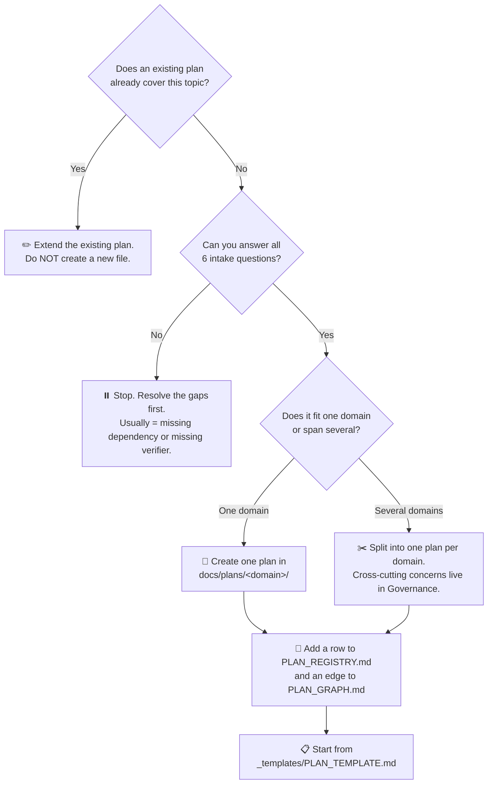

# SupremeAI Impact Map

> **Before you create a new plan, answer these six questions.**
> If you cannot answer all of them, you do not have a plan — you have a wish.
> This is the smart intake layer that prevents the documentation jungle from
> regrowing.

---

## The intake checklist

Answer every question. If any answer is "none" or "unknown", stop and resolve
that first — usually by extending an existing plan instead of creating a new one.

```text
NEW PLAN
   │
   ├── 1. Which DOMAIN does it belong to?            (one of the 9)
   ├── 2. Which EXISTING plan(s) does it DEPEND ON?  (P01–P12, or "foundation")
   ├── 3. Which plan(s) does it CHANGE?              (touching = coordinate a PR)
   ├── 4. Which NEW capability does it ENABLE?       (name the downstream plan)
   ├── 5. Which AUDIT / checklist verifies it?       (no verification = no Stable)
   └── 6. Which GitHub MILESTONE implements it?      (no milestone = stays Proposed)
```

---

## Decision tree



---

## Worked example

> *"We want a new plan for prompt caching."*

1. **Domain?** Intelligence (it touches the provider gateway).
2. **Depends on?** P02 Provider Abstraction (must be Stable first).
3. **Changes?** P02 (the gateway gains a cache layer) — coordinate a single PR.
4. **Enables?** P04 Agent Orchestration (cheaper long-running agent loops).
5. **Verified by?** Cache-hit-rate tests + cost-regression dashboard.
6. **Milestone?** "Prompt Caching".

✅ All six answered. But notice: **this is an extension of P02, not a new plan.**
The right move is to add a "Prompt Caching" section to
[`provider-abstraction.md`](./intelligence/provider-abstraction.md), not to
create `docs/plans/intelligence/prompt_caching_plan.md`. That decision is the
entire point of this Impact Map.

---

## Relationship-header generator

When you DO create a new plan, copy this block into the top of the file
(from [`_templates/PLAN_TEMPLATE.md`](./_templates/PLAN_TEMPLATE.md)) and fill
it in. The interactive version of this generator lives in the visualization's
**Impact Map** section.

```md
# Plan: <Name>

Status: <Proposed|Active|Implementing|Verifying|Stable|Blocked|Archived>
Owner: <Circle> Circle

## Purpose
<one paragraph>

## Depends On
- [Pxx — Name](../<domain>/<file>.md)

## Enables
- [Pxx — Name](../<domain>/<file>.md)

## Related
- [Pxx — Name](../<domain>/<file>.md)

## Source of Truth
This document defines <topic>. Other documents must reference it,
not duplicate it.

## Execution
See GitHub milestone: <Milestone name>
```

---

## Anti-patterns (do not do these)

| Anti-pattern | Why it's wrong | Do this instead |
|--------------|----------------|-----------------|
| `security_plan_v2.md` next to `security_plan.md` | Versioned filenames = duplicate truth | Edit the canonical `security-guardian.md`; bump `last_verified` |
| A plan with no `depends_on` and no `enables` | Isolated node = probably duplicate or forgotten | Find its real neighbors; if none exist, it's not a plan |
| A plan marked Stable with no evidence links | Stable is a hard gate, not a vibe | Move it back to Verifying until evidence is linked |
| A new plan that duplicates 80% of an existing one | The jungle regrows | Extend the existing plan; archive the draft |
| "Master plan" documents that summarize other plans | Re-introduces the 305KB index problem | The registry IS the summary. Point to it. |
