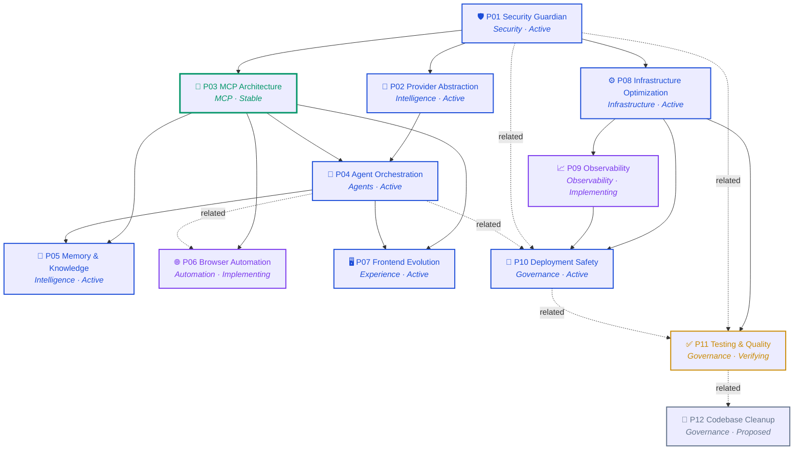
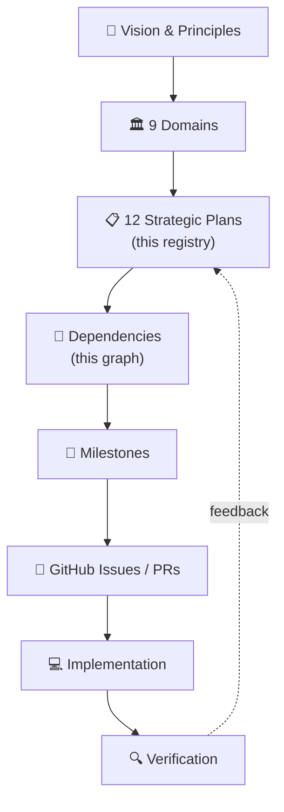
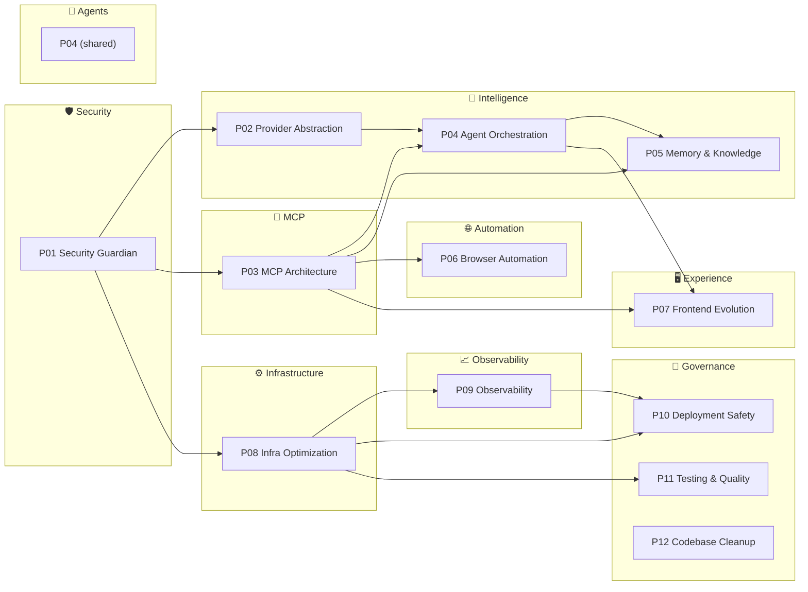

# SupremeAI Plan Graph

> The visual relationship map of the Plan Network. Every arrow is a real
> dependency that already exists in [PLAN_REGISTRY.md](./PLAN_REGISTRY.md).
> This is a **living graph**, not a static diagram — when the registry changes,
> this graph changes.

**Legend:**

- `A --> B` means **A depends on B** (B must be Stable before A can ship).
- Node color = domain (see [domains](../architecture/domains.md)).
- Node border = status (Stable = green, Active = blue, Implementing = purple, Verifying = amber, Proposed = gray).

---

## Full dependency graph

---

## Foundation → Execution flow

The same network read top-to-bottom as the user's intended execution model:

---

## Domain cluster view

Plans grouped by their owning domain. This is the view to use when scoping a
single team's work.

---

## Reading the graph

1. **Start at P01.** Everything depends on Security Guardian. If P01 is not
   Stable, no other plan can claim Stable either.
2. **Follow the arrows down.** P03 (MCP) is the most-connected enabler — four
   plans depend on it. That makes P03 the highest-leverage plan to keep healthy.
3. **Watch the dashed lines.** `related` edges are not blocking dependencies,
   but they signal "touching one likely affects the other."
4. **P11 (Testing & Quality) is the verification sink.** It depends on infra
   but every plan eventually flows evidence through it.

---

## Updating this graph

This graph is generated from [PLAN_REGISTRY.md](./PLAN_REGISTRY.md). When you
change a plan's `dependsOn` or `enables`, update both files in the same PR.
The `scripts/governance/lint_plans.py` check (extended by this patch) verifies
graph ↔ registry parity.
