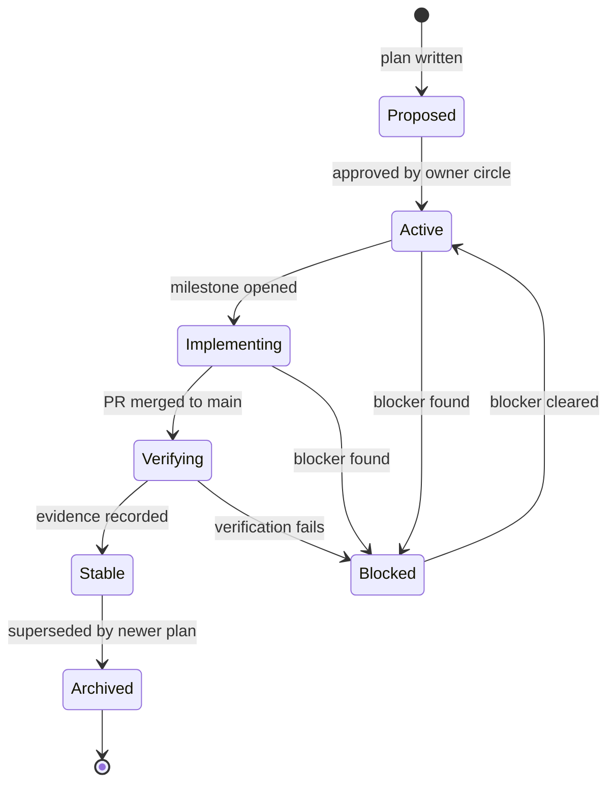

# SupremeAI Plan Status Lifecycle

> Standardized status so we can tell at a glance which plans are real and
> which are just writing. Extends the existing
> `PLAN_LIFECYCLE_POLICY.md` with explicit states and transitions.

---

## The state machine

---

## Status definitions

| Status | Color | Meaning | Allowed next states |
|--------|-------|---------|---------------------|
| **Proposed** | ⬜ gray | Idea written, frontmatter complete, not yet approved for execution. | Active, Archived |
| **Active** | 🟦 blue | Approved; next milestone being scoped. No code yet. | Implementing, Blocked, Archived |
| **Implementing** | 🟪 purple | Code is being written against an open GitHub milestone. | Verifying, Blocked, Archived |
| **Verifying** | 🟨 amber | PR merged; tests / audit / runtime verification in progress. | Stable, Blocked, Archived |
| **Stable** | 🟩 green | Evidence recorded and linked. **Safe for other plans to depend on.** | Archived |
| **Blocked** | 🟥 red | Cannot proceed until a named blocker clears. The blocker MUST be documented in the plan. | (back to previous state) |
| **Archived** | ⬜ gray | Superseded or retired. Kept for history; `superseded_by` points to the replacement. | (terminal) |

---

## Transition rules

1. **Proposed → Active** requires owner-circle approval. No approval, no work.
2. **Active → Implementing** requires an open GitHub milestone linked in the
   plan's `implemented_by` field.
3. **Implementing → Verifying** requires a merged PR with all review approvals.
4. **Verifying → Stable** requires every row in the plan's Verification table
   to be ✅ with linked evidence. **This is the only path to Stable.**
5. **→ Blocked** requires a documented blocker (named person + named issue).
   A plan may not sit in Blocked silently for more than 7 days.
6. **Stable → Archived** only when a successor plan reaches Stable and sets
   `superseded_by` on this one.

---

## Single-plan execution discipline (carried from the existing policy)

SupremeAI follows **one plan in active execution at a time** unless the
founder explicitly authorizes parallel execution. Multiple plans may be
Proposed or Stable, but only one is Implementing.

> Why: parallel Implementing plans cause conflicting execution instructions,
> the exact problem this registry exists to prevent.

---

## Promotion to Stable — the hard gate

A plan may declare `status: stable` **only when ALL of these are true**:

- [ ] Every row in its Verification table is ✅.
- [ ] Evidence links resolve (audit report, test run, dashboard).
- [ ] All plans in its `depends_on` are themselves Stable.
- [ ] `last_verified` is within the last 30 days.
- [ ] No open `unverified-claim` lint findings against the plan.

If any box is unchecked, the plan stays Active / Implementing / Verifying.

---

## Why this matters

Before this lifecycle, the repo had 188 plan files with statuses like
`historical`, `active`, `partial` — words that meant different things in
different files. With 7 explicit states and a machine-checkable transition
graph, `lint_plans.py` can now answer:

- *"Which plans claim Stable but have a non-Stable dependency?"*
- *"Which plans are Blocked with no documented blocker?"*
- *"Which plans have been Verifying for > 14 days?"*

That is the difference between a documentation jungle and a living network.
