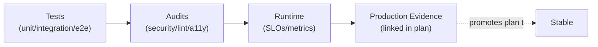

# Verification — Audits

> **Layer 5 — Verification.** Audits are linked from each plan's Verification
> table, never duplicated into the plan. This file indexes the audit surfaces.

---

## Audit surfaces

| Surface | Location | Cadence | Feeds |
|---------|----------|---------|-------|
| Security audit | `docs/audit_reports/round*_comments/` | per release | [P01](../plans/security/security-guardian.md) |
| Plan-lint audit | `scripts/governance/lint_plans.py` | per PR | [P11](../plans/governance/testing-quality.md) + [P12](../plans/governance/codebase-cleanup.md) |
| Dependency-graph audit | `lint_plans.py --check-graph` | per PR | [PLAN_REGISTRY](../plans/PLAN_REGISTRY.md) ↔ [PLAN_GRAPH](../plans/PLAN_GRAPH.md) |
| gitleaks / semgrep | CI | per commit | [P01](../plans/security/security-guardian.md) |
| a11y audit | Playwright + axe | per release | [P07](../plans/experience/frontend-evolution.md) |
| Deployment verification | canary metrics | per deploy | [P10](../plans/governance/deployment-safety.md) |

---

## The verification chain

A plan reaches **Stable** only when evidence from all four stages is linked in
its Verification table (see [PLAN_STATUS_LIFECYCLE.md](../plans/PLAN_STATUS_LIFECYCLE.md)).

---

## Existing audit inventory

The repo already has a rich audit history — **47 files** under
`docs/audit_reports/` (rounds 14–19). These are retained as evidence and linked
from the relevant plans. This patch does not move them; it points to them.

| Round | Location | Linked from |
|-------|----------|-------------|
| 14 | `docs/audit_reports/round14_comments/` | P01, P03 |
| 16 | `docs/audit_reports/round16_comments/` | P01, P03 |
| 17 | `docs/audit_reports/round17_comments/` | P02, P03, P08 |
| 19 | `docs/audit_reports/round19_comments/` | P01, P11 |

---

## Production checks

See [production-checks.md](./production-checks.md) for the runtime verification
surface (SLOs, dashboards, alert dry-runs).
