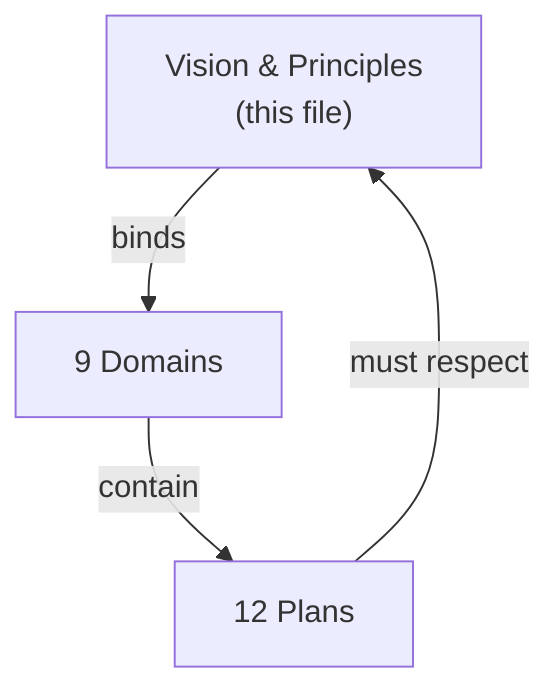

# SupremeAI Vision & Principles

> **Layer 1 — Direction.** This file answers *why* SupremeAI exists. It changes
> rarely. Every plan in the network must be consistent with these principles;
> if a plan contradicts them, the plan is wrong.

---

## Vision

SupremeAI is a **provider-neutral, self-evolving intelligence platform** that
runs on free-tier infrastructure, is guarded by humans, and is documented as a
**living network of plans** rather than a pile of files.

The product is not one app — it is a control tower (MCP), a reasoning core
(agents + memory), an automation surface (browser), and a human experience
(frontend), all governed by a single plan network.

---

## Principles (non-negotiable)

| # | Principle | What it means in practice | Enforced by |
|---|-----------|---------------------------|-------------|
| 1 | **Security-first** | Nothing ships without a trust boundary and audit trail. No secret in plaintext; no tool un-sandboxed. | [P01](../plans/security/security-guardian.md) |
| 2 | **Provider-neutral** | No hard dependency on OpenAI, Anthropic, Google, Render, or any single vendor. Swap must be a config change. | [P02](../plans/intelligence/provider-abstraction.md) |
| 3 | **Modular** | Domains are independently deployable and replaceable. A domain can be rewritten without touching the others. | [architecture/domains.md](../architecture/domains.md) |
| 4 | **Dynamic** | Zero-hardcode configuration. Everything is registry-driven; no value lives in code that could live in config. | [P08](../plans/infrastructure/infrastructure-optimization.md) |
| 5 | **Lean infrastructure** | Survive and thrive on free-tier compute. Pay for scale only when free-tier is provably exhausted. | [P08](../plans/infrastructure/infrastructure-optimization.md) |
| 6 | **AI-assisted** | Agents do the heavy lifting — coding, research, verification. The network self-evolves under human oversight. | [P04](../plans/agents/agent-orchestration.md) |
| 7 | **Human-controlled** | HITL approvals gate every high-risk action, especially anything with `target_scope: user_project`. | [P04](../plans/agents/agent-orchestration.md) + [P10](../plans/governance/deployment-safety.md) |

---

## Non-negotiables

These are lines that, if crossed, invalidate a plan regardless of its status:

1. **No customer data leaves the trust boundary** without an audited, HITL-approved path.
2. **No vendor lock-in** — a single provider outage must not take down the platform.
3. **No plan reaches Stable without linked evidence.** Status is earned, not declared.
4. **No new plan duplicates an existing one.** Extend, don't fork.
5. **No hardcode in code.** If a value can be config, it must be config.

---

## How principles bind to plans

If a plan's target state violates a principle, the plan is rejected at the
[Impact Map](../plans/IMPACT_MAP.md) intake — it never enters the registry.

---

## Source

This file supersedes the vision-level content previously scattered across
`docs/plans/vision_strategic_positioning.md` and
`docs/plans/HEAD_OF_PLANNING_STRATEGIC_LEVERAGE.md`. Those files are archived
with `superseded_by: vision-principles`.
