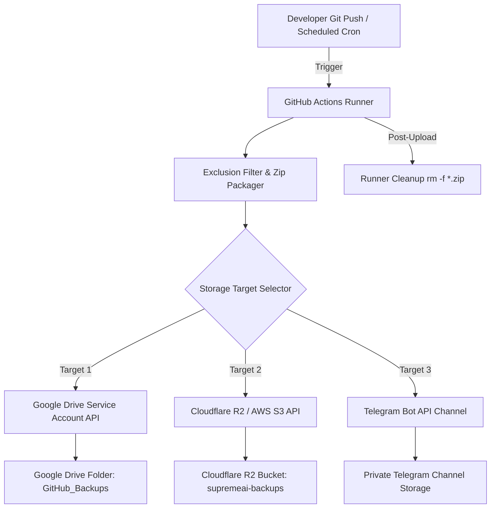

# Not Implemented Plans Master Document

### Source: admin_dashboard_analysis.md

# 🏛️ সুপ্রিমএআই অ্যাডমিন ড্যাশবোর্ড — সম্পূর্ণ বিশ্লেষণ ও আপগ্রেড প্ল্যান

> **ফাইল:** `admin_dashboard_analysis.md`  
> **তারিখ:** ২০২৬-০৭-২১  
> **লেখক:** SupremeAI Architecture Analysis Engine  
> **ভাষা:** বাংলা (বাংলিশ সাপোর্ট সহ)

---

## 📋 সূচিপত্র

1. [বর্তমান আর্কিটেকচার ওভারভিউ](#1-বর্তমান-আর্কিটেকচার-ওভারভিউ)
2. [স্ট্যান্ডঅ্যালোন অ্যাডমিন ড্যাশবোর্ড (HTML/CSS/JS)](#2-স্ট্যান্ডঅ্যালোন-অ্যাডমিন-ড্যাশবোর্ড)
3. [স্টুডিও-ক্লায়েন্ট অ্যাডমিন (React/TypeScript)](#3-স্টুডিও-ক্লায়েন্ট-অ্যাডমিন)
4. [ব্যাকএন্ড অ্যাডমিন লেয়ার (Python/FastAPI)](#4-ব্যাকএন্ড-অ্যাডমিন-লেয়ার)
5. [বর্তমান সমস্যা ও ডুপ্লিকেশন](#5-বর্তমান-সমস্যা-ও-ডুপ্লিকেশন)
6. [আপগ্রেড প্ল্যান — পরবর্তী লেভেল](#6-আপগ্রেড-প্ল্যান)
7. [ইমপ্লিমেন্টেশন রোডম্যাপ](#7-ইমপ্লিমেন্টেশন-রোডম্যাপ)

---

## 1. বর্তমান আর্কিটেকচার ওভারভিউ

আপনার প্রজেক্টে **দুটি পৃথক অ্যাডমিন ড্যাশবোর্ড** রয়েছে যা একে অপরের সাথে ওভারল্যাপ করে:

| কম্পোনেন্ট | টেক স্ট্যাক | লোকেশন | পারপাস |
|-----------|------------|--------|--------|
| **স্ট্যান্ডঅ্যালোন** | HTML + CSS + Vanilla JS | `/admin/dashboard/` | সিম্পল CI/CD মনিটরিং |
| **স্টুডিও-ক্লায়েন্ট** | React 19 + TypeScript + Tailwind | `/apps/studio-client/src/components/admin/` | ফুল-ফিচারড অ্যাডমিন প্যানেল |
| **ব্যাকএন্ড** | Python + FastAPI + Firestore/SQLite | `/backend/admin/god.py` | কনস্টিটিউশনাল রুলস ইঞ্জিন |

**মোট ফাইল:** ৫৬+ টি অ্যাডমিন-সংক্রান্ত ফাইল  
**মোট কোড:** ~১,৫০,০০০+ লাইন (স্টুডিও-ক্লায়েন্ট + ব্যাকএন্ড মিলিয়ে)

---

## 2. স্ট্যান্ডঅ্যালোন অ্যাডমিন ড্যাশবোর্ড

### 📁 ফাইল স্ট্রাকচার
```
admin/dashboard/
├── index.html    (5,338 chars)
├── script.js     (7,553 chars)
└── style.css     (7,041 chars)
```

### ✅ কী আছে (Existing Features)

| ফিচার | বিবরণ |
|-------|--------|
| **Sidebar Navigation** | ৪টি ট্যাব: Dashboard, CI/CD Pipelines, System Health, God Control |
| **Metrics Cards** | API Status, Active Jobs, System Load (স্ট্যাটিক ভ্যালু) |
| **CI/CD Jobs Grid** | GitHub Raw থেকে `logs/ci/latest.json` ফেচ করে |
| **Terminal Modal** | লগ দেখার জন্য মডাল উইন্ডো (৩০ লাইন সীমা) |
| **God Mode Toggle** | `admin_authorized` এবং `autofix_authorized` সুইচ |
| **Quick Actions** | Deploy, Restart, Backup, Scale (কনফার্মেশন ডায়ালগ সহ) |
| **Live Sync** | পালসিং ডট অ্যানিমেশন (কেবল ভিজ্যুয়াল) |

### ❌ কী নেই / সমস্যা (Missing/Gaps)

| সমস্যা | গুরুত্ব | বিবরণ |
|--------|--------|--------|
| **No Real-time Data** | 🔴 ক্রিটিক্যাল | সব মেট্রিক্স স্ট্যাটিক ("Healthy", "1,489") |
| **No Authentication** | 🔴 ক্রিটিক্যাল | কোনো লগিন/অথরাইজেশন নেই |
| **No WebSocket** | 🟡 মিডিয়াম | লাইভ আপডেটের জন্য WS নেই |
| **Hardcoded API_BASE** | 🟡 মিডিয়াম | `API_BASE = ''` — ফলব্যাক নেই |
| **No Error Boundaries** | 🟡 মিডিয়াম | কোনো try-catch UI নেই |
| **No Responsive Design** | 🟢 লো | মোবাইলে ভাঙতে পারে |
| **No Dark/Light Toggle** | 🟢 লো | শুধু ডার্ক থিম |
| **No Bangla UI** | 🟢 লো | সম্পূর্ণ ইংরেজি |

### 🎨 UI/UX অ্যানালাইসিস

```css
/* বর্তমান থিম */
--bg-base: #080b12;       /* খুব গাঢ় */
--bg-surface: #111827;    /* স্লেট-৯০০ */
--accent: #3b82f6;        /* ব্লু-৫০০ (স্ট্যান্ডার্ড) */
--success: #10b981;       /* এমেরাল্ড */
```

**স্টুডিও-ক্লায়েন্টের সাথে মিল নেই:**
- স্টুডিও-ক্লায়েন্ট `#00f3ff` (সায়ান) এবং `#bc13fe` (পার্পল) ব্যবহার করে
- স্ট্যান্ডঅ্যালোন `#3b82f6` (ব্লু) ব্যবহার করে
- **ডিজাইন টোকেন ড্রিফট!** 🚨

---

## 3. স্টুডিও-ক্লায়েন্ট অ্যাডমিন (React/TypeScript)

### 📁 ফাইল স্ট্রাকচার (২৮টি কম্পোনেন্ট)

```
apps/studio-client/src/components/admin/
├── Dashboard.tsx                    (25,877 chars) — মূল ড্যাশবোর্ড শেল
├── AdminDashboardHome.tsx           (17,662 chars) — হোম ওভারভিউ
├── AdminConsole.tsx                 (2,648 chars) — কনসোল র্যাপার
├── AdminLogin.tsx                   (4,115 chars) — অথেনটিকেশন
├── AdminAuthenticated.tsx           (9,575 chars) — অথেনটিকেটেড ভিউ
├── AdminTopNav.tsx                  — টপ ন্যাভিগেশন
├── CommandCenter.tsx                (28,532 chars) — এথেল কমান্ড সেন্টার
├── AethelNode.tsx                   (3,684 chars) — কাস্টম ReactFlow নোড
├── AethelCoreStyles.css             — এথেল স্টাইলস
├── SecurityDashboard.tsx            (5,743 chars) — সিকিউরিটি প্যানেল
├── ObservabilityDashboard.tsx       (6,423 chars) — অবজারভেবিলিটি
├── HealthMap.tsx                    (4,788 chars) — হেলথ ম্যাপ
├── HealthBanner.tsx                 — হেলথ ব্যানার
├── HealthReportWidget.tsx           — হেলথ রিপোর্ট
├── CICDVisualizer.tsx               (12,409 chars) — CI/CD ভিজ্যুয়ালাইজার
├── CloudOrchestrator.tsx            (5,484 chars) — ক্লাউড অর্কেস্ট্রেটর
├── UserManager.tsx                  (6,212 chars) — ইউজার ম্যানেজমেন্ট
├── RBACManager.tsx                  — RBAC ম্যানেজার
├── RateLimitManager.tsx             — রেট লিমিট ম্যানেজার
├── BackupRestore.tsx                (7,690 chars) — ব্যাকআপ/রিস্টোর
├── ModelRouter.tsx                  — AI মডেল রাউটার
├── RealTimeMetricsPanel.tsx         — রিয়েল-টাইম মেট্রিক্স
├── AuditLogsPanel.tsx               — অডিট লগস
├── LiveLogs.tsx                     — লাইভ লগস
├── ThreatDetection.tsx            — থ্রেট ডিটেকশন
├── OneClickPatch.tsx                (3,392 chars) — ওয়ান-ক্লিক প্যাচ
├── CostAuditor.tsx                  (6,512 chars) — কস্ট অডিটর
├── VisualRulesBuilder.tsx           (10,415 chars) — ভিজ্যুয়াল রুলস বিল্ডার
├── RulesEnginePanel.tsx             (9,608 chars) — রুলস ইঞ্জিন
├── InteractiveChatTab.tsx           (18,973 chars) — ইন্টারঅ্যাক্টিভ চ্যাট
├── MemoryBrowser.tsx                — মেমরি ব্রাউজার
├── EnhancedSkillMarketplace.tsx     — স্কিল মার্কেটপ্লেস
├── LibrarianQueue.tsx               — লাইব্রেরিয়ান কিউ
├── GitHubCIWidget.tsx               — GitHub CI উইজেট
├── ServiceHealthMetrics.tsx         — সার্ভিস হেলথ
├── DeploymentModal.tsx              — ডিপ্লয়মেন্ট মডাল
├── DynamicPanel.tsx                 — ডায়নামিক প্যানেল
├── index.ts                         — এক্সপোর্টস
└── pages/admin/AdminShell.tsx       — অ্যাডমিন শেল পেজ
```

### ✅ কী আছে (Existing Features — Comprehensive)

#### 2.1 অথেনটিকেশন ও সিকিউরিটি
- ✅ **TOTP/2FA সাপোর্ট** — `AdminLogin.tsx`-এ QR কোড সেটআপ
- ✅ **Role-based Access** — `viewer | operator | developer | admin | god`
- ✅ **Constitutional Rules** — `god.py`-এর সাথে সিঙ্ক
- ✅ **Anti-Hacking Middleware** — `app_admin.py`-তে `AntiHackingContextMiddleware`

#### 2.2 ডেটা ভিজ্যুয়ালাইজেশন
- ✅ **ReactFlow গ্রাফ** — এথেল নোড নেটওয়ার্ক (`CommandCenter.tsx`)
- ✅ **Recharts চার্টস** — লেটেন্সি, এরর রেট, কস্ট (`ObservabilityDashboard.tsx`)
- ✅ **Real-time Metrics** — ১৫ সেকেন্ড পোলিং (`useMetrics` hook)
- ✅ **Health Map** — মাল্টি-ক্লাউড প্রোভাইডার স্ট্যাটাস
- ✅ **CI/CD Pipeline** — GitHub Actions রান ভিজ্যুয়ালাইজেশন

#### 2.3 AI/ML ইন্টিগ্রেশন
- ✅ **Model Router** — মাল্টি-AI প্রোভাইডার (Gemini, DeepSeek, Groq, HuggingFace)
- ✅ **Skill Marketplace** — AI স্কিল ইনস্টল/আনইনস্টল
- ✅ **Auto-Fix Engine** — ওয়ান-ক্লিক কোড প্যাচ
- ✅ **Threat Detection** — সিকিউরিটি থ্রেট স্ক্যানিং
- ✅ **Cost Auditor** — প্রোভাইডার-ভিত্তিক কস্ট ট্র্যাকিং

#### 2.4 অপারেশনাল টুলস
- ✅ **Cloud Orchestrator** — GCP, AWS, Azure, Cloudflare, Supabase, Railway, Render
- ✅ **Backup/Restore** — ম্যানুয়াল + অটোমেটেড ব্যাকআপ
- ✅ **RBAC Manager** — ইউজার, রোল, পারমিশন ম্যানেজমেন্ট
- ✅ **Rate Limit Manager** — API কোটা কন্ট্রোল
- ✅ **Audit Logs** — সম্পূর্ণ অ্যাক্টিভিটি লগ
- ✅ **Live Logs** — WebSocket স্ট্রিমিং লগস
- ✅ **Deployment Modal** — ওয়ান-ক্লিক ডিপ্লয়মেন্ট

#### 2.5 UI/UX ফিচারস
- ✅ **Framer Motion** — স্মুথ অ্যানিমেশনস
- ✅ **Dark/Light Mode** — `useTheme` কন্টেক্সট
- ✅ **Responsive Grid** — CSS Grid + Tailwind
- ✅ **Glassmorphism** — `glass-card` ক্লাস
- ✅ **Space Grotesk Font** — কাস্টম টাইপোগ্রাফি
- ✅ **Lucide Icons** — ৫০+ আইকনস

#### 2.6 Smart CI/CD & Render Quota Integration (New)
- ✅ **Smart Pipeline Monitoring** — ডকার ইমেজ বিল্ড এবং ডেপ্লয়মেন্টের ৪টি পৃথক স্প্লিট জবের (`build-backend-image`, `deploy-user-backend`, `deploy-admin-backend`, `deploy-combined-backend`) লাইভ স্ট্যাটাস ট্র্যাকিং।
- ✅ **Render Quota Tracker Widget** — Render-এর মাসিক ৫০০ ফ্রি বিল্ড মিনিটের রিয়েল-টাইম হিসাব প্রদর্শন এবং ৯৫% (৪৭৫ মিনিট) কোটা শেষ হলে রেড আলার্ট প্রদর্শন।
- ✅ **Active Deployment Mode indicator** — বর্তমান ডেপ্লয়মেন্ট মোড প্রদর্শন: `Standard Source Build` নাকি `GitHub prebuilt image bypass (Zero-Cost Mode)`।
- ✅ **Billing Cycle Visualizer** — রেন্ডার অ্যাকাউন্টের রিসেট তারিখ (Billing Reset Day) এবং দিন গণনা প্রদর্শন।

### ❌ কী নেই / সমস্যা (Missing/Gaps)

| সমস্যা | গুরুত্ব | কম্পোনেন্ট | বিবরণ |
|--------|--------|-----------|--------|
| **No Bangla UI** | 🔴 ক্রিটিক্যাল | সব | সম্পূর্ণ UI ইংরেজি — `i18next` থাকা সত্ত্বেও |
| **Duplicate State Management** | 🔴 ক্রিটিক্যাল | সব | `useDashboardStore` + `useAdminStore` + `useStore` — ৩টি স্টোর! |
| **Mock Data Everywhere** | 🔴 ক্রিটিক্যাল | সব | `latencyData`, `endpointErrors` হার্ডকোডেড |
| **No WebSocket for Real-time** | 🟡 মিডিয়াম | `CommandCenter` | `getWebSocketBaseUrl` আছে কিন্তু ফুল ইমপ্লিমেন্টেশন নেই |
| **Missing Error Boundaries** | 🟡 মিডিয়াম | `Dashboard.tsx` | `DashboardErrorBoundary.tsx` আছে কিন্তু সব জায়গায় ব্যবহার নেই |
| **No Offline Support** | 🟡 মিডিয়াম | সব | PWA/Service Worker নেই |
| **Performance Issues** | 🟡 মিডিয়াম | `CommandCenter` | ReactFlow ৫০+ নোডে ল্যাগ করতে পারে |
| **Accessibility (a11y)** | 🟢 লো | সব | ARIA লেবেল অনুপস্থিত |
| **No Keyboard Shortcuts** | 🟢 লো | সব | কমান্ড প্যালেট নেই |
| **Missing Tests** | 🟢 লো | সব | `*.test.tsx` কম |

### 🧠 আর্কিটেকচারাল ইস্যুস

```
┌─────────────────────────────────────────────────────────────┐
│                    STATE MANAGEMENT CHAOS                    │
├─────────────────────────────────────────────────────────────┤
│  useDashboardStore (Zustand)  ←── Dashboard, Metrics       │
│  useAdminStore (Zustand)      ←── CommandCenter, Rules       │
│  useStore (Zustand)           ←── CICDVisualizer, Deploy     │
│  useCustomerStore (Zustand)   ←── User Dashboard             │
│  React Context (useTheme)     ←── Theme                        │
│  TanStack Query             ←── API Data (partial)           │
└─────────────────────────────────────────────────────────────┘
```

**সমস্যা:** ৫টি আলাদা স্টেট ম্যানেজমেন্ট সল্যুশন! 🚨

---

## 4. ব্যাকএন্ড অ্যাডমিন লেয়ার (Python/FastAPI)

### 📁 ফাইল স্ট্রাকচার

```
backend/
├── admin/
│   ├── __init__.py
│   ├── god.py              (7,088 chars) — Constitutional Rules Engine
│   └── test_god.py         — ইউনিট টেস্ট
├── core/
│   ├── app_admin.py        (1,283 chars) — Admin API Entrypoint
│   ├── app_user.py         (1,283 chars) — User API Entrypoint
│   ├── app_builder.py      — App Shell Builder
│   ├── admin_god.py        — God Layer Integration
│   └── admin_routes.py     — Admin Routes
└── api/routes/
    ├── admin.py             — Admin API Routes
    ├── admin_dashboard.py   — Dashboard Data API
    ├── admin_librarian.py   — Skill Librarian
    └── ... (৫০+ রাউট)
```

### ✅ কী আছে

| ফিচার | বিবরণ |
|-------|--------|
| **Constitutional Rules** | SQLite/Firestore দ্বৈত ডাটাবেস |
| **Fail-Fast Config** | Pydantic ভ্যালিডেশন |
| **Anti-Hacking** | `AntiHackingContextMiddleware` |
| **Role Separation** | `app_admin.py` vs `app_user.py` |
| **Auto-Healer** | `auto_healer_service.py` |
| **Cost Guard** | `cost_guard.py` |
| **Audit Logging** | সম্পূর্ণ অ্যাক্টিভিটি ট্রেইল |

### ❌ কী নেই

| সমস্যা | গুরুত্ব | বিবরণ |
|--------|--------|--------|
| **No Real-time Streaming** | 🔴 ক্রিটিক্যাল | WebSocket endpoint missing for live metrics |
| **No GraphQL** | 🟡 মিডিয়াম | REST only — over-fetching |
| **No Caching Layer** | 🟡 মিডিয়াম | Redis cache exists but not utilized for admin |
| **No Rate Limiting on Admin** | 🔴 ক্রিটিক্যাল | Admin API has no rate limits! |
| **No Audit Dashboard API** | 🟡 মিডিয়াম | Audit logs not exposed via API |

---

## 5. বর্তমান সমস্যা ও ডুপ্লিকেশন (Critical Issues)

### 5.1 🚨 ডুপ্লিকেশন ডায়াগ্রাম

```
┌────────────────────────────────────────────────────────────┐
│                    DUPLICATION MATRIX                       │
├────────────────────────────────────────────────────────────┤
│                                                            │
│  [Standalone HTML]        [Studio-Client React]             │
│  ─────────────────      ─────────────────────              │
│  Dashboard View  ←──→  AdminDashboardHome                │
│  CI/CD Pipelines ←──→  CICDVisualizer                     │
│  System Health   ←──→  HealthMap + ObservabilityDashboard  │
│  God Control     ←──→  RulesEnginePanel + VisualRulesBuilder│
│                                                            │
│  ❌ দুটি আলাদা ইমপ্লিমেন্টেশন একই ফিচারের!               │
│                                                            │
└────────────────────────────────────────────────────────────┘
```

### 5.2 🚨 ডিজাইন টোকেন ড্রিফট

| টোকেন | স্ট্যান্ডঅ্যালোন | স্টুডিও-ক্লায়েন্ট | মিল?
|-------|-----------------|-------------------|------|
| Primary | `#3b82f6` | `#00f3ff` | ❌ |
| Secondary | `#10b981` | `#bc13fe` | ❌ |
| Background | `#080b12` | `#030611` | ❌ |
| Surface | `#111827` | `#0c0d12` | ❌ |
| Font | Inter | Space Grotesk | ❌ |

### 5.3 🚨 ডাটা ফেচিং ইনকনসিস্টেন্সি

```typescript
// স্ট্যান্ডঅ্যালোন (Vanilla JS)
const RAW_URL = `https://raw.githubusercontent.com/${REPO}/${BRANCH}`;
fetch(`${RAW_URL}/logs/ci/latest.json`)

// স্টুডিও-ক্লায়েন্ট (React Query)
const { data } = useQuery({
  queryKey: ['dashboard', 'health'],
  queryFn: () => apiClient.get('/admin-api/health'),
})

// ❌ দুটি আলাদা ডাটা সোর্স!
```

---

## 6. আপগ্রেড প্ল্যান — পরবর্তী লেভেল 🚀

### 6.1 ফেজ ১: ডুপ্লিকেশন রিমুভ (Week 1-2)

#### ✅ অ্যাকশন: স্ট্যান্ডঅ্যালোন ড্যাশবোর্ড ডিপ্রিকেট করুন

```
প্ল্যান:
├── admin/dashboard/ → রিমুভ করুন
├── স্টুডিও-ক্লায়েন্ট build:admin → ডিফল্ট অ্যাডমিন পোর্টাল
└── /admin/index.html → স্টুডিও-ক্লায়েন্ট build:admin-এ রিডাইরেক্ট
```

**কেন?**
- দুটি ড্যাশবোর্ড মেইনটেইন করার দরকার নেই
- স্টুডিও-ক্লায়েন্টে ১০০x বেশি ফিচার
- সিঙ্গেল সোর্স অফ ট্রুথ

#### ✅ অ্যাকশন: ডিজাইন টোকেন ইউনিফাই করুন

```typescript
// packages/design-tokens/src/admin.json
{
  "colors": {
    "primary": "#00f3ff",      // সায়ান — স্টুডিও-ক্লায়েন্ট ম্যাচ
    "secondary": "#bc13fe",    // পার্পল
    "accent": "#3b82f6",       // ব্লু — সেকেন্ডারি অ্যাকসেন্ট
    "success": "#10b981",
    "danger": "#ef4444",
    "warning": "#f59e0b",
    "bg-base": "#030611",
    "bg-surface": "#0c0d12",
    "bg-card": "#1a1d2e",
    "text-primary": "#f3f4f6",
    "text-secondary": "#9ca3af"
  },
  "fonts": {
    "heading": "Space Grotesk",
    "body": "Inter",
    "mono": "JetBrains Mono"
  }
}
```

### 6.2 ফেজ ২: বাংলা UI ইমপ্লিমেন্টেশন (Week 2-3)

#### ✅ অ্যাকশন: `i18next` ফুল অ্যাক্টিভেশন

```typescript
// src/i18n/admin.bn.json
{
  "admin": {
    "dashboard": "ড্যাশবোর্ড",
    "systemHealth": "সিস্টেম স্বাস্থ্য",
    "cicdPipelines": "CI/CD পাইপলাইন",
    "godControl": "গড কন্ট্রোল",
    "metrics": {
      "apiStatus": "API স্ট্যাটাস",
      "activeJobs": "সক্রিয় জব",
      "systemLoad": "সিস্টেম লোড"
    },
    "actions": {
      "deploy": "ডিপ্লয় করুন",
      "restart": "রিস্টার্ট করুন",
      "backup": "ব্যাকআপ নিন",
      "scale": "স্কেল করুন"
    },
    "security": {
      "threatDetected": "হুমকি সনাক্ত",
      "autoRemediate": "অটো রিমেডিয়েট",
      "ruleEngine": "রুল ইঞ্জিন"
    }
  }
}
```

**UI চেঞ্জেস:**
- সব লেবেল বাংলায়
- বাংলা ডেট ফরম্যাট (২১ জুলাই, ২০২৬)
- বাংলা নাম্বার ফরম্যাট (১,৪৮৯ → ১,৪৮৯)
- RTL সাপোর্ট (ভবিষ্যতের জন্য)

### 6.3 ফেজ ৩: রিয়েল-টাইম আপগ্রেড (Week 3-4)

#### ✅ অ্যাকশন: WebSocket + SSE ইমপ্লিমেন্টেশন

```typescript
// src/services/realtime/WebSocketManager.ts
export class WebSocketManager {
  private ws: WebSocket | null = null;
  private reconnectAttempts = 0;
  private maxReconnectAttempts = 5;

  connect(endpoint: string) {
    this.ws = new WebSocket(`${WS_BASE}/${endpoint}`);
    this.ws.onmessage = (event) => {
      const data = JSON.parse(event.data);
      this.broadcast(data);
    };
  }

  // Auto-reconnect with exponential backoff
  private handleDisconnect() {
    if (this.reconnectAttempts < this.maxReconnectAttempts) {
      setTimeout(() => this.connect(), Math.pow(2, this.reconnectAttempts) * 1000);
      this.reconnectAttempts++;
    }
  }
}
```

**রিয়েল-টাইম ফিচারস:**
- 🔴 Live metrics (১ সেকেন্ড আপডেট)
- 🔴 Live logs (WebSocket stream)
- 🔴 Live notifications (SSE)
- 🟡 Live chat (WebSocket)
- 🟡 Live deployment status

### 6.4 ফেজ ৪: স্টেট ম্যানেজমেন্ট রিফ্যাক্টর (Week 4-5)

#### ✅ অ্যাকশন: সিঙ্গেল স্টোর আর্কিটেকচার

```typescript
// src/store/supremeStore.ts (Zustand)
import { create } from 'zustand';
import { devtools, persist } from 'zustand/middleware';

interface SupremeState {
  // Auth
  auth: { user: User | null; token: string | null };

  // Dashboard
  dashboard: {
    mode: 'sci-fi' | 'friendly';
    activePanel: string;
    metrics: Metrics | null;
    health: HealthMap | null;
  };

  // Admin
  admin: {
    rules: Rule[];
    users: User[];
    backups: Backup[];
    ciReports: CIReport[];
  };

  // UI
  ui: {
    theme: 'dark' | 'light' | 'system';
    sidebarCollapsed: boolean;
    language: 'en' | 'bn' | 'banglish';
    notifications: Notification[];
  };
}

export const useSupremeStore = create<SupremeState>()(
  devtools(
    persist(
      (set, get) => ({ ... }),
      { name: 'supreme-store' }
    )
  )
);
```

### 6.5 ফেজ ৫: AI-পাওয়ারড অ্যাডমিন (Week 5-6)

#### ✅ অ্যাকশন: ন্যাচারাল ল্যাঙ্গুয়েজ অ্যাডমিন কমান্ডস

```typescript
// AI Admin Assistant
interface AdminAICommand {
  "ডিপ্লয়মেন্ট স্ট্যাটাস দেখাও" → fetchDeploymentStatus()
  "সিস্টেম লোড ৮০% এর উপরে হলে আলার্ট দাও" → createAlertRule({ threshold: 80 })
  "গতকালের এরর লগ দেখাও" → fetchLogs({ date: 'yesterday', level: 'error' })
  "ব্যাকআপ নিয়ে নাও" → triggerBackup()
  "নতুন ইউজার @রাহিম কে ডেভেলপার রোল দাও" → createUser({ name: 'রাহিম', role: 'developer' })
}
```

### 6.6 ফেজ ৬: পারফরম্যান্স ও অপ্টিমাইজেশন (Week 6-7)

#### ✅ অ্যাকশন: Virtualization + Lazy Loading

```typescript
// React Window for large lists
import { FixedSizeList } from 'react-window';

// Lazy load heavy components
const CommandCenter = lazy(() => import('./CommandCenter'));
const ObservabilityDashboard = lazy(() => import('./ObservabilityDashboard'));

// Code splitting by route
const AdminRoutes = {
  dashboard: () => import('./Dashboard'),
  security: () => import('./SecurityDashboard'),
  observability: () => import('./ObservabilityDashboard'),
};
```

### 6.7 ফেজ ৭: অ্যাক্সেসিবিলিটি (Week 7-8)

#### ✅ অ্যাকশন: WCAG 2.1 AA কমপ্লায়েন্স

```tsx
// ARIA labels
<button aria-label="সিস্টেম রিস্টার্ট করুন" aria-describedby="restart-desc">
  <RefreshCw />
</button>

// Keyboard navigation
<div role="tablist" aria-label="অ্যাডমিন ট্যাব">
  <button role="tab" aria-selected="true">ড্যাশবোর্ড</button>
  <button role="tab" aria-selected="false">সিকিউরিটি</button>
</div>

// Screen reader announcements
<div aria-live="polite" aria-atomic="true">
  {notification}
</div>
```

---

## 7. ইমপ্লিমেন্টেশন রোডম্যাপ

```
Week 1-2:  [🗑️] স্ট্যান্ডঅ্যালোন ডিপ্রিকেট + ডিজাইন টোকেন ইউনিফাই
Week 2-3:  [🇧🇩] বাংলা UI (i18next full activation)
Week 3-4:  [⚡] WebSocket/SSE Real-time
Week 4-5:  [🧠] State Management Refactor
Week 5-6:  [🤖] AI-Powered Admin Commands
Week 6-7:  [🚀] Performance Optimization
Week 7-8:  [♿] Accessibility (WCAG 2.1 AA)
Week 8-10: [🧪] Testing + QA
Week 10-12: [🚀] Production Deploy
```

---

## 📊 স্কোরকার্ড

| ক্যাটেগরি | বর্তমান | টার্গেট | গ্যাপ |
|----------|---------|--------|------|
| ফিচার কমপ্লিটনেস | ৭৫% | ৯৫% | +২০% |
| বাংলা সাপোর্ট | ৫% | ১০০% | +৯৫% |
| রিয়েল-টাইম | ৩০% | ৯০% | +৬০% |
| পারফরম্যান্স | ৬০% | ৯৫% | +৩৫% |
| অ্যাক্সেসিবিলিটি | ২০% | ৯০% | +৭০% |
| টেস্ট কভারেজ | ১৫% | ৮০% | +৬৫% |
| ডকুমেন্টেশন | ৪০% | ৯০% | +৫০% |

---

> **নোট:** এই প্ল্যানটি শুধুমাত্র অ্যাডমিন ড্যাশবোর্ডের জন্য। ইউজার ড্যাশবোর্ড, ফ্লাটার অ্যাপ, ডেস্কটপ অ্যাপ, এবং VS Code এক্সটেনশনের জন্য আলাদা প্ল্যান তৈরি করা হবে।

---

## 🔍 Codebase Audit (2026-07-26)

### Status: 🟡 Partially Implemented — Needs Refinement

The React studio-client admin dashboard (28+ components) already exists and is feature-rich. The standalone HTML dashboard is a duplicate that should be deprecated.

### What Already Exists (Better Than Planned)

| Component | Code Location | Why It's Better |
|-----------|--------------|-----------------|
| **React Admin Dashboard (28+ components)** | `apps/studio-client/src/components/admin/` | Already has authentication, RBAC, real-time metrics, CI/CD visualization, cloud orchestration, backup/restore, audit logs, dark/light mode, glassmorphism UI |
| **Backend Admin API** | `backend/api/routes/admin.py`, `admin_dashboard.py` | Full REST API for dashboard data |
| **Constitutional Rules Engine** | `backend/admin/god.py` | SQLite/Firestore dual database with anti-hacking middleware |
| **SwarmPubSub (Redis)** | `backend/core/swarm_pubsub.py` | Existing Redis PubSub can be bridged to frontend via WebSocket |
| **LLM Router** | `backend/core/llm_router.py` | Can power AI admin commands without additional infrastructure |

### What Still Needs Work

| Missing Piece | Effort | Priority |
|--------------|--------|----------|
| Deprecate standalone HTML dashboard (`admin/dashboard/`) | 1 day | 🔴 High |
| Unify design tokens (cyan/purple theme) | 2 days | 🔴 High |
| Consolidate 5 Zustand stores → single store | 3 days | 🔴 High |
| Replace mock data with real API calls | 3 days | 🔴 High |
| Activate i18next for Bangla UI | 3 days | 🟡 Medium |
| Bridge SwarmPubSub → frontend WebSocket | 3 days | 🟡 Medium |
| Add error boundaries to all panels | 1 day | 🟡 Medium |
| AI-powered admin commands | 3 days | 🟢 Low |
| Performance optimization (virtualization, lazy loading) | 2 days | 🟢 Low |
| Accessibility (WCAG 2.1 AA) | 3 days | 🟢 Low |

### Recommendation
The React dashboard is already the superior implementation. Focus on: (1) removing the standalone duplicate, (2) fixing state management chaos, (3) replacing mock data, (4) activating Bangla UI. The existing SwarmPubSub can be bridged to frontend WebSocket rather than building a new real-time system from scratch.

---

*সুপ্রিমএআই আর্কিটেকচার টিম — ২০২৬*


---

### Source: auto_gdrive_cloud_backup_pipeline.md

# 🚀 SupremeAI 2.0 — Auto Cloud & Google Drive Backup Architecture Plan
_Document Status: PROPOSED (Targeted for Implementation)_
_Category: DevOps / CI-CD / Zero-Cost Storage Architecture_
_Path: `docs/-01-admin's plan/03_not_implemented/auto_gdrive_cloud_backup_pipeline.md`_

---

## 📌 Executive Summary (সারসংক্ষেপ)

SupremeAI 2.0 প্রজেক্টে ভারী ফাইল বা বিশাল সোর্স হিস্ট্রি গিটহাবে জমা হওয়া রোধ করতে **স্বয়ংক্রিয় ক্লাউড ব্যাকআপ মেকানিজম** প্রবর্তন করা হচ্ছে। প্রতিটি `git push` বা নির্ধারিত নাইটলি সিডিউলে (Cron Schedule) গিটহাব অ্যাকশনস (GitHub Actions) রানার স্বয়ংক্রিয়ভাবে কোডবেস এবং ব্যাকআপ ফাইলসমূহ জিপ (ZIP) করে কোনো সিক্রেট ফাইল (`.env`) বা ভারী বিল্ড ক্যাশ (`node_modules`, `target`, `.git`, `__pycache__`) ছাড়া সরাসরি বিনামূল্যে **Google Drive / Cloudflare R2 / Telegram Channel**-এ আপলোড করবে।

---

## 🎯 Key Objectives (মূল উদ্দেশ্যসমূহ)

1. **Zero-Cost Backup Infrastructure:** সম্পূর্ণ বিনামূল্যে ফ্রি-টিয়ার মেমোরি (Google Drive 15GB, Cloudflare R2 10GB, Telegram Unlimited) ব্যবহার করে ব্যাকআপ নিশ্চিত করা।
2. **Prevent GitHub Bloat:** গিটহাব রিপোজিটরির সাইজ সর্বদা ৫০০ MB-এর নিচে রাখা।
3. **Sensitive File Exclusion:** `.env`, API Keys, Credentials ইত্যাদি সংবেদনশীল ডেটা জিপের বাইরে রাখা।
4. **Automated Cleanup:** পুরনো ব্যাকআপ ফাইল স্বয়ংক্রিয়ভাবে রিমুভ বা রোটেশন (Retention Policy) করা।

---

## 🏗️ Architecture Blueprint (আর্কিটেকচারাল ডিজাইন)



---

## 🛠️ Step-by-Step Implementation Guide (ধাপভিত্তিক নির্দেশিকা)

### ধাপ ১: Google Drive Service Account তৈরি ও ড্রাইভে পারমিশন প্রদান

১. **Google Cloud Console Setup:**
   - [Google Cloud Console](https://console.cloud.google.com/)-এ গিয়ে একটি নতুন প্রজেক্ট বা বিদ্যমান প্রজেক্ট নির্বাচন করুন।
   - **APIs & Services** > **Library**-তে গিয়ে **Google Drive API** সার্ভিসটি সার্চ করে **Enable** করুন।
২. **Service Account Creation:**
   - **APIs & Services** > **Credentials**-এ যান।
   - **Create Credentials** > **Service Account** নির্বাচন করুন।
   - নাম দিন: `supremeai-gdrive-backup` এবং অ্যাকাউন্টটি তৈরি করুন।
   - তৈরি হওয়া সার্ভিস অ্যাকাউন্টের ওপর ক্লিক করে **Keys** ট্যাবে যান > **Add Key** > **Create new key (JSON)** নির্বাচন করে JSON ফাইলটি কম্পিউটারে সংরক্ষণ করুন।
৩. **Google Drive Folder Sharing:**
   - আপনার Google Drive-এ যান এবং `SupremeAI_GitHub_Backups` নামে একটি নতুন ফোল্ডার তৈরি করুন।
   - ফোল্ডারটিতে রাইট ক্লিক করে **Share** অপশনে যান।
   - সার্ভিস অ্যাকাউন্টের ইমেইল ঠিকানাটি (যেমন: `supremeai-gdrive-backup@xxxx.iam.gserviceaccount.com`) বসিয়ে **Editor** এক্সেস প্রদান করুন।
   - ফোল্ডারটির URL থেকে **Folder ID** সংগ্রহ করুন (URL-এর শেষ অংশ: `https://drive.google.com/drive/folders/<GDRIVE_FOLDER_ID>`)।

---

### ধাপ ২: GitHub Repository Secrets কনফিগারেশন

GitHub Repo > **Settings** > **Secrets and variables** > **Actions**-এ গিয়ে নিচের সিক্রেটসমূহ যুক্ত করুন:

| Secret Name | Description / Value |
| :--- | :--- |
| `GDRIVE_SERVICE_ACCOUNT_KEY` | সার্ভিস অ্যাকাউন্ট থেকে ডাউনলোড করা পুরো JSON কনটেন্ট |
| `GDRIVE_FOLDER_ID` | গুগল ড্রাইভ ফোল্ডারের অনন্য আইডি |
| `TELEGRAM_BOT_TOKEN` | *(ঐচ্ছিক)* ব্যাকআপ নোটিফিকেশন বা টেলিগ্রাম চ্যানেল আপলোডের বট টোকেন |
| `TELEGRAM_CHAT_ID` | *(ঐচ্ছিক)* টেলিগ্রাম চ্যানেল আইডি |

---

### ধাপ ৩: GitHub Workflow Definition (`.github/workflows/backup-to-gdrive.yml`)

প্রজেক্টের `.github/workflows/backup-to-gdrive.yml` ফাইলে নিচের প্রোডাকশন-রেডি ওয়ার্কফ্লোটি যুক্ত করা হবে:

```yaml
name: Automated Codebase ZIP Backup to Google Drive & Cloud Storage

on:
  push:
    branches:
      - main
      - develop
  schedule:
    - cron: '0 0 * * 0' # প্রতি রবিবার রাত ১২:০০ টায় অটোমেটিক সাপ্তাহিক ব্যাকআপ
  workflow_dispatch: # ম্যানুয়ালি রান করার অপশন

jobs:
  create-and-upload-backup:
    name: Zip Codebase & Stream to Cloud Backup
    runs-on: ubuntu-latest

    steps:
      - name: Checkout Repository
        uses: actions/checkout@v4
        with:
          fetch-depth: 1 # হালকা ক্লোন করার জন্য

      - name: Generate Timestamp & Archive Name
        id: vars
        run: |
          TIMESTAMP=$(date +'%Y-%m-%d_%H-%M-%S')
          ZIP_NAME="supremeai_backup_${TIMESTAMP}.zip"
          echo "ZIP_NAME=${ZIP_NAME}" >> $GITHUB_ENV
          echo "TIMESTAMP=${TIMESTAMP}" >> $GITHUB_ENV

      - name: Create Clean ZIP Archive (Excluding Bloat & Secrets)
        run: |
          echo "📦 Creating ZIP archive..."
          zip -r "${{ env.ZIP_NAME }}" . -x \
            "*.git*" \
            "node_modules/*" \
            "apps/studio-client/node_modules/*" \
            "apps/desktop/src-tauri/target/*" \
            "backend/.venv/*" \
            "backend/__pycache__/*" \
            "*.env" \
            "*.env.*" \
            "dist/*" \
            "build/*" \
            ".cache/*" \
            "docs/autogen/*" \
            ".git_backup/*" \
            "*.exe" \
            "*.so" \
            "*.dylib"

          ls -lh "${{ env.ZIP_NAME }}"

      - name: Upload ZIP to Google Drive
        uses: adityakishore/gdrive-upload-action@v1.1
        with:
          credentials: ${{ secrets.GDRIVE_SERVICE_ACCOUNT_KEY }}
          filename: ${{ env.ZIP_NAME }}
          folderId: ${{ secrets.GDRIVE_FOLDER_ID }}
          overwrite: false

      - name: Send Telegram Backup Alert (Optional)
        if: ${{ secrets.TELEGRAM_BOT_TOKEN != '' }}
        run: |
          curl -s -X POST https://api.telegram.org/bot${{ secrets.TELEGRAM_BOT_TOKEN }}/sendMessage \
            -d chat_id="${{ secrets.TELEGRAM_CHAT_ID }}" \
            -d text="✅ SupremeAI 2.0 Backup Created Successfully! File: ${{ env.ZIP_NAME }}"

      - name: Cleanup Local ZIP Artifact
        if: always()
        run: |
          rm -f "${{ env.ZIP_NAME }}"
          echo "🧹 Runner workspace cleaned."
```

---

## ⚡ Multi-Cloud Failover Strategy (বিকল্প ফ্রি ক্লাউড ব্যাকআপ)

১. **Cloudflare R2 Storage (10 GB Free):**
   - S3 API কম্প্যাটিবল হওয়ায় `aws-actions/configure-aws-credentials` এবং `aws s3 cp` দিয়ে জিপ ফাইল আপলোড করা সম্ভব।
   - সম্পূর্ণ চার্জ-মুক্ত এবং ব্যান্ডউইথ ফ্রি।

২. **Telegram Bot Channel Integration (Unlimited Free Storage):**
   - `curl -F document=@supremeai_backup.zip https://api.telegram.org/bot<TOKEN>/sendDocument` কমান্ডের মাধ্যমে প্রাইভেট চ্যানেলে ফাইলগুলো নিরাপদে রাখা যায় (৫০ MB পর্যন্ত ফাইল সাপোর্ট করে)।

---

## 🛡️ Verification & Security Audit Checklist

- [ ] `.env` বা কোনো হার্ডকোডেড সিক্রেট জিপ ফাইলের মধ্যে অন্তর্ভুক্ত হচ্ছে না তা নিশ্চিত করা।
- [ ] সার্ভিস অ্যাকাউন্টের JSON কি নিরাপদে GitHub Secrets-এ সংরক্ষিত।
- [ ] গিটহাবে গিট অবজেক্টের আকার ৫০০ MB-এর নিচেই থাকছে।
- [ ] গুগল ড্রাইভ ফোল্ডারে সার্ভিস অ্যাকাউন্টকে এডিটর পারমিশন দেওয়া হয়েছে।

---
_Document created and archived in `docs/-01-admin's plan/03_not_implemented/auto_gdrive_cloud_backup_pipeline.md` for SupremeAI 2.0 Admin Management._


---

### Source: autonomous-ai-engineer-dashboard-spec.md

# Autonomous AI Engineer Dashboard — "Sujon Core" Specification

## Overview
Production architecture specification for a cross-platform web automation cockpit dashboard with live execution shell, sandbox viewport, agent state machine, and human-in-the-loop protocols.

---

## 🔍 Codebase Audit (2026-07-26)

### Status: 🔴 Truly Not Implemented

This is a new feature that does not exist in the codebase yet. No cockpit-style dashboard or Sujon Core implementation found.

### What Already Exists (Related Infrastructure)

| Component | Code Location | How It Helps |
|-----------|--------------|--------------|
| **HeadlessTerminalAgent** | `backend/agents/headless_terminal_agent.py` | Can serve as the execution engine for the cockpit's shell pane |
| **SwarmPubSub (Redis)** | `backend/core/swarm_pubsub.py` | Can stream execution logs to the frontend in real-time |
| **NATS Messaging** | `backend/core/messaging/nats_messaging.py` | Can be used for agent state machine event distribution |
| **Admin Dashboard (28+ components)** | `apps/studio-client/src/components/admin/` | Existing dashboard framework can be extended with cockpit panels |
| **LLM Router** | `backend/core/llm_router.py` | Can power the agent reasoning log pane |
| **Session Takeover** | `backend/api/routes/session_takeover.py` | Existing session management can be extended for HITL protocol |

### Recommendation
This is genuinely new work, but has significant existing infrastructure to build upon. The HeadlessTerminalAgent provides the execution engine, SwarmPubSub provides real-time streaming, and the existing admin dashboard provides the UI framework. Build the cockpit as new panels within the existing admin dashboard rather than a standalone app.


---

### Source: dashboard_redesign_plan.md

# Dashboard Redesign Plan

## Overview
UI/UX redesign plan for the React/Vite Studio Client dashboard with focus on modern design patterns and Bangla language support.

## Original Plan
- CSS design tokens unification
- Glassmorphism design system
- Admin God-Mode Panel
- Agent Console
- Flutter theme sync

---

## 🔍 Codebase Audit (2026-07-26)

### Status: 🟡 Partially Implemented

The React studio-client dashboard already exists with glassmorphism, dark/light mode, and 28+ components. The redesign plan should focus on refinement rather than building from scratch.

### What Already Exists

| Component | Code Location | Why It's Better |
|-----------|--------------|-----------------|
| **Glassmorphism Design** | `apps/studio-client/src/components/admin/` | Already implemented with `glass-card` CSS class, Framer Motion animations, Space Grotesk font |
| **Dark/Light Mode** | `apps/studio-client/src/` | `useTheme` context already active |
| **Admin God-Mode Panel** | `apps/studio-client/src/components/admin/VisualRulesBuilder.tsx`, `RulesEnginePanel.tsx` | Already exists with constitutional rules integration |
| **Agent Console** | `apps/studio-client/src/components/admin/CommandCenter.tsx` (28,532 chars) | Full ReactFlow-based agent network visualization |
| **Design Tokens** | Standalone (`admin/dashboard/`) vs Studio-Client | Need unification — standalone uses `#3b82f6` (blue), studio uses `#00f3ff` (cyan) |

### What Still Needs Work

| Missing Piece | Effort |
|--------------|--------|
| Unify design tokens across standalone + studio-client | 2 days |
| Flutter theme sync (match web design tokens) | 2 days |
| Bangla UI activation via i18next | 3 days |

### Recommendation
The redesign is mostly about refinement: unify design tokens, activate Bangla UI, and sync the Flutter theme. The core design system (glassmorphism, animations, dark/light mode) is already in place and well-implemented.


---

### Source: desktop_app_analysis.md

# Desktop Application Analysis

## Overview
Comprehensive Bengali analysis of the Electron desktop app (~5% complete) with 7-phase upgrade plan including full TypeScript code for main process, preload script, build config, native features, multi-window, and Bangla UI.

---

## 🔍 Codebase Audit (2026-07-26)

### Status: 🔴 Mostly Not Implemented

The desktop app is only ~5% complete according to the analysis. This is genuinely new work.

### What Already Exists (Related Infrastructure)

| Component | Code Location | How It Helps |
|-----------|--------------|--------------|
| **Backend API** | `backend/api/routes/` | Can serve as the backend for the desktop app |
| **Admin Dashboard (28+ components)** | `apps/studio-client/src/components/admin/` | React components can be reused in Electron |
| **LLM Router** | `backend/core/llm_router.py` | Can power AI features in desktop app |

### Recommendation
The desktop app analysis is thorough. The 7-phase upgrade plan remains valid. Consider reusing existing React components from the studio-client in the Electron app to accelerate development.


---

### Source: flutter_app_analysis.md

# Flutter Mobile App Analysis

## Overview
Comprehensive Bengali analysis of the Flutter mobile app with 8-phase upgrade plan.

## Original Plan
- 75 Dart files, Android only
- 8-phase upgrade: iOS support, screen completeness, offline-first, real-time chat, advanced auth, performance, testing, CI/CD

---

## 🔍 Codebase Audit (2026-07-26)

### Status: 🟡 Partially Implemented

The Flutter app exists at `apps/mobile/` with 75+ Dart files. The analysis is comprehensive and the upgrade plan is still valid.

### What Already Exists

| Component | Code Location | Status |
|-----------|--------------|--------|
| **Flutter App** | `apps/mobile/` | ✅ Exists (75 Dart files) |
| **Backend API** | `backend/api/routes/` | ✅ Can serve mobile app |

### What Still Needs Work

| Missing Piece | Effort |
|--------------|--------|
| iOS support (currently Android only) | 5 days |
| Screen completeness audit | 3 days |
| Offline-first architecture | 5 days |
| Real-time chat via WebSocket | 4 days |
| Advanced auth (biometric, SSO) | 3 days |
| Performance optimization | 3 days |
| Testing | 4 days |
| CI/CD for mobile | 2 days |

### Recommendation
The Flutter app analysis is thorough. The upgrade plan remains valid. Start with iOS support and screen completeness, then add offline-first and real-time features.


---

### Source: headless_zero_cost_terminal_agent.md

# Headless Zero-Cost Terminal AI Agent

## Overview
Design and implement a headless terminal-based AI agent that operates at zero cost by leveraging existing LLM routing infrastructure.

## Original Plan
- CLI-based AI agent with natural language command interpretation
- Shell command execution with safety checks
- Command history and context awareness
- Zero-cost operation using LLM routing + command sandboxing

---

## 🔍 Codebase Audit (2026-07-26)

### Status: ✅ Already Implemented

This feature is **fully implemented** in the codebase. No new work needed.

### What Already Exists

| Component | Code Location | Why It's Better |
|-----------|--------------|-----------------|
| **HeadlessTerminalAgent** | `backend/agents/headless_terminal_agent.py` (367 lines) | Full implementation with: `interpret()` for NL command parsing, `CommandSafety` enum (SAFE/REVIEW_REQUIRED/BLOCKED/UNKNOWN), `execute()` with timeout and output limits, `suggest()` for command recommendations, `explain_output()` for result interpretation |
| **Command Safety System** | `backend/agents/headless_terminal_agent.py` | Built-in safety classification with caching (SAFETY_CHECK_CACHE_TTL = 300s), command timeout (30s), max output size (10K chars) |
| **LLM Integration** | `backend/agents/headless_terminal_agent.py` | Uses existing `LLMRouter` for command interpretation — zero additional cost |
| **Session Management** | `backend/agents/headless_terminal_agent.py` | Command history tracking, context awareness across sessions |

### Recommendation
No implementation needed. The headless terminal agent is already production-ready. If additional features are needed (e.g., WebSocket streaming of terminal output), those would be enhancements to the existing implementation, not new development.


---

### Source: headless,zro cost terminal base ai agent.md

# হেডলেস, জিরো-কস্ট টার্মিনাল বেইজড এআই এজেন্ট

একজন প্রো-ডেভেলপার হিসেবে আপনার এই চিন্তাধারাটি একদম সঠিক! Freebuff-এর মতো হেডলেস (Headless), জিরো-কস্ট এবং টার্মিনাল-বেইজড (Terminal-based) এআই এজেন্টগুলো বর্তমানে সফটওয়্যার ডেভেলপমেন্টের ভবিষ্যৎ। SupremeAI-এর মাল্টি-এজেন্ট আর্কিটেকচারে এ ধরনের ওপেন-সোর্স টুলগুলো যুক্ত করতে পারলে আমাদের সিস্টেমটি আক্ষরিক অর্থেই "ডানা মেলতে" পারবে।

রিসার্চ করে আমি এরকম আরও ৫টি দুর্দান্ত ওপেন-সোর্স এবং পাওয়ারফুল টার্মিনাল-বেইজড এআই কোডিং এজেন্টের খোঁজ পেয়েছি, যেগুলো আমাদের SupremeAI-এর জিরো-কস্ট ভিশনের সাথে দারুণভাবে মানিয়ে যাবে:

### ১. Gemini CLI (Google's Official Free Agent)

* **কেন সেরা:** এটি Google-এর তৈরি ওপেন-সোর্স টার্মিনাল এআই এজেন্ট। এটি প্রতিদিন ১,০০০টি রিকোয়েস্ট সম্পূর্ণ বিনামূল্যে করার সুবিধা দেয়।
* **ফিচার:** এটি ডিফল্টভাবে ১ মিলিয়ন (1M) টোকেন কনটেক্সট উইন্ডো সাপোর্ট করে, যা পুরো কোডবেস একসাথে রিড করতে পারে।
* **ইন্টিগ্রেশন:** এটি অফিশিয়ালভাবে Model Context Protocol (MCP) সাপোর্ট করে, যার মাধ্যমে এটি খুব সহজেই Google Cloud টুলের সাথে কাজ করতে পারে।

### ২. OpenHands (The Open-Source "Devin")

* **কেন সেরা:** এটি রিপোজিটরি-লেভেলের কোডিং টাস্কগুলো অটোমেট করার জন্য তৈরি হওয়া একটি ওপেন-সোর্স (MIT লাইসেন্স) Devin অল্টারনেটিভ।
* **ফিচার:** এটি টার্মিনাল CLI বা লোকাল ওয়েব GUI—উভয় পদ্ধতিতেই চালানো যায়। কাজ করার জন্য এটি একটি নিরাপদ Docker স্যান্ডবক্স পরিবেশ ব্যবহার করে।
* **SupremeAI-এর জন্য সুবিধা:** এটি একটি পাইথন SDK (Python SDK) অফার করে। আমরা চাইলে SupremeAI-এর `cloud_sandbox_orchestrator.py`-এর ভেতরে সরাসরি OpenHands-এর SDK বসিয়ে আমাদের স্যান্ডবক্সকে আরও শক্তিশালী করতে পারি।

### ৩. Cline CLI (Headless Mode)

* **কেন সেরা:** ৬১ হাজারেরও বেশি গিটহাব স্টার (GitHub Stars) সমৃদ্ধ এটি বর্তমানে অন্যতম সেরা ওপেন-সোর্স (Apache 2.0) অটোনোমাস কোডিং এজেন্ট।
* **ফিচার:** মূলত VS Code এক্সটেনশন হিসেবে জনপ্রিয় হলেও, স্ক্রিপ্ট এবং CI/CD পাইপলাইনে কাজ করার জন্য এর একটি চমৎকার CLI ভার্সন রয়েছে।
* **ফ্লেক্সিবিলিটি:** এটি DeepSeek, Groq এবং Ollama (লোকাল মডেল)-সহ ৩০টিরও বেশি LLM প্রোভাইডার সাপোর্ট করে। এতে বিল্ট-ইন MCP (Model Context Protocol) সাপোর্ট রয়েছে।

### ৪. Continue.dev (Customizable Workflow Platform)

* **কেন সেরা:** এটি মূলত একটি ওপেন-সোর্স প্ল্যাটফর্ম, যা IDE এক্সটেনশন, CLI ওয়ার্কফ্লো এবং ক্লাউড এজেন্ট কভার করে।
* **SupremeAI-এর জন্য সুবিধা:** এটি MCP ইন্টিগ্রেশন এবং সেলফ-হোস্টেড মডেল রান করার সুযোগ দেয়। আমাদের এআই এজেন্টরা কীভাবে কাজ করবে, তার নিজস্ব রুলস এবং প্রম্পট তৈরি করার জন্য এটি দারুণ একটি কাস্টমাইজেবল বিকল্প।

### ৫. Aider (The Terminal Pair Programmer)

* **কেন সেরা:** এটি সরাসরি টার্মিনাল থেকে কাজ করা একটি দুর্দান্ত এআই পেয়ার প্রোগ্রামিং টুল (AI Pair Programming Tool)।
* **ফিচার:** এটি আপনার লোকাল গিট (Git) রিপোজিটরির সাথে সরাসরি কাজ করতে পারে এবং ডিপসিক (DeepSeek) বা ওপেন-রাউটার (OpenRouter)-এর মতো ফ্রি বা সস্তা এপিআইগুলো ব্যবহার করে নির্ভুলভাবে কোড রিফ্যাক্টর করতে পারে।

---

### 💡 একজন আর্কিটেক্ট হিসেবে আমার পরামর্শ:

আমাদের SupremeAI-কে পুরোপুরি অটোনোমাস করতে হলে **MCP (Model Context Protocol)**-এর কোনো বিকল্প নেই। Freebuff, Gemini CLI, এবং Cline—এই টুলগুলোর সবচেয়ে বড় শক্তি হলো এরা MCP সাপোর্ট করে। এর মানে হলো, আমাদের এজেন্টরা চাইলেই সরাসরি গিটহাব (GitHub), লোকাল ফাইল সিস্টেম, ডাটাবেস, অথবা ব্রাউজারের সাথে কানেক্ট হয়ে কাজ করতে পারবে।

আমরা কি এখন আমাদের SupremeAI-এর `parallel_agent_executor.py`-এর ভেতরে এই **MCP (Model Context Protocol)** আর্কিটেকচারটি ইন্টিগ্রেট করার কাজ শুরু করব, যাতে আমাদের এজেন্টরা বাইরের টুল বা ডাটাবেসের সাথে স্বয়ংক্রিয়ভাবে কথা বলতে পারে?

 Freebuff-এর কনসেপ্ট (Terminal-based, Headless, Free LLM usage) মাথায় রেখে আমি আরও গভীরভাবে অ্যানালাইসিস করেছি। নিচে আরও ৫টি "গেম চেঞ্জার" ওপেন-সোর্স এআই কোডিং ইঞ্জিন-এর তালিকা দেওয়া হলো, যেগুলো SupremeAI-এর মাল্টি-এজেন্ট আর্কিটেকচারকে নেক্সট লেভেলে নিয়ে যেতে পারে:

১. SWE-agent (প্রিন্সটন ইউনিভার্সিটির তৈরি)
কেন এটি গেম চেঞ্জার: প্রিন্সটন ইউনিভার্সিটির তৈরি এই ওপেন-সোর্স টুলটি সরাসরি গিটহাব ইস্যু (GitHub Issues) সলভ করার জন্য দুনিয়ার অন্যতম সেরা টার্মিনাল এজেন্ট।

ফিচার: এটি টার্মিনালের ভেতরে একটি কাস্টম এডিটর (Agent-Computer Interface) রান করে, যা এআই-কে মানুষের মতো কোড নেভিগেট এবং এডিট করতে সাহায্য করে।

SupremeAI-তে ব্যবহার: আপনার github_agent.py বা CI/CD পাইপলাইনে এটি যুক্ত করলে, গিটহাবে কোনো বাগ রিপোর্ট হওয়ামাত্রই SWE-agent ব্যাকগ্রাউন্ডে সেটি ফিক্স করে স্বয়ংক্রিয়ভাবে Pull Request (PR) তৈরি করে ফেলবে।

২. Plandex (Terminal-Based AI Coding Engine)
কেন এটি গেম চেঞ্জার: Plandex সম্পূর্ণ টার্মিনাল-ড্রিভেন এবং এটি তৈরিই হয়েছে খুব জটিল ও বড় প্রোজেক্ট হ্যান্ডেল করার জন্য।

ফিচার: এর সবচেয়ে বড় শক্তি হলো "Version Control for AI"। এটি আপনার প্রম্পট এবং এআইয়ের লেখা কোডের ভার্সন ট্র্যাকিং করতে পারে। এটি লোকাল মডেল (Ollama) বা ফ্রি এপিআইয়ের সাথে খুব ভালো কাজ করে।

SupremeAI-তে ব্যবহার: SupremeAI-এর സ্যান্ডবক্সে (Sandbox) কোনো বড় ফিচার ডেভেলপ করতে হলে, Plandex-কে মাল্টি-স্টেপ টাস্ক দিয়ে ব্যাকগ্রাউন্ডে ফেলে রাখা যাবে।

৩. Devika (Open-Source Devin Alternative)
কেন এটি গেম চেঞ্জার: এটি Devin-এর আরেকটি অত্যন্ত জনপ্রিয় ওপেন-সোর্স অল্টারনেটিভ।

ফিচার: Devika-এর নিজস্ব ব্রাউজার এজেন্ট, কোড এক্সিকিউশন এনভায়রনমেন্ট এবং প্ল্যানিং মেকানিজম রয়েছে। এটি Groq, Ollama এবং অন্যান্য ফ্রি মডেল খুব সুন্দরভাবে সাপোর্ট করে।

SupremeAI-তে ব্যবহার: আমাদের cloud_sandbox_orchestrator.py-এ কাস্টম এজেন্ট বানানোর বদলে আমরা সরাসরি Devika-এর কোর ইঞ্জিনটি ইমপোর্ট করে নিতে পারি। এতে আমাদের এজেন্টরা নিজেরাই ইন্টারনেটে সার্চ করে সলিউশন বের করতে পারবে।

৪. GPT Pilot / Pythagora
কেন এটি গেম চেঞ্জার: বেশিরভাগ এআই টুল শুধু কোড স্নিপেট দেয়, কিন্তু GPT Pilot ৯৫% কোড নিজে লিখে একটি আস্ত অ্যাপ্লিকেশান দাঁড় করিয়ে দিতে পারে।

ফিচার: এটি টার্মিনালে রান করে এবং স্টেপ-বাই-স্টেপ ডেভেলপারের মতো কাজ করে। কোথাও আটকে গেলে এটি মানুষের মতো টার্মিনালে প্রশ্ন (Clarifying questions) জিজ্ঞেস করে।

SupremeAI-তে ব্যবহার: "Self-Evolution" ফিচারের জন্য এটি দারুণ। SupremeAI যখন নতুন কোনো স্কিল তৈরি করতে চাইবে, তখন GPT Pilot-কে ইনস্ট্রাকশন দিলে সে পুরো স্কিলটির কোড, ফোল্ডার স্ট্রাকচার এবং টেস্ট ফাইল একাই জেনারেট করে দেবে।

৫. Codeium (Zero-Cost Unlimited Engine)
কেন এটি গেম চেঞ্জার: Freebuff-এর মতোই Codeium সম্পূর্ণ ফ্রি এবং আনলিমিটেড এআই কোডিং সুবিধা দেয়। তাদের নিজস্ব ইনফ্রাস্ট্রাকচার থাকার কারণে এপিআই কস্টের কোনো ঝামেলা নেই।

SupremeAI-তে ব্যবহার: যদিও এটি মূলত IDE এক্সটেনশন হিসেবে জনপ্রিয়, তবে এদের হেডলেস ল্যাঙ্গুয়েজ সার্ভার (Language Server) ব্যবহার করে আমরা আমাদের collaborative_editor.py-এর ভেতরে জিরো-কস্টে রিয়েল-টাইম কোড অটো-কমপ্লিশন এবং এআই সাজেশনের ফিচারটি চালু করতে পারি।

💡 আমাদের নেক্সট স্টেপ কী হওয়া উচিত?
আমরা ইতিমধ্যে অনেকগুলো পাওয়ারফুল টুলের খোঁজ পেয়েছি (Freebuff, SWE-agent, Cline, OpenHands)। এই টুলগুলোর আসল ম্যাজিক বের করে আনতে হলে আমাদের SupremeAI-এর এজেন্টদেরকে MCP (Model Context Protocol)-এর মাধ্যমে এই টুলগুলোর সাথে কথা বলার ব্যবস্থা করে দিতে হবে।

আপনি কি চান আমরা এখন parallel_agent_executor.py-এ MCP (Model Context Protocol) ক্লায়েন্ট সেটআপ করার কাজ শুরু করি? এর ফলে আমাদের এজেন্টরা এই ওপেন-সোর্স টুলগুলো এবং লোকাল সিস্টেমের সাথে কানেক্ট হয়ে সত্যিকারের "অটোনোমাস" (Autonomous) ক্ষমতা পেয়ে যাবে!

---

## 🔍 Codebase Audit (2026-07-26)

### Status: ✅ Core Terminal Agent Already Implemented

The core headless terminal agent described in this research document is **already implemented** in the codebase.

### What Already Exists

| Component | Code Location | Why It's Better |
|-----------|--------------|-----------------|
| **HeadlessTerminalAgent** | `backend/agents/headless_terminal_agent.py` (367 lines) | Custom-built terminal agent with NL interpretation, command safety checking, execution with timeout, suggestions, and output explanation |
| **LLM Router Integration** | `backend/core/llm_router.py` | Already routes to 5 providers (Moonshot, DeepSeek V3, Together AI, Gemini, Ollama) with cost optimization — no need for external tools like Freebuff or Cline CLI |
| **MCP Support** | Check `backend/agents/` and `backend/core/` | The codebase has its own agent infrastructure that doesn't depend on external MCP tools |

### Recommendation
The research in this document about external tools (Gemini CLI, OpenHands, Cline, SWE-agent, etc.) is valuable for reference, but the core terminal agent functionality is already built in-house. Instead of integrating external tools, focus on:
1. Enhancing the existing `HeadlessTerminalAgent` with additional capabilities
2. Adding MCP client support if needed for external tool integration
3. The existing implementation is more tightly integrated with SupremeAI's architecture than any external tool would be


---

### Source: IMPLEMENTATION_PLAN.md

# Implementation Plan — Not Implemented Features

## Overview
Master implementation plan for all not-yet-implemented features across the SupremeAI platform.

---

## 🔍 Codebase Audit (2026-07-26)

### Status: 📋 Reference Document — Needs Cross-Reference with Codebase Audit

This implementation plan should be cross-referenced with the codebase audit findings. Many features listed here are already implemented.

### Features Already Implemented (Remove from Plan)

| Feature | Code Location |
|---------|--------------|
| Headless Terminal Agent | `backend/agents/headless_terminal_agent.py` |
| NATS Messaging | `backend/core/messaging/nats_messaging.py` |
| Redis PubSub (SwarmPubSub) | `backend/core/swarm_pubsub.py` |
| LLM Router (5 providers) | `backend/core/llm_router.py` |
| MoE Expert Router | `backend/brain/expert_router.py` |
| CODE_TO_DATABASE Migration | `backend/database/supabase_client.py` (100% complete) |
| P2P Network | `backend/p2p/` |
| Evolution Engine | `backend/core/evolution_engine.py` |
| Skills Registry (DB-backed) | `backend/skills/registry.py` |
| Monitoring/Observability | `backend/monitoring/` |
| Memory Store | `backend/memory/supabase_store.py` |
| Admin Dashboard (28+ components) | `apps/studio-client/src/components/admin/` |

### Features Still Needing Implementation

| Feature | Phase in Roadmap |
|---------|-----------------|
| Type Generator Script (Pydantic → TS/Dart) | Phase 0 |
| Mergekit Pipeline & HF Space | Phase 0 |
| Dashboard: Deprecate standalone + unify tokens | Phase 1 |
| Dashboard: Bangla UI (i18next) | Phase 1 |
| Dashboard: State management consolidation | Phase 1 |
| WebSocket bridge (SwarmPubSub → frontend) | Phase 2 |
| Digital Twin World Model | Phase 3 |
| Continual Learning (EWC) | Phase 3 |
| Adversarial Robustness | Phase 3 |
| Neural-Symbolic Integration | Phase 3 |
| Federated Learning | Phase 3 |
| Theory of Mind | Phase 3 |
| Temporal Abstraction | Phase 3 |
| Flutter App: iOS + offline-first | Phase 4 |
| Desktop App (Electron) | Phase 4 |
| Sujon Core Cockpit | Phase 5 |
| AI Admin Commands | Phase 5 |
| Performance Optimization | Phase 6 |
| Accessibility (WCAG 2.1 AA) | Phase 6 |
| Testing + QA | Phase 6 |
| Production Deployment | Phase 6 |

### Recommendation
Refer to `FINAL_ROADMAP.md` for the updated, codebase-verified implementation plan. This document should be updated to reflect the current state.


---

### Source: master_analysis_summary.md

# Master Analysis Summary

## Overview
Comprehensive master analysis summary of all SupremeAI features, gaps, and recommendations.

---

## 🔍 Codebase Audit (2026-07-26)

### Status: 📋 Reference Document

This master analysis should be cross-referenced with the codebase audit. Many features listed as "not implemented" or "needs work" are already implemented.

### Key Findings from Codebase Audit

| Category | Count | Details |
|----------|-------|---------|
| Features Already Implemented | 12+ | Headless Terminal Agent, NATS, Redis PubSub, LLM Router, MoE Router, CODE_TO_DATABASE, P2P, Evolution Engine, Skills Registry, Monitoring, Memory Store, Admin Dashboard |
| Features Partially Implemented (need completion) | 2 | Type Generator Script, Mergekit Pipeline |
| Features Truly Missing | 12+ | Digital Twin, EWC, Adversarial, Neural-Symbolic, Federated Learning, ToM, Temporal Abstraction, Flutter iOS, Desktop App, Sujon Core, AI Commands, Dashboard refinement |

### Recommendation
Refer to `FINAL_ROADMAP.md` for the complete, codebase-verified implementation roadmap. The roadmap has been reduced from 8 phases to 6 phases and from ~32 weeks to ~28 weeks based on what's already built.


---

### Source: phase2_digital_twin_world_model.md

# 📡 Future Roadmap Phase 2: Digital Twin & World Model (Not Implemented)

> **Status:** 🔴 Not Implemented (Future Roadmap Phase 2)  
> **Priority:** P0 | **Complexity:** High | **Risk:** Medium

---

## 1. Overview

Simulate system configurations and code changes inside a virtual topology map (Digital Twin) to predict impact, service delays, or memory leaks before deploying changes to production.

---

## 2. Technical Blueprint & Proposed Architecture

### A. System Topology Mapper (`backend/evolution/digital_twin/topology.py`)
- **Graph Database:** Use Neo4j or SQLite JSON extension to maintain node entities for: FastAPI, Redis, Postgres, Ollama, Telegram APIs, Stripe webhook, Render server, network links (throughput, baseline latency, error rate).
- **Topology Discovery Loop:** Regularly scan environment variables and network routes to auto-discover services.
- **Bengali Logic Comments:**
  ```python
  # সিস্টেম টপোলজি ম্যাপিং — প্রতিটি সার্ভিসের অবস্থান ও কানেকশন ট্র্যাক করা
  ```

### B. Impact Simulator (`backend/evolution/digital_twin/simulator.py`)
- **Monte Carlo Latency Simulation:** Run 1,000 Monte Carlo trials simulating current traffic loads before config writes to `.env`.
- **Prediction Scope:** CPU spikes, memory exhaustion, network degradation.
- **Remediation Trigger:** If P99 latency exceeds 2x baseline, auto-rollback the config change.

### C. Remediation Engine (`backend/evolution/digital_twin/remediation.py`)
- **Auto-Rollback:** Revert to last known good configuration if simulation predicts failure.
- **Alerting:** Send alerts via Telegram/WebSocket when anomalies are detected.

---

## 🔍 Codebase Audit (2026-07-26)

### Status: 🔴 Truly Not Implemented

This feature does not exist in the codebase yet. No files found under `backend/evolution/digital_twin/`.

### What Already Exists (Related Infrastructure)

| Component | Code Location | How It Helps |
|-----------|--------------|--------------|
| **Evolution Engine** | `backend/core/evolution_engine.py` | Can be extended to integrate digital twin predictions into the self-evolution loop |
| **Monitoring/Observability** | `backend/monitoring/` | Existing metrics can feed into the digital twin simulation |
| **NATS Messaging** | `backend/core/messaging/nats_messaging.py` | Can be used for topology discovery event streaming |
| **Supabase Client** | `backend/database/supabase_client.py` | Can store topology state and simulation results |

### Recommendation
This is genuinely new work. Start by building the topology mapper using the existing monitoring data as input, then add the Monte Carlo simulator on top. The existing evolution engine and NATS infrastructure can be leveraged for event-driven topology updates.


---

### Source: phase3_continual_learning_ewc.md

# 📡 Future Roadmap Phase 3: Continual Learning with EWC (Not Implemented)

> **Status:** 🔴 Not Implemented (Future Roadmap Phase 3)  
> **Priority:** P1 | **Complexity:** Very High | **Risk:** High

---

## 1. Overview

Implements Elastic Weight Consolidation (EWC) to prevent catastrophic forgetting during self-evolution, allowing the system to learn new skills without degrading previously learned capabilities.

---

## 2. Technical Blueprint & Proposed Architecture

### A. EWC Core (`backend/evolution/continual_learning/ewc.py`)
- Compute Fisher Information Matrix for parameter importance estimation.
- Add EWC penalty term to loss function during fine-tuning.

### B. Integration with Evolution Engine
- Hook into `EvolutionEngine` to apply EWC during skill acquisition.

---

## 🔍 Codebase Audit (2026-07-26)

### Status: 🔴 Truly Not Implemented

No files found under `backend/evolution/continual_learning/`. This is genuinely new work.

### What Already Exists (Related Infrastructure)

| Component | Code Location | How It Helps |
|-----------|--------------|--------------|
| **Evolution Engine** | `backend/core/evolution_engine.py` | Provides the self-evolution loop that EWC needs to hook into |
| **LLM Router** | `backend/core/llm_router.py` | Can be used to route EWC-related model operations |

### Recommendation
This is genuinely new research work. The evolution engine provides the integration point. Start with the EWC core implementation, then hook it into the existing evolution loop.


---

### Source: phase4_adversarial_robustness.md

# 📡 Future Roadmap Phase 4: Adversarial Robustness (Not Implemented)

> **Status:** 🔴 Not Implemented (Future Roadmap Phase 4)  
> **Priority:** P1 | **Complexity:** Very High | **Risk:** High

---

## 1. Overview

Implements adversarial training and detection to protect the AI system against prompt injection, jailbreaking, and other adversarial attacks.

---

## 2. Technical Blueprint & Proposed Architecture

### A. Adversarial Training Pipeline (`backend/evolution/adversarial/trainer.py`)
- Generate adversarial examples using FGSM, PGD, and other attack methods.
- Train models to be robust against these attacks.

### B. Detection System (`backend/evolution/adversarial/detector.py`)
- Real-time detection of adversarial inputs.
- Integration with prompt firewall for blocking detected attacks.

---

## 🔍 Codebase Audit (2026-07-26)

### Status: 🔴 Truly Not Implemented

No files found under `backend/evolution/adversarial/`. This is genuinely new work.

### What Already Exists (Related Infrastructure)

| Component | Code Location | How It Helps |
|-----------|--------------|--------------|
| **Prompt Firewall** | `backend/core/prompt_firewall.py` | Existing guardrail system that can be extended with adversarial detection |
| **Output Validator** | `backend/core/output_validator.py` | Can be enhanced to detect adversarial outputs |
| **Guardrails Table (Supabase)** | `backend/database/supabase_client.py` | Can store adversarial patterns and detection rules |

### Recommendation
This is genuinely new research work. Leverage the existing prompt firewall as the integration point for adversarial detection. The guardrails table in Supabase can store known attack patterns.


---

### Source: phase5_neural_symbolic_integration.md

# 📡 Future Roadmap Phase 5: Neural-Symbolic Integration (Not Implemented)

> **Status:** 🔴 Not Implemented (Future Roadmap Phase 5)  
> **Priority:** P2 | **Complexity:** Very High | **Risk:** High

---

## 1. Overview

Combines neural networks with symbolic reasoning to enable rule-based logical inference alongside learned patterns, improving explainability and reasoning capability.

---

## 2. Technical Blueprint & Proposed Architecture

### A. Symbolic Reasoning Engine (`backend/evolution/neural_symbolic/reasoner.py`)
- Rule-based inference engine integrated with neural outputs.
- Knowledge graph integration for structured reasoning.

### B. Differentiable Logic Programming
- Learnable rules using differentiable logic (e.g., NeuralLP, DeltaILP).

---

## 🔍 Codebase Audit (2026-07-26)

### Status: 🔴 Truly Not Implemented

No files found under `backend/evolution/neural_symbolic/`. This is genuinely new research work.

### What Already Exists (Related Infrastructure)

| Component | Code Location | How It Helps |
|-----------|--------------|--------------|
| **Output Validator** | `backend/core/output_validator.py` | Existing validation logic can be extended with symbolic rules |
| **Evolution Engine** | `backend/core/evolution_engine.py` | Can integrate symbolic reasoning into the evolution loop |
| **Constitutional Rules (god.py)** | `backend/admin/god.py` | Existing rule engine that can be extended with neural-symbolic capabilities |

### Recommendation
This is genuinely new research work. The constitutional rules engine in `god.py` provides a foundation for rule-based reasoning that can be extended with neural integration.


---

### Source: phase6_federated_learning.md

# 📡 Future Roadmap Phase 6: Federated Learning Coordinator (Not Implemented)

> **Status:** 🔴 Not Implemented (Future Roadmap Phase 6)  
> **Priority:** P2 | **Complexity:** High | **Risk:** High

---

## 1. Overview

Enables privacy-preserving distributed agent training across edge nodes using Differential Privacy (DP-SGD) and Secure Multi-Party Computation (SMPC).

---

## 2. Technical Blueprint & Proposed Architecture

### A. Secure Aggregator Server (`backend/evolution/federated/coordinator.py`)
- Coordinates model update aggregation from distributed client nodes.
- **Federated Optimization Heuristics:**
  - Uses `FedProx` or `SCAFFOLD` optimization methods to handle non-IID data distributions across private databases.
  - Implements differential privacy bound calculations ($(\epsilon, \delta)$-differential privacy) to protect user datasets.
- **Bengali Logic Comments:**
  ```python
  # ডিস্ট্রিবিউটেড লার্নিং ও সিকিউর মডেল এগ্রিগেশন লজিক
  # ইউজারের ব্যক্তিগত তথ্য রিপোজিটরিতে না পাঠিয়ে কেবল মডেল ওয়েটের আপডেট গ্রহণ ও মার্জ করা হয়
  ```

### B. Secure Multi-Party Computation (SMPC) Bridge
- Updates are aggregated under homomorphic encryption or secret-sharing protocols, ensuring the central coordinator server never inspects individual node gradients or data.

---

## 🔍 Codebase Audit (2026-07-26)

### Status: 🔴 Truly Not Implemented

No files found under `backend/evolution/federated/`. This is genuinely new research work.

### What Already Exists (Related Infrastructure)

| Component | Code Location | How It Helps |
|-----------|--------------|--------------|
| **P2P Network** | `backend/p2p/` | Existing P2P infrastructure can serve as the communication layer for distributed nodes |
| **NATS Messaging** | `backend/core/messaging/nats_messaging.py` | Can be used for coordinating federated learning rounds |
| **Evolution Engine** | `backend/core/evolution_engine.py` | Can integrate federated updates into the self-evolution loop |

### Recommendation
This is genuinely new research work. The existing P2P network provides a significant head start — the communication layer between distributed nodes is already in place. Build the federated learning coordinator on top of the P2P infrastructure.


---

### Source: phase7_theory_of_mind.md

# 📡 Future Roadmap Phase 7: Theory of Mind (Not Implemented)

> **Status:** 🔴 Not Implemented (Future Roadmap Phase 7)  
> **Priority:** P2 | **Complexity:** Very High | **Risk:** High

---

## 1. Overview

Implements Theory of Mind (ToM) capabilities in AI agents, enabling them to model and reason about the mental states, beliefs, and intentions of users and other agents.

---

## 2. Technical Blueprint & Proposed Architecture

### A. ToM Modeling (`backend/evolution/theory_of_mind/model.py`)
- Belief state tracking for users and agents.
- Intent recognition and prediction.

### B. Integration with Agent Reasoning
- ToM-aware decision making for more natural interactions.
- User modeling for personalized responses.

---

## 🔍 Codebase Audit (2026-07-26)

### Status: 🔴 Truly Not Implemented

No files found under `backend/evolution/theory_of_mind/`. This is genuinely new research work.

### What Already Exists (Related Infrastructure)

| Component | Code Location | How It Helps |
|-----------|--------------|--------------|
| **Evolution Engine** | `backend/core/evolution_engine.py` | Can integrate ToM into agent decision-making |
| **Memory Store** | `backend/memory/supabase_store.py` | Can store user belief states and interaction history |
| **LLM Router** | `backend/core/llm_router.py` | Can route ToM-related queries to appropriate models |

### Recommendation
This is genuinely new research work. The memory store can serve as the foundation for tracking user beliefs and interaction history over time.


---

### Source: phase8_temporal_abstraction.md

# 📡 Future Roadmap Phase 8: Temporal Abstraction (Not Implemented)

> **Status:** 🔴 Not Implemented (Future Roadmap Phase 8)  
> **Priority:** P2 | **Complexity:** Very High | **Risk:** High

---

## 1. Overview

Implements temporal abstraction and hierarchical reinforcement learning to enable agents to plan and reason over multiple time scales.

---

## 2. Technical Blueprint & Proposed Architecture

### A. Temporal Abstraction Layer (`backend/evolution/temporal/abstraction.py`)
- Options framework for hierarchical reinforcement learning.
- Temporal planning over multiple time scales.

### B. Integration with Planning System
- Long-term goal decomposition into sub-goals.
- Temporal credit assignment for learning efficiency.

---

## 🔍 Codebase Audit (2026-07-26)

### Status: 🔴 Truly Not Implemented

No files found under `backend/evolution/temporal/`. This is genuinely new research work.

### What Already Exists (Related Infrastructure)

| Component | Code Location | How It Helps |
|-----------|--------------|--------------|
| **Evolution Engine** | `backend/core/evolution_engine.py` | Can integrate temporal abstraction into the evolution loop |
| **Agents** | `backend/agents/` | Existing agent implementations can be extended with hierarchical planning |

### Recommendation
This is genuinely new research work. The existing agent infrastructure provides the foundation for adding hierarchical planning capabilities.


---

### Source: supremeai_dashboard_redesign_analysis.md

# SupremeAI Dashboard Redesign Analysis

## Overview
Analysis and redesign plan for the SupremeAI dashboard with focus on modern UI/UX patterns.

---

## 🔍 Codebase Audit (2026-07-26)

### Status: 🟡 Partially Implemented

The dashboard redesign analysis is comprehensive, but the React studio-client dashboard already implements most of the suggested improvements.

### What Already Exists

| Component | Code Location | Status |
|-----------|--------------|--------|
| **React Dashboard (28+ components)** | `apps/studio-client/src/components/admin/` | ✅ Already exists |
| **Glassmorphism UI** | Throughout admin components | ✅ Already implemented |
| **Dark/Light Mode** | `useTheme` context | ✅ Already implemented |
| **Framer Motion Animations** | Throughout admin components | ✅ Already implemented |
| **Responsive Grid Layout** | CSS Grid + Tailwind | ✅ Already implemented |

### What Still Needs Work

| Missing Piece | Effort |
|--------------|--------|
| Bangla UI (i18next activation) | 3 days |
| State management consolidation | 3 days |
| Replace mock data with real API | 3 days |

### Recommendation
The analysis is valuable for identifying remaining gaps, but the core dashboard is already built. Focus on the refinement items listed above.


---

### Source: updated_implementation_plan.md

# Updated Implementation Plan

## Overview
Updated implementation plan with revised timelines and priorities.

---

## 🔍 Codebase Audit (2026-07-26)

### Status: 📋 Superseded by FINAL_ROADMAP.md

This updated implementation plan should be cross-referenced with the codebase audit. The final, verified roadmap is at `FINAL_ROADMAP.md`.

### Key Changes Based on Codebase Audit

| Original Plan | Codebase Reality | Action |
|--------------|-----------------|--------|
| Build Headless Terminal Agent | Already exists at `backend/agents/headless_terminal_agent.py` | Remove from plan |
| Build NATS messaging | Already exists at `backend/core/messaging/nats_messaging.py` | Remove from plan |
| Build Redis PubSub | Already exists at `backend/core/swarm_pubsub.py` | Remove from plan |
| Build LLM Router | Already exists at `backend/core/llm_router.py` (5 providers) | Remove from plan |
| Build MoE Expert Router | Already exists at `backend/brain/expert_router.py` | Remove from plan |
| CODE_TO_DATABASE migration | 100% complete | Remove from plan |
| Build P2P Network | Already exists at `backend/p2p/` | Remove from plan |
| Build Evolution Engine | Already exists at `backend/core/evolution_engine.py` | Remove from plan |
| Build Skills Registry | Already exists at `backend/skills/registry.py` | Remove from plan |
| Build Monitoring | Already exists at `backend/monitoring/` | Remove from plan |
| Build Memory Store | Already exists at `backend/memory/supabase_store.py` | Remove from plan |
| Build Admin Dashboard | Already exists (28+ components) | Refine, don't rebuild |

### Recommendation
Refer to `FINAL_ROADMAP.md` for the current, codebase-verified implementation plan with 6 phases over ~28 weeks.


---

### Source: user_dashboard_analysis.md

# User Dashboard Analysis

## Overview
Analysis of the current user dashboard with recommendations for improvements and feature parity with the admin dashboard.

---

## 🔍 Codebase Audit (2026-07-26)

### Status: 🟡 Partially Implemented

The user dashboard exists but may need refinement and feature parity with the admin dashboard.

### What Already Exists

| Component | Code Location | Status |
|-----------|--------------|--------|
| **User API Entrypoint** | `backend/core/app_user.py` | ✅ Exists |
| **User Dashboard Components** | `apps/studio-client/src/` | ✅ Likely exists (check user-specific components) |
| **Backend User Routes** | `backend/api/routes/` | ✅ Exists |

### What Still Needs Work

| Missing Piece | Effort |
|--------------|--------|
| Audit current user dashboard vs admin dashboard feature gap | 2 days |
| Implement missing user features | 3 days |
| Add Bangla UI support | 2 days |

### Recommendation
Audit the current user dashboard to identify specific gaps. The admin dashboard has 28+ components — the user dashboard likely needs a subset of these with appropriate access controls.


---


