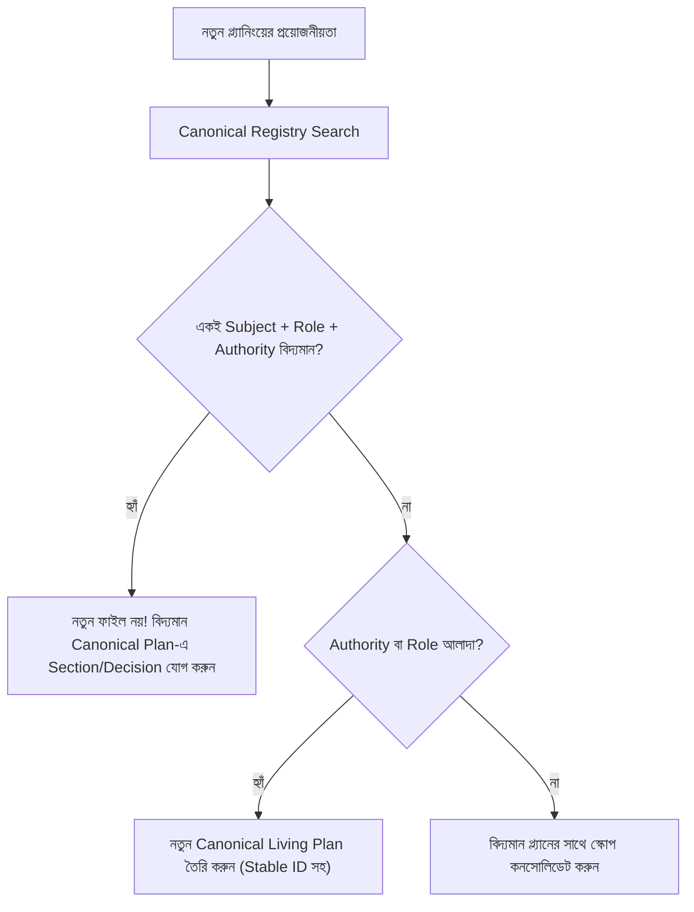
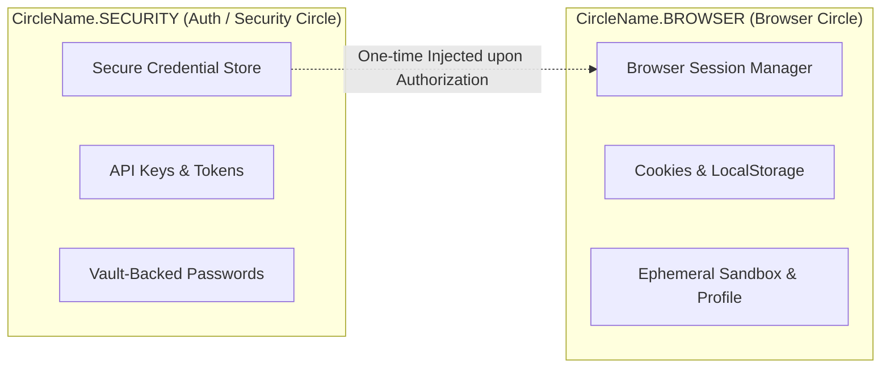

# Canonical Planning, Reconciliation, Evidence Lifecycle and Automated Guardrails

> **Language:** বাংলা + প্রয়োজনীয় English Identifiers  
> **Status:** ACTIVE / CANONICAL GOVERNANCE PLAN  
> **Created:** 2026-09-17 | **Updated:** 2026-09-17  
> **Owner Circle:** Architecture Governance / Planning Circle  
> **Source of Truth Reference:** `docs/plans/PLAN_LIFECYCLE_POLICY.md`

---

## ১. Revised Core Rule

### "One Distinct Subject + One Planning Authority = One Canonical Living Plan"

একটি canonical plan কেবল তখনই তৈরি হবে যখন:
1. বিষয়টি একটি **distinct subject / capability / policy / initiative**;
2. তার জন্য একটি নির্দিষ্ট **planning authority** বা owner circle আছে;
3. সেই plan-এর scope, decision boundary এবং evidence boundary সম্পূর্ণ পরিষ্কার;
4. অন্য কোনো canonical plan-এর দায়িত্ব ও সিদ্ধান্ত অকারণে পুনরাবৃত্তি (duplicate) করছে না।

> [!IMPORTANT]
> এটি কোনো **"একটি বিশাল মনোলিথিক মাস্টার প্ল্যান"** তৈরির নিয়ম নয়। একটি প্ল্যানের ভিতরে evolution ও stages থাকবে, কিন্তু ভিন্ন document role বা ভিন্ন planning authority-কে জোর করে একই ফাইলে মেলানো যাবে না।

### Document Role-এর সুস্পষ্ট পৃথকীকরণ (Separation of Concerns)

ডকুমেন্টের উদ্দেশ্য ও স্থায়িত্ব অনুযায়ী নিচের Role-গুলো আলাদা document হিসেবে থাকবে:

| Document Role | সংজ্ঞা ও পরিধি | স্থায়িত্ব (Lifetime) |
|---|---|---|
| **Architecture** | System boundary, components, contracts, interfaces, invariants | দীর্ঘস্থায়ী (Long-lived) |
| **Roadmap** | Prioritized outcomes, milestones, sequencing, dependencies | মধ্যমমেয়াদী (Quarterly/Release) |
| **Implementation** | Actionable code, PR tasks, test matrix, configuration | স্বল্পমেয়াদী (Sprint/Task-based) |
| **Policy** | Rules, security limits, authorization, compliance, guardrails | সার্বজনীন ও অপরিবর্তনীয় নিয়ম |
| **Audit / Reconciliation** | Evidence records, conflicts, file disposition, historical lineage | হিস্টোরিক্যাল এভিডেন্স লগ |

একই subject-এ একাধিক role থাকা duplicate নয়; duplicate কেবল তখনই হবে যখন একই role, একই subject এবং একই planning authority-র অধীনে একাধিক প্রতিযোগী (competing) ফাইল বিদ্যমান থাকে।

---

## ২. Current Repository Reality এবং Correction

রিপোজিটরিতে ইতিমধ্যে বিদ্যমান ভিত্তিপ্রস্তরসমূহ:
- [`docs/plans/PLAN_LIFECYCLE_POLICY.md`](file:///f:/supremeai/docs/plans/PLAN_LIFECYCLE_POLICY.md)
- [`docs/plans/PLAN_TO_CODE_TRACEABILITY_MATRIX.md`](file:///f:/supremeai/docs/plans/PLAN_TO_CODE_TRACEABILITY_MATRIX.md)
- [`docs/plans/phases/plan_reconciliation_register.md`](file:///f:/supremeai/docs/plans/phases/plan_reconciliation_register.md)
- [`docs/plans/phases/file_disposition_and_retention_list.md`](file:///f:/supremeai/docs/plans/phases/file_disposition_and_retention_list.md)
- ডোমেইন ফোল্ডারসমূহ: `architecture/`, `features/`, `infrastructure/`, `design/`, `phases/`

### সংশোধিত সিদ্ধান্তসমূহ (Corrected Posture):

1. **Mass Move / Rename সম্পূর্ণ নিষিদ্ধ:** সত্য উদ্ঘাটন (discovery) এবং রেফারেন্স ম্যাপিং শেষ না হওয়া পর্যন্ত কোনো ফাইল সরানো বা রিনেম করা যাবে না।
2. **Naming-ভিত্তিক Versioning নিষিদ্ধ:** ফাইলে `v2`, `v3`, `final`, `new`, `latest` নাম দিয়ে ফাইল ক্লোন করা যাবে না। সকল পরিবর্তন একই লিভিং প্ল্যানের `evolution` সেকশনে যাবে।
3. **Folder দিয়ে Lifecycle প্রকাশ নয়:** ফোল্ডার (যেমন `active/`, `completed/`) দিয়ে নয়, ফাইলের **YAML Frontmatter Status** দিয়ে ডকুমেন্টের অবস্থা নির্ধারিত হবে।
4. **Family Index ঐচ্ছিক:** প্রতিটি সাব-ফোল্ডারে অন্ধভাবে `family_index.md` তৈরি করা হবে না; কেবল যেখানে একাধিক সংশ্লিষ্ট ডকুমেন্ট নেভিগেশন প্রয়োজন, সেখানে থাকবে।
5. **Archive কোনো Active Planning নয়:** আর্কাইভ কেবল হিস্টোরিক্যাল লিনিয়েজ ও এভিডেন্স প্রিজার্ভেশনের জন্য।
6. **Strict Evidence Requirement:** বাস্তব কোড, টেস্ট বা রানটাইম মেজারমেন্ট না পাওয়া পর্যন্ত কোনো ইমপ্লিমেন্টেশন, আপটাইম বা পারফরম্যান্স ক্লেইম করা যাবে না।
7. **Browser Scope Decoupling:** Browser Credential Persistence এবং Browser Session Persistence আলাদা ক্যাপাবিলিটি ও সিকিউরিটি বাউন্ডারিতে মডেল হবে।

---

## ৩. Canonical Plan Registry Model

প্রতিটি প্ল্যানে স্ট্যান্ডার্ড YAML Frontmatter থাকবে, যা থেকে অটোমেটেড টুলস বা রেজিস্ট্রি তৈরি হবে:

| Field | প্রকার | অর্থ ও উদ্দেশ্য |
|---|---|---|
| `id` | `string` | Stable unique identifier (e.g. `browser-automation-core-2026`) |
| `subject` | `string` | Distinct subject / capability / system |
| `document_role` | `enum` | `architecture` \| `roadmap` \| `implementation` \| `policy` \| `audit` |
| `planning_authority`| `string` | Owner Circle (e.g. `CircleName.BROWSER`, `Planning Circle`) |
| `canonical` | `boolean` | `true` \| `false` \| `candidate` |
| `status` | `enum` | `proposed` \| `active` \| `blocked` \| `complete` \| `superseded` \| `historical` |
| `source_file` | `path` | বর্তমান রিপোজিটরি পাথ (`docs/plans/...`) |
| `supersedes` | `list[path]`| যে পূর্ববর্তী ফাইলগুলোকে প্রতিস্থাপন করেছে |
| `superseded_by` | `list[path]`| যে নতুন ফাইল দ্বারা প্রতিস্থাপিত হয়েছে |
| `evidence_state` | `enum` | `verified` \| `partial` \| `unverified` |
| `last_verified` | `date` | সর্বশেষ এভিডেন্স যাচাইয়ের তারিখ (`YYYY-MM-DD`) |
| `disposition` | `enum` | `retain` \| `merge` \| `archive` \| `redirect` \| `delete-approved` |

> [!NOTE]
> রেজিস্ট্রি মূলত সার্চ, কনফ্লিক্ট ডিটেকশন এবং ডুপ্লিকেট রোধ করার মেকানিজম; এটি নিজে কোনো এক্সিকিউশন প্ল্যান নয়।

---

## ৪. "One Plan" কখন প্রযোজ্য এবং কখন নয়

### একই Canonical Plan-এ থাকবে:
- একই subject;
- একই planning authority / owner circle;
- একই decision boundary;
- একই primary outcome;
- একই lifecycle-এর বিভিন্ন স্তর (evolution/stages);
- ছোটখাটো design পরিবর্তন, পরিমিত সংশোধন ও future backlog।

### আলাদা Plan হবে:
- Authority বা Owner Circle আলাদা (যেমন Browser Circle vs Security Circle);
- Document Role আলাদা (যেমন Architecture vs Roadmap);
- Security / Policy সিদ্ধান্ত যা সাধারণ আর্কিটেকচার থেকে স্বাধীনভাবে পরিচালিত;
- Audit / Reconciliation যা কেবল এভিডেন্স রেকর্ড হিসেবে কাজ করে;
- আলাদা acceptance criteria, আলাদা risk model বা ভিন্ন approval path থাকলে।

---

## ৫. Evidence Discipline (এভিডেন্স শৃঙ্খলা)

প্ল্যানের প্রতিটি দাবি ৩ স্তরে শ্রেণীবদ্ধ থাকবে:
1. **Verified:** বাস্তব কোড, টেস্ট ফাইল বা রানটাইম মেট্রিক পাথ এবং যাচাইয়ের তারিখ সংযুক্ত।
2. **Partial:** কিছু আংশিক কোড/টেস্ট আছে, কিন্তু প্রোডাকশন কভারেজ বা ভ্যালিডেশন অসম্পূর্ণ।
3. **Planned / Unverified:** স্রেফ ডিজাইন বা প্রস্তাবনা।

### নিষিদ্ধ দাবি (Unverified Statements Ban):
সরাসরি কোড/টেস্ট এভিডেন্স লিংক ছাড়া কোনো ডকুমেন্টে নিচের শব্দগুলো নিশ্চিত হিসেবে লেখা নিষিদ্ধ:
- *"implemented"* / *"operational"*
- *"all modes operational"*
- *"8/8 tests passing"*
- *"99.2% uptime"*
- *"zero leaks"*
- *"P50/P95 latency achieved"*
- *"production deployed"*

প্রতিটি পরিমাপযোগ্য দাবির সাথে source path, test identifier, measurement window এবং evaluator কমান্ড উল্লেখ করতে হবে। প্রমাণ না থাকলে দাবিটি বাধ্যতামূলকভাবে `planned` বা `target` হিসেবে লিখতে হবে।

---

## ৬. Browser/Auth Scope Correction

Browser অটোমেশনের প্ল্যান তৈরির সময় নিচের প্রযুক্তিগত বিভাজন অক্ষুণ্ণ রাখতে হবে:

1. **Credential Persistence:** Token, password বা secret কোথায় এবং কীভাবে সংরক্ষিত (Security Vault-এর দায়িত্ব)।
2. **Browser Session Persistence:** Cookies, storage state, context ও profile কতক্ষণ কার্যকর থাকে (Browser Center-এর দায়িত্ব)।
3. **Session Modes:** Ephemeral session, User-provided-per-run credentials, এবং Authorized vault-backed credentials।
4. **Lifecycle:** সেশন এক্সপায়ারি, রেভোকেশন, লগআউট এবং স্যান্ডবক্স ক্লিনআপ।
5. **Zero-Abuse Boundary:** Unauthorized scraping, cookie theft, CAPTCHA bypass বা stealth attack সম্পূর্ণভাবে আউট-অব-স্কোপ।

---

## ৭. Execution Phases (বাস্তবায়ন পর্যায়)

### Phase 0 — Governance Baseline
- `PLAN_LIFECYCLE_POLICY.md`, traceability matrix, এবং reconciliation register-কে রেফারেন্স হিসেবে নিশ্চিত করা।
- স্ট্যাটাস শব্দভাণ্ডার (`proposed`, `active`, `blocked`, `complete`, `superseded`, `historical`) সমন্বয় করা।

### Phase 1 — Repository-backed Inventory
- `docs/plans/`-এর সকল Markdown ফাইল স্ক্যান করা।
- ফাইলের নাম নয়, ভেতরের কন্টেন্ট ও মেটাডাটা বিশ্লেষণ করে ডুপ্লিকেট শনাক্ত করা।
- Browser, Free-Tier, Dynamic Config, Production Readiness ইত্যাদি হাই-কনফ্লিক্ট ফ্যামিলিকে ম্যাপিং করা।

### Phase 2 — Canonical Registry ও Reconciliation
- ফ্রন্টম্যাটার স্ক্যানার দিয়ে স্বয়ংক্রিয় রেজিস্ট্রি প্রস্তুত করা।
- প্রতিটি distinct বিষয় ও রোলের জন্য একটি করে canonical candidate নির্ধারণ করা।
- অপ্রয়োজনীয়/কনফ্লিক্টিং ফাইলগুলোকে `retain`, `merge`, `archive`, `redirect` বা `delete-approved` চিহ্নিত করা।

### Phase 3 — Canonical Living Plans Consolidation
- Browser Automation: সেশন লাইফসাইকেল ও সিকিউরিটি বাউন্ডারি আলাদা করা।
- Free-Tier: কস্ট পলিসি ও রিসোর্স কনস্ট্রেইন্ট আর্কিটেকচার।
- Dynamic Configuration: জিরো-হার্ডকোড কনফিগ আর্কিটেকচার।
- Production Readiness: রোডম্যাপ ও পলিসিকে পৃথক রাখা।
- Unified Architecture: হাই-লেভেল সিস্টেম ইনভ্যারিয়েন্টস।

### Phase 4 — Navigation ও Family Index
- `docs/plans/README.md`-তে স্ট্যাটাস-ভিত্তিক ক্যাটালগ যোগ করা।
- কেবল যেখানে বাস্তবে একাধিক সম্পর্কিত ফাইল আছে, সেখানে মিনিমাল ফ্যামিলি ইনডেক্স রাখা।

### Phase 5 — Controlled Archive ও Lineage
- কোনো ফাইল নিশ্চিহ্ন না করে `docs/archive/` বা লিনিয়েজ ট্র্যাকারে প্রিজার্ভ করা।
- স্থানান্তরের পূর্বে ক্রস-রেফারেন্স স্ক্যান করা এবং প্রয়োজনে রিডাইরেক্ট স্টাব তৈরি করা।

### Phase 6 — Automated Guardrails
- রিপোজিটরি স্ক্রিপ্টের মাধ্যমে স্বয়ংক্রিয় চেক চালু করা।
- প্রথমে **Report-Only (Non-blocking)** মোডে চালানো; ড্রিফট দূর হলে PR ব্লকিং গেট হিসেবে সংযুক্ত করা।

---

## ৮. Scope Definition

### In Scope
- `docs/plans/` ইনভেন্টরি, ডায়নামিক রেজিস্ট্রি ও রিকনসিলিয়েশন;
- Canonical living plan কাঠামো ও ডিরেক্টরি রুলস;
- Document Role বিচ্ছেদ (`architecture`, `roadmap`, `implementation`, `policy`, `audit`);
- ফ্রন্টম্যাটার মেটাডাটা ও এভিডেন্স ডিসিপ্লিন বাস্তবায়ন;
- Browser সেশন ও অথেন্টিকেশন বাউন্ডারি পৃথকীকরণ;
- অটোমেটেড কোয়ালিটি ও লিন্টিং গার্ডরেল স্ক্রিপ্ট।

### Out of Scope
- প্ল্যান অনুমোদন ও রেফারেন্স ম্যাপিং ছাড়া পাইকারি হারে ফাইল সরানো বা মোছা (Mass rename/deletion);
- কোড টেস্ট না করে কাগজে-কলমে "Implemented" দাবি করা;
- কোনো আনরিলেটেড অ্যাপ্লিকেশন ফিচার কোডিং;
- হিস্টোরিক্যাল বা লিগ্যাসি ফাইল নির্বিচারে ডিলিট করা।

---

## ৯. Validation ও Acceptance Criteria

প্ল্যানটির বাস্তবায়ন সফল বলে গণ্য হবে যখন:
- [x] প্রতিটি canonical ফাইলে সুনির্দিষ্ট `id`, `subject`, `document_role`, এবং `planning_authority` থাকবে।
- [x] ডুপ্লিকেট চেকিং ফাইলের নাম দেখে নয়, কন্টেন্ট ও মেটাডাটা দেখে হবে।
- [x] নতুন কোনো `_v2`, `_final`, `_latest` টাইটেল সংবলিত ডুপ্লিকেট ক্যানোনিকাল ফাইল কমিট করা যাবে না।
- [x] প্রমাণ ছাড়া কোনো পারফরম্যান্স বা ইমপ্লিমেন্টেশন দাবি থাকলে গার্ডরেল ওয়ার্নিং দেবে।
- [x] Browser Credential Vaulting এবং Session Persistence আলাদা সার্কেলে ডকুমেন্টেড থাকবে।
- [x] কোনো ফাইল সরানোর আগে তার সমস্ত অভ্যন্তরীণ লিংক ও ডিপেন্ডেন্সি অটো-চেক পাস করবে।

---

## ১০. Resolved Architectural Decisions (Answers to Open Questions)

রিপোজিটরির বাস্তব কোডবেস এবং আর্কিটেকচার গভীর পর্যালোচনার পর ৩টি মূল প্রশ্নের সুনির্দিষ্ট সিদ্ধান্ত:

### Decision 1: Registry Architecture — Hybrid Frontmatter + Generated JSON
* **প্রশ্ন:** Registry কি Markdown টেবিলে থাকবে নাকি আলাদা Machine-readable ফাইলে?
* **সিদ্ধান্ত:** **Hybrid Engine.**
  - **Source of Truth:** প্রতিটি ডকুমেন্টের শীর্ষস্থ `YAML Frontmatter`।
  - **Machine-Readable Cache:** একটি অটোমেটেড স্ক্রিপ্ট ফ্রন্টম্যাটার স্ক্যান করে `docs/plans/plan_registry.json` তৈরি করবে।
  - **Human View:** সেই JSON থেকে `docs/plans/README.md` এবং `plan_reconciliation_register.md` স্বয়ংক্রিয়ভাবে রেন্ডার হবে। এতে কাউকে ম্যানুয়ালি বিশাল মার্কডাউন টেবিল লিখে সময় নষ্ট করতে হবে না।

### Decision 2: Guardrails Rollout — Two-Stage Safety Pipeline
* **প্রশ্ন:** Automated guardrail কি Python স্ক্রিপ্ট হিসেবে শুরু হবে নাকি CI workflow-তে?
* **সিদ্ধান্ত:** **Two-Stage Rollout.**
  1. **Stage 1 (Standalone Python Tool):** প্রথমে `scripts/governance/lint_plans.py` তৈরি করা হবে, যা লোকাল ডেভেলপার রান বা প্রি-কমিটে `--warn-only` মোডে চলবে।
  2. **Stage 2 (CI Integration):** রিপোজিটরির বর্তমান ড্রিফট দূর হয়ে ফলস পজিটিভ রেট ০%-এ নামলে GitHub Actions-এ PR গেট হিসেবে ব্লকিং মোডে কার্যকর হবে।

### Decision 3: Browser Canonical Plan Ownership — Circle Center Evidence
* **প্রশ্ন:** Browser canonical plan-এর Owner Authority বাস্তব রিপোজিটরি অনুযায়ী কে?
* **সিদ্ধান্ত:** **কোডবেস-ভেরিফায়েড স্পষ্ট বিভাজন।**
  - **Browser Execution & Session Lifecycle Authority:** `CircleName.BROWSER` (Browser Circle)  
    *(রেফারেন্স: [`backend/core/circles/centers/browser_center.py`](file:///f:/supremeai/backend/core/circles/centers/browser_center.py) এবং `core.browser_session_manager`)*।
  - **Credential Vault & Persistence Authority:** `CircleName.SECURITY` (Security Circle)  
    *(রেফারেন্স: [`backend/core/security/secure_credential_store.py`](file:///f:/supremeai/backend/core/security/secure_credential_store.py))*।

---

## ১১. চূড়ান্ত বাস্তবায়ন আদেশ (Execution Sequencing)

1. **Step 1:** এই ক্যানোনিকাল গভর্নেন্স প্ল্যানটি রেফারেন্স হিসেবে সক্রিয় রাখা।
2. **Step 2:** `scripts/governance/lint_plans.py` তৈরি করে বর্তমান `docs/plans/` ফোল্ডারের প্রাথমিক ইনভেন্টরি ও ভ্যালিডেশন রিপোর্ট বের করা।
3. **Step 3:** কনফ্লিক্টিং ফাইলগুলোর ফ্রন্টম্যাটার আপডেট ও লিনিয়েজ লিংক নিশ্চিত করা।
4. **Step 4:** `docs/plans/README.md`-কে জেনারেটেড ক্যাটালগের সাথে সিঙ্ক করা।
5. **Step 5:** কোনো ডেসট্রাক্টিভ পরিবর্তন ছাড়া নিয়ন্ত্রিতভাবে আর্কাইভ সম্পন্ন করা।
