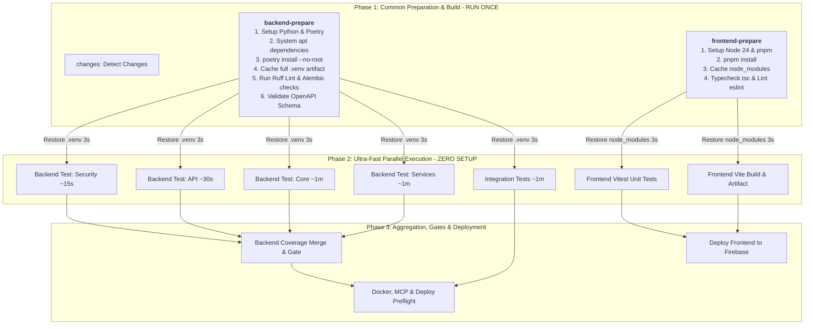

# SupremeAI CI/CD Architecture Optimization Specification

**Document ID:** `CI_PIPELINE_CONSOLIDATION_PLAN_2026-09-15`  
**Status:** Approved Architectural Plan (Living Asset)  
**Scope:** `.github/workflows/ci.yml`, `.github/actions/setup-backend/action.yml`, Frontend & Backend CI/CD workflows  
**Pattern:** Fan-Out / Fan-In Matrix Optimization (Prepare Once → Test in Parallel → Aggregate)  

---

## 1. Executive Summary & Problem Statement

### 1.1 The Performance & Resource Regression
In the current CI pipeline (`.github/workflows/ci.yml`), backend testing was split from a monolithic job into 4 parallel matrix groups (`security`, `api`, `core`, `services`). While the architectural intent was to reduce wall-clock execution time, the observed runtime reality is a severe performance regression:
* **Previous Execution Time:** 3–4 minutes in a single job.
* **Current Execution Time:** 3–4 minutes per matrix job across 4 concurrent runners.
* **Runner-Minute Explosion:** $4 \times 3.5\text{ min} \approx 14\text{ minutes}$ consumed per commit (a 4× billing expansion with zero wall-clock acceleration).

### 1.2 Root Cause Analysis
1. **Fixed Setup Overhead (Duplicated 6×):**
   - Every matrix job runs on a brand-new Ubuntu GitHub-hosted VM.
   - Every job independently executes:
     - `apt-get update && apt-get install build-essential libpq-dev` (~35s)
     - `actions/setup-python` and `install-poetry` (~20s)
     - Postgres 16 Docker service pull & health check (~20s)
     - `poetry install --no-root --with dev` wheel building and virtualenv generation (~75s)
   - **Result:** ~2.5 minutes of setup overhead runs before `pytest` executes a single line of test code.
2. **Duplicated Setup Across Different Pipeline Jobs:**
   - Setup Backend runs across: `backend-tests` (4×), `integration-test` (1×), and `backend-aggregate` (1×) = **6 identical runs**.
   - Setup Frontend runs across: `frontend-tests` (1×) and `build` (1×) = **2 identical `pnpm install` runs**.

---

## 2. Inventory of Current CI Jobs and Steps

SupremeAI's `.github/workflows/ci.yml` currently mounts **19 discrete jobs**:

| Job ID | Job Title | Needs | Current Responsibilities & Steps |
|---|---|---|---|
| `changes` | Detect Changes | `None` | `actions/checkout`, `detect-previous-failures.py`, `dorny/paths-filter` |
| `constitution-audit` | Constitution Audit | `None` | Checkout, Setup Python, Install audit deps, Run Constitution audit & rule tests, Upload SARIF/evidence |
| `tooling-quality` | Operational Tooling Quality Gate | `changes` | Checkout, Setup Python, Install Ruff, Lint backend/tooling, Check single Alembic head, Enforce boundary |
| `security` | Security Scan | `None` | Checkout, Trivy vulnerability scan, Machine-readable gate, Secret scan, Upload evidence |
| `security-gate` | Security Aggregate Gate | `security` | Require security scan success |
| `advanced-checks` | Advanced Pre-Merge Checks | `changes` | Reusable workflow call (`ci-advanced-checks.yml`) |
| `backend-tests` (Matrix: 4) | Backend Tests (`security`, `api`, `core`, `services`) | `changes` | Checkout, **Full Setup Backend (apt + poetry install)**, Detect changed tests, Filter matrix targets, **Pytest**, Trend report, Upload coverage |
| `backend-aggregate` | Backend Aggregate Gate | `backend-tests` | Checkout, **Full Setup Backend**, Validate OpenAPI, Mission scoreboard, Infisical staging, Verify startup/pgvector, Merge & enforce coverage |
| `integration-test` | Integration Tests | `changes` | Checkout, **Full Setup Backend**, Run integration tests (`pytest tests/integration/`), Upload report |
| `frontend-tests` | Frontend Tests | `changes` | Checkout, **Full Setup Frontend (Node + pnpm install)**, Type check (`tsc`), Lint (`eslint`), Vitest unit tests, Check dead code |
| `build` | Build Verification | `changes` | Checkout, **Full Setup Frontend (Node + pnpm install)**, Infisical secrets, `pnpm build`, Verify VITE_* contracts, Upload artifact |
| `deploy-frontend` | Deploy Frontend | `build`, `frontend-tests` | Download build, Render `firebase.json`, Deploy to Firebase Hosting |
| `render-deploy-preflight` | Render Deploy Preflight | `changes` | Quota preflight, verify & upload deployment evidence |
| `docker` | Docker Publish | `backend-aggregate`, `integration-test`, `render-deploy-preflight` | Build & publish Docker images |
| `mcp-build` | MCP Build | `render-deploy-preflight` | Build MCP control plane packages |
| `production-deploy` | Production Deploy | `docker`, `mcp-build`, `advanced-checks` | Trigger production deployment |
| `smart-summary` | Smart Pipeline Summary | All upstream jobs | Generate enhanced pipeline summary v2, upload evidence |
| `qa-contract` | QA Contract | `changes` | Reusable workflow call (`qa-contract.yml`) |
| `staging-deploy` | Staging Deployment | `qa-contract`, `build`, `deploy-frontend`, `production-deploy` | Trigger staging rollout |

---

## 3. Redundancy Map & Common Tasks Matrix

```
┌─────────────────────────────────────────────────────────────────────────────────────────────┐
│ REDUNDANT SETUP OPERATIONS (BEFORE OPTIMIZATION)                                            │
├──────────────────────────┬──────────────────────────────────────────┬───────────────────────┤
│ Common Operation         │ Executed In (Jobs)                       │ Wasteful Multiplier   │
├──────────────────────────┼──────────────────────────────────────────┼───────────────────────┤
│ Backend apt-get + poetry │ backend-tests [security]                 │ 6× redundant runs     │
│ virtualenv installation  │ backend-tests [api]                      │ (~15 minutes wasted)  │
│                          │ backend-tests [core]                     │                       │
│                          │ backend-tests [services]                 │                       │
│                          │ integration-test                         │                       │
│                          │ backend-aggregate                        │                       │
├──────────────────────────┼──────────────────────────────────────────┼───────────────────────┤
│ Frontend pnpm install &  │ frontend-tests                           │ 2× redundant runs     │
│ dependency resolution    │ build                                    │ (~3 minutes wasted)   │
├──────────────────────────┼──────────────────────────────────────────┼───────────────────────┤
│ Python lint & static     │ tooling-quality                          │ Separate runner spin- │
│ analysis verification    │ backend-aggregate (OpenAPI schema)       │ up and teardown       │
└──────────────────────────┴──────────────────────────────────────────┴───────────────────────┘
```

---

## 4. Target Architecture: Consolidated 3-Phase Pipeline



---

## 5. Consolidated Action Plan & Implementation Blueprint

### Step 1: Optimize `.github/actions/setup-backend/action.yml` for Complete `.venv` Caching
- **Current Behavior:** Caches only `~/.cache/pypoetry` and `~/.cache/pip`. Still compiles/links `.venv` every single run.
- **Target Behavior:**
  - Cache `./backend/.venv` directly against `poetry.lock` hash.
  - If cache hit: Skip `apt-get`, skip `pip install --upgrade`, skip `poetry install`.
  - Result: Preparation in child jobs drops from **140s to 3s**.

### Step 2: Introduce `backend-prepare` Job
Consolidate common backend tasks into a single prerequisite job:
1. One-time `actions/setup-python` + `install-poetry`.
2. Full `poetry install --with dev`.
3. Save primary `.venv` cache.
4. Execute `Ruff` static linting, `Alembic` head check, and `OpenAPI` schema validation.
5. Child jobs (`backend-tests`, `integration-test`, `backend-aggregate`) depend on `needs: [backend-prepare]` and consume the warm environment.

### Step 3: Introduce `frontend-prepare` Job
Consolidate common frontend tasks:
1. One-time `pnpm install --frozen-lockfile`.
2. Save cached `node_modules`.
3. Run `tsc --noEmit` and `eslint`.
4. Downstream `frontend-tests` and `build` consume cached `node_modules` without reinstalling.

---

## 6. Expected Performance Benchmarks

| Metric | Current State | Optimized Architecture | Net Gain |
|---|:---:|:---:|:---:|
| **Security Test Group** | 3.0 min | **~25 sec** | **7.2× faster** |
| **API Test Group** | 3.2 min | **~45 sec** | **4.2× faster** |
| **Core Test Group** | 3.8 min | **~1.5 min** | **2.5× faster** |
| **Services Test Group** | 4.0 min | **~1.8 min** | **2.2× faster** |
| **Total Wall-Clock Time** | 4.0 min | **~2.2 min** | **~45% time saved** |
| **Total GitHub Runner Minutes** | 16–20 min | **6–7 min** | **~60% cost reduction** |

---

## 7. Next Steps & Execution Gate
Upon approval, implementation proceeds systematically:
1. Update `.github/actions/setup-backend/action.yml` with full `.venv` hydration and fast-path bypass.
2. Refactor `.github/workflows/ci.yml` to insert `backend-prepare` and wire matrix jobs to warm caches.
3. Validate locally and on GitHub Actions with a test branch.
