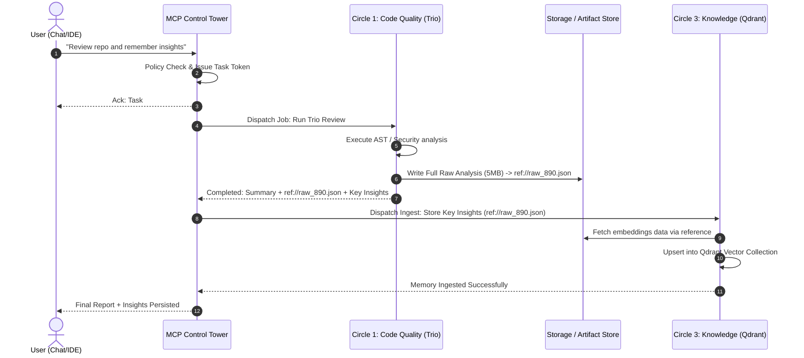

# SupremeAI Unified Ecosystem Master Architecture Plan
**Document Version:** 1.0.0  
**Status:** Approved Architectural Blueprint  
**Location:** `docs/plans/UNIFIED_ECOSYSTEM_ARCHITECTURE_PLAN.md`  
**Philosophy:** *"Reuse before creation. Modules own execution. Circles own domains. The MCP Tower owns orchestration. The Frontend is the Face."*

---

## 1. Executive Summary & Vision

SupremeAI is designed as an autonomous, self-evolving, production-ready AI platform. To avoid both monolithic tool bloat and chaotic, tangled spaghetti dependencies, the architecture implements a **Hub-and-Spoke Federated Topology**.

```
                           [ USER / DEVELOPER ]
                                     │
                                     ▼
                      ┌─────────────────────────────┐
                      │    FRONTEND / CHAT / IDE    │  ◄── "The Face"
                      │   (Clean, Observability)    │      (No Private Reasoning)
                      └──────────────┬──────────────┘
                                     │ (Single Connection)
                                     ▼
                      ┌─────────────────────────────┐
                      │      MCP CONTROL TOWER      │  ◄── "Central Hub & Brain"
                      │ (Router, Guardrails, Policy)│      (Lightweight Orchestrator)
                      └──────────────┬──────────────┘
                                     │
         ┌───────────────────────────┼───────────────────────────┐
         │ (Center 1)                │ (Center 2)                │ (Center N)
         ▼                           ▼                           ▼
  ┌──────────────┐            ┌──────────────┐            ┌──────────────┐
  │   Circle 1   │            │   Circle 2   │            │   Circle N   │  ◄── "Domain Leads"
  │ Code Quality │            │ Cloud & Infra│            │Memory & K-RAG│      (Cluster Routers)
  └──────┬───────┘            └──────┬───────┘            └──────┬───────┘
         │                           │                           │
    ┌────┴────┐                 ┌────┴────┐                 ┌────┴────┐
    ▼         ▼                 ▼         ▼                 ▼         ▼
┌───────┐ ┌───────┐         ┌───────┐ ┌───────┐         ┌───────┐ ┌───────┐
│ Trio  │ │Flake8 │         │Render │ │Supabase│        │Qdrant │ │Episodic│ ◄── "Autonomous Workers"
│Engine │ │Linter │         │Deploy │ │Storage│         │Vector │ │Memory  │     (Isolated Execution)
└───────┘ └───────┘         └───────┘ └───────┘         └───────┘ └───────┘
```

---

## 2. Core Architectural Tenets (The Constitution)

1. **Rule of Existing Capability (Reuse Before Creation):**
   Existing modules (`trio`, `qdrant`, `render`, `supabase`, `infisical`, `redis`) must be integrated into domain circles before developing redundant tools.
2. **Decoupled Autonomy (Modules do not touch peer modules directly):**
   Module A (e.g., `Trio`) never imports or directly invokes Module B (e.g., `Qdrant`). They operate in isolation. Data exchange occurs through Central Orchestration.
3. **Control Plane vs. Data Plane Separation:**
   The Central MCP Tower only manages control commands, task dispatches, and metadata references. Heavy payload data (e.g., full AST dumps, massive logs) flows via references/artifacts, never congesting the Tower.
4. **The Frontend is the Face, Not the Brain:**
   The frontend / chat interface observes status, user prompts, approvals, and summaries. Internal chain-of-thought, secret handling, and raw routing logic remain hidden within the Control Plane.
5. **Intent-First Generalization (Avoid the "Example Trap"):**
   Agents must never confuse an illustrative example with a rigid specification. If a user names 3 specific models (e.g. Gemini, Kilo, Cline) or a specific cloud provider as an example, the architecture MUST remain generalized to dynamic discovery ($1 \dots N$ resources). Hardcoding illustrative examples into rigid filenames or fixed 3-stage bounds is an architectural anti-pattern.
6. **Mandatory Canonical Documentation for Every Module:**
   No module exists as an undocumented "magic box". Every current and future module in SupremeAI must maintain comprehensive, living documentation outlining: its true generalized intent, operational lifecycle, inputs/outputs, and decoupling boundaries.

---

## 3. The True Hybrid Architecture Paradigm (Lightweight Core + Virtual Unified Tools)

Why this architecture is classified as a **True Hybrid System**:
- **From the AI Agent’s Perspective (The Face):** It appears as a seamless, single-point tool interface. The agent never worries about which port, microservice, or server is hosting a capability.
- **From the Control Plane’s Perspective (The Hub):** The MCP Tower remains **ultra-lightweight**. It does not bundle heavy computation or large AST parsers; it acts as a smart dispatcher/router.
- **Zero-Friction Extensibility (Plug & Play):**
  - **Adding a New Module:** Build the module inside a domain Circle. The Central Tower only registers a single gateway link or relies on dynamic discovery. Zero spaghetti edits across unrelated files.
  - **Safe Deprecation (Graceful Degradation):** Unplugging or refactoring a module (e.g., swapping Render for AWS, or swapping Trio for a new engine) produces **zero ripple effects** across other Circles. The Tower simply flags that Circle node as `unreachable` or `degraded` while all other 9 Circles continue running uninterrupted.
- **Zero-Duplication Composable Workflows (Lego Block Dynamics):**
  - In legacy systems, chaining features requires hardcoded glue code: `Table (Trio) + Orange (Qdrant)` needs a glue service, and `Table (Trio) + Water (Render)` demands yet another duplicate adapter ($N \times (N-1)$ explosion).
  - In our Federated Hybrid Model, **no module is ever modified or duplicated** to support new pairings:
    - `Table + Orange` works dynamically via Central Hub dispatch.
    - `Table + Water` works out of the box with **zero code modifications** in either Table or Water.
    - Modules remain pure single sources of truth, eliminating glue-code bloat and duplicate implementations completely.

---

## 4. Logical Gaps & Production Solutions

| # | Identified Logical Gap | Risk / Bottleneck | Architectural Solution |
|---|---|---|---|
| **1** | **Synchronous Timeout Trap** | Deep scans (Trio) or Cloud operations (Render) take 1–5+ minutes, causing HTTP/MCP timeout in sync calls. | **Async Job Dispatcher & SSE/Polling:** Immediate response with `task_id`. Progress streamed via notifications or polled asynchronously. |
| **2** | **Central Memory / Data Congestion** | Passing 10MB+ log dumps or AST trees through Tower RAM causes process slowdown and high token costs. | **Artifact & Reference Passing:** Modules write heavy data to object stores/artifacts (`ref://scan-42`). Tower routes only the URI ticket. |
| **3** | **Single Point of Failure (SPOF)** | If the Control Tower restarts, entire UI/Chat becomes disconnected and blind. | **Graceful Fallback & Health Degraded Mode:** Frontend possesses fallback connectivity to monitor basic platform health. |
| **4** | **Prompt / Context Window Exhaustion** | Exposing 200+ raw tools directly to the AI model wastes thousands of tokens per prompt. | **Coarse-Grained Gateway Tools & Lazy Discovery:** Only ~10 Circle Lead tools exposed upfront; specialized tools discovered on demand. |

---

## 5. Circle Organization & Domain Mapping

All SupremeAI modules are grouped into specialized **Circles**, each governed by a **Circle Center (Lead Gateway)**:

| Circle ID | Domain Circle | Responsibilities | Core Member Modules |
|---|---|---|---|
| **C1** | **Code & Quality Circle** | Static analysis, code review, formatting, syntax validation. | `Adaptive Multi-Agent Assembly (formerly Trio / 1..N Agents)`, `Ruff`, `Flake8`, `Actionlint` |
| **C2** | **Cloud & Infrastructure Circle** | Services deployment, serverless routing, caching, secrets. | `Render`, `Cloudflare`, `Redis`, `Infisical` |
| **C3** | **Knowledge & Memory Circle** | Vector search, RAG, knowledge graphs, long-term learning. | `Qdrant`, `Supabase Vector`, `Episodic Memory` |
| **C4** | **Auth, Tenancy & Security Circle** | RBAC, tenant isolation, zero-trust token rotation, audit. | `Supabase Auth`, `Firebase Auth`, `Policy Engine` |
| **C5** | **Agent Orchestration Circle** | Multi-agent collaboration, verification planning, self-evolution. | `Autonomous Loop`, `Review Workflow`, `HITL Gate` |

> [!IMPORTANT]
> **Dynamic Discovery over Hardcoded Implementations:**
> In Circle C1, the assembly pipeline must dynamically discover all active local/remote AI models available on the host machine ($1 \dots N$ agents, e.g., Ollama, Cursor, Cline, Claude Code, Gemini). It dynamically assigns assembly roles (Writer, Reviewer, Checker, etc.) according to available capabilities rather than assuming an inflexible 3-agent limit.

---

## 6. End-to-End Operational Workflow: Cross-Circle Example

### Scenario: "Review code repository and store learned patterns for future runs."



---

## 7. Implementation Roadmap

### Phase 1: Inventory & Circle Lead Specification (Immediate)
- Formalize Circle Center interfaces (`CircleLeadBase`).
- Map all existing tools into respective Circle domains.

### Phase 2: Lightweight Gateway & Lazy Discovery
- Implement coarse-grained gateway tools in MCP Control Tower.
- Enable dynamic on-demand tool loading (`client_discover_mcp_server`).

### Phase 3: Asynchronous Job Bus & Artifact Reference Broker
- Implement background task queue with task IDs for operations > 3 seconds.
- Connect artifact storage references (`ref://`) to decouple data payload from control plane.

### Phase 4: Frontend Face Synchronization
- Connect Chat UI and IDE agents exclusively to the unified Control Tower.
- Implement streaming status and user-approval prompts (HITL).
