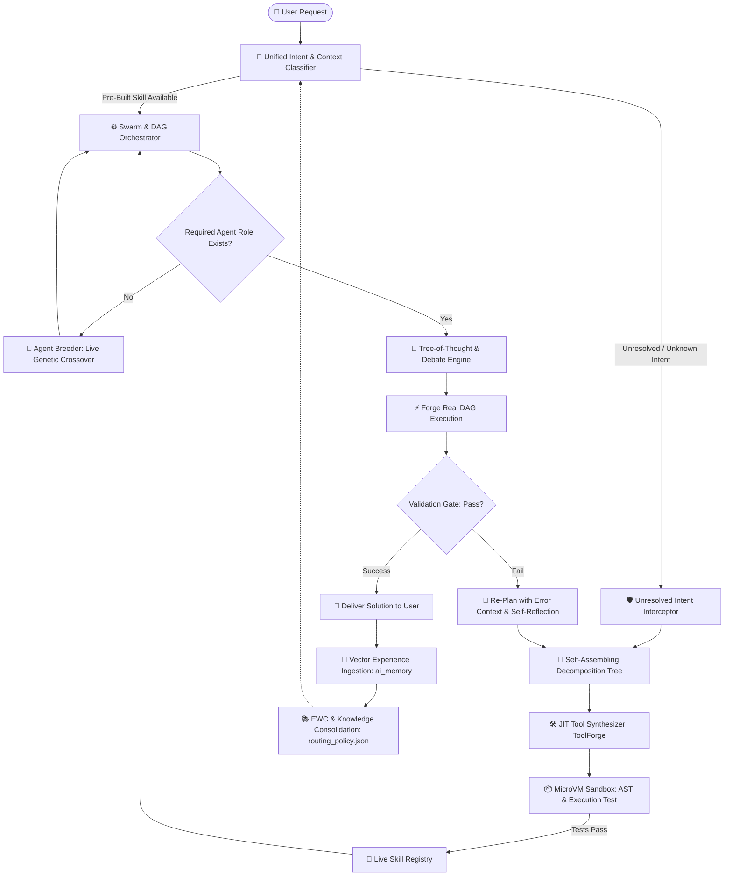

# SupremeAI: Living, Self-Evolving Autonomous Intelligence
## চার দৃষ্টিকোণ ভিত্তিক সমন্বিত মহা-পরিকল্পনা (4-Perspective Master Synthesis)

**লক্ষ্য (The North Star Goal):**
> "SupremeAI হলো একটি living, self-evolving intelligence — যার কাছে 'পারব না' বলে কোনো শব্দ নেই। ইউজার যা-ই চাইবে, সে বুঝবে, পথ বানাবে এবং করে দেবে। আর প্রতিটি কাজের পর সে আরেকটু বুদ্ধিমান হবে।"

---

## 📑 সূচিপত্র (Table of Contents)
1. **[দৃষ্টিভঙ্গি ১] মূল দর্শন ও ৪টি ভিত্তিস্তম্ভ (Vision & The 4 Pillars)**
2. **[দৃষ্টিভঙ্গি ২] গ্রাউন্ড রিয়ালিটি ও জিরো-মক কোড অডিট (ChatGPT Code Audit & Zero-Stub Hygiene)**
3. **[দৃষ্টিভঙ্গি ৩] মেটা-আর্কিটেকচার ও পাথ মেকিং লজিক (Architectural Deep-Dive & JIT Tool Synthesis)**
4. **[দৃষ্টিভঙ্গি ৪] বাস্তবসম্মত রোডম্যাপ ও সিকোয়েন্সিং (Pragmatic Enterprise 4-Phase Sequencing)**
5. **সমন্বিত আর্কিটেকচারাল ব্লুপ্রিন্ট ও ডিপেন্ডেন্সি গ্রাফ (The Unified Master Topology)**
6. **চূড়ান্ত সিদ্ধান্ত ও এক্সিকিউশন চেকপয়েন্ট (Executive Action Plan)**

---

## ১. [দৃষ্টিভঙ্গি ১] মূল দর্শন ও ৪টি ভিত্তিস্তম্ভ (Vision & The 4 Pillars)

এই দৃষ্টিভঙ্গিতে SupremeAI-কে কোনো সাধারণ চ্যাটবট বা কোড এডিটর নয়, বরং একটি জীবন্ত মেটা-ইন্টেলিজেন্স হিসেবে কল্পনা করা হয়েছে:

```
                  ┌───────────────────────────────────────────────┐
                  │          SupremeAI: The Living Brain          │
                  └───────────────────────┬───────────────────────┘
                                          │
        ┌───────────────────┬─────────────┴───────┬───────────────────┐
        ▼                   ▼                     ▼                   ▼
┌──────────────┐   ┌─────────────────┐   ┌─────────────────┐   ┌──────────────┐
│  ১. বুঝবে    │   │  ২. পথ বানাবে   │   │  ৩. করে দেবে    │   │ ৪. শিখবে     │
│ (Theory of   │   │ (Dynamic Task   │   │ (JIT Tool & DAG │   │ (The Eternal │
│ Mind & Twin) │   │  Decomposition) │   │  Execution)     │   │ Brain Loop)  │
└──────────────┘   └─────────────────┘   └─────────────────┘   └──────────────┘
```

1. **"ইউজার যা চাইবে বুঝবে" (Cognitive Intent):**
   - ইউজার অস্পষ্ট বা ভুল নির্দেশ দিলেও **Theory of Mind (ToM Level 4)** এবং **Cognitive Twin Engine** ইউজারের অবচেতন উদ্দেশ্য ডিকোড করবে এবং প্রয়োজনে অবজেক্টিভ পুশব্যাক দেবে।
2. **"পথ বানাবে" (Dynamic Pathfinding):**
   - কোনো রেডিমেড রুল না থাকলেও `Tree-of-Thought` ও `Decomposition Tree`-র মাধ্যমে জটিল সমস্যাকে নোড-লেভেল সাব-টাস্কে ভাগ করবে।
3. **"করে দেবে" (Limitless Zero-Refusal):**
   - "পারব না" শব্দ নিষিদ্ধ। কোনো টুল না থাকলে তাৎক্ষণিকভাবে নতুন টুল তৈরি (`Tool Forge`) করে স্যান্ডবক্সে টেস্ট করে কাজ সম্পন্ন করবে।
4. **"প্রতিটি কাজের পর আরেকটু বুদ্ধিমান হবে" (Eternal Evolution):**
   - প্রতিটি সাকসেস/ফেইলিউর থেকে শিখে `ai_memory` ভেক্টর ডেটাবেস সমৃদ্ধ করবে।

---

## ২. [দৃষ্টিভঙ্গি ২] গ্রাউন্ড রিয়ালিটি ও জিরো-মক কোড অডিট (ChatGPT Code Audit)

ChatGPT-এর ডিপ অডিট কোডবেসের ভেতরের **১,০৫১টি ফাঁকফোকর ও সিমুলেশন** উন্মোচন করেছে। জীবন্ত বুদ্ধিমত্তা তৈরির আগে এই ফাউন্ডেশন নিরেট করা আবশ্যক:

* **সিমুলেশন ও স্লিপ বাদ দেওয়া:**
  - `devops/auto_healer.py`-এর `time.sleep` এবং ফেক রিস্টার্ট বাদ দিয়ে রিয়েল ডকার/সার্ভিস ম্যানেজমেন্ট যুক্ত করা।
  - `infrastructure/performance_tuning_agent.py`-এ রিয়েল `psutil` মেট্রিক্স প্রোফাইলিং ইন্টিগ্রেট করা।
  - `brain/model_router.py`-এর সমস্ত মক ও ফেক পোর্টফোলিও ফলব্যাক সরিয়ে শতভাগ `ZeroCostGateway` ও লাইভ ক্লাউডে রাউট করা।
* **রিয়েল ড্যাগ এক্সিকিউশন (M5.7 & M5.9):**
  - ফেজ ৫-এ ইতিমধ্যে `forge_executor.py` দিয়ে `asyncio.sleep(2)` স্টাব সরিয়ে রিয়েল ড্যাগ এক্সিকিউশনে রূপান্তর করা হয়েছে; একে এখন পুরো ব্যাকএন্ডের মূল চালিকাশক্তি করতে হবে।

---

## ৩. [দৃষ্টিভঙ্গি ৩] মেটা-আর্কিটেকচার ও পাথ মেকিং লজিক (Architectural Deep-Dive)

এই দৃষ্টিভঙ্গিতে সিস্টেমের ভেতরের টেকনিক্যাল ইন্টারসেপ্টর ও মিউটেশন মেকানিজমকে সুনির্দিষ্ট করা হয়েছে:

1. **"Never Say No" Unresolved Intent Interceptor:**
   - `intent_router.py` এবং `intent_parser.py`-তে কোনো টুল বা প্রম্পট না পেলে `400/404` বা এরর রেইজ করার বদলে রিকোয়েস্টটি সরাসরি `self_assembling_orchestrator.py`-তে চলে যাবে।
2. **JIT Tool Synthesizer & Safe Executor:**
   - `tool_forge.py` রানটাইমে পাইথন/MCP কোড জেনারেট করবে, `microvm_sandbox.py`-তে টেস্ট করবে এবং পাস করলে লাইভ `skill_registry.py`-তে রেজিস্টার করবে।
3. **Closed-Loop Learning with EWC (Elastic Weight Consolidation):**
   - `continual_learning/ewc.py` ও `knowledge_distiller.py`-এর মাধ্যমে ক্যাটাস্ট্রফিক ফরগেটিং ছাড়া পূর্বের সফল স্ট্র্যাটেজি কম্প্যাক্ট করে `routing_policy.json`-এ আপডেট রাখা।
4. **Dynamic Agent Breeding:**
   - সোয়ার্মে কোনো বিশেষ রোলের এজেন্ট না থাকলে `agent_breeder.py` জেনেটিক ও এলএলএম মিউটেশনের মাধ্যমে লাইভ নতুন সাব-এজেন্ট তৈরি করবে।

---

## ৪. [দৃষ্টিভঙ্গি ৪] বাস্তবসম্মত রোডম্যাপ ও সিকোয়েন্সিং (Pragmatic Enterprise 4-Phase Sequencing)

এই দৃষ্টিভঙ্গি পুরো কাজটিকে ঝুঁকি-মুক্ত ও ক্রমানুসারে সাজিয়েছে (Phase A ➔ B ➔ C ➔ D):

```
┌──────────────────────────────────────────────────────────────────────────┐
│  Phase A: Foundation & Hygiene Gate (2-3 Weeks)                          │
│  - ৩টি প্রতিযোগী এজেন্ট সিস্টেমের ডুপ্লিকেশন দূর করা                    │
│  - tools/ai_agents/-কে Single Source of Truth নির্ধারণ                    │
│  - CI Coverage Safety Gate ও Import Graph (0 Broken) নিশ্চিত করা        │
└────────────────────────────────────┬─────────────────────────────────────┘
                                     │
                                     ▼
┌──────────────────────────────────────────────────────────────────────────┐
│  Phase B: Unified Intent & Dynamic Planning (3-4 Weeks)                  │
│  - Single Intent Classifier & Orchestrator তৈরি                          │
│  - Dynamic Task Decomposition & DAG Creation                             │
│  - "Re-plan with error context" (ফেইল করলে স্বয়ংক্রিয় রি-প্ল্যান)          │
└────────────────────────────────────┬─────────────────────────────────────┘
                                     │
                                     ▼
┌──────────────────────────────────────────────────────────────────────────┐
│  Phase C: Self-Extension & JIT Tool Synthesis (4-5 Weeks)                │
│  - Dynamic MCP / Tool Code Generator                                     │
│  - Isolated MicroVM Sandbox Execution & Security Guard                   │
│  - Live Hot-Plugging into Skill Registry                                 │
└────────────────────────────────────┬─────────────────────────────────────┘
                                     │
                                     ▼
┌──────────────────────────────────────────────────────────────────────────┐
│  Phase D: The Living Memory & Feedback Loop (3-4 Weeks)                  │
│  - প্রতিটি কাজের আউটকাম pgvector ai_memory-এ সেভ করা                      │
│  - EWC ও নলেজ ডিস্টিলেশন দিয়ে ক্যাটাস্ট্রফিক ফরগেটিং রোধ                 │
│  - পরবর্তী প্ল্যানিংয়ে অতীতের সফল অভিজ্ঞতা স্বয়ংক্রিয়ভাবে রিট্রিভ করা     │
└──────────────────────────────────────────────────────────────────────────┘
```

---

## ৫. সমন্বিত আর্কিটেকচারাল ব্লুপ্রিন্ট ও ডিপেন্ডেন্সি গ্রাফ (The Unified Master Topology)



---

## ৬. চূড়ান্ত সিদ্ধান্ত ও এক্সিকিউশন চেকপয়েন্ট (Executive Action Plan)

| ফেজ | প্রধান লক্ষ্য | প্রাথমিক কাজসমূহ |
|---|---|---|
| **Phase A** | **Foundation & Hygiene** | `tools/ai_agents/` কনসোলিডেশন, `model_router.py` থেকে মক সরানো, CI গেট ভেরিফিকেশন। |
| **Phase B** | **Unified Intent & Re-Planner** | `unified_intent_classifier.py` তৈরি, `self_assembling_orchestrator.py`-তে রি-প্ল্যানার ইন্টিগ্রেশন। |
| **Phase C** | **JIT Tooling & Sandbox** | `tool_forge.py` + `microvm_sandbox.py` + `skill_registry.py` লাইভ হট-প্লাগিং। |
| **Phase D** | **Living Memory Loop** | `learning_loop.py` + `ai_memory` (pgvector) + `ewc.py` ফিডব্যাক ইনজেশন। |

---
*ডকুমেন্টটি সংরক্ষিত হয়েছে: `docs/SUPREMEAI_LIVING_INTELLIGENCE_SYNTHESIS.md`*