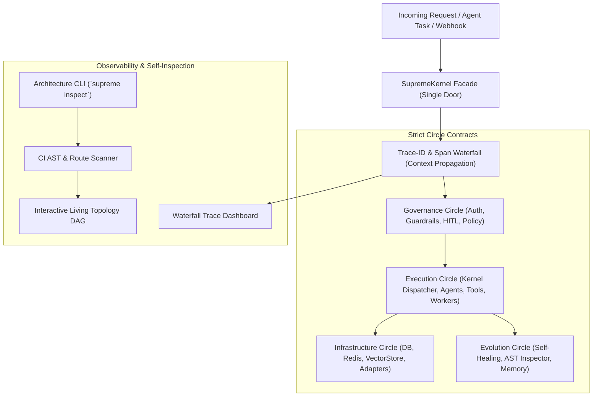

# Self-Tracing & Bounded Black-Box Architecture Implementation Plan

Transforming the 1500+ file SupremeAI codebase from a manual-navigation labyrinth into an enterprise-grade **"Self-Tracing & Bounded Black-Box"** architecture.

---

## Executive Summary & Pro Insights

In a 1500+ file autonomous AI agent system:
1. **Docs lie; Runtime telemetry & AST never lie.**
2. Trying to refactor all 1500 files at once causes massive regression and broken import loops.
3. The winning approach is **Non-Disruptive Layering (Facade + Scopes + AST Extractor)** followed by **Zero-Downtime Contract Enforcement**.

This implementation plan delivers:
- **Phase 1: Unified Kernel Facade (`SupremeKernel` / Single-Door Entry)**
- **Phase 2: End-to-End Request Waterfall Tracing (`X-Trace-ID` + OpenTelemetry / Langfuse)**
- **Phase 3: Living Interactive Topology Graph (AST & Route DAG + Web Dashboard)**
- **Phase 4: Circle-Based Domain Boundary Enforcement (`Import Linter` + Contracts)**
- **Phase 5: Self-Query Architecture CLI (`supreme inspect --flow ...`)**

---

## User Review Required

> [!IMPORTANT]
> **Domain Re-packaging Strategy:** Rather than physically moving all 52 directories under `backend/` overnight (which would break thousands of imports and git history), we will implement **Circle Contracts** using Python namespace facades (`backend/circles/execution`, `governance`, `evolution`, `infrastructure`) with explicit `__all__` re-exports, combined with an AST Import-Linter in CI. Physical migration will follow incrementally without disruption.

> [!NOTE]
> **Tracing Stack:** We will leverage OpenTelemetry standard spans with pluggable exporters (compatible with Langfuse, SigNoz, PostHog, or standard Jaeger/Render logs) to avoid vendor lock-in.

---

## Proposed Phases & Architecture Changes



---

### Phase 1: Unified Kernel Facade (Single-Door Pattern)

**Objective**: Ensure all agent executions, API intents, and pipeline dispatches funnel through one unified, strongly-typed interface (`SupremeKernel`) instead of calling disjointed controllers or internal scripts.

#### Tasks:
1. **Design `KernelContract`**:
   - `backend/core/kernel/interface.py`: Define `KernelRequest`, `KernelResponse`, `ExecutionMode`, `TenantContext`.
2. **Implement `SupremeKernel` (`backend/core/kernel/dispatcher.py`)**:
   - Central entry point that orchestrates:
     - 1. Identity & Tenant resolution
     - 2. Governance & Policy Check (HITL / Permission)
     - 3. Context & Semantic Memory fetch
     - 4. Target Agent / Tool dispatch
     - 5. Verification & Safety Post-check
     - 6. Telemetry emission
3. **Mount in `backend/main.py` / `core/app.py`**:
   - Expose `/api/v1/kernel/dispatch` as the universal headless agent pipeline.
   - Keep existing FastAPI route wrappers as thin adapters calling the Kernel.

---

### Phase 2: End-to-End Request Waterfall Tracing (`Trace-ID Waterfall`)

**Objective**: Give developers and AI agents instant visual proof of execution flow (Router ➔ Semantic Cache ➔ Agent ➔ Tools ➔ Vector DB) without reading code.

#### Tasks:
1. **Context-Propagated Tracing Middleware (`backend/middleware/trace_middleware.py`)**:
   - Intercepts all requests; extracts or generates `X-Trace-ID` and `X-Correlation-ID`.
   - Binds Trace ID to Python `contextvars` so async threads, Celery/Redis workers, and sub-agents carry the exact same trace ID.
2. **Layer Spans Instrumentation**:
   - Decorate critical boundaries:
     - `@trace_span("kernel.dispatch")`
     - `@trace_span("cache.semantic_lookup")`
     - `@trace_span("agent.reasoning")`
     - `@trace_span("tool.execution")`
     - `@trace_span("db.transaction")`
3. **Dual Telemetry Sink**:
   - Emit traces to:
     - OpenTelemetry / Langfuse (Visual Waterfall UI)
     - Structured JSON logs (`trace_id`, `layer`, `duration_ms`, `status`) for zero-cost Render / CLI inspections.

---

### Phase 3: Living Interactive Topology Graph (Auto-Generated Visual DAG)

**Objective**: Automated, always-accurate architectural graph generated on every commit or build.

#### Tasks:
1. **Extend `scripts/ci/generate_route_graph.py` to Full AST System Graph**:
   - Create `scripts/ci/generate_system_topology.py`:
     - Parses FastAPI route definitions
     - Parses Agent tool registrations
     - Parses Database models and Redis cache keys
     - Outputs a unified `docs/generated/system_topology.json`.
2. **Auto-Generate Mermaid & Static Web Dashboard**:
   - Generate:
     - `docs/generated/ARCHITECTURE_DAG.md` (Native GitHub Mermaid diagrams)
     - Interactive standalone HTML viewer: `docs/generated/topology_viewer.html` (using D3.js or Cytoscape.js with search & filter by Circle).
3. **CI Pipeline Integration**:
   - Add automated check in GitHub Actions (`.github/workflows/ci.yml` or equivalent): verifies topology is refreshed before merge.

---

### Phase 4: Circle-Based Domain Boundary Enforcement (Strict Packaging)

**Objective**: Group the 52+ root folders into 4 logical Supreme Circles with strict import contracts, preventing circular spaghetti dependencies.

#### The 4 Supreme Circles:
| Circle | Components Included | Export Contract |
|---|---|---|
| **Governance (`backend/circles/governance/`)** | `admin`, `security`, `hitl`, `audit_check`, `policy` | `__all__ = ["PolicyEngine", "AuthGuard", "HITLApproval"]` |
| **Execution (`backend/circles/execution/`)** | `core/kernel`, `agents`, `browser`, `pipelines`, `workers`, `tools` | `__all__ = ["SupremeKernel", "AgentRunner", "ToolRegistry"]` |
| **Evolution (`backend/circles/evolution/`)** | `evolution`, `learning`, `adaptive_engine`, `memory`, `brain` | `__all__ = ["MemoryFabric", "AdaptiveEngine", "EvolutionBus"]` |
| **Infrastructure (`backend/circles/infrastructure/`)** | `database`, `storage`, `adapters`, `monitoring`, `integrations` | `__all__ = ["DatabaseSession", "RedisClient", "VectorStore"]` |

#### Tasks:
1. **Define Circle Index Facades**:
   - Create `backend/circles/{governance,execution,evolution,infrastructure}/__init__.py` exposing only public contracts.
2. **CI Import Linter (`scripts/ci/enforce_circle_boundaries.py`)**:
   - AST script that scans all imports:
   - Rules:
     - `Infrastructure` CANNOT import `Execution` or `Governance`.
     - `Governance` CANNOT import `Evolution`.
     - Private helper modules within a circle cannot be imported from outside that circle; must go through the Circle root contract.

---

### Phase 5: Internal Architecture CLI (`Self-Query CLI`)

**Objective**: Give engineers and autonomous agents instant terminal commands to inspect flows and contracts.

#### Commands to Build (`backend/cli/inspect.py` / `python -m supreme.inspect`):
- `python -m supreme.inspect --flow <flow_name>`:
  - Example: `python -m supreme.inspect --flow browser_task`
  - Output: Prints exact execution waterfall: Entry Router ➔ Kernel ➔ Target Agent ➔ Dependencies ➔ Database/Tables.
- `python -m supreme.inspect --circle <circle_name>`:
  - Lists public contracts, active dependencies, and violation alerts.
- `python -m supreme.inspect --route <method_and_path>`:
  - Traces route handler back to its underlying models and tools.

---

## Verification Plan

### Automated Verification
1. **Circle Boundary Check**:
   ```bash
   python scripts/ci/enforce_circle_boundaries.py
   ```
2. **Topology Graph Generation Test**:
   ```bash
   python scripts/ci/generate_system_topology.py
   ```
3. **Kernel Dispatch Test**:
   ```bash
   pytest backend/tests/test_kernel_dispatch.py
   ```
4. **Trace Waterfall Test**:
   ```bash
   pytest backend/tests/test_tracing_waterfall.py
   ```

### Manual / Visual Verification
1. Open `docs/generated/topology_viewer.html` in browser; verify interactive zooming and node filtering across the 4 Circles.
2. Trigger an end-to-end task via CLI/API and inspect the resulting waterfall trace in logs/Langfuse.
