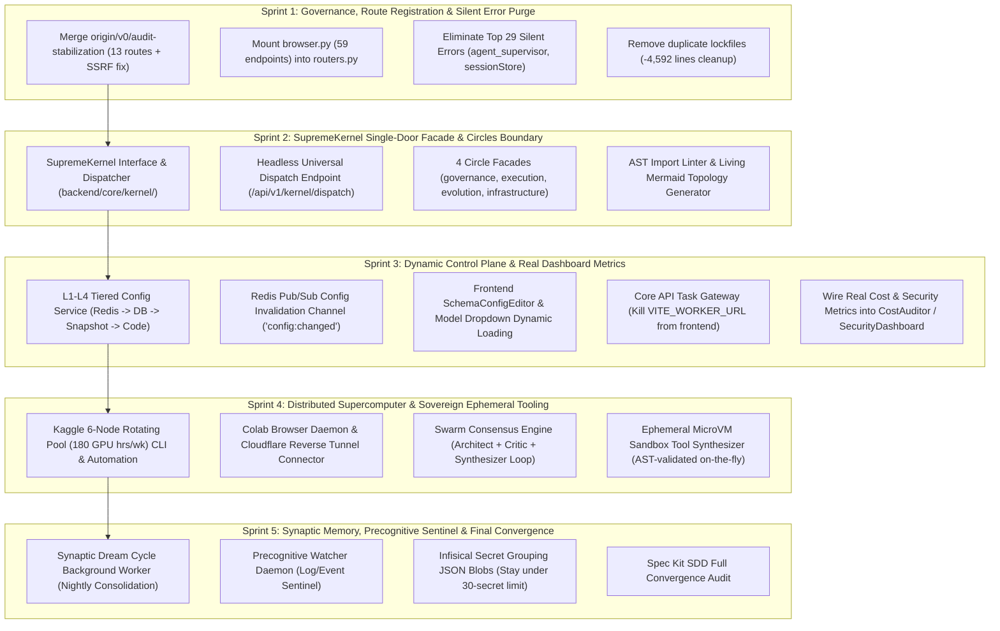

# 🌐 SupremeAI — মহাপরিকল্পনা একত্রীকরণ ও সামগ্রিক অমীমাংসিত অডিট ও পূর্ণাঙ্গ বাস্তবায়ন পরিকল্পনা (Master Blueprint & Technical Implementation Plan)
### (C:\Users\N\Downloads\New folder (6) এর ১৭২টি ফাইল, গোল্ড বেঞ্চমার্ক অ্যাকশন প্ল্যান ও লাইভ কোডবেস ভেরিফিকেশনের ভিত্তিতে প্রণীত)

**তারিখ:** ১৩ সেপ্টেম্বর ২০২৬ | **কোডবেস স্থিতি:** `main` @ `43012eef10` / `origin/v0/audit-stabilization` @ `4b97420891`  
**বিশ্লেষিত সোর্স:** `C:\Users\N\Downloads\New folder (6)` (১৭২টি ফাইল) + `SupremeAI_Gold_Benchmark_Action_Plan.pdf` (২৮ পৃষ্ঠা) + লাইভ গিট রিপোজিটরি `f:\supremeai`

---

## 🎯 ১. এক্সিকিউটিভ সিন্থেসিস ও গ্রাউন্ড রিয়্যালিটি (Executive Synthesis)

আপনার দেওয়া ১৭২টি ফাইল, গোল্ড বেঞ্চমার্ক পিডিএফ এবং সক্রিয় গিট কোডবেস (`43012eef10` এবং রিমোট ব্রাঞ্চ `origin/v0/audit-stabilization`) পাশাপাশি মিলিয়ে ভেরিফাই করে দেখা গেছে:
1. **যা ইতিমধ্যে বাস্তবায়িত হয়েছে:** Auto-RAG মেমোরি ইনজেকশন, বায়োমেট্রিক স্টিলথ ব্রাউজিং (`human_behavior.py`), Cloudflare Multi-Node Circuit Breaker, 1-Line MCP UI ও Discovery সার্ভিস, Supabase RPC ভেক্টর সার্চ, এবং JWT সিকিউরিটি।
2. **যা এখনও বাস্তবায়িত হয়নি কিন্তু রোডম্যাপে প্রতিশ্রুত:** এই অমীমাংসিত অংশগুলোই সুপ্রিম এআই-এর সর্বোচ্চ শক্তিশালী স্তম্ভ—যেমন: **জিরো-কস্ট ডিস্ট্রিবিউটেড সুপারকম্পিউটার ক্লাস্টার (Kaggle/Colab)**, **L1-L4 ডাইনামিক কনট্রোল প্লেন**, **SupremeKernel ইউনিফাইড ফ্যাসাড ও সার্কেল বাউন্ডারি**, **সার্বভৌম সেলফ-ইভোল্যুশন সোয়ার্ম ও এফিমিরাল স্যান্ডবক্সিং**, এবং **ফ্রন্টএন্ডের ফেক ডাটা উচ্ছেদ**।

নিচে প্রতিটি অমীমাংসিত বিষয়ের **অডিট ফলাফল** এবং একই সাথে তার **সুনির্দিষ্ট টেকনিক্যাল ইমপ্লিমেন্টেশন প্ল্যান (কোড স্পেক, মেথড সিগনেচার, ফাইল পাথ ও লজিক)** হুবহু সংযুক্ত করা হলো।

---

## 🧭 ২. অমীমাংসিত পরিকল্পনা ও তাদের পুঙ্খানুপুঙ্খ বাস্তবায়ন প্ল্যান (Detailed Implementation Plans)



---

### 🔴 ক্যাটাগরি ১: ডিস্ট্রিবিউটেড জিরো-কস্ট সুপারকম্পিউটার ক্লাস্টার (Zero-Cost Compute Infrastructure)
*(রেফারেন্স ফাইল: `### 🧠 Kaggle, Colab, Cloudflare ও Rende(1).md`, `KAGGLE_IMPLEMENTATION_PLAN.md`, `SUPREMAI_FREE_TIER_FEDERATION_MASTER_PLAN_V4.md`)*

#### ১.১ বর্তমান গ্যাপ ও অবস্থা:
- `scripts/kaggle/` ডিরেক্টরিতে শুধু একটি খালি `__init__.py` ফাইল আছে।
- ৬টি ক্যাগল অ্যাকাউন্ট রোটেট করে প্রতি সপ্তাহে ১৮০ ঘণ্টা ফ্রি GPU (T4/P100) ব্যবহারের স্ক্রিপ্ট বা রিমোট ক্লাউডফ্লেয়ার টানেল কানেক্টর অনুপস্থিত।
- গুগল কোলাব কিপ-অ্যালাইভ ও রিভার্স টাস্ক ডেমোন অনুপস্থিত।

#### 🛠️ বাস্তবায়ন পরিকল্পনা (Technical Implementation Plan):

1. **`scripts/kaggle/account_pool_rotator.py` তৈরি:**
   - **উদ্দেশ্য:** ৬টি ক্যাগল ক্রেডেনশিয়াল কি (`KAGGLE_KEY_1` থেকে `KAGGLE_KEY_6`) সিক্রেট ম্যানেজার বা এনভায়রনমেন্ট থেকে রিড করে কোটা ও ব্যবহার ট্র্যাক করা।
   - **মেকানিজম:**
     ```python
     class KaggleAccountPool:
         def __init__(self, accounts: List[dict]):
             self.accounts = accounts  # [{'username': '...', 'key': '...', 'used_hours': 0}]
         def acquire_runner(self) -> dict:
             # সর্বাধিক ফ্রি কোটা থাকা অ্যাকাউন্ট নির্বাচন করবে (30 hrs/week per account)
             best = min(self.accounts, key=lambda x: x['used_hours'])
             if best['used_hours'] >= 30:
                 raise QuotaExhaustedError("All 6 Kaggle accounts exhausted weekly quota.")
             return best
         def record_session(self, username: str, duration_hours: float):
             # সেশন রেকর্ড আপডেট করবে
     ```
2. **`scripts/kaggle/pipeline_orchestrator.py` তৈরি:**
   - ক্যাগল এপিআই দিয়ে হেডলেস নোটবুক পুশ করবে (`kaggle kernels push -p ./kernel_bundle`).
   - নোটবুক স্টার্ট হওয়ার সাথে সাথে একটি এফিমিরাল Cloudflare Quick Tunnel (`cloudflared tunnel --url http://localhost:8000`) তৈরি করে Core Backend-কে ওয়েবহুক পাঠাবে।
   - কোর ব্যাকএন্ড হেভি এলএলএম ফাইন-টিউনিং, ডাল-ই/এসডি ইমেজ জেনারেশন বা ডিপ স্ক্র্যাপিং এই ক্যাগল টানেলে অফলোড করবে।
3. **`scripts/colab/colab_tunnel_daemon.py` তৈরি:**
   - গুগল কোলাব নোটবুকে চালানোর মতো সিঙ্গেল-সেল পাইথন ডেমোন।
   - অটোমেটিক রিভার্স WebSocket কানেকশনের মাধ্যমে সুপ্রিম এআই কোরের সাথে হ্যান্ডশেক করবে এবং ব্যাকগ্রাউন্ড টাস্ক এক্সিকিউট করবে।

---

### 🔴 ক্যাটাগরি ২: ইউনিফাইড এমসিপি কন্ট্রোল টাওয়ার ও আর্কিটেকচারাল গেটওয়ে
*(রেফারেন্স ফাইল: `SUPREMEAI_UNIFIED_MCP_CONTROL_TOWER_MULTI_TENANT_EXPANDABLE_MASTER_PLAN_BN.md`, `## সংক্ষিপ্ত রায়.md`, `SUPREMAI_MISSING_SERVICES_INTEGRATION_PLAN.md`)*

#### ২.১ বর্তমান গ্যাপ ও অবস্থা:
- `frontend/src/services/controlPlane.ts`-এ সরাসরি `VITE_WORKER_URL`-এ ফেচ কল করা হচ্ছে (যা টেন্যান্ট আইসোলেশন ও সেন্ট্রাল গভর্ন্যান্স বাইপাস করে)।
- সার্ভিসের ৩-স্টেট হেলথ স্ট্যাটাস (`configured`, `ready`, `operational`) নেই।
- Infisical ফ্রি টিয়ারে ২৫+ আলাদা সিক্রেট কি ব্যবহার হচ্ছে, যা ৩০টি সিক্রেটের ক্যাপ লিমিটের ৮৩% দখল করে ফেলেছে।

#### 🛠️ বাস্তবায়ন পরিকল্পনা (Technical Implementation Plan):

1. **কোর এপিআই টাস্ক গেটওয়ে (`POST /api/v1/tasks`) তৈরি:**
   - **ফাইল:** `backend/api/routes/task_gateway.py`
   - **লজিক:** ফ্রন্টএন্ড কখনো সরাসরি ব্যাকগ্রাউন্ড ওয়ার্কারে রিকোয়েস্ট পাঠাবে না। ফ্রন্টএন্ড পাঠাবে কোরে, কোর টেন্যান্ট পারমিশন ও রেট লিমিট ভেরিফাই করে ইন্টারনাল Redis Queue বা ওয়ার্কারে পুশ করবে:
     ```python
     @router.post("/tasks", response_model=TaskSubmissionResponse)
     async def submit_unified_task(
         payload: TaskRequest,
         current_user: User = Depends(get_current_active_user),
         db: AsyncSession = Depends(get_db_session)
     ):
         # 1. Audit log
         # 2. Check tenant quota
         # 3. Route to internal worker or Kaggle runner
         task_id = await task_dispatcher.enqueue(payload, tenant_id=current_user.tenant_id)
         return {"task_id": task_id, "status": "queued"}
     ```
2. **ফ্রন্টএন্ড সার্ভিস রিফ্যাক্টরিং:**
   - `frontend/src/services/controlPlane.ts` থেকে `VITE_WORKER_URL` পুরোপুরি ডিলিট করে কোর এপিআই ক্লায়েন্ট `apiClient.post('/api/v1/tasks', ...)` ব্যবহার করা হবে।
3. **Infisical Secret Grouping Loader (`backend/core/config_loader.py`):**
   - পৃথক ভ্যারিয়েবলের পরিবর্তে ৩টি বড় JSON ব্লব এনক্রিপ্টেড আকারে সংরক্ষণ ও আনপ্যাক করার কোড যুক্ত করা:
     - `SUPREME_CORE_SECRETS` (DB URLs, Redis, JWT Secret)
     - `SUPREME_LLM_KEYS` (OpenAI, Anthropic, Gemini, Groq)
     - `SUPREME_INTEGRATIONS` (GitHub, Cloudflare, Resend, Supabase Service Key)

---

### 🔴 ক্যাটাগরি ৩: ডাইনামিক কনট্রোল প্লেন ও জিরো-হার্ডকোড পলিসি
*(রেফারেন্স ফাইল: `ইমপ্লিমেন্টেশন প্ল্যান ডাইনামিক কনট্রোল প্লেন.md`, `HARDCODED_ANALYSIS_BN.md`, `SUPREMEAI_REMAINING_DYNAMIC_CONFIGURATION_IMPLEMENTATION_PLAN.md`)*

#### ৩.১ বর্তমান গ্যাপ ও অবস্থা:
- `backend/core/config_control_plane.py`-তে শুধু স্ট্যাটিক মেটাডাটা ভিউ আছে, কিন্তু রানটাইম ভ্যালু ওভাররাইড ও মাল্টি-নোড ক্যাশ ইনভ্যালিডেশন ইঞ্জিন নেই।
- ফ্রন্টএন্ডের `ProfilePage.tsx` এবং `commandRegistry.ts`-এ হার্ডকোডেড মডেল ও কনফিগারেশন আছে।
- অ্যাডমিন ড্যাশবোর্ডে ডাইনামিক স্কিমা অনুযায়ী ফর্ম জেনারেটর নেই।

#### 🛠️ বাস্তবায়ন পরিকল্পনা (Technical Implementation Plan):

1. **L1-L4 ডাইনামিক কনফিগ ইঞ্জিন বাস্তবায়ন (`backend/core/dynamic_config.py`):**
   ```python
   class DynamicConfigEngine:
       """
       Tiered Runtime Resolution:
       L1: Redis In-Memory Cache (<1ms)
       L2: PostgreSQL 'system_config' table (persistent overrides)
       L3: Process Local Cache Snapshot (survives DB downtime)
       L4: Hardcoded Code Defaults (fail-safe fallback)
       """
       async def get(self, key: str, default: Any = None) -> Any:
           # 1. Check L3 Local Cache
           if key in self._local_cache and not self._is_expired(key):
               return self._local_cache[key]
           # 2. Check L1 Redis
           val = await self.redis.get(f"config:{key}")
           if val is not None:
               self._update_local(key, val)
               return val
           # 3. Check L2 Postgres
           val = await self._fetch_from_db(key)
           if val is not None:
               await self.redis.set(f"config:{key}", json.dumps(val), ex=300)
               self._update_local(key, val)
               return val
           # 4. Fallback to L4
           return default

       async def set(self, key: str, value: Any, updated_by: str):
           # Save to L2 DB -> Update L1 Redis -> Broadcast via PubSub
           await self._save_to_db(key, value, updated_by)
           await self.redis.set(f"config:{key}", json.dumps(value))
           await self.redis.publish("config:changed", json.dumps({"key": key, "val": value}))
   ```
2. **Redis Pub/Sub ব্যাকগ্রাউন্ড লিসেনার (`backend/core/lifespan.py`):**
   - সার্ভার স্টার্টআপে `config:changed` চ্যানেলে সাবস্ক্রাইব করবে এবং কোনো নোডে কনফিগ পরিবর্তন হলে মুহূর্তের মধ্যে সব নোডের লোকাল ক্যাশ ফ্ল্যাশ করবে।
3. **ফ্রন্টএন্ড স্কিমা-ড্রাইভেন এডিটর (`frontend/src/components/admin/SchemaConfigEditor.tsx`):**
   - ব্যাকএন্ড থেকে পাওয়া JSON Schema (Pydantic Generated) থেকে স্বয়ংক্রিয়ভাবে টেক্সটবক্স, স্লাইডার ও ড্রপডাউন ফর্ম রেন্ডার করবে।
4. **মডেল ড্রপডাউন ডাইনামিক ফেচিং:**
   - `ProfilePage.tsx` এবং `commandRegistry.ts` সরাসরি `GET /api/v1/config/models` কল করে ব্যাকএন্ডের রেজিস্ট্রি থেকে মডেল লিস্ট লোড করবে।

---

### 🔴 ক্যাটাগরি ৪: সার্বভৌম আউট-অফ-দ্য-বক্স সেলফ-ইভোল্যুশন ইঞ্জিন
*(রেফারেন্স ফাইল: `আউট-অফ-দ্য-বক্স (Out-of-the-Box) রেভোলিউশনারি ব্লুপ্রিন্ট.md`, `SUPREMEAI_AUTONOMOUS_USER_TASK_AND_SELF_EVOLUTION_MASTER_PLAN.md`, `SUPREMAI_DYNAMIC_AI_ARCHITECTURE_V5.md`)*

#### ৪.১ বর্তমান গ্যাপ ও অবস্থা:
- সোয়ার্ম কনসেনসাস (Architect + Critic/Red-Team + Synthesizer লুপ) আর্কিটেকচারে প্রস্তাবিত হলেও কোনো কোঅর্ডিনেটর ক্লাস নেই।
- কোনো টুল না থাকলে স্বয়ংক্রিয় পাইথন স্ক্রিপ্ট তৈরি করে স্যান্ডবক্সে রান করার এফিমিরাল সিন্থেসাইজার নেই।
- মেমোরি ড্রিম সাইকেল ব্যাকগ্রাউন্ড ওয়ার্কার অনুপস্থিত।

#### 🛠️ বাস্তবায়ন পরিকল্পনা (Technical Implementation Plan):

1. **সোয়ার্ম কনসেনসাস ইঞ্জিন (`backend/core/intelligence/swarm_consensus.py`):**
   ```python
   class SwarmConsensusEngine:
       def __init__(self, llm_gateway: LLMGateway):
           self.gateway = llm_gateway

       async def execute_task(self, prompt: str, context: dict) -> str:
           # Step 1: Architect creates solution blueprint
           arch_plan = await self.gateway.complete("architect_model", f"Draft architecture for: {prompt}")
           # Step 2: Critic / Red-Team attacks & identifies edge-cases/vulnerabilities
           critique = await self.gateway.complete("critic_model", f"Find security, logic, and cost flaws in: {arch_plan}")
           # Step 3: Synthesizer fuses best parts and outputs final production response
           final_code = await self.gateway.complete("synthesizer_model", f"Synthesize hardened final output based on plan:\n{arch_plan}\nand fixes for critique:\n{critique}")
           return final_code
   ```
2. **এফিমিরাল মাইক্রো-টুল সিন্থেসাইজার (`backend/tools/ephemeral_synthesizer.py`):**
   - কোনো ব্যবহারকারীর অনুরোধে বিদ্যমান টুল না থাকলে:
     - নিরাপদ পাইথন স্ক্রিপ্ট কোড জেনারেট করবে।
     - `ast.parse()` দিয়ে বিপজ্জনক ফাংশন (`os.system`, `subprocess`, `eval`, `open`) ব্লকলিস্ট চেক করবে।
     - `microvm_sandbox.py`-তে মেমোরি লিমিট (২৫৬ এমবি) ও টাইমআউট (১০ সেকেন্ড) দিয়ে রান করবে।
     - আউটপুট রিটার্ন করার পর স্বয়ংক্রিয়ভাবে স্ক্রিপ্টটি মেমোরি ও ডিস্ক থেকে মুছে ফেলবে।
3. **Synaptic Dream Cycle ওয়ার্কার (`backend/workers/synaptic_dream.py`):**
   - প্রতি মধ্যরাতে ক্রন জবের মাধ্যমে সক্রিয় হবে।
   - সারাদিনের অপ্রয়োজনীয় চ্যাট ও এরর লগ মুছে ফেলবে।
   - গুরুত্বপূর্ণ প্যাটার্ন ও ব্যবহারকারীর প্রিফারেন্সকে লং-টার্ম ভেক্টর এম্বেডিংয়ে রূপান্তর করে নলেজ গ্রাফে যুক্ত করবে।

---

### 🔴 ক্যাটাগরি ৫: কোডবেস স্যানিটেশন, সাইলেন্ট এরর ও অরফান রুট উচ্ছেদ
*(রেফারেন্স ফাইল: `ISOLATED_COMPONENTS_AND_ORPHAN_ROUTES_CATALOG.md`, `SILENT_ERRORS_SUMMARY.md`, `ENTERPRISE_ROADMAP.md`)*

#### ৫.১ বর্তমান গ্যাপ ও অবস্থা:
- `backend/api/routes/browser.py` ফাইলটিতে ৫৯টি ব্রাউজার অটোমেশন এন্ডপয়েন্ট রয়েছে (১,৫০৮ লাইন), যা সেন্ট্রাল `backend/api/routers.py`-তে মাউন্ট করা হয়নি!
- কোডবেসে ২৯টি High Severity সাইলেন্ট এরর (`except: pass` এবং খালি `catch {}` ব্লক) রয়েছে, যার মধ্যে `agent_supervisor.py`, `GlobalErrorBoundary.tsx`, এবং `sessionStore.ts` অন্যতম।
- রিমোট ব্রাঞ্চ `origin/v0/audit-stabilization`-এ ১৩টি মিসিং রুট সংযুক্ত হয়েছে ও SSRF ফিক্স হয়েছে, যা লোকাল `main` ব্রাঞ্চে এখনও মার্জ করা হয়নি।

#### 🛠️ বাস্তবায়ন পরিকল্পনা (Technical Implementation Plan):

1. **রিমোট অডিট-স্ট্যাবিলাইজেশন ব্রাঞ্চ মার্জ করা:**
   - `git merge origin/v0/audit-stabilization` সম্পন্ন করে ১৩টি অরফান রুট ও SSRF প্রোটেকশন সেন্ট্রাল কোডবেসে অন্তর্ভুক্ত করা।
2. **`browser.py` সেন্ট্রাল রেজিস্ট্রেশন (`backend/api/routers.py`):**
   ```python
   from backend.api.routes import browser
   api_router.include_router(browser.router, prefix="/browser", tags=["Browser Automation"])
   ```
3. **সাইলেন্ট এরর নির্মূল ও স্ট্রাকচার্ড লগিং:**
   - `backend/agents/agent_supervisor.py`:
     ```diff
     - except Exception:
     -     pass
     + except Exception as e:
     +     logger.error(f"[AgentSupervisor] Worker execution failed: {str(e)}", exc_info=True)
     +     await error_bus.publish("agent_failure", {"error": str(e), "agent_id": self.id})
     +     raise
     ```
   - ফ্রন্টএন্ড `frontend/src/utils/sessionStore.ts`:
     ```diff
     - } catch {}
     + } catch (err) {
     +     console.warn('[SessionStore] Failed to persist session data:', err);
     + }
     ```

---

### 🔴 ক্যাটাগরি ৬: ড্যাশবোর্ড কমপ্লিটনেস ও প্রোডাকশন রিয়েল মেট্রিক্স
*(রেফারেন্স ফাইল: `SUPREMEAI_ADMIN_DASHBOARD_GAP_ANALYSIS.md`, `SUPREMEAI_2_UI_UX_MASTER_PLAN.md`)*

#### ৬.১ বর্তমান গ্যাপ ও অবস্থা:
- `frontend/src/components/admin/CostAuditor.tsx`-এ স্ট্যাটিক ফেক ডাটা (`$42.67` স্পেন্ট, `$150.00` লিমিট) হার্ডকোড করা আছে।
- `SecurityDashboard.tsx`-এ রিয়েল অডিট ও ব্লকড আইপি ইভেন্ট কানেক্টেড নেই।

#### 🛠️ বাস্তবায়ন পরিকল্পনা (Technical Implementation Plan):

1. **ব্যাকএন্ড রিয়েল মেট্রিক্স এপিআই (`backend/api/routes/admin_metrics.py`):**
   - ডাটাবেজের `token_usage` এবং `audit_logs` টেবিল থেকে রিয়েল-টাইম এগ্রিগেশন কোয়েরি:
     ```python
     @router.get("/metrics/cost", response_model=CostMetricsResponse)
     async def get_cost_metrics(db: AsyncSession = Depends(get_db_session)):
         total_spend = await db.scalar(select(func.sum(TokenUsage.cost_usd)))
         current_month_tokens = await db.scalar(select(func.sum(TokenUsage.total_tokens)).where(...))
         return {
             "current_spend_usd": float(total_spend or 0.0),
             "budget_limit_usd": float(await dynamic_config.get("MONTHLY_BUDGET_LIMIT", 50.0)),
             "total_tokens": int(current_month_tokens or 0)
         }
     ```
2. **ফ্রন্টএন্ড `CostAuditor.tsx` ওয়্যারিং:**
   - হার্ডকোডেড ভ্যালুগুলো সরিয়ে `useQuery` হুকের মাধ্যমে রিয়েল এন্ডপয়েন্ট `/api/v1/admin/metrics/cost` থেকে ডাটা নিয়ে লাইভ চার্ট ও স্পেন্ডিং বার রেন্ডার করা।
3. **`SecurityDashboard.tsx` লাইভ ইভেন্ট ফিড:**
   - অডিট লগ টেবিল ও ক্লাউডফ্লেয়ার আইপি ব্লকলিস্ট ব্যাকএন্ড থেকে সরাসরি এনে ড্যাশবোর্ডে টেবিল আকারে প্রদর্শন করা।

---

## 🚀 ৩. সম্পূর্ণ সমন্বিত এক্সিকিউশন সিকোয়েন্স (Step-by-Step Execution Sequence)

| পর্যায় (Phase) | কাজের ক্ষেত্র | প্রধান কাজসমূহ ও আউটপুট |
| :--- | :--- | :--- |
| **Phase 1** | **গিট কনভার্জেন্স ও রুট ইন্টিগ্রেশন** | ১. `origin/v0/audit-stabilization` লোকাল কোডে মার্জ করা。<br>২. `browser.py` (৫৯ এন্ডপয়েন্ট) `routers.py`-তে মাউন্ট করা।<br>৩. হাই-সেভিয়ারিটি সাইলেন্ট এররগুলো ফিক্স করা। |
| **Phase 2** | **SupremeKernel ও আর্কিটেকচারাল সার্কেল** | ১. `backend/core/kernel/interface.py` ও `dispatcher.py` তৈরি।<br>২. ৪টি সার্কেল ফ্যাসাড (`governance`, `execution`, `evolution`, `infrastructure`) প্রতিষ্ঠা।<br>৩. এএসটি ইমপোর্ট লিন্টার সিআই রুল এনফোর্স করা। |
| **Phase 3** | **ডাইনামিক কনট্রোল প্লেন ও টাস্ক গেটওয়ে** | ১. L1-L4 ডাইনামিক কনফিগ সার্ভিস ও Redis Pub/Sub যুক্ত করা।<br>২. কোর এপিআই টাস্ক গেটওয়ে তৈরি করে ফ্রন্টএন্ড থেকে সরাসরি ওয়ার্কার কল বন্ধ করা।<br>৩. ফ্রন্টএন্ডে `SchemaConfigEditor.tsx` যুক্ত করা ও ফেক ডাটা দূর করা। |
| **Phase 4** | **জিরো-কস্ট ডিস্ট্রিবিউটেড সুপারকম্পিউটার** | ১. Kaggle 6-Node Rotating Pool স্ক্রিপ্ট (`account_pool_rotator.py`, `pipeline_orchestrator.py`) তৈরি।<br>২. Colab ডেমোন রিভার্স কানেক্টর স্ক্রিপ্ট প্রস্তুত করা।<br>৩. সোয়ার্ম কনসেনসাস ও এফিমিরাল মাইক্রো-টুল স্যান্ডবক্স ইঞ্জিন সক্রিয় করা। |
| **Phase 5** | **প্রিমিয়াম সেলফ-ইভোল্যুশন ও ভেরিফিকেশন** | ১. Synaptic Dream Cycle ও Precognitive Sentinel ব্যাকগ্রাউন্ড ডেমন চালু করা।<br>২. Infisical Secret Grouping অপ্টিমাইজেশন সম্পন্ন করা।<br>৩. সম্পূর্ণ টেস্ট স্যুট রান করে গ্রিন সিগন্যাল নিশ্চিত করা। |

---

## 🚦 ৪. পরবর্তী তাৎক্ষণিক পদক্ষেপ (Immediate Execution Readiness)

এই সম্পূর্ণ পরিকল্পনাটি এখন বাস্তবায়নের জন্য সম্পূর্ণ প্রস্তুত।
আপনার অনুমোদনের সাথে সাথে আমরা **Phase 1 (গিট মার্জ, `browser.py` মাউন্ট ও সাইলেন্ট এরর নির্মূল)** দিয়ে সরাসরি কোডবেসে কাজ শুরু করবো।
