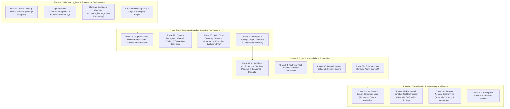

# 🚀 SupremeAI — পূর্ণাঙ্গ একত্রীকরণ ও অবশিষ্ট পরিকল্পনা বাস্তবায়ন ব্লুপ্রিন্ট (Master Implementation Plan)

এই মাস্টার প্ল্যানটি আপনার সরবরাহকৃত ৮টি পরিকল্পনা ফাইলের প্রতিটি অমীমাংসিত/অবাস্তবায়িত (unimplemented) অংশকে চিহ্নিত করে একটি নিশ্ছিদ্র, যৌক্তিক এবং নন-ব্রেকিং রোডম্যাপে সাজিয়েছে।

---

## 🏗️ মূল উদ্দেশ্য ও নীতি (Architecture Directives)
1. **Zero Local-Machine Dependency & Pure Cloud Production Parity:** কোনো পরিবর্তন লোকাল পাথ বা লোকাল মেশিনের উপর নির্ভরশীল হবে না।
2. **Centralize Everything Important:** ফ্র্যাগমেন্টেড বা ব্যাকডোর রেজিস্ট্রেশন (যেমন `core/app.py`-এর মাধ্যমে রুট রেজিস্ট্রেশন) বন্ধ করে একক সেন্ট্রাল গভর্নেন্স নিশ্চিত করা।
3. **Non-Disruptive Layering (Facade + Contracts):** ১৫০০+ ফাইল একবারে সরিয়ে ব্রেকিং চেঞ্জ না এনে নেমস্পেস ফ্যাসাড ও কন্ট্রাক্ট দিয়ে সিস্টেমকে সেলফ-ট্রেসিং ও বাউন্ডেড ব্ল্যাক-বক্সে রূপান্তর।
4. **Zero-Hardcoding Runtime Control:** কনফিগারেশন, মডেল অর্কেস্ট্রেশন ও পলিসিকে DB ও Redis ক্যাশে ডাইনামিক রূপ দেওয়া।
5. **Living Out-of-the-Box Sovereign Intelligence:** মাল্টি-পারসপেক্টিভ সোয়ার্ম কনসেনসাস ও অন-দ্য-ফ্লাই এপিমারাল স্যান্ডবক্সিং সক্ষম করা।

---

## 🧭 ফেজওয়ার্ক রোডম্যাপ ওভারভিউ (Phase Roadmap)



---

## 📋 ফেজভিত্তিক বিস্তারিত অ্যাকশন প্ল্যান (Detailed Action Items)

---

### Phase 1: কোডবেস হাইজিন ও সেন্ট্রাল গভর্নেন্স কনভার্জেন্স (Gap Solution Plan)
**লক্ষ্য:** ডুপ্লিকেট লকফাইল ও রুট ফ্র্যাগমেন্টেশন দূর করে একক সেন্ট্রাল এপিআই গভর্নেন্স প্রতিষ্ঠা।

#### ১.১ লকফাইল একত্রীকরণ
- **[DELETE]** [`backend/uv.lock`](file:///F:/supremeai/backend/uv.lock) — CI পাইপলাইন শুধুমাত্র Poetry ব্যবহার করে; ড্রিফট দূর করতে uv.lock রিমুভ।
- **[DELETE]** [`infrastructure/mcp-control-plane/package-lock.json`](file:///F:/supremeai/infrastructure/mcp-control-plane/package-lock.json) — রুট `pnpm-lock.yaml`-এর সাথে কনফ্লিক্ট রোধে এটি রিমুভ।

#### ১.২ সেন্ট্রাল রাউটার রেজিস্ট্রেশন ও ব্যাকডোর অপসারণ
- **[MODIFY]** [`backend/api/routers.py`](file:///F:/supremeai/backend/api/routers.py):
  - `ALL_ROUTERS` লিস্টে ১৩টি বৈধ অরফান রুট যুক্ত করা:
    `artifacts`, `branch_conversations`, `browser_action_registry`, `chat_export`, `chat_search`, `chat_upload`, `code_dependency_graph`, `deep_research`, `global_memory`, `prompt_templates`, `reasoning`, `scheduled_tasks`, `share`, `slash_commands`।
- **[MODIFY]** [`backend/core/app.py`](file:///F:/supremeai/backend/core/app.py):
  - লাইন ৬১–৬৩ থেকে `register_workspace_feature_routes(app)` সরাসরি কল বাদ দেওয়া। সব রুট সেন্ট্রাল `register_all_routers(app)` দিয়ে লোড হবে।
- **[MODIFY]** [`backend/api/routes/healing_stats.py`](file:///F:/supremeai/backend/api/routes/healing_stats.py):
  - `get_current_user` অথেন্টিকেশন গার্ড যোগ করা যাতে আন-অথোরাইজড মেট্রিক লিক না হয়।
- **[DELETE]** জিরো-রেফারেন্সের পুরনো ব্রিজ ফাইল অপসারণ:
  - `backend/cloud_watchman.py`
  - `backend/cost_sage.py`
  - `backend/seed_database.py`
  - `backend/langchain_agent_example.py`
  - `backend/api/routes/codeflow.py`
  - `backend/api/routes/site_actions.py`
  - `backend/api/routes/healing.py` (টেস্ট রেফারেন্স `healing_stats.py`-তে মাইগ্রেট করে রিমুভ)

---

### Phase 2: সেলফ-ট্রেসিং ও বাউন্ডেড ব্ল্যাক-বক্স আর্কিটেকচার (Self-Tracing Plan)
**লক্ষ্য:** ১৫০০+ ফাইলের সিস্টেমকে ৪টি সুনির্দিষ্ট বৃত্তে (Circle) আবদ্ধ করে একক কার্নেল ও ট্রেসিবিলিটি দেওয়া।

#### ২.১ ইউনিফাইড কার্নেল ফ্যাসাড (`SupremeKernel`)
- **[NEW]** [`backend/core/kernel/interface.py`](file:///F:/supremeai/backend/core/kernel/interface.py):
  - `KernelRequest`, `KernelResponse`, `ExecutionMode`, `TenantContext` এর জন্য Pydantic V2 কন্ট্রাক্ট তৈরি।
- **[NEW]** [`backend/core/kernel/dispatcher.py`](file:///F:/supremeai/backend/core/kernel/dispatcher.py):
  - `SupremeKernel`: একক গেটওয়ে যা অথেন্টিকেশন, টেন্যান্ট কনটেক্সট, গভর্নেন্স/পলিসি চেক, মেমোরি ফেচিং, টার্গেট সাব-এজেন্ট/টুল এক্সিকিউশন ও সেফটি ভ্যালিডেশন অর্কেস্ট্রেট করবে।
- **[NEW]** [`backend/api/routes/kernel_dispatch.py`](file:///F:/supremeai/backend/api/routes/kernel_dispatch.py):
  - `POST /api/v1/kernel/dispatch` সার্বজনীন হেডলেস এক্সিকিউশন এন্ডপয়েন্ট।

#### ২.২ এন্ড-টু-এন্ড রিকোয়েস্ট ওয়াটারফল ট্রেসিং (`Trace-ID Waterfall`)
- **[NEW]** [`backend/middleware/trace_middleware.py`](file:///F:/supremeai/backend/middleware/trace_middleware.py):
  - পাইথন `contextvars` ব্যবহার করে `X-Trace-ID` ও `X-Correlation-ID` ব্যাকগ্রাউন্ড ওয়ার্কার, সাব-এজেন্ট ও এসিঙ্ক থ্রেডে প্রোপাগেট করা।
- **[NEW]** [`backend/core/telemetry/spans.py`](file:///F:/supremeai/backend/core/telemetry/spans.py):
  - `@trace_span("layer.name")` ডেকোরেটর যা OpenTelemetry/Langfuse এবং স্ট্রাকচার্ড JSON লগে ট্রেস পাঠাবে।

#### ২.৩ ফোর-সার্কেল ডোমেইন বাউন্ডারি এনফোর্সমেন্ট (`Circles Architecture`)
- **[NEW]** ডোমেইন ইনডেক্স ফ্যাসাডসমূহ:
  - `backend/circles/governance/__init__.py` (`PolicyEngine`, `AuthGuard`, `HITLApproval`)
  - `backend/circles/execution/__init__.py` (`SupremeKernel`, `AgentRunner`, `ToolRegistry`)
  - `backend/circles/evolution/__init__.py` (`MemoryFabric`, `AdaptiveEngine`, `EvolutionBus`)
  - `backend/circles/infrastructure/__init__.py` (`DatabaseSession`, `RedisClient`, `VectorStore`)
- **[NEW]** [`scripts/ci/enforce_circle_boundaries.py`](file:///F:/supremeai/scripts/ci/enforce_circle_boundaries.py):
  - AST-বেসড সিআই স্ক্রিপ্ট যা সার্কেলের ভেতরের অবৈধ সার্কুলার ডিপেন্ডেন্সি বা প্রাইভেট মডিউল ইমপোর্ট ব্লক করবে।

#### ২.৪ লিভিং টপোলজি গ্রাফ ও ইন্টারনাল সিএলআই (`Self-Query CLI`)
- **[NEW]** [`scripts/ci/generate_system_topology.py`](file:///F:/supremeai/scripts/ci/generate_system_topology.py):
  - FastAPI রুট, এজেন্ট টুল রেজিস্ট্রি, ডাটাবেস মডেল স্ক্যান করে `docs/generated/system_topology.json` ও `ARCHITECTURE_DAG.md` তৈরি করবে।
- **[NEW]** [`backend/cli/inspect.py`](file:///F:/supremeai/backend/cli/inspect.py):
  - `python -m supreme.inspect --flow <flow_name>` ও `--circle <name>` টার্মিনাল কমান্ড।

---

### Phase 3: ডাইনামিক কনট্রোল প্লেন (Zero-Hardcoded Runtime Configuration)
**লক্ষ্য:** কোড ডেপ্লয়মেন্ট ছাড়াই ড্যাশবোর্ড থেকে রিয়েল-টাইম কনফিগারেশন, মডেল লাইফসাইকেল ও রেট লিমিট নিয়ন্ত্রণ।

#### ৩.১ L1–L4 মাল্টি-টায়ার রেজিলিয়েন্ট কনফিগ সার্ভিস
- **[MODIFY]** [`backend/core/config_control_plane.py`](file:///F:/supremeai/backend/core/config_control_plane.py):
  - L1 (Redis Cache) ➔ L2 (PostgreSQL `system_config` table) ➔ L3 (Last Known Good in-memory Snapshot) ➔ L4 (Immutable Code Defaults) রিড/রাইট ইঞ্জিন বাস্তবায়ন।
- **[NEW]** [`backend/core/config_pubsub.py`](file:///F:/supremeai/backend/core/config_pubsub.py):
  - Redis Pub/Sub ইভেন্ট (`config:changed`) পাঠিয়ে মাল্টিপল ব্যাকএন্ড ইনস্ট্যান্সের লোকাল মেমোরি ক্যাশ সাথে সাথে সিঙ্ক করা।
- **[NEW]** [`backend/api/routes/admin_config.py`](file:///F:/supremeai/backend/api/routes/admin_config.py):
  - কনফিগ ভিউ, আপডেট ও ওয়ান-ক্লিক রোলব্যাক API (`/admin-api/config/*`)।

#### ৩.২ ডাইনামিক মডেল রেজিস্ট্রি ও ফ্রন্টএন্ড সংযোগ
- **[NEW]** [`backend/core/llm/dynamic_model_registry.py`](file:///F:/supremeai/backend/core/llm/dynamic_model_registry.py):
  - মডেল ক্যাটালগ ও লাইফসাইকেল স্টেট মেশিন (`enabled`, `routing_enabled`, `cost_weight`, `context_window`)।
- **[MODIFY]** [`frontend/src/pages/user/ProfilePage.tsx`](file:///F:/supremeai/frontend/src/pages/user/ProfilePage.tsx) ও [`frontend/src/services/commandRegistry.ts`](file:///F:/supremeai/frontend/src/services/commandRegistry.ts):
  - হার্ডকোডেড মডেল তালিকা পরিহার করে সরাসরি ডাইনামিক মডেল ক্যাটালগ এপিআই কনজিউম করা।

#### ৩.৩ স্কিমা-ড্রাইভেন ইউনিভার্সাল কনফিগ UI
- **[NEW]** [`frontend/src/components/admin/SchemaConfigEditor.tsx`](file:///F:/supremeai/frontend/src/components/admin/SchemaConfigEditor.tsx):
  - ব্যাকএন্ড স্কিমার ডাটাটাইপ অনুযায়ী অটোমেটিক টগল, ড্রপডাউন, স্লাইডার রেন্ডারিং।

---

### Phase 4: আউট-অফ-দ্য-বক্স রেভোলিউশনারি ইন্টেলিজেন্স (Out-of-the-Box Blueprint)
**লক্ষ্য:** ফ্রন্টিয়ার এআই-এর সীমাবদ্ধতা অতিক্রমকারী সার্বভৌম অর্কেস্ট্রেশন ফিচার সক্রিয়করণ।

#### ৪.১ মাল্টি-পারসপেক্টিভ সোয়ার্ম কনসেনসাস ইঞ্জিন (Swarm Consensus)
- **[NEW]** [`backend/core/intelligence/swarm_consensus.py`](file:///F:/supremeai/backend/core/intelligence/swarm_consensus.py):
  - প্রম্পট আসলে ৩টি ভার্চুয়াল রোল জন্ম নেবে: **Architect** (সমাধান তৈরি), **Critic/Red-Team** (বাগ/লুপহোল আক্রমণ), এবং **Synthesizer** (দ্বিমত দূর করে নিখুঁত উত্তর তৈরি)।
- **[MODIFY]** [`backend/api/routes/chat.py`](file:///F:/supremeai/backend/api/routes/chat.py):
  - `IntelligenceTier.SWARM` হলে সোয়ার্ম কনসেনসাস লুপে কল ডিসপ্যাচ করা।

#### ৪.২ অন-দ্য-ফ্লাই এপিমারাল টুল সিন্থেসিস (Dynamic Sandbox Tooling)
- **[NEW]** [`backend/tools/ephemeral_synthesizer.py`](file:///F:/supremeai/backend/tools/ephemeral_synthesizer.py):
  - এলএলএম কোনো উপযুক্ত টুল না পেলে ইনস্ট্যান্ট পাইথন মাইক্রো-স্ক্রিপ্ট তৈরি করবে ➔ `backend/core/microvm_sandbox.py`-তে নিরাপদ এএসটি স্ক্যান সহ রান করবে ➔ রেজাল্ট নিয়ে স্ক্রিপ্ট মেমোরি থেকে নিরাপদভাবে ধ্বংস করবে।

#### ৪.৩ সিন্যাপটিক মেমরি ড্রিম সাইকেল (Synaptic Dream Cycle)
- **[NEW]** [`backend/workers/synaptic_dream_worker.py`](file:///F:/supremeai/backend/workers/synaptic_dream_worker.py):
  - ব্যাকগ্রাউন্ড শিডিউল্ড ক্রন ওয়ার্কার যা রাতের বেলায় সারাদিনের চ্যাটের নয়েজ ছেঁটে হাই-ভ্যালু নলেজ গ্রাফ ও হিউরিস্টিকস সিন্যাপ্স আকারে কনসোলিডেট করবে।

#### ৪.৪ প্রো-অ্যাক্টিভ প্রি-কগনিশন ওয়াচার (Precognitive Watcher)
- **[NEW]** [`backend/services/precognitive_watcher.py`](file:///F:/supremeai/backend/services/precognitive_watcher.py):
  - সিস্টেম রিসোর্স, ডিপ্লয়মেন্ট এরর ও ট্র্যাফিক ট্রেন্ড মনিটর করে ব্যবহারকারী চাওয়ার আগেই প্রোঅ্যাকটিভ সতর্কবার্তা ও রেডিমেড ফিক্স প্রপোজাল তৈরি করবে।

---

## 🧪 ভেরিফিকেশন ও টেস্ট প্ল্যান (Comprehensive Verification)

### ১. অটোমেটেড টেস্ট স্যুট
```bash
# ১. গিটহাব কনস্টিটিউশন সিআই অডিট
python .github/scripts/constitution/engine.py --pr-diff

# ২. সার্কেল বাউন্ডারি ও ইমপোর্ট চেকিং
python scripts/ci/enforce_circle_boundaries.py

# ৩. কার্নেল ডিসপ্যাচ ও ট্রেসিং টেস্ট
pytest backend/tests/test_kernel_dispatch.py
pytest backend/tests/test_tracing_waterfall.py

# ৪. ডাইনামিক কনট্রোল প্লেন L1-L4 ফেইলওভার টেস্ট
pytest backend/tests/test_dynamic_control_plane.py

# ৫. সোয়ার্ম কনসেনসাস ও এপিমারাল টুল সিন্থেসিস টেস্ট
pytest backend/tests/intelligence/test_swarm_consensus.py
pytest backend/tests/tools/test_ephemeral_synthesizer.py
```

### ২. ম্যানুয়াল ও ব্রাউজার ভেরিফিকেশন
- **FastAPI OpenAPI (/docs):** সব ১৩টি অরফান রুট ও `/api/v1/kernel/dispatch` উন্মুক্ত ও সঠিক অথ গার্ড সহ রয়েছে কিনা যাচাই।
- **এডমিন ড্যাশবোর্ড:** স্কিমা-এডিটরে কনফিগ টগল করলে শূন্য ডেপ্লয়মেন্টে রিফ্রেশ ছাড়া লাইভ ইফেক্ট পড়ে কিনা দেখা।
- **টপোলজি ভিউয়ার:** `docs/generated/topology_viewer.html` ব্রাউজারে ওপেন করে ৪টি সার্কেলের গ্রাফ ইন্টারঅ্যাকশন পর্যবেক্ষণ।

---

## 🚦 পরবর্তী পদক্ষেপ (Next Immediate Step)

আমরা **Phase 1 (লকফাইল রিমুভ, অরফান রুট রেজিস্টার ও ব্যাকডোর অপসারণ)** দিয়ে সরাসরি শুরু করতে পারি। আপনার সবুজ সংকেত পেলে কোড পরিবর্তনের কাজ শুরু হবে।
