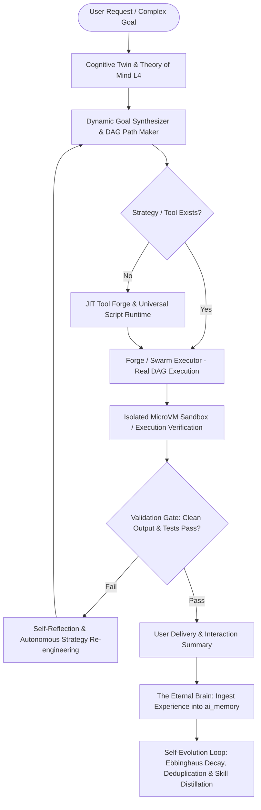

# Master Architectural Plan: Realizing SupremeAI as a Living, Self-Evolving Autonomous Intelligence (v2.0)

## Goal Description
SupremeAI-কে এমন একটি **Living, Self-Evolving Autonomous Intelligence**-এ রূপান্তর করা যার কাছে কোনো সীমাবদ্ধতা নেই:
> **"SupremeAI হলো একটি living, self-evolving intelligence — যার কাছে 'পারব না' বলে কোনো শব্দ নেই। ইউজার যা-ই চাইবে, সে বুঝবে, পথ বানাবে এবং করে দেবে। আর প্রতিটি কাজের পর সে আরেকটু বুদ্ধিমান হবে।"**

---

## User Review Required

> [!IMPORTANT]
> **Twin Pillar Execution Strategy: (A) Zero-Stub Foundation + (B) The Autonomous Living Loop**
> 1. **Pillar A (Zero Fake/Stub Hygiene):** কোডবেসের সমস্ত সেকেন্ডারি এজেন্ট (`auto_healer.py`, `performance_tuning_agent.py`, `model_router.py`, `internet_monitor_agent.py`) থেকে অবশিষ্ট সমস্ত `asyncio.sleep`, সিমুলেশন ও প্লেসহোল্ডার সরিয়ে ১০০% রিয়েল এক্সিকিউশন ও ফলব্যাক ইঞ্জিন প্রতিষ্ঠা করা।
> 2. **Pillar B (Living Intelligence Loop):** Theory of Mind, Cognitive Twin, JIT Tool Forging (USR), Self-Healing DAG Swarm, এবং Continuous Learning Matrix (`ai_memory` pgvector + Ebbinghaus Decay)-কে একটি নিরবচ্ছিন্ন অটোনোমাস লুপে ইন্টিগ্রেট করা।

---

## Architecture of the Autonomous Living Loop



---

## Proposed Changes

### Component 1: Zero-Stub Production Hygiene & Real DevOps/System Agents
কোডবেসের সমস্ত অবাস্তব সিমুলেশন ও স্লিপ বাদ দিয়ে বাস্তব অপারেশনাল সক্ষমতা দেওয়া।

#### [MODIFY] [backend/brain/model_router.py](file:///f:/supremeai%20backup/backend/brain/model_router.py)
- সমস্ত পুরানো ফলব্যাক ও মক স্ট্রাকচার পুরোপুরি মুছে সরাসরি `ZeroCostGateway` এবং `LocalModelHandler` (Ollama/Free Tiers)-এ রি-রাউট করা।

#### [MODIFY] [backend/agents/devops/auto_healer.py](file:///f:/supremeai%20backup/backend/agents/devops/auto_healer.py)
- `time.sleep` এবং সিমুলেটেড রিস্টার্ট সরিয়ে প্রকৃত ডকার/সার্ভিস স্ট্যাটাস ইন্সপেকশন ও সেলফ-হিলিং কমান্ড যুক্ত করা।

#### [MODIFY] [backend/agents/infrastructure/performance_tuning_agent.py](file:///f:/supremeai%20backup/backend/agents/infrastructure/performance_tuning_agent.py)
- সিমুলেটেড প্রসেসিং টাইম সরিয়ে রিয়েল সিস্টেম প্রসেস মেমোরি/সিপিইউ মেট্রিক্স রিডিং (`psutil`) ও অপটিমাইজেশন লজিক দেওয়া।

---

### Component 2: Cognitive Understanding & Theory of Mind Layer
মানুষের চিন্তার অসঙ্গতি, লুকানো উদ্দেশ্য এবং অপ্রকাশিত নির্দেশ ডিকোড করা।

#### [MODIFY] [backend/evolution/theory_of_mind/tom_system.py](file:///f:/supremeai%20backup/backend/evolution/theory_of_mind/tom_system.py)
- **Level 4 Recursive ToM:** "ইউজারের অবচেতন প্রত্যাশা কী?", "ইউজারের লজিকে কোনো ভুল বা ফ্যালাসি আছে কি না?" তা বিশ্লেষণ করে অবজেক্টিভ পুশব্যাক ও সঠিক বিকল্প প্রস্তাব করা।
- `ZeroCostGateway`-এর মাধ্যমে ১০০% ফ্রি-টিয়ারে গভীর সাইকোলজিক্যাল/আর্কিটেকচারাল ইনটেন্ট ম্যাপিং।

#### [MODIFY] [backend/memory/cognitive_twin_engine.py](file:///f:/supremeai%20backup/backend/memory/cognitive_twin_engine.py)
- ইউজারের বিগত কোডিং স্টাইল, অভ্যাসের বায়াস এবং টেক-স্ট্যাক প্রেফারেন্স ডায়নামিকালি সেশন প্রম্পটে ইনজেক্ট করা।

---

### Component 3: Dynamic Pathfinding, JIT Tool Forging & Universal Runtime
কোনো টুল না থাকলেও অন-দ্য-ফ্লাই নতুন টুল বানিয়ে যেকোনো কাজ সম্পন্ন করা ("পারব না" শব্দ নিষিদ্ধ)।

#### [MODIFY] [backend/engine/tool_forge.py](file:///f:/supremeai%20backup/backend/engine/tool_forge.py)
- ইউজারের রিকোয়েস্ট যদি বর্তমান কোনো এপিআই বা টুলে না থাকে, স্বয়ংক্রিয়ভাবে নতুন পাইথন/শেল টুল কোড সিন্থেসিস করা।
- AST ভ্যালিডেশন এবং ডায়নামিক মেমোরি রেজিস্ট্রি নিশ্চিত করা।

#### [MODIFY] [scripts/supremeai_toolkit/universal_runtime/universal_runtime.py](file:///f:/supremeai%20backup/scripts/supremeai_toolkit/universal_runtime/universal_runtime.py)
- যেকোনো জটিল অটোমেশনের জন্য এন্ড-টু-এন্ড রিকোয়ারমেন্ট সিন্থেসিস, ডিপেন্ডেন্সি ইন্সটলেশন ও সেলফ-ভ্যালিডেশন সম্পাদন করা।

#### [MODIFY] [backend/engine/self_assembling_orchestrator.py](file:///f:/supremeai%20backup/backend/engine/self_assembling_orchestrator.py)
- উচ্চমাত্রার জটিল প্রজেক্টকে স্বয়ংক্রিয়ভাবে DAG নোডে ভেঙে `ForgeExecutor`-এর মাধ্যমে মাল্টি-এজেন্ট ডেসপ্যাচ করা।

---

### Component 4: Limitless Self-Healing & Swarm Execution
বাধা আসলে না থেমে নিজে নিজে এরর ডিবাগ করে পুনরায় চেষ্টা করা।

#### [MODIFY] [backend/engine/forge_executor.py](file:///f:/supremeai%20backup/backend/engine/forge_executor.py)
- নোড ফেইল করলে স্বয়ংক্রিয় রি-প্রম্পট এবং অল্টারনেটিভ ডিপার্টমেন্ট ডেসপ্যাচ (সার্কিট ব্রেকার হ্যান্ডলিং)।
- রিয়েল এক্সিকিউশন স্টেট ও স্ট্রিমিং নোটিফিকেশন ক্লায়েন্টে পাঠানো।

#### [MODIFY] [backend/engine/self_reflection.py](file:///f:/supremeai%20backup/backend/engine/self_reflection.py)
- প্রতিটি টাস্ক শেষে ৩টি আত্ম-পর্যালোচনা: ১) কাজ কি ১০০% নিখুঁত হয়েছে? ২) কোনো এরর থাকলে রুট-কজ কী? ৩) ভবিষ্যতে কীভাবে এটি স্বয়ংক্রিয়ভাবে প্রিভেন্ট করা যায়?

---

### Component 5: The Eternal Brain & Continuous Self-Evolution
প্রতিটি কাজের পর জ্ঞান বৃদ্ধি এবং মেমোরি স্বয়ংক্রিয় অপটিমাইজেশন।

#### [MODIFY] [backend/adaptive_engine/learning_loop.py](file:///f:/supremeai%20backup/backend/adaptive_engine/learning_loop.py)
- প্রতিটি কাজের সফল অভিজ্ঞতা `experience_db` এবং `ai_memory` (pgvector)-এ স্থায়ী মেমোরি হিসেবে সেভ করা।

#### [MODIFY] [backend/memory/self_evolve_service.py](file:///f:/supremeai%20backup/backend/memory/self_evolve_service.py)
- Ebbinghaus Decay Pruning (অপ্রয়োজনীয় মেমোরি ক্লিনিং), Hierarchical Clustering এবং Memory Deduplication নিশ্চিত করা।

---

## Verification Plan

### Automated Tests
```bash
# 1. Theory of Mind & Cognitive Engine Test Suite
poetry run pytest tests/test_theory_of_mind.py
poetry run pytest tests/test_cognitive_twin.py

# 2. Forge Real DAG Execution & Self-Reflection Test Suite
poetry run pytest tests/engine/test_forge_executor.py
poetry run pytest tests/test_phase3_engine.py

# 3. Universal Runtime & Crown Jewels Health Audit
python scripts/supremeai_toolkit/crown_jewel_audit.py

# 4. Monorepo Import Graph & Zero Broken Imports Check
python backend/scripts/import_graph_audit.py --json audit_out.json
```

### Systemic Verification
1. **Unseen Dynamic Task Test:** এমন একটি আনসিন টাস্ক দেওয়া যার জন্য পূর্বে কোনো টুল ছিল না -> সিস্টেম স্বয়ংক্রিয়ভাবে টুল ফোর্জ করে স্যান্ডবক্সে রান করে সমাধান এনে দেবে।
2. **Cognitive Logic Challenge:** ইউজারের ভুল যুক্তি বা ফ্যালাসি প্রম্পট ইনপুট দিয়ে দেখা হবে সিস্টেম ব্লাইন্ডলি সায় দেয় নাকি অবজেক্টিভ পুশব্যাক দিয়ে সঠিক পথ বের করে।
3. **Memory Vector Ingestion Check:** কাজ শেষে ভেক্টর মেমোরিতে নতুন অভিজ্ঞতা অ্যাড হয়েছে কি না এবং পরবর্তী কুয়েরিতে তা রিকল হচ্ছে কি না তা যাচাই।