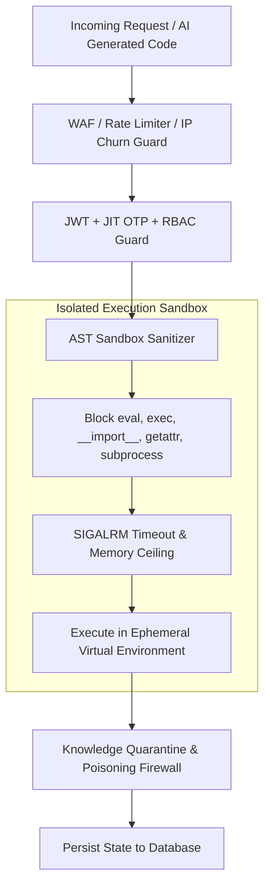

# 🛡️ SupremeAI Security, Threat Model & Governance Master Plan

> **Document Version:** 3.1.0 (Consolidated Canonical Security Master Spec)  
> **System Phase:** **Phase 3: Self-Evolving & Multi-Agent Swarm**  
> **Classification:** Enterprise Security, Threat Modeling, Secrets Management & Zero-Trust Governance  
> **Target Alignment:** [`docs/architecture/SUPREMEAI_CORE_CONSTITUTION.md`](file:///f:/supremeai/docs/architecture/SUPREMEAI_CORE_CONSTITUTION.md)  
> **Single Source of Truth:** [`STATUS.md`](file:///f:/supremeai/STATUS.md) | [`CHECKPOINT.md`](file:///f:/supremeai/CHECKPOINT.md)  
> **Consolidated Authorities:** Incorporates and supersedes `threat-model.md`, `THREAT-MODEL-001-authentication.md`, and `secrets-management.md`.

---

## 🎯 1. Security Philosophy: Fail-Closed & Zero-Trust

SupremeAI একটি **Defensive, Multi-Layered Security Architecture** মেনে চলে। আনট্রাস্টেড ইউজার কোড বা এআই-জেনারেটেড স্ক্রিপ্ট যেন কোনোভাবেই মূল সার্ভার এনভায়রনমেন্ট বা ক্লাউড ক্রেডেনশিয়াল স্পর্শ করতে না পারে, সেজন্য সব স্তর "Fail-Closed" নীতিতে সুরক্ষিত।

---

## 🔒 2. Core Security Pillars

### A. Advanced AST Sandbox Containment
- **Forbidden AST Nodes:** `ast.parse()` দিয়ে সমস্ত পাইথন কোড স্ক্যান করা হয়। নিষিদ্ধ ডান্ডার মেথড (`__subclasses__`, `__globals__`, `__code__`, `__builtins__`) অথবা `os`, `sys`, `subprocess`, `shutil` ইনভোকেশন তাত্ক্ষণিকভাবে ব্লক করা হয়।
- **Execution Timeouts & Quotas:** প্রতিটি কোড এক্সিকিউশন টাইমআউট (ডিফল্ট: ৫-১০ সেকেন্ড) এবং মেমোরি লিমিট (২৫০ MB) দ্বারা সীমাবদ্ধ।

### B. JIT (Just-In-Time) OTP & Session Takeover
- ক্রিটিকাল প্রশাসনিক কাজ (যেমন: ডিপ্লয়মেন্ট ট্রিগার, সিক্রেট রোটেশন, ডাটাবেজ ওয়াইপ) সম্পন্ন করার জন্য ডায়নামিক JIT OTP ভ্যালিডেশন বাধ্যতামূলক।
- রিমোট সেশন হাইজ্যাকিং রোধে ডিভাইস ফিঙ্গারপ্রিন্ট হ্যাশ প্রতি রিকোয়েস্টে যাচাই করা হয়।

### C. Knowledge Poisoning Firewall & Quarantine
- এআই-এর দীর্ঘমেয়াদী স্মৃতি (`ai_memory`)-তে কোনো ক্ষতিকর প্রম্পট ইনজেকশন বা ভুল তথ্য প্রবেশ ঠেকাতে নতুন তথ্যকে প্রথমে `KnowledgeQuarantine` জোনে রাখা হয়।
- `ContradictionHunter` এবং `SourceTrustEngine` দ্বারা ভেরিফাই হওয়ার পরেই তথ্য মূল মেমোরিতে প্রমোট করা হয়।

### D. Brand Exclusivity & Thin Client Zero-Exposure
- ক্লায়েন্ট সাইড (Web, Desktop, Mobile, VS Code Extension) সম্পূর্ণ থিন-ক্লায়েন্ট।
- কোনো ক্লাউড প্রোভাইডারের নাম (OpenAI, Gemini, Groq, Anthropic), ইন্টারনাল পাথ, বা ডিরেক্ট API Key ইউজারের ব্রাউজার বা বান্ডেলে প্রকাশিত হয় না।

---

## 🔑 3. Secrets Management & Rotation Policy

### 3.1 Credential Tiers
1. **Infrastructure & Cloud Secrets:** Infisical Centralized Vault (Supabase, Redis Upstash, Render, Cloudflare).
2. **Third-Party Integrations:** GitHub App Private Keys (`.pem`), OAuth Refresh Tokens (Gmail, Outlook), Payment Gateway keys.
3. **Internal Auth Secrets:** Server-signed JWT secrets (`SECRET_KEY`), JIT OTP secrets.

### 3.2 Guidelines & Guardrails
- **No Hardcoded Secrets:** Credentials must never be saved in plain text database fields, client code, or committed to git repositories.
- **External Secret Manager:** All production secrets are injected at runtime via Infisical or managed environment variables.
- **Automated Rotation Policy:**
  - OAuth refresh tokens and application passwords rotate every **90 days**.
  - GitHub App keys and service tokens are audited annually or rotated immediately upon suspected breach.
  - Zero secrets in client-side bundles: verified via Gitleaks CI pre-commit and pre-push hooks.

---

## 🚨 4. STRIDE Threat Matrix & Mitigations

| Category | Threat Vector | Risk Level | Mitigation Architecture |
|---|---|---|---|
| **Spoofing** | Attacker impersonates admin or user | 🔴 Critical | Firebase Auth + PyJWT validation + JIT OTP / TOTP MFA. Hard rejection of `is_test` bypasses in production (`settings.is_bypass_allowed = False`). |
| **Tampering** | Modifying JWT payload or approval tasks | 🔴 Critical | HS256/RS256 signature enforcement + SHA-256 canonical payload hash verification in `pending_tasks.py`. |
| **Repudiation** | Denying an unauthorized execution | 🟠 High | Structured Redis & PostgreSQL audit trails (`_audit()` in `approval_manager.py`) with immutable timestamps and user correlation IDs. |
| **Information Disclosure** | Secret leaks via logs or error stacks | 🟠 High | Production debug mode disabled; Infisical secret masking; automatic scrubbing of stack traces in HTTP 500 handlers. |
| **Denial of Service** | Resource exhaustion / unbounded queries | 🟡 Medium | Upstash Redis sliding-window rate limiting; memory caps on in-memory stores; circuit breaker pattern with bounded half-open states. |
| **Elevation of Privilege** | Sandbox escape or unauthorized DB DDL | 🔴 Critical | Pure AST Sanitizer + Ephemeral Docker Containers + DDL SQL interceptors blocking `DROP`/`TRUNCATE` without explicit governance. |
| **Supply Chain** | Malicious third-party packages (npm/PyPI) | 🟠 High | Strict version pinning in `poetry.lock` and `pnpm-lock.yaml`; Dependabot + Snyk automated scanning; sandboxed dependency testing. |
| **Autonomous Runaway** | AI pushes broken/hallucinated code | 🔴 Critical | AI cannot push to `main`; all autonomous modifications flow through GitHub PRs requiring human review or strict multi-model consensus validation. |

---

## 5. Security Verification & CI Quality Gates

1. **Static Analysis:** `ruff check`, `bandit -r backend/`, `semgrep`.
2. **Secret Auditing:** `gitleaks detect` on all pre-commits and PR pipelines.
3. **Dead Route & Auth Gate Verification:** `tests/security/test_dead_route_wiring.py` guarantees 100% router mounting and RBAC guard compliance.
4. **Multi-Model Consensus:** Critical self-evolution patches must be validated by independent LLM evaluators before reaching the quarantine approval queue.

---

## 🔍 6. Historical System Blind Spots & Hardened Remediations (Audit Compendium)

The following matrix documents known system blind spots identified across audits (including `blindspots-bangla.md` and `blink_spots_gemini.md`) and their permanent remediations:

| Domain | Identified Risk / Blind Spot | Severity | Permanent Remediation Architecture |
|---|---|---|---|
| **Auth & Access** | Hardcoded god-passwords or test bypasses (`is_test=True`) in auth middleware | 🔴 Critical | Hardcoded client backdoors removed; `settings.is_bypass_allowed = False` enforced in production. JWT signatures cryptographically validated. |
| **Auth & Access** | Unauthenticated WebSockets (`websocket_agent.py`, `websocket_voice.py`) | 🔴 Critical | First-message token authentication mandatory; unauthenticated sockets closed within 5000ms. |
| **CI/CD & Self-Fix** | Direct git push in automated AI fix scripts (`ci-auto-fix-v3.py`) without guardrails | 🔴 Critical | Auto-fix scripts restricted to ephemeral branches + Pull Requests (`gh pr create`). Direct push to `main` by automated agents strictly prohibited. |
| **CI/CD Coverage** | Artificially suppressed test thresholds (`--cov-fail-under=1`) | 🟠 High | Coverage floors restored to meaningful gates; test failures cannot be swallowed with `|| true`. |
| **Backend & DB** | Raw SQL interpolation in database queries (`db_repository.py`) | 🔴 Critical | All queries converted to SQLAlchemy 2.0 parameterized statements or ORM queries. |
| **Network & Desktop** | Unrestricted network scope (`*/*`) in client configurations | 🟠 High | Tauri and client network scopes restricted to authorized backend and CDN origins. |
| **Storage & Secrets** | Secrets stored in plaintext `localStorage` | 🟠 High | Sensitive operational tokens isolated; HttpOnly/Secure cookies preferred where feasible; in-memory store for session credentials. |
| **Infrastructure** | Rate limiter fail-open when Redis is unreachable | 🔴 Critical | Fail-closed or bounded in-memory sliding window fallback implemented for critical endpoints. |
| **AI Firewall** | Weak prompt scanning / simple keyword checks | 🔴 Critical | Multi-tier prompt firewall with semantic classification, regex pattern blocking, and jailbreak detection. |
