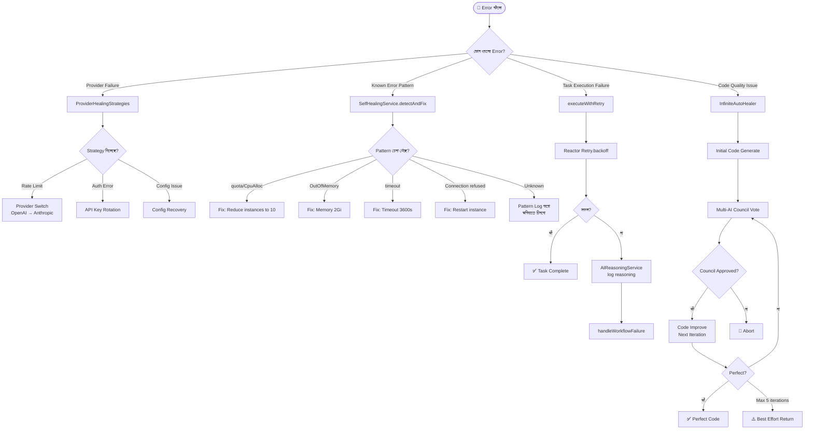

# Feature 06: Self-Healing System
> **অবস্থা:** ✅ বিদ্যমান (সম্পূর্ণ)
> **Priority:** CRITICAL
> **ফাইলসমূহ:** `SelfHealingService.java` (7K), `SelfHealingController.java` (4K), `HealingController.java` (3K), `AutoHealingStrategyService.java` (3K), `ProviderHealingStrategies.java` (7K), `InfiniteAutoHealer.java` (1K)

---

## 🎯 ফিচারটি কী করে?

সিস্টেমে কোনো error বা failure হলে এই ফিচার **স্বয়ংক্রিয়ভাবে** সমস্যা শনাক্ত করে, সমাধানের চেষ্টা করে এবং প্রয়োজনে বিকল্প provider-এ সুইচ করে। এটি তিনটি স্তরে কাজ করে:
1. **Retry with Backoff** — ব্যর্থ task পুনরায় চেষ্টা
2. **Auto Detection & Fix** — পরিচিত error pattern শনাক্ত ও সমাধান
3. **Infinite Auto-Healer** — কোড পরিপূর্ণ না হওয়া পর্যন্ত council voting দিয়ে উন্নতি

---

## 🔄 সম্পূর্ণ ফ্লো



---

## 📋 বর্তমান Implementation

### ✅ যা আছে:

| কম্পোনেন্ট | বিবরণ | অবস্থা |
|------------|-------|--------|
| SelfHealingService | Unified healing service (retry, detect, develop) | ✅ |
| Retry with Backoff | Reactor-based exponential backoff | ✅ |
| Error Pattern Detection | Known fix mapping (quota, OOM, timeout) | ✅ |
| Infinite Auto-Healer | Council-driven iterative code improvement | ✅ |
| Provider Healing | Provider switching strategies (5 providers) | ✅ |
| API Key Rotation | Rotation strategy (placeholder logic) | ⚠️ আংশিক |
| Config Recovery | Config restoration strategy | ⚠️ আংশিক |
| HealingController | Dual controller endpoints `/api/healing` | ✅ |
| SelfHealingController | Extended endpoints `/api/self-healing` | ✅ |
| AI Reasoning Integration | Failure reasoning log | ✅ |
| GitHub Webhook Integration | CI/CD failure auto-detection | ✅ |

### 🏗️ Architecture Layers:

```
┌──────────────────────────────────────────┐
│           Controllers (2টি)              │
│  SelfHealingController  HealingController│
├──────────────────────────────────────────┤
│         SelfHealingService (Unified)     │
│  ┌──────────┬──────────┬──────────────┐  │
│  │ Retry    │ Detect & │ Develop Until│  │
│  │ Engine   │ Fix      │ Perfection   │  │
│  └──────────┴──────────┴──────────────┘  │
├──────────────────────────────────────────┤
│       selfhealing package                │
│  AutoHealingStrategyService              │
│  ProviderHealingStrategies               │
├──────────────────────────────────────────┤
│       Integration Layer                  │
│  AIReasoningService                      │
│  AIFallbackOrchestrator                  │
│  MultiAIVotingService (Council)          │
└──────────────────────────────────────────┘
```

---

## ❌ কী মিসিং?

| মিসিং অংশ | প্রভাব | জরুরিতা |
|-----------|--------|---------|
| **Real API key rotation** — বর্তমানে placeholder | key expire হলে manual fix | 🔴 Critical |
| **Health check scheduling** — proactive monitoring | শুধু reactive, proactive নয় | 🔴 Critical |
| **Circuit breaker metrics** — সফল/ব্যর্থ ratio | healing effectiveness অজানা | 🟡 High |
| **Healing history dashboard** — UI তে দেখানো | admin দেখতে পারে না | 🟡 High |
| **Alert/notification on heal** — ইমেইল/Slack alert | silent healing | 🟡 High |
| **ML-based pattern learning** — নতুন error শিখবে | static pattern list | 🟠 Medium |
| **Rollback capability** — ভুল fix revert করা | risky auto-fix | 🟠 Medium |
| **Healing audit trail** — কোন fix কখন apply হলো | traceability নেই | 🟠 Medium |

---

## 🆚 প্রতিযোগী তুলনা

| ফিচার | SupremeAI | ChatGPT | Claude | Gemini | Kubernetes |
|-------|-----------|---------|--------|--------|------------|
| Auto Retry | ✅ | ✅ | ✅ | ✅ | ✅ |
| Provider Failover | ✅ | ❌ | ❌ | ❌ | N/A |
| Error Pattern Detection | ✅ | ❌ | ❌ | ❌ | ⚠️ |
| Infinite Healing Loop | ✅ | ❌ | ❌ | ❌ | ❌ |
| Council-based Approval | ✅ | ❌ | ❌ | ❌ | ❌ |
| CI/CD Failure Detection | ✅ | ❌ | ❌ | ❌ | ⚠️ |
| ML Pattern Learning | ❌ | ❌ | ❌ | ❌ | ⚠️ |

---

## 📊 API Endpoints

| Endpoint | Method | কাজ | অবস্থা |
|----------|--------|-----|--------|
| `/api/self-healing/retry` | POST | Retry with backoff | ✅ |
| `/api/self-healing/detect` | POST | Auto detect & fix | ✅ |
| `/api/self-healing/develop` | POST | Infinite auto-heal | ✅ |
| `/api/self-healing/status` | GET | System status | ✅ |
| `/api/healing/retry` | POST | Retry (unified) | ✅ |
| `/api/healing/detect` | POST | Detect (unified) | ✅ |
| `/api/healing/develop` | POST | Develop (unified) | ✅ |
| `/api/healing/status` | GET | Status (unified) | ✅ |
| `/api/self-healing/history` | GET | Healing history | ❌ মিসিং |
| `/api/self-healing/metrics` | GET | Healing metrics | ❌ মিসিং |

---

## ⚠️ সমস্যা ও ঝুঁকি

1. **Duplicate Controllers** — `SelfHealingController` এবং `HealingController` প্রায় একই endpoint দেয়; একীভূত করা উচিত
2. **MAX_ITERATIONS = 5** — Infinite healer আসলে infinite নয়, সর্বোচ্চ ৫ iteration
3. **Simplified `isCodePerfect()`** — শুধু `TODO` অনুপস্থিতি check করে, প্রকৃত testing/compilation নেই
4. **Hardcoded Provider List** — `developUntilPerfection()` এ council list hardcoded

---

*বিশ্লেষণ তারিখ: ২০২৬-০৫-১৪*
