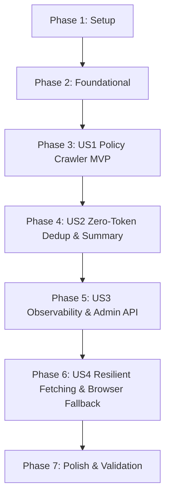

# Tasks: Policy-Driven Web Crawler Upgrade

**Feature**: `002-policy-driven-web-crawler`  
**Spec**: [spec.md](file:///f:/supremeai/specs/002-policy-driven-web-crawler/spec.md) | **Plan**: [plan.md](file:///f:/supremeai/specs/002-policy-driven-web-crawler/plan.md)  
**Status**: Ready for Implementation  

---

## Phase 1: Setup (Shared Infrastructure)

**Purpose**: Module structure and package initialization

- [x] T001 Initialize `backend/scout/` directory structure and package exports in `backend/scout/__init__.py`
- [x] T002 [P] Create test scaffolding directory in `backend/tests/scout/__init__.py`

---

## Phase 2: Foundational (Blocking Prerequisites)

**Purpose**: Core data schemas and database models that all user stories depend on

- [x] T003 [P] Implement Pydantic data schemas for `CrawlPolicy`, `DomainRule`, `CrawlPageResult`, and `CrawlResponse` in `backend/scout/models.py`
- [x] T004 [P] Implement database models for `CrawlPolicy`, `DomainRule`, and `CrawlHistory` in `backend/database/models/crawler.py`

**Checkpoint**: Foundation ready — user story implementation can now begin.

---

## Phase 3: User Story 1 - Policy-Governed Crawling (Priority: P1) 🎯 MVP

**Goal**: Deliver a safe, controllable web crawler enforcing domain allowlists, trust levels, depth caps, rate limits, and SSRF security.

**Independent Test**: Configure a policy with allowed and disallowed domains; crawl with depth > 2; verify disallowed domains are blocked, depth is capped, and requests are paced without violating rate limits.

### Tests for User Story 1
- [x] T005 [P] [US1] Unit test for domain allowlist and SSRF URL validation in `backend/tests/scout/test_crawler_policy.py`
- [x] T006 [P] [US1] Unit test for per-domain rate limiting and depth caps in `backend/tests/scout/test_crawler_policy.py`

### Implementation for User Story 1
- [x] T007 [US1] Implement `PolicyEngine` in `backend/scout/policy.py` validating domains, trust levels, depth, and integrating `core.security.is_safe_url`
- [x] T008 [US1] Implement primary `CrawlerService` async fetch loop using `httpx.AsyncClient` pacing via `middleware.rate_limiter.AsyncRateLimiter` in `backend/scout/crawler.py`
- [x] T009 [US1] Upgrade `backend/scout/web_crawler_agent.py` to delegate to `CrawlerService`

**Checkpoint**: User Story 1 (MVP) is fully functional and independently testable.

---

## Phase 4: User Story 2 - Zero-Token Content Reduction (Priority: P2)

**Goal**: Eliminate duplicate content via exact SHA-256 and Jaccard similarity, and produce zero-token extractive summaries to reduce downstream LLM token spend by 30–50%.

**Independent Test**: Feed multiple webpages with shared boilerplate and identical articles; verify duplicate pages are omitted and an extractive summary is produced with zero AI provider calls.

### Tests for User Story 2
- [x] T010 [P] [US2] Unit test for exact SHA-256 and Jaccard similarity deduplication in `backend/tests/scout/test_dedup.py`
- [x] T011 [P] [US2] Unit test for zero-token extractive summarizer in `backend/tests/scout/test_extractor.py`

### Implementation for User Story 2
- [x] T012 [P] [US2] Implement `ContentDeduplicator` in `backend/scout/dedup.py` with 3-word shingling and Jaccard similarity calculation
- [x] T013 [P] [US2] Implement `ExtractiveSummarizer` in `backend/scout/extractor.py` with frequency-weighted sentence ranking and character budgeting
- [x] T014 [US2] Integrate deduplication and extractive summarization into `CrawlerService` pipeline in `backend/scout/crawler.py`

**Checkpoint**: User Stories 1 and 2 work together independently.

---

## Phase 5: User Story 3 - Crawl Observability & History (Priority: P3)

**Goal**: Provide full auditability through event-bus telemetry and admin API query endpoints for policies and crawl history.

**Independent Test**: Run a crawl; query the admin API endpoints `/api/v1/admin/crawler/policies` and `/api/v1/admin/crawler/history`; verify events and dedup stats are returned.

### Tests for User Story 3
- [x] T015 [P] [US3] Unit test for event publishing and history retrieval in `backend/tests/scout/test_crawler_observability.py`

### Implementation for User Story 3
- [x] T016 [US3] Implement crawl event emitter dispatching to `core.messaging.event_bus.error_event_bus` in `backend/scout/telemetry.py`
- [x] T017 [US3] Implement FastAPI admin routes for managing policies and inspecting history in `backend/api/routes/crawler_admin.py`
- [x] T018 [US3] Centralize router registration in `backend/api/routers.py`

**Checkpoint**: User Stories 1, 2, and 3 are fully operational and observable.

---

## Phase 6: User Story 4 - Resilient Fetching & Graceful Degradation (Priority: P4)

**Goal**: Ensure network errors, timeouts, or bot-blocking never fail a research task, with content caching and optional Playwright headless browser fallback.

**Independent Test**: Crawl a slow/failing domain and a JS-only domain; verify cache hits return instant responses and timeouts degrade gracefully with partial results.

### Tests for User Story 4
- [x] T019 [P] [US4] Unit test for cache hit and timeout degradation in `backend/tests/scout/test_crawler_resilience.py`

### Implementation for User Story 4
- [x] T020 [US4] Implement content caching layer backed by `core.cache.redis_manager` in `backend/scout/cache.py`
- [x] T021 [US4] Implement Playwright browser-render delegation fallback for `render_js: True` domains in `backend/scout/crawler.py`

---

## Phase 7: Polish & Cross-Cutting Concerns

- [x] T022 [P] Run all test suites in `backend/tests/scout/` and verify 100% pass rate
- [x] T023 Run `quickstart.md` in-process smoke test validation
- [x] T024 Code formatting and linting check via `ruff`

---

## Dependencies & Execution Order

### Parallel Execution Opportunities
- **Phase 1**: T001 and T002 can run in parallel.
- **Phase 2**: T003 (Pydantic schemas) and T004 (DB models) can run in parallel.
- **Phase 3 (US1)**: T005 and T006 tests can be written in parallel before implementation.
- **Phase 4 (US2)**: T010 and T011 tests can run in parallel; T012 (`dedup.py`) and T013 (`extractor.py`) can be implemented in parallel.
- **Phase 7**: T022 and T024 can run in parallel.
